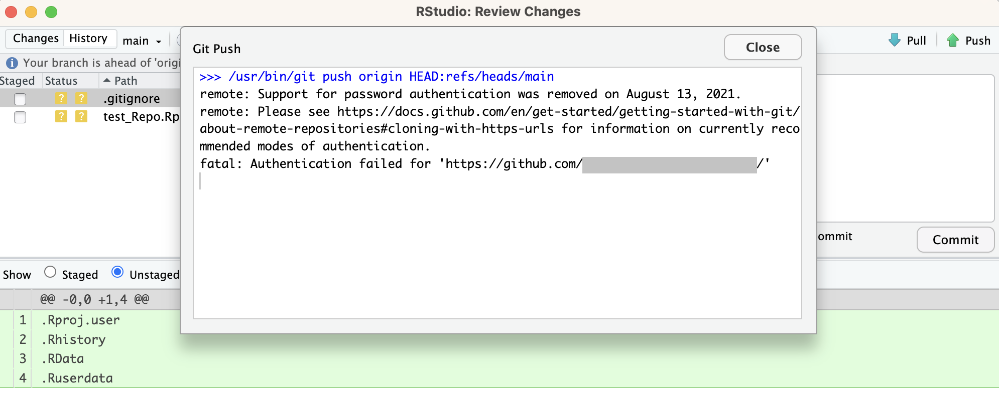
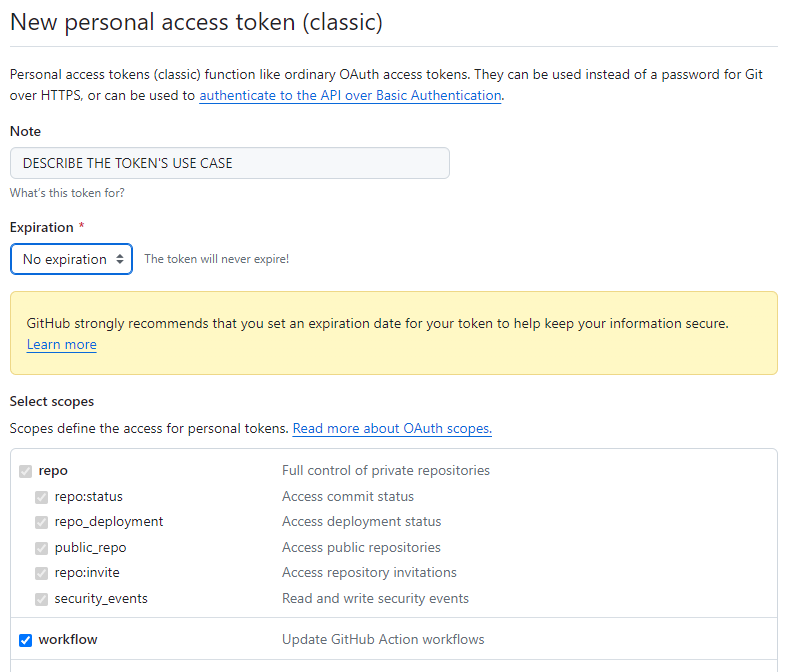
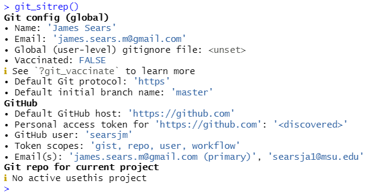

```{css, echo=FALSE}
# CSS for including pauses in printed PDF output (see bottom of lecture)
@media print {
  .has-continuation {
    display: block !important;
  }
}
.remark-code-line {
  font-size: 95%;
}
.small {
  font-size: 75%;
}
.scroll-output-full {
  height: 90%;
  overflow-y: scroll;
}
.scroll-output-75 {
  height: 75%;
  overflow-y: scroll;
}
```

```{r setup, include=FALSE}
options(htmltools.dir.version = FALSE)
library(knitr)
library(fontawesome)
knitr::opts_chunk$set(
	fig.align = "center",
	cache = FALSE,
	dpi = 300,
  warning = F,
  message = F,
	fig.height = 5,
	out.width = "80%"
)
```
# Table of Contents

1. [Troubleshooting Git Credential Issues in RStudio](#gitcred)

---

class: inverse, middle
name: gitcred

# Troubleshooting Git Credential Issues in RStudio


---

# Troubleshooting Git Credential Issues in RStudio

Do you get a password authentication error when trying to push to GitHub from RStudio?
.center[

]

---

# Troubleshooting Steps

To begin, install the `usethis` package:


```{r, eval = FALSE}
pacman:p_load(usethis)

# or: 
# install.packages("usethis")
# followed by 
# library(usethis)
```

---

# Troubleshooting Steps

Next, run the following:

```{r, eval = FALSE}
library("usethis")
git_sitrep()
```

--

View the output: 
do you see any Xs or lines saying "lacks recommended scopes", "error", or "can't retrieve"? 

---
# Create a Personal Access Token (PAT)

To fix these errors, we'll create a .hi-medgrn[Personal Access Token (PAT)] on GitHub.

The below code will open a browser window - follow the steps to create a PAT

```{r, eval = FALSE}
usethis::create_github_token()
```

.center[

]

---
# Add a PAT to RStudio


Back in RStudio, run

```{r, eval = FALSE}
 gitcreds::gitcreds_set()
```

Follow the prompts to add/replace existing credentials, pasting in the PAT.

---
# Check PAT

Once added, run `git_sitrep` one last time to verify.

If all looks good, try pushing again!

.center[

]

```{r gen_pdf, include = FALSE, cache = FALSE, eval = FALSE}
infile = list.files(pattern = 'RStudio.html')
pagedown::chrome_print(input = infile, timeout = 200)
```