```{css, echo=FALSE}
# CSS for including pauses in printed PDF output (see bottom of lecture)
@media print {
  .has-continuation {
    display: block !important;
  }
}
.remark-code-line {
  font-size: 95%;
}
.small {
  font-size: 75%;
}
.scroll-output-full {
  height: 90%;
  overflow-y: scroll;
}
.scroll-output-75 {
  height: 75%;
  overflow-y: scroll;
}
```

```{r setup, include=FALSE}
options(htmltools.dir.version = FALSE)
library(knitr)
library(fontawesome)
knitr::opts_chunk$set(
	fig.align = "center",
	cache = FALSE,
	dpi = 300,
  warning = F,
  message = F,
	fig.height = 5,
	out.width = "80%"
)
```
# Table of Contents

1. [Prologue](#prologue)

1. [R Markdown](#markdown)

1. [Version Control](#control)

1. [Git(Hub) + RStudio](#gitr)

1. [GitHub Desktop](#desktop)

1. [Other Tips and Productivity Tools](#tips)

---
class: inverse, middle
name: prologue

# Prologue

<!-- software installations, checking registrations-->

---
# Prologue

Before we dive in, let's double check that we all have

`r fa('square-check')` Installed [.hi-orange[R]](https://www.r-project.org/).

`r fa('square-check')` Installed [.hi-orange[RStudio]](https://www.rstudio.com/products/rstudio/download/preview/).
	
`r fa('square-check')`  Signed up for an account on [.hi-orange[Github]](https://github.com/)

`r fa('square-check')` Installed [.hi-orange[Git]](https://happygitwithr.com/install-git) and [.hi-orange[Github Desktop]](https://desktop.github.com/)

`r fa('square-check')`  Log into your Github account on Github Desktop

---
class: inverse, middle
name: markdown

# R Markdown

---
#R Markdown

Before we dive into version control, let's chat about .hi-medgrn[R Markdown].

--

R Markdown is a document type that allows for integration of R code and output into a Markdown document. 

.hi-blue[Resources:]
- Website: [.hi-orange[rmarkdown.rstudio.com]](https://rmarkdown.rstudio.com)
- [.hi-orange[R Markdown Cheatsheet]](https://github.com/rstudio/cheatsheets/raw/main/rmarkdown-2.0.pdf)
- Book: [.hi-orange[R Markdown: The Definitive Guide]](https://bookdown.org/yihui/rmarkdown) (Yihui Xie, JJ Allaire, and Garrett Grolemund)

---
#R Markdown

Before we dive into version control, let's chat about .hi-medgrn[R Markdown].


R Markdown is a document type that allows for integration of R code and output into a Markdown document. 

.hi-pink[Other points:]
- We'll be completing assignments using R Markdown.
- FWIW, my lecture slides and notes are all written in R Markdown too. (E.g. This slide deck is built using the [.hi-orange[xaringan]](https://github.com/yihui/xaringan/wiki) package with the metropolis theme.)


---
# R Markdown: Getting Started

`r fa('square-check')` Installed [R](https://www.r-project.org/).

`r fa('square-check')` Installed [RStudio](https://www.rstudio.com/products/rstudio/download/preview/).
	
`r fa('square')`  Add the `rmarkdown` package


``` {r, eval = FALSE}
install.packages("rmarkdown")
```

`r fa('square')` Install LaTeX
  * If just for this, can use [.hi-orange[TinyTex]](https://yihui.name/tinytex/)

``` {r, eval = FALSE}
# Install only if you don't have LaTeX already
install.packages("tinytex")
tinytex::install_tinytex()
```

---
# R Markdown: Creating a New .Rmd File

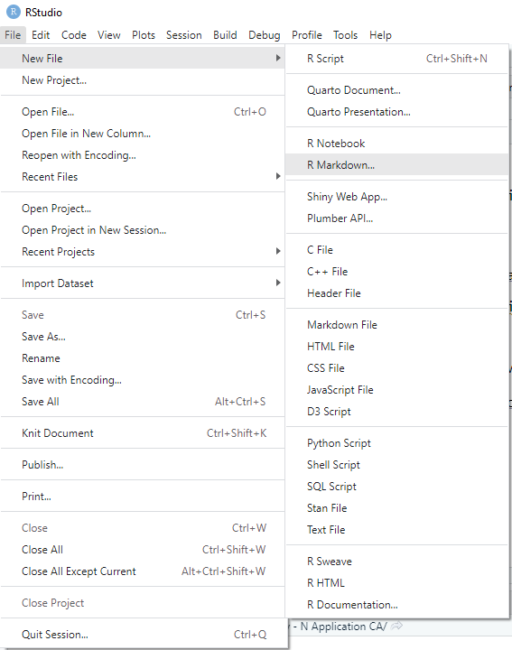 

---
# R Markdown: Creating a New .Rmd File

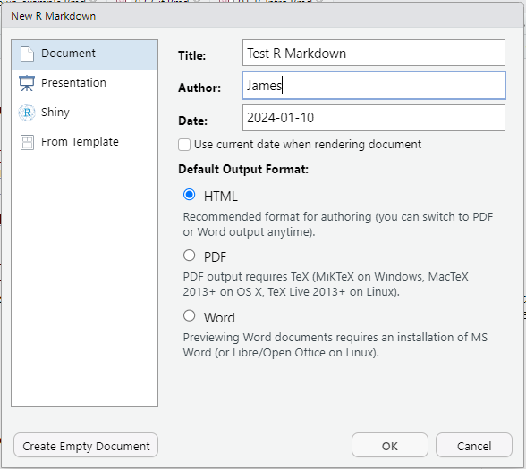 

---
# R Markdown: Creating a New .Rmd File

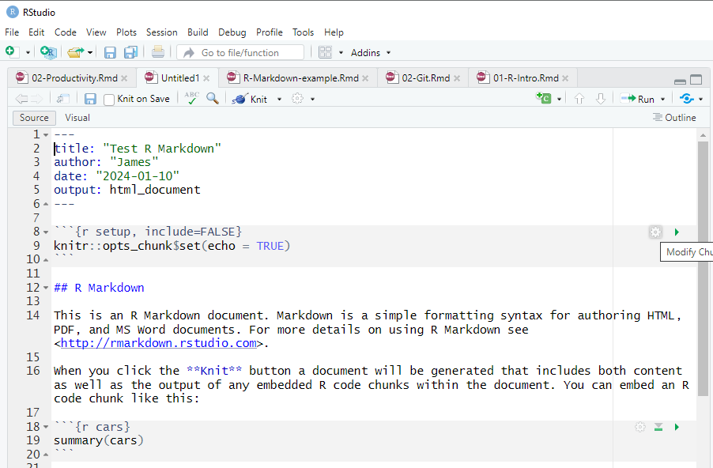 


---
# R Markdown Components

R Markdown combines
  1. .hi-purple[Markdown:] lightweight markup language
  1. .hi-pink[LaTeX:] typesetting for math
  1. .hi-medgrn[R:] include code and generate output
  
--

<br>
<br> 
Let's do some practice: .hi-slate[open a new .Rmd file] and try adding content as we go

---
# Markdown

.hi-purple[Markdown] allows for formatting text in a lightweight way

I highly recommend the handy [.hi-orange[Markdown Guide]](https://www.markdownguide.org/) for more details

---
# Markdown: Heading

.hi-blue[Headings] emphasize text and add chunks to your script

Largest headingwith one leading \#  (slide title above) 

## Second Largest (\#\#)
### Third Largest (\#\#\#)
#### Getting Smaller... (\#\#\#\#)
Normal Text for comparison


---
# Markdown: Text Format

**Bold text** with \*\*your text\*\*

*Italicize* with \*single asterisks\*

Add `code text` with  grave accents (the back tick symbol)
  * &#96;
  * The other output of the tilde key `~` on keyboard

End a line with two spaces  to start a new paragraph 
  * or leave a line space between sentences

Can also start a new line with backslash (\\)


---
# Markdown: Text Format

Add superscripts<sup>2</sup> with ^carets^

Add ~~strikethroughs~~ with \~\~double tildes\~\~

Add a line break (horizontal rule) 

***

with \*\*\*

---
# Markdown: Text Format

Draw .hi-pink[tables] using | and -


| Col A | Col B | Col C|
|---|---|---|
| This | is | a |
| Table | | wow|


---
# Markdown: Lists

Add an .hi-purple[ordered list] with .hi-purple[1.]

  1. First Item
  1. Second Item
  1. No need to change the number - keep using 1. It will automatically update.
  
--

Add an .hi-medgrn[unordered list] with .hi-medgrn[\* or \-]

  * A thing
  * Another related thing
    - Indent to nest
      1. Can mix ordered and unordered

---
# Markdown: Inputs

Add a [link](https://www.markdownguide.org/cheat-sheet/) with \[\]()
  * \[text label\](URL)
  * Add direct link with &#60;link&#62;   <https://www.markdownguide.org>
  
--

Add an image with !\[\]()
  * !\[alt text](URL)


.hi-medgrn[practice] by adding `images/smile.png`:
  
  
  
---
# R Markdown: LaTeX

Another advantage of R Markdown is that it integrates  functionality for typesetting math.


--

Add an .hi-purple[inline equation] with &#36;TeX&#36;

$Var(X) = \sum\limits_{i=1}^n \frac{(x_i - \bar{x})^2}{n} ~~~~ ~~~ Y_{it} = \beta_0 + \beta_1 X_{it} + \epsilon_{it}$

--

Add multiple rows of LaTeX with 

&#36;&#36; 

LaTeX lines here

&#36;&#36;

Use the [.hi-orange[standard LaTeX commands]](https://kapeli.com/cheat_sheets/LaTeX_Math_Symbols.docset/Contents/Resources/Documents/index) for symbols/characters


---
# R Markdown: R Code

R code is primarily executed with .hi-blue[code chunks]

--

Add a chunk with 
  * `Cmd + Option + I (Ctrl + Alt + I on PC)`
  * The `Insert` button in the UI
  * Manually type 

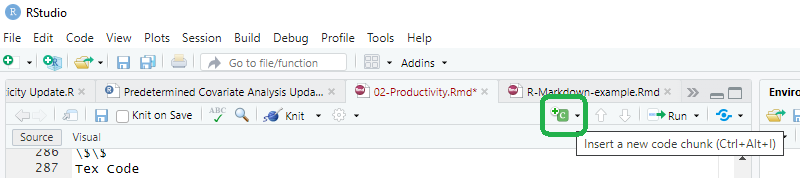
---
# R Markdown: R Code Chunks


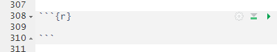 


.hi-blue[Code chunks] allow us to add as many lines of code as we want
  * Output will appear underneath after executing the full chunk
  * Can customize whether it runs, how output is displayed
  * Can run manually 
    * Line by line with `Cmd/Ctrl + Enter`
    * Entire chunk with `Run Entire Chunk` button

---
# R Markdown: R Code Chunk Options

You can .hi-blue[add chunk options] in brackets after `r` and separated by commas.

Some commonly-used options include:
  * .hi-slate[Chunk label] (`ex_chunk`)
  * `include = FALSE` will run the chunk but hide it from the final document
  * `eval = FALSE` will display code without evaluating it
  * `results = 'hide'` runs code but hides output from the final document 
  
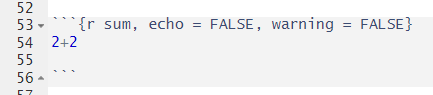 

  
---
# R Markdown: R Code Chunk Options

You can .hi-blue[add chunk options] after `r` and separated by commas.

Some commonly-used options include:
  * `echo = FALSE` runs the code but hides the chunk from the final document 
  * `error = FALSE` (`warning: FALSE`) will hide error (warning) messages generated by the code
  * LOTS of options for output figures: figure size (fig.width, fig.height, fig.dim), output document scale (out.width, out.height), alignment (fig.align), caption (fig.cap)
  
  Learn more [.hi-orange[about chunk options here]](http://yihui.name/knitr/options)
  
---
# R Markdown: R Code

You can call R objects from earlier chunks .hi-medgrn[inline] with 

 r  


``` {r}
four = 2+2
```

This can output in line with text: 2 + 2 = `r four`


---
class: inverse, middle


# R Markdown File Organization


---
# 1. Header
.pull-left[
RStudio automatically builds the R Markdown file from a template, which begins with a .hi-medgrn[header]
  * Title
  * Author
  * Date
  * Output Format
    * Main options<sup>1</sup>: HTML (`html_document`), PDF (`pdf_document`), LaTeX (`latex_document`), or Word (`word_document`)
]
.pull-right[

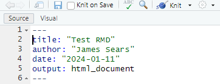 

]

.footnote[1: See [.hi-orange[CH 3 of "R Markdown: The Definitive Guide" for more on how to customize output formats]](https://bookdown.org/yihui/rmarkdown/documents.html)]

---
# 2. R Setup

By default, RStudio adds a .hi-blue[setup] code chunk next.

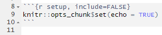 

  * Can set global options
  * Useful as your preamble
  * For [.hi-orange[R Notebooks]](https://bookdown.org/yihui/rmarkdown/notebook.html), this will automatically be run and is the only place where you can change your working directory 


---
# 3. Contents

From here on you can build the report/notebook as needed for the task.
  * Add any writing and outside graphics or [.hi-orange[bibTeX citations]](https://bookdown.org/yihui/rmarkdown-cookbook/bibliography.html)
  * Add code chunks to carry out desired analysis
  * Employ sections and formatting to structure the document as desired
  
---
# Compiling/Knitting

When you are ready to compile your final document, use the `Knit` button or ` Ctrl/Cmd + Shift + K`

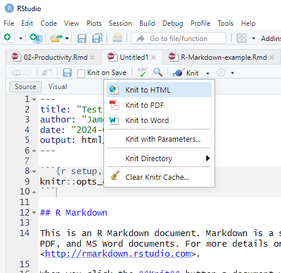 

---
# R Markdown: Knit to Compile Output (HTML, PDF)

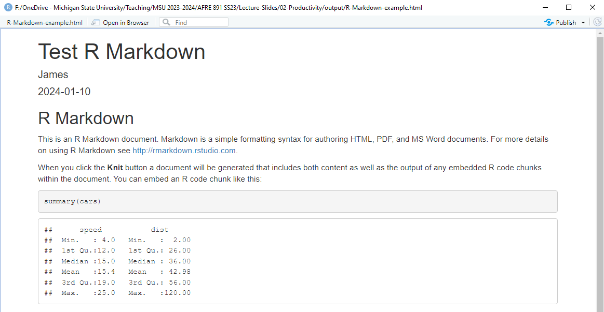 


---
class: inverse, middle

# Markdown Practice!

---
# Markdown Practice

  1. Create a new R Markdown file named "R-Markdown-Ex.RMD"
  1. In the setup chunk, load the `dslabs` and `tidyverse` packages
    * Use the `data()` function to read in the `divorce_margarine` dataset
  1. Add a header labeled "Correlation vs. Causation" and a text explanation below for why we often want to differentiate between the two
  1. Add a code chunk with the label `plot`
    * Type the following code:
    ```
    ggplot(divorce_margarine) +
    geom_point(aes(x = margarine_consumption_per_capita, 
                   y = divorce_rate_maine)) +
    labs(title = "Relationship between Margarine Consumption and 
                  Divorce Rates in Maine",
         subtitle = "2000-2009",
         x = "Margarine Consumption per Capita",
        y = "Divorce Rate")`
     ```     
  1. Knit and save a PDF/HTML copy of the file to the "output" folder
  
  
---
class: inverse, middle
name: control

# Version Control

<!-- basics of version control, why do it, different version -->

---
# Why Use Version Control

 

---
# Goals of Version Control

While building project folders with the above naming conventions is *fun*, a good .hi-medgrn[version control system] can solve this problem.

  * Save each set of changes sequentially
  * Keep track of different versions of a file
  * Merge changes from multiple versions/sources

---

# Git(Hub) Solves this Problem

### Git

- .hi-medgrn[Git] is a .hi-medgrn[distributed version control system]
  - Each team member has a .hi-blue[local copy] of files on their computer
- Imagine if Dropbox and the "Track changes" feature in MS Word had a baby. Git would be that baby.
- In fact, it's even better than that because Git is optimised for the things that economists and data scientists spend a lot of time working on (e.g. code).
- There is a learning curve, but I promise you it's worth it.

---

# Git(Hub) Solves this Problem

### GitHub

- It's important to realise that .hi-medgrn[Git] and .hi-purple[GitHub] are distinct things.
- .hi-purple[GitHub] is an .hi-purple[online hosting platform] that provides an array of services built on top of the Git system. (Similar platforms include Bitbucket and GitLab.)
- Just like we don't *need* Rstudio to run R code, we don't *need* GitHub to use Git... But it will make our lives so much easier.

---

# Git(Hub) for Scientific Research

.hi-slate[From software development...]

- Git and GitHub's role in global software development is not in question.
- There's a high probability that your favourite app, program or package is built using Git-based tools. (RStudio is a case in point.)

.hi-slate[... to scientific research]

- Benefits of VC and collaboration tools aside, Git(Hub) helps to operationalise the ideals of open science and reproducibility.<sup>2</sup>
- Journals have increasingly strict requirements regarding reproducibility and data access. GH makes this easy (DOI integration, off-the-shelf licenses, etc.)
- I host [.hi-orange[teaching materials]](https://github.com/searsjm) on GH. I even use it to host and maintain my [.hi-orange[website]](https://github.com/searsjm/searsjm.github.io).
.footnote[2: [.hi-orange[Democratic databases: Science on GitHub (Nature)]](https://www.nature.com/news/democratic-databases-science-on-github-1.20719) (Perkel, 2016).]

  
---
class: inverse, middle
name:gitr

# Git(Hub) and RStudio 

---

# Seamless Integration

One of the (many) great features of RStudio is how well it integrates version control into your everyday workflow.
- Even though Git is a completely separate program to R, they feel like part of the same "thing" in RStudio.
- This next section is about learning the basic Git(Hub) commands and the recipe for successful project integration with RStudio.

--

I also want to bookmark a general point that we'll revisit many times during this course: 
- The tools that we're using all form part of a coherent .hi-medgrn[data science ecosystem].
- Greatly reduces the cognitive overhead ("aggregation") associated with traditional workflows, where you have to juggle multiple programs and languages at the same time.

---

# Link a GitHub Repo to an RStudio Project 

The starting point for our workflow is to link a GitHub repository (i.e. "repo") to an RStudio Project. Here are the steps we're going to follow:

1. Create the repo on GitHub and initialize with a README.
2. Copy the HTTPS/SSH link (the green "Clone or Download" button).<sup>1</sup>
3. Open up RStudio.
4. Navigate to **File -> New Project -> Version Control -> Git**.
5. Paste your copied link into the "Repository URL:" box.
6. Choose the project path ("Create project as subdirectory of:") and click **Create Project**.

<!-- .footnote[<sup>1</sup> It's easiest to start with HTTPS, but <a href="http://happygitwithr.com/ssh-keys.html#ssh-keys" target="_blank">SSH</a> is advised for more advanced users.] -->

--

Now, I want you to practice by these steps by creating your own repo on GitHub — call it "test" — and cloning it via an RStudio Project.

---
# Create a Repository on GitHub (Repo)

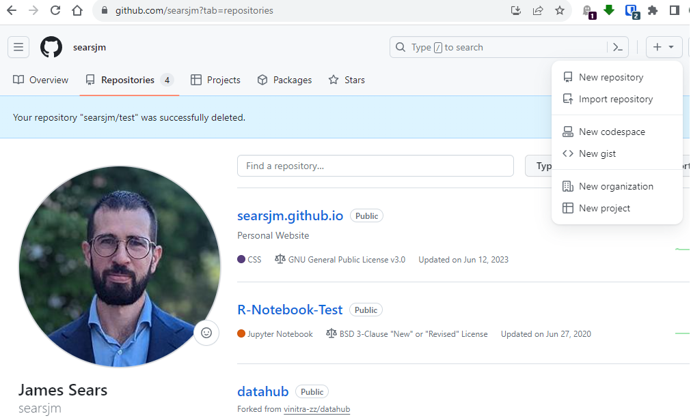

---
# Create a Repository on GitHub (Repo)

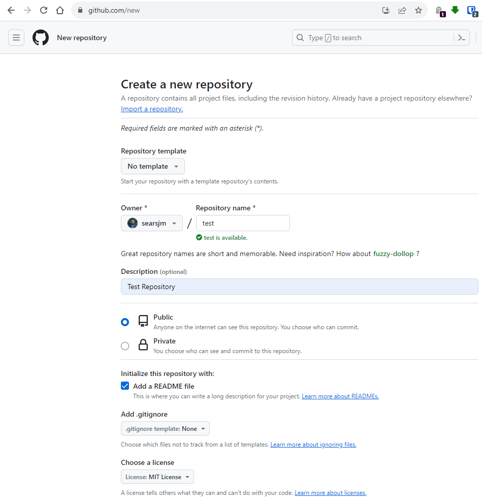

---
# Create a Repository on GitHub (Repo)

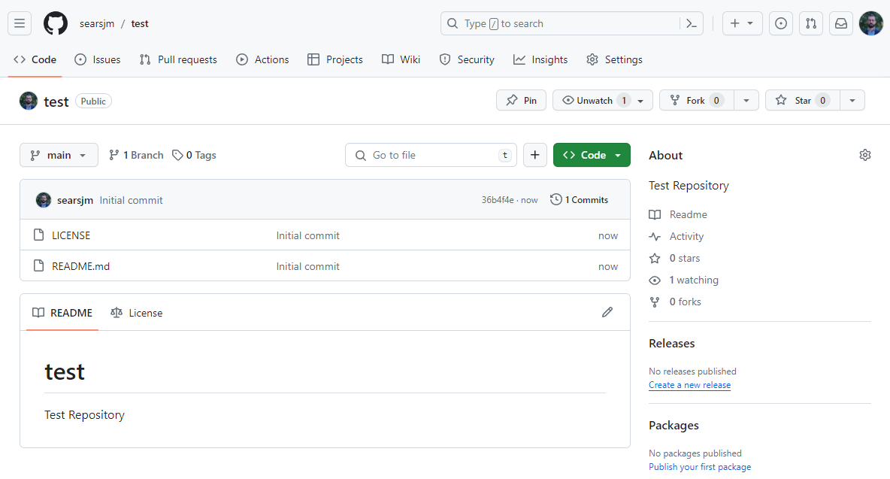

---
#  Create a Repository on GitHub (Repo)

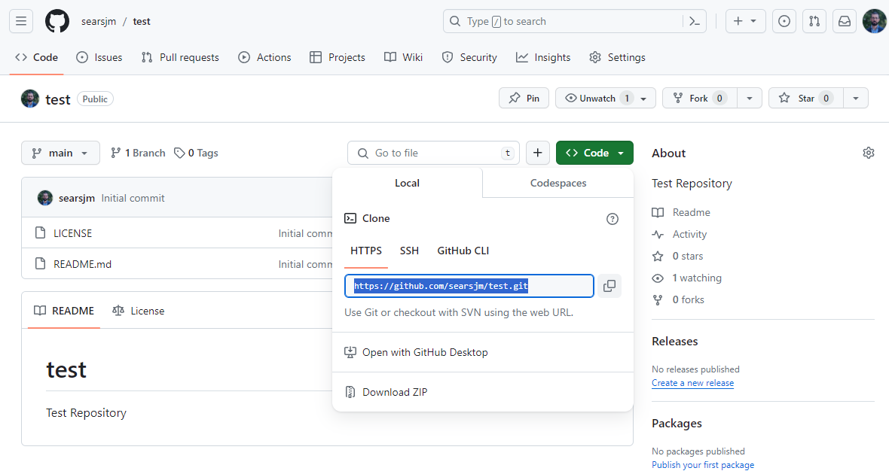

---
# Copy Repo Link

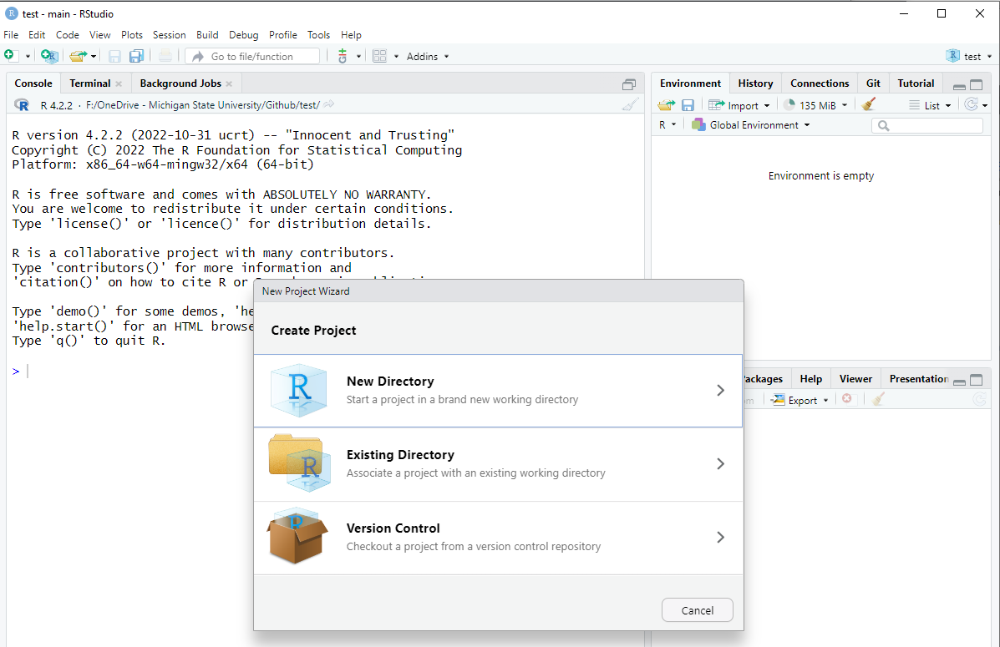


---
# Add Repo into RStudio

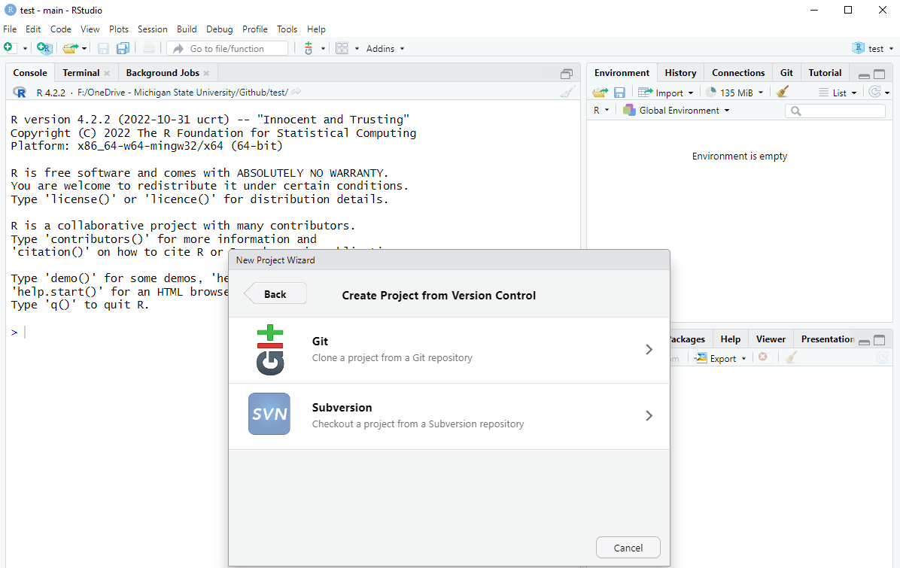


---
# Add Repo into RStudio

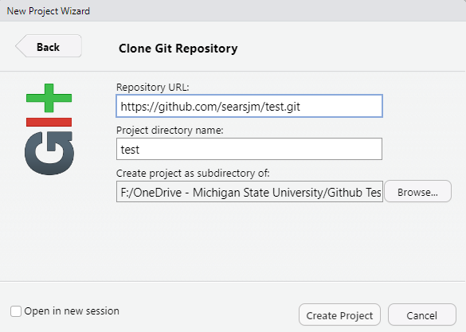


---
# Add Repo into RStudio

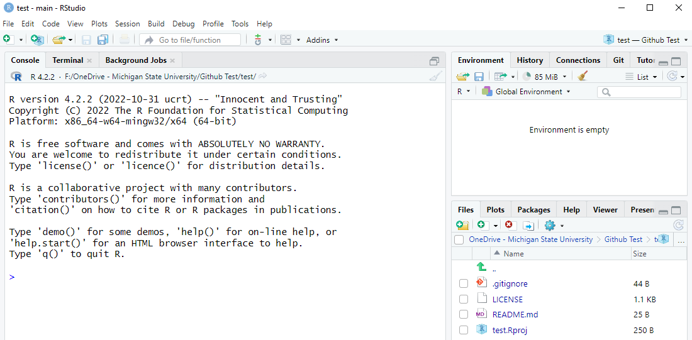

---
# Making Local Changes

Look at the .hi-medgrn[top-right panel] in your RStudio IDE. Do you see the .hi-blue[Git] tab? 
- Click on it. 
- There should already be some files in there, which we'll ignore for the moment.<sup>1</sup>

Now open up the README file (see the "Files" tab in the bottom-right panel).
- Add some text and save the README.
- Do you see any changes in the .hi-blue[Git] panel? Good. (Raise your hand if not.)


.footnote[<sup>1</sup> They're important, but not for the purposes of this section.]

---
# Making Local Changes

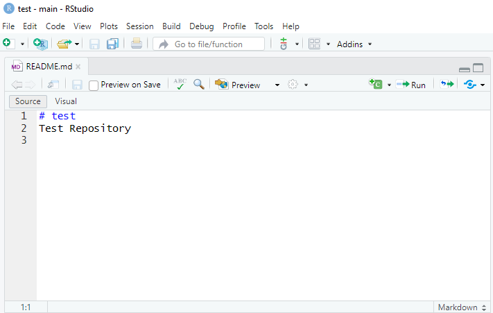

---
# Making Local Changes

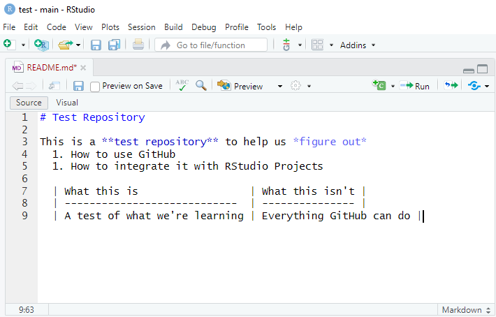


---

# Main Git operations

Now that you've .hi-purple[cloned] your first repo and made some local changes, it's time to learn the .hi-medgrn[four main Git operations].

1. .hi-slate[Stage] (or "add")
  - Tell Git that you want to add changes to the repo history (file edits, additions, deletions, etc.)
2. .hi-slate[Commit]
  - Tell Git that, yes, you are sure these changes should be part of the repo history.
3. .hi-slate[Pull]
  - Get any new changes made on the GitHub repo (i.e. the upstream remote), either by your collaborators or you on another machine.
4. .hi-slate[Push]
  - Push any (committed) local changes to the GitHub repo

---

# Main Git operations

1. .hi-slate[Stage] (or "add")
  - Tell Git that you want to add changes to the repo history (file edits, additions, deletions, etc.)
2. .hi-slate[Commit]
  - Tell Git that, yes, you are sure these changes should be part of the repo history.
3. .hi-slate[Pull]
  - Get any new changes made on the GitHub repo (i.e. the upstream remote), either by your collaborators or you on another machine.
4. .hi-slate[Push]
  - Push any (committed) local changes to the GitHub repo

For the moment, it will be useful to group the first two operations and last two operations together. (They are often combined in practice too, although you'll soon get a sense of when and why they should be split up.)


---
# Stage and Commit
.center[
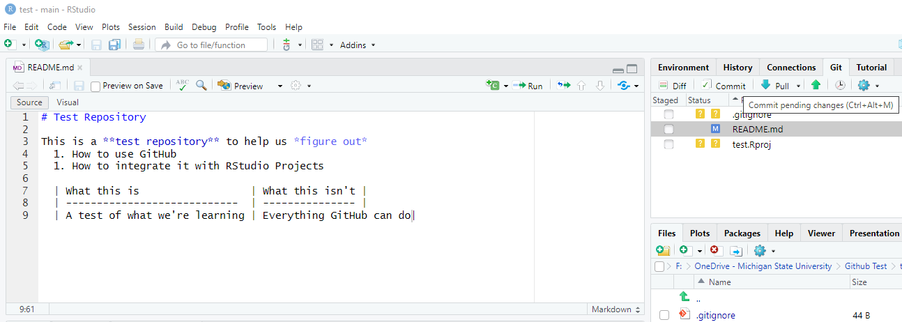
]
---
# Stage and Commit
.center[
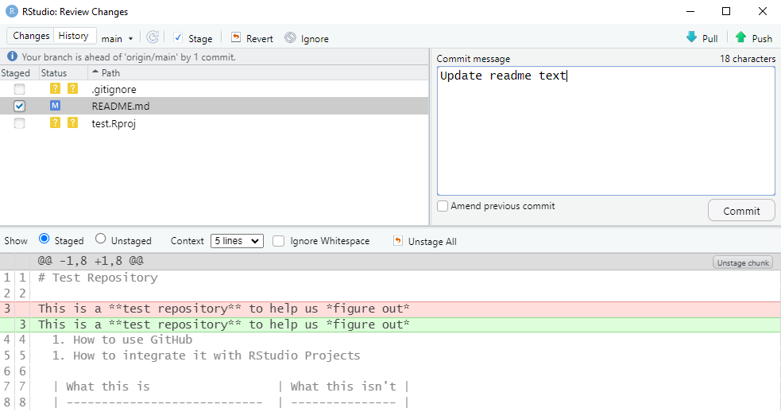
]
---
# Stage and Commit
.center[
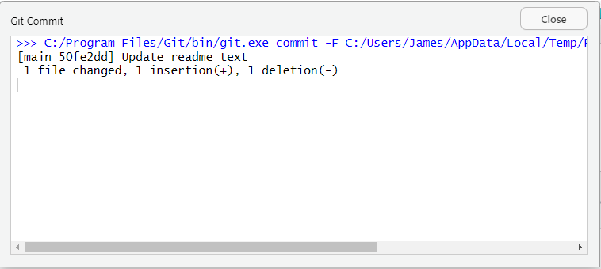
]
---
# Pull
.center[
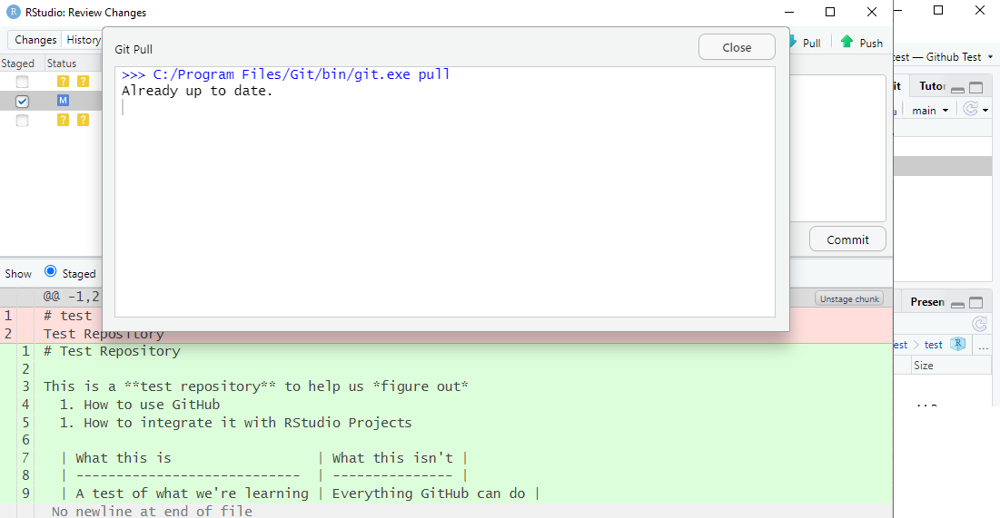
]
---
# Push
.center[
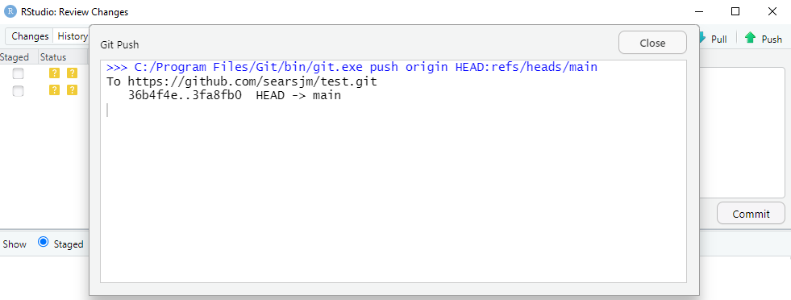
]
---
# Sign RStudio into Github
.center[
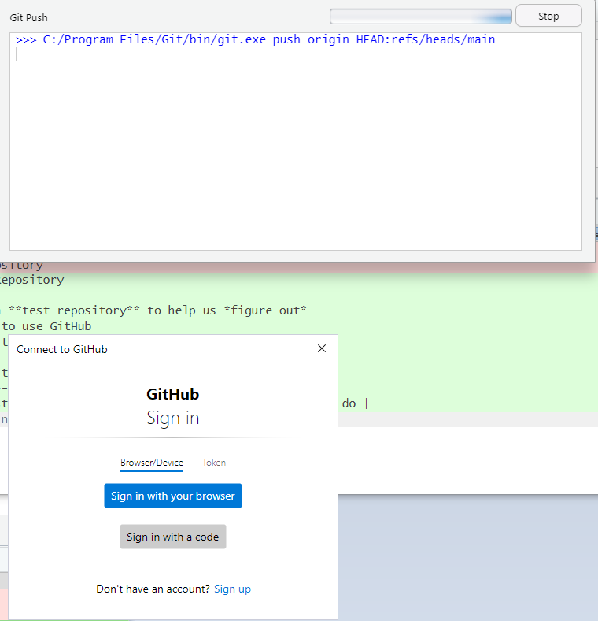
]
---
# Sign RStudio into Github
.center[
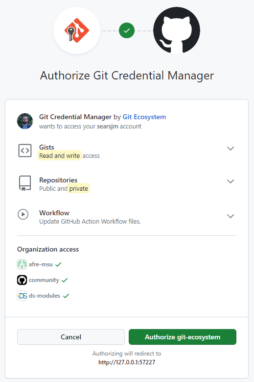
]
---
# Changes Now Visible on Github
.center[
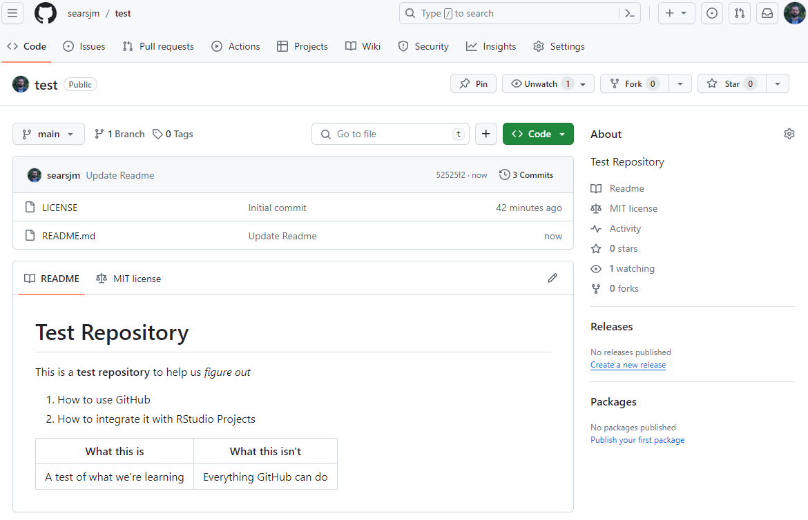
]
---
# Changes Now Visible Locally Too
.center[
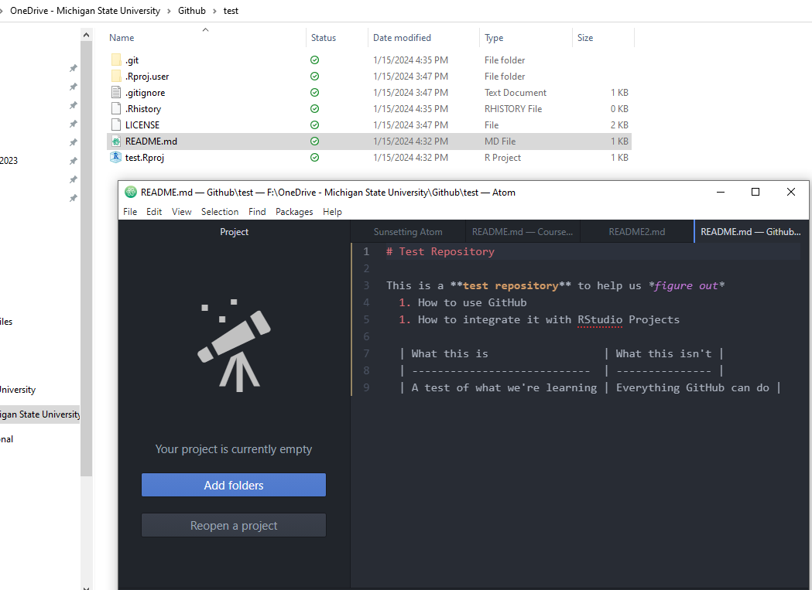
]


---

# Recap

Here's a step-by-step summary of what we just did.
- Made same changes to a file and saved them locally.
- .hi-blue[Staged] these local changes.
- .hi-medgrn[Committed] these local changes to our Git history with a helpful message.
- .hi-purple[Pulled] from the GitHub repo just in case anyone else made changes too (not expected here, but good practice).
- .hi-pink[Pushed] our changes to the GitHub repo.

Aside: Always pull from the upstream repo *before* you push any changes. Seriously, do this even on solo projects; making it a habit will save you headaches down the road.


---

# Recap

Here's a step-by-step summary of what we just did.
- Made same changes to a file and saved them locally.
- .hi-blue[Staged] these local changes.
- .hi-medgrn[Committed] these local changes to our Git history with a helpful message.
- .hi-purple[Pulled] from the GitHub repo just in case anyone else made changes too (not expected here, but good practice).
- .hi-pink[Pushed] our changes to the GitHub repo.


PS — You were likely challenged for your GitHub credentials at some point. Learn how to cache these [here](https://happygitwithr.com/credential-caching.html).

---

# Why this Workflow: GitHub

Creating the repo on GitHub first means that it will .hi-medgrn[always be "upstream"] of your (and any other) local copies.
- In effect, this allows GitHub to act as the .hi-purple[central node] in the distributed VC network.
- Especially valuable when you are collaborating on a project with others — more on this later — but also has advantages when you are working alone.
- If you would like to move an existing project to GitHub, my advice is still to create an empty repo there first, clone it locally, and then copy all your files across.


---

# Why this Workflow: RStudio

.hi-blue[RStudio Projects] are great. 
- They interact seamlessly with Git(Hub), as we've just seen. 
- They also solve absolute vs. relative path problems, since the .Rproj file acts as an anchor point for all other files in the repo.<sup>1</sup>

.footnote[<sup>1</sup> Calling files from their full `YourComputer/YourName/Documents/Special-Subfolder/etc` paths in your scripts is the enemy of reproducibility!]


---
class: inverse, middle
name: desktop

# GitHub Desktop

---
# Version Control with GitHub Desktop

Although GitHub integration with RStudio has lots of functionality, there are times where we want to keep track of files and projects .hi-medgrn[outside of RStudio].

This is where .hi-purple[GitHub Desktop] comes in.

---
# Github Desktop Workflow

With GitHub Desktop, we can maintain a similar workflow

.center[
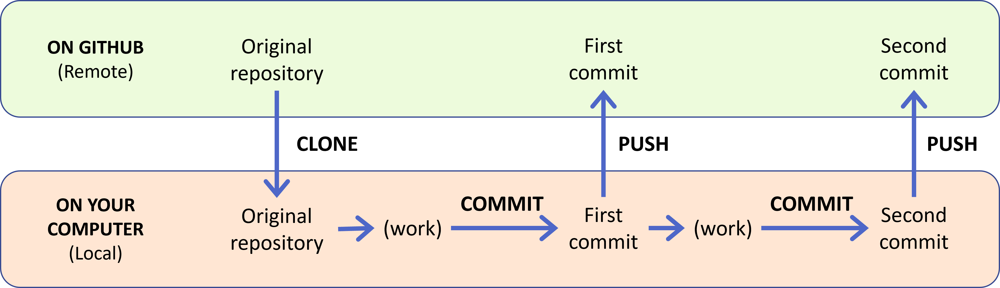
]

---
# Github Desktop Workflow

With GitHub Desktop, we can maintain a similar workflow

1. Create a new repository on GitHub.com
1. .hi-blue[Clone] the repository to your local machine
1. Do some work (i.e. edit the repository)
1. .hi-medgrn[Commit] changes to the repository
1. .hi-purple[Push] your commit to GitHub

---
# Clone Repository 

.center[
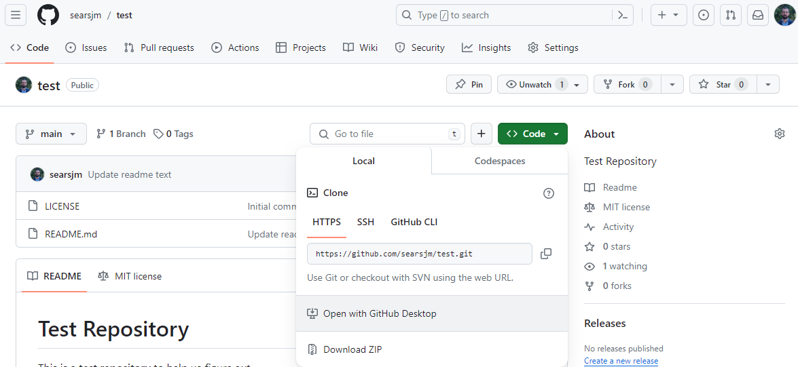
]

---
# Clone Repository 

.center[
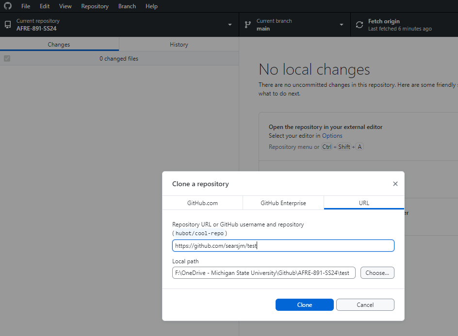
]

---
# Clone Repository 

.center[
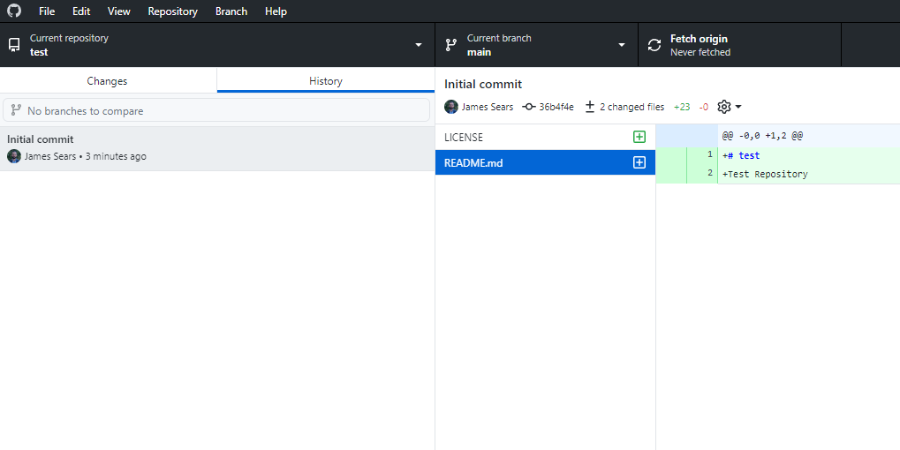
]

---
# Fetch Origin + Pull to Stay Current

.center[
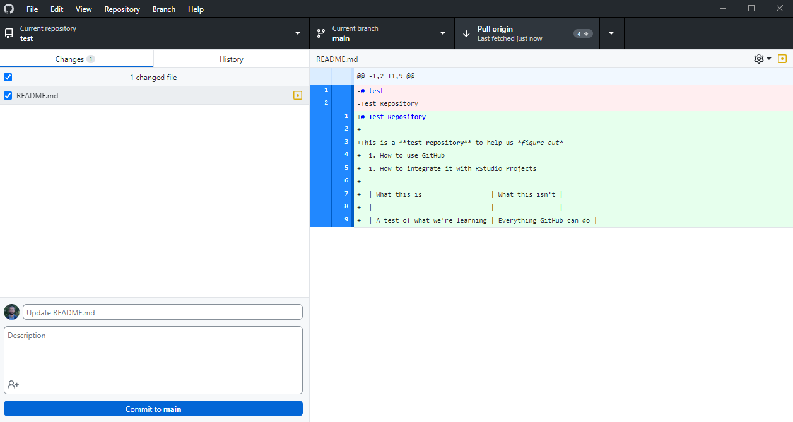
]

---
# Make Local Changes to Repo
Save a new .Rmd file named `repo-test` into the "test" folder
  * GitHub Desktop automatically stages the changes

.center[
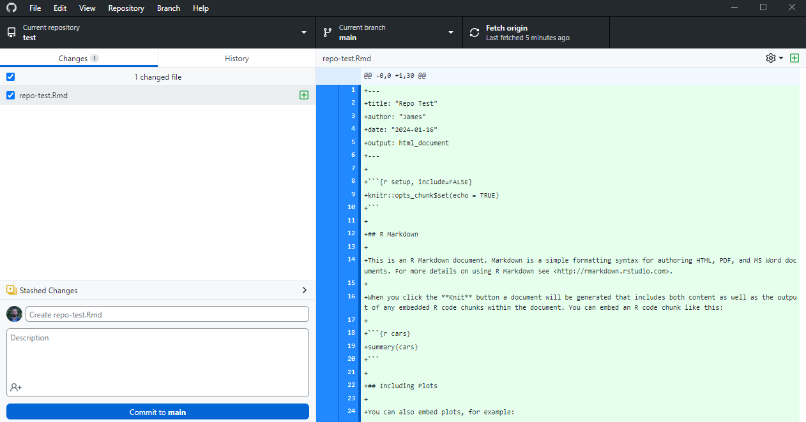
]

---
# Commit Changes
Add commit title and description, then commit to GitHub

.center[
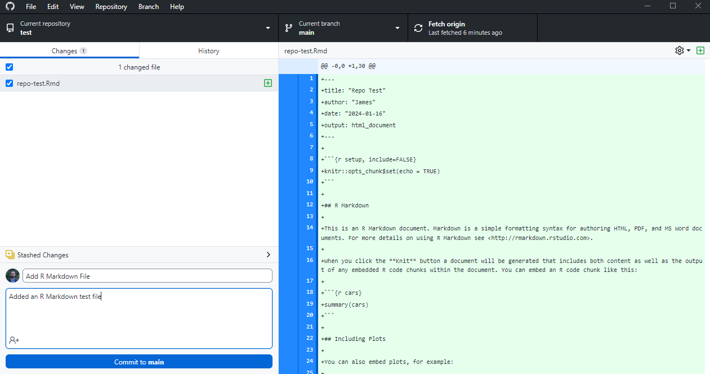
]

---
# Push Changes to GitHub Desktop

.center[
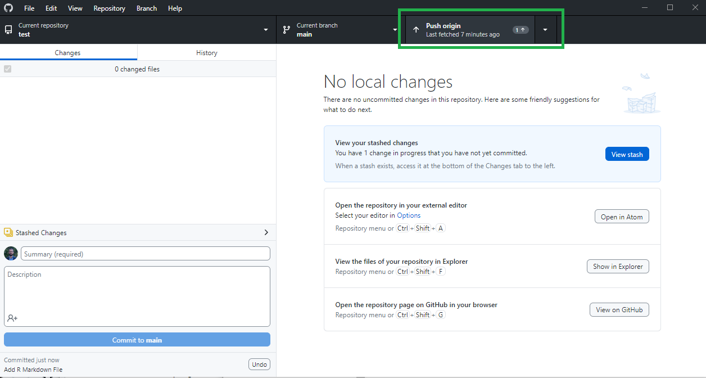
]

---
# Repo now Matches Local Version

.center[
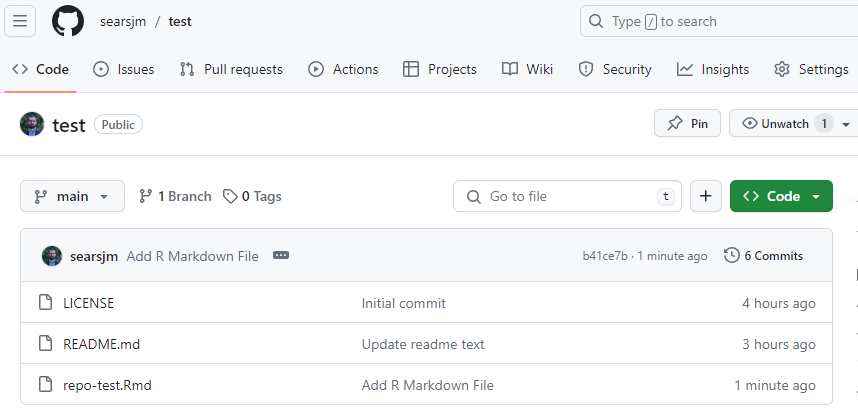
]


---
class: inverse, middle
name: tips

# Other Tips and Productivity Tools

---
# Productivity Miscellanea

What follows are miscellaneous things that I find .hi-purple[improve my productivity]

  * .hi-medgrn[Synced Cloud Storage] (SpartanDrive or Dropbox/Box)
  * .hi-blue[Overleaf] for LaTeX collaboration
  * .hi-pink[Connected Papers] for literature networks
  
  
---
# Synced Cloud Storage and OneDrive

.hi-medgrn[Synced Cloud Storage] is hugely beneficial if you work across .hi-pink[multiple computers] or .hi-blue[with many collaborators].

  * Make sure each computer has the most up-to-date version of all your files
  * Renders flash drives almost entirely obselete!

---
# Synced Cloud Storage and OneDrive

One easy way to do this: .hi-purple[SpartanDrive/OneDrive]

All faculty + staff get .hi-blue[5 TB of free storage] on [.hi-orange[SpartanDrive (MSU's version of OneDrive)]](https://tdx.msu.edu/TDClient/32/Portal/KB/ArticleDet?ID=1169#ANCHOR_Topic%20Two)


.pull-left[

## Pros
  * Free
  * Syncable desktop apps
  * Part of the MSU Office365 ecosystem
]
.pull-right[

## Cons

  * Part of the MSU Office365 ecosystem
  * Limited storage (5TB, 250gb max filesize)
  * Sometimes finicky
]


---
# Synced Cloud Storage


Alternatives to SpartanDrive:

  * .hi-blue[Dropbox]: 2GB free ($10/mo for 2TB)
  * .hi-pink[Box:] 10GB free ($10/mo for 100GB)

--

Ultimate choice of platform may depend on coauthors + your current choice, but it's a good idea to .hi-purple[download the desktop app] to keep your files synced + backed up!
  * Also gives basic version control

---
# Overleaf

If you typeset using LaTeX, [.hi-orange[Overleaf]](https://www.overleaf.com/) streamlines access and collaboration

.less-right[
.hi-blue[Free Version:] remotely host all files, access for you + 1 collaborator
  
.hi-medgrn[Paid ($7.40/mo):] track changes + full document history, Git(hub) + Dropbox integration,  up to 6 collaborators
]

  

.more-left[
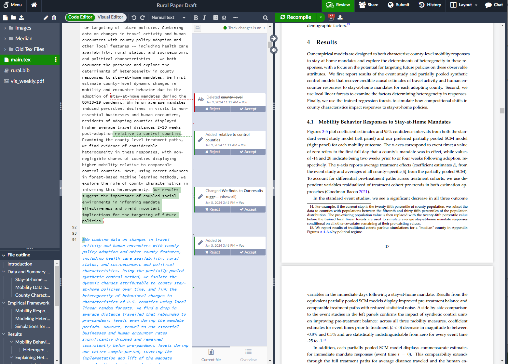 

]

---
# Connected Papers 

.more-left[
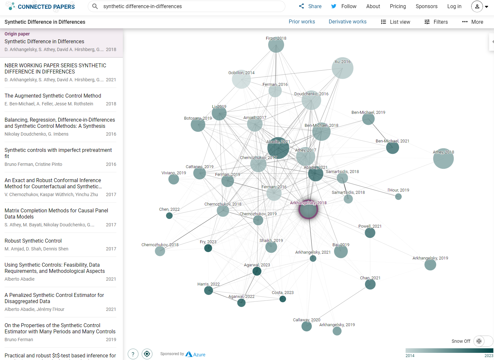 
]
.less-right[
  * Graphical representation of paper networks
  * Visualize literature as directed graph
  * 5 free per month ([.hi-orange[unlimited for $6/mo]](https://www.connectedpapers.com/pricing))
]

---
# Productivity Miscellanea

<br>
<br>

.font200[
.center[
 .hi-dkgrn[Your Productivity Tips + Tricks?]
]
]

---
# Table of Contents

1. [Prologue](#prologue)

1. [R Markdown](#markdown)

1. [Version Control](#control)

1. [Git(Hub) + RStudio](#gitr)

1. [GitHub Desktop](#desktop)

1. [Other Tips and Productivity Tools](#tips)


```{r gen_pdf, include = FALSE, cache = FALSE, eval = FALSE}
infile = list.files(pattern = 'Productivity.html')
pagedown::chrome_print(input = infile, timeout = 21600)
```