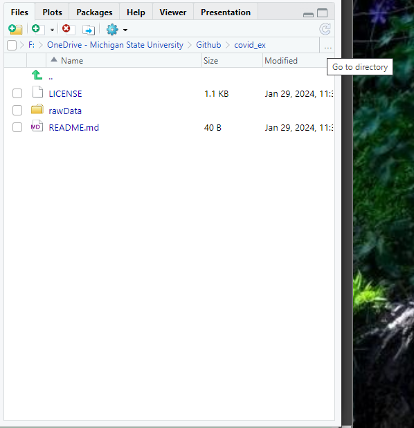
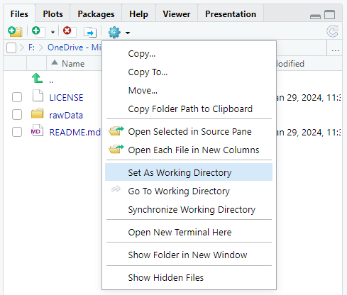

```{css, echo=FALSE}
# CSS for including pauses in printed PDF output (see bottom of lecture)
@media print {
  .has-continuation {
    display: block !important;
  }
}
.remark-code-line {
  font-size: 95%;
}
.small {
  font-size: 75%;
}
.scroll-output-full {
  height: 90%;
  overflow-y: scroll;
}
.scroll-output-75 {
  height: 75%;
  overflow-y: scroll;
}
```

```{r setup, include=FALSE}
options(htmltools.dir.version = FALSE)
library(knitr)
library(fontawesome)
knitr::opts_chunk$set(
	fig.align = "center",
	cache = FALSE,
	dpi = 300,
  warning = F,
  message = F,
	fig.height = 5,
	out.width = "80%"
)
```

# Table of Contents

1. [Prologue](#prologue)

1. [Paths and Importing Data](#import)

1. [Keys and Relational Data](#keys)

1. [String Cleaning](#string)

1. [Number Storage](#numbers)

1. [Data Cleaning Checklist](#check)


---
class: inverse, middle
name: prologue

# Prologue

---
# Data Cleaning

No that we know how to wrangle data in R, it's time to talk more specifically about .hi-medgrn[Data Cleaning].

  * Importing data
  * Keys and relational data
  * Cleaning character strings
  * Number Storage

--

Packages we will use today:
  * .hi-slate[stringr]
  * .hi-slate[tidyverse]
  * .hi-slate[nycflights13]
  
```{r}
pacman::p_load(stringr, tidyverse, nycflights13)
```
---

class: inverse, middle
name: import

# Paths and Importing Data


---

# Paths and Directories

The .hi-medgrn[working directory] is your "current location" in the filesystem. What's your current working directory?
```{r}
getwd()
```

* This is an example of a full or .hi-slate[absolute path].
  * Usually starts with `C:/` on Windows or `/` on Mac.
  * Defaults to the .hi-medgrn[folder containing your script/Rmd file]
  
---

# Paths and Directories

In contrast, .hi-blue[relative paths] are defined .hi-blue[relative to] the full path of the working directory.
* Let's say your working directory is `"C:/Github/AFRE-891-SS24/"`
* If you had a file saved at `"C:/Github/AFRE-891-SS24/assignment-1/assignment-1.Rmd"`
* Its relative path would be `"assignment-1/assignment-1.Rmd"`
* Relies on the folder/directory nesting within your filesystem

In R you can use either an absolute or relative path in any given situation, but .hi-medgrn[relative paths] are usually .hi-medgrn[easier to work with].

---

# Paths and Directories: Best Practices

.hi-medgrn[Option 1: use relative paths within GitHub repositories]
  * In the main folder (root directory), place 
    * A **README** file that gives a basic overview of your project.
    * A **master script** that lists and runs all other scripts]
  * Use paths relative to included folder structure specific to each type of input/output, a la...

---

# Paths and Directories: Best Practices

```{r, eval=F}
/my_project
  /rawData
  /processedData
  /code
    /1_clean
    /2_process
    /3_results
  /output
    /tables
    /figures
    /estimates
```

Relative path to access a processed data file named `parcels.dta` is then

.center[
`"processedData/parcels.dta"`
]

---

# Paths and Directories: Best Practices

.hi-purple[Option 2: use relative paths within other Version Control]
  * Even if you're not using GitHub, you can use a similar folder structure for projects saved locally  
  * Back up files/sync across computers with cloud storage (a la OneDrive)


---

# Download this data

Most data does not come nicely in R packages! You will download it from somewhere and load it in R.

[.hi-dkorange[Go here: NYTimes COVID-19 Data]](https://github.com/nytimes/covid-19-data/tree/master/colleges) and click on the .hi-medgrn[Raw CSV] link.

* This is a list of COVID-19 case counts reported at U.S. colleges and universities between July 2020 and May 2021.

.hi-blue[Save] this file somewhere sensible on your computer
  * Perhaps the "data" subfolder in your cloned lecture 4 slides folder?


---
  
# Setting the Working Directory
  
You can change your working directory with `setwd(dir)`. Now:

1. .hi-medgrn[Find the location you saved your CSV file and copy the filepath.]
  * Manual navigation or use the .hi-slate[Files] window in bottom-right
  
.pull-left[

]
.pull-right[

]
---
  
# Setting the Working Directory
  
You can change your working directory with `setwd(dir)`. Now:

1. .hi-medgrn[Find the location you saved your CSV file and copy the filepath.]

2. .hi-blue[Use the console in R to set your working directory to that location.]

For example:
```{r, eval = F}
setwd("F:/OneDrive - Michigan State University/Github/covid_ex/")
```


---
  
# setwd Best Practices

.hi-purple[Pro tip: minimize use of `setwd()` in scripts.]

* Someone else's working directory will be different from yours!
* You want your code to be portable.
* .hi-blue[Best:] set working directory to the project folder .hi-blue[outside the script] (like we just did)
* .hi-medgrn[Better:] declare a `maindir` path to your project folder at the start of your script, set working directory to that path
* .hi-slate[Worst:] changing working directories more than once in a script (barf)


---

# Read in Data (with readr)
The main reason we bother with working directories is to let us .hi-medgrn[read in and interact with data.]

--

The tidyverse package `readr` provides lots of options to read data into R. Read in the college COVID data using `read_csv` and the .hi-purple[relative filepath]:

```{r, message = F}
col <- read_csv("data/colleges.csv")
```

`View` this data to take a look at it. 
```{r}
str(col)
```


---

# Reading in Data with readr

.hi-slate[readr] can read a wide set of .hi-medgrn[plain text and delimited] files, as well as .hi-purple[R Data files] 

| File Type | Function | Use|
|----|-----|-----|
| CSV | `read_csv` | comma delimited<sup>1</sup> |
| CSV | `read_csv2` | semicolon delimited, comma decimal mark |
| TSV | `read_tsv` | tab delimited |
| Delimited Plain Text | `read_delim` | Any delimiter |
| Fixed Width Text | `read_fwf` | Fixed width |
| R Data  | `read_rds` | storage-efficient native R files |

.footnote[More on readr options [.hi-dkorange[here.]](https://evoldyn.gitlab.io/evomics-2018/ref-sheets/R_data-import.pdf)]

---

# Reading in Data with readr

.hi-slate[readr] will guess at column types, but often it makes sense to .hi-medgrn[manually specify what column types are]
  * i.e. FIPS codes with leading zeroes as character strings
  
--

Include the `col_types = list()` argument to tell readr what the column types are before reading in:

```{r, eval = F}
col <- read_csv("data/colleges.csv",
                col_types = list(
                  date = col_date(),
                  state = col_character(),
                  county = col_character(),
                  city = col_character(),
                  ipeds_id = col_character(),
                  college = col_character(),
                  cases = col_integer(),
                  cases_2021 = col_integer(),
                  notes = col_character()
                ))
```


---

# Reading in Data with readr

We can also use .hi-medgrn[string abbreviations] in the list to simplify:

```{r, eval = F}
col <- read_csv("data/colleges.csv",
                col_types = list(
                  date = "d", # can mix abbreviations/functions
                  state = col_character(), 
                  county = "c",
                  city = "c",
                  ipeds_id = "c",
                  college = "c",
                  cases = "i",
                  cases_2021 = "i",
                  notes = "c"
                ))
```


---

# Reading in Data with readr

Or if we don't want to specify variable names, we can use a  .hi-blue[single string of abbreviations]:

```{r, eval = F}
col <- read_csv("data/colleges.csv",
                col_types =  "dccccciic"
                )
```

---

# Reading in Online Data 

Note that we can read files in .hi-medgrn[directly from the internet] without downloading them first 
  * You .hi-blue[usually shouldn't] - what happens if the file location changes?
  
```{r, eval = F}
url <- "https://raw.githubusercontent.com/nytimes/covid-19-data/master/colleges/colleges.csv"
col <- read_csv(url)
```

---

# Reading in Data: Other Formats

Often we need to read in other data types, for which we'll need .hi-slate[other packages]

| File Type | Function(s) | Package|
|----|-----|-----|
| CSV | `fread` | .hi-slate[data.table] (good for large files) |
| Excel (.xlsx, .xls) | `read_excel` | .hi-slate[readxl] |
| Google Sheets | `read_sheet` | .hi-slate[googlesheets4] |
| Stata, SAS, SPSS | `read_dta/read_sas/read_sav` | .hi-slate[haven] |
| R Data (.rds) | `readRDS` | .hi-slate[base R]|

---

# Challenge

.hi-slate[Which state had the least total reported Covid-19 cases at colleges and universities?]

  * Is it Michigan?

---

# Writing Out Data with readr

.hi-slate[readr] also makes it easy to write (save) out processed files with the `write_X(object, path)` functions.


| File Type | Function | Use|
|----|-----|-----|
| CSV | `write_csv` | comma delimited<sup>1</sup> |
| CSV | `write_csv2` | semicolon delimited, comma decimal mark |
| TSV | `write_tsv` | tab delimited |
| Delimited Plain Text | `write_delim` | Any delimiter |
| Fixed Width Text | `write_fwf` | Fixed width |
| R Data  | `write_rds` | storage-efficient native R files |


---

# Writing Out Data with readr

Let's say we want to produce a summary statistics table of  .hi-blue[all cases] across .hi-blue[all colleges in a state], sorted .hi-blue[most to least] for the .hi-blue[10 states with highest caseloads]

```{r}
state_tab <- group_by(col, state) %>%
  summarise(total_cases = sum(cases, na.rm = T)) %>%
  arrange(desc(total_cases)) %>%
  ungroup() %>%
  filter(row_number() <= 10)
```

--

We can write it out as a CSV with `write_csv(object, path)`

```{r, eval = F}
write_csv(state_tab, "data/state_top10.csv")
```


---
class: inverse, middle
name: keys

# Keys and Relational Data

Images in this section are from [.hi-dkorange[R for Data Science]](https://r4ds.had.co.nz/relational-data.html) by Wickham & Grolemund, used under [.hi-dkorange[CC BY-NC-ND 3.0]](https://creativecommons.org/licenses/by-nc-nd/3.0/us/) and not included under this resource's overall CC license.

---

# Relational data

More often than not, we'll be working with .hi-medgrn[relational data:] multiple tables of data that have relations to each other

.pull-left[
  .center[]
]
.pull-right[
-   `flights` connects to `planes` via a single variable, `tailnum`.
-   `flights` connects to `airlines` through the `carrier` variable.
-   `flights` connects to `airports` in two ways: via the `origin` and `dest` variables.
-   `flights` connects to `weather` via `origin` (the location), and `year`, `month`, `day` and `hour` (the time).
]
 
  
---
  
# Keys

To join relation data, we need .hi-blue[key variable(s)] that .hi-blue[uniquely identifies an observation].

* In `planes`, the key is `tailnum`.
* In `weather`, the key consists of 5 variables: (`year`, `month`, `day`, `hour`, `origin`).

---
  
# Keys

There are two types of keys:
  
1. A .hi-medgrn[primary key] uniquely identifies an observation in .hi-medgrn[its own data frame].
  * `planes$tailnum` is a .hi-medgrn[primary key] because it uniquely identifies each plane in the `planes` data frame.

1. A .hi-purple[foreign key] uniquely identifies an observation in .hi-purple[another data frame].
  * `flights$tailnum` is a .hi-purple[foreign key] because it appears in the `flights` data frame where it matches each flight to a unique plane.

A variable can be .hi-slate[both a primary key *and* a foreign key].
* For example, `origin` is part of the `weather` primary key, and is also a foreign key for the `airports` data frame.

---
  
# Keys
  
  The .hi-medgrn[primary key] is the .hi-slate[first thing] you need to know about a new data frame.

Once you think you know the primary key, .hi-medgrn[verify it]. Here's one way to do that:
```{r}

planes_dup <- rbind(planes, planes[1:100,]) %>% arrange(tailnum) %>% mutate(n = row_number())

planes_dist <- distinct(planes_dup, .keep_all = T)

planes_dist2 <- group_by(planes_dup, tailnum) %>%
  mutate(count = row_number()) %>%
  filter(count == 1) %>%
  ungroup()

View(flights)
flights %>% 
  count(month, day, dep_time, carrier, flight, tailnum) %>%
  filter(n > 1)
```

.font80[If `tailnum` is the primary key, we can't have any duplicate values!]

---

# Keys

You can write a .hi-medgrn[unit test] into your code to make sure uniqueness is true before proceeding:
```{r, error=TRUE}
dups_planes <- planes %>%
  count(tailnum) %>% 
  filter(n > 1)

stopifnot(nrow(dups_planes) == 0)  #<< 

dups_weather <- weather |> # same thing using base R pipe
  count(year, month, day, hour, origin) |> 
  filter(n > 1)

stopifnot(nrow(dups_weather) == 0) #<< 
```

---

# Surrogate Keys

What's the primary key in the `flights` data frame? Take a minute to investigate/verify.

--
  
  You might think it would be the date + the carrier + the flight or tail number, but neither of those are unique:
  
```{r}
flights %>%
  count(year, month, day, carrier, flight) %>%
  filter(n > 1)
```


---
  
# Surrogate keys
  
  If a data frame lacks a primary key but it is tidy (each row is an observation), it's often useful to add in a .hi-blue[surrogate key]:
```{r}
flights2 = flights %>%
  arrange(year, month, day, carrier, flight, sched_dep_time) %>%
  mutate(id = row_number()) %>%
  relocate(id) %>%
  head(8)
```

---

# Relations

A  .hi-medgrn[primary key] and the corresponding .hi-purple[foreign key] in another data frame form a **relation**.

In general, relations are .hi-slate[one-to-many]: Each flight has one plane, but each plane has many flights.

* Sometimes you'll see a .hi-slate[one-to-one] relation, but you can think of this as a special case of one-to-many.

* You can also find .hi-slate[many-to-many] relations, but you can think of these as two one-to-many relations going in each direction.
* There's a many-to-many relationship between airlines and airports: each airline flies to many airports; each airport hosts many airlines.


---

# Relations

**Note on Stata: NEVER USE `merge m:m`. JUST DON'T DO IT.** There is no scenario in which it will give you what you want. This syntax should not exist. If you are tempted, you are probably either confused or looking for `joinby`.

---
  
# Relations
  
  `join` does **not** think about whether your key is unique, or what type of relation you have. 
  * Instead, it simply returns all possible combinations of observations in your two dataframes:
  
  
  
  
  
---
  
# Duplicate Keys
  
  What if you join by a key that is not actually unique, when you think it is?
  
  You'll get .hi-medgrn[extra rows with incorrect matches]:

```{r}
flights_weather <- flights %>%
  left_join(weather, by=c("year", "month", "day", "origin"))
nrow(flights_weather)
```

Now you no longer have a dataframe of unique flights.

```{r}
nrow(flights)
```


---

# Best Practice: Joins

Here's an example of a good (safe) way to join `flights` and `planes`:

.hi-blue[1\. Confirm the primary key in `planes` is unique]
  
```{r eval=FALSE}
# Confirm that tailnum is the primary key (unique ID) of planes
dups_planes <- planes %>% 
  count(tailnum) %>% 
  filter(n > 1)

stopifnot(nrow(dups_planes) == 0)
```


---

# Best Practice: Joins

Here's an example of a good (safe) way to join `flights` and `planes`:

.hi-blue[2\. Join, keeping the original join keys from both datasets]
  
```{r eval=FALSE}
# Join, keeping the join keys from both datasets
flights_planes <- flights %>%
  left_join(planes %>% rename(year_built = year), by="tailnum", keep=TRUE) %>%
  rename(tailnum = tailnum.x, tailnum_planes = tailnum.y)
```


---

# Best Practice: Joins

Here's an example of a good (safe) way to join `flights` and `planes`:

.hi-blue[3\. Confirm the join was one-to-many]
  
```{r eval=FALSE}
# Confirm the join was 1:many
stopifnot(nrow(flights) == nrow(flights_planes))
```

---

class: inverse, middle
name: string

# String Cleaning


Parts of this section are adapted from [.hi-dkorange[“Introduction to Data Science”]](http://rafalab.dfci.harvard.edu/dsbook/string-processing.html) by Rafael A. Irizarry, used under [.hi-dkorange[CC BY-NC-SA 4.0]](https://creativecommons.org/licenses/by-nc-sa/4.0).

---

# String Cleaning

Regardless of where we get them from, .hi-medgrn[character strings] often require a lot of cleaning work to get them into our desired formats
  * .hi-slate[Surveys:] report agricultural yields in a mix of bushels, pounds, hundred weight, tons, etc.
  * .hi-slate[Admin records:] manual entry of information prone to typos/inconsistencies

Whether we want to convert to numeric values/dates or find matching info, we will likely need to do some pre-processing on our strings.

--

Let's practice some .hi-purple[key string cleaning steps].

---

# String Cleaning Example

Let's load in the raw data output from a web form asking students to report their height in inches:

```{r}
library(dslabs)
data(reported_heights)
str(reported_heights)
```

--

Unfortunately `height` is not numeric. Can we coerce it to numeric?
```{r}
heights2 <- reported_heights %>%
  mutate(height_num = as.numeric(height))
sum(is.na(heights2$height_num))
```


---

# String Cleaning Example

Yes, but we .hi-medgrn[lose a lot of information] because there are plenty of .hi-blue[non-numeric entries:]
```{r}
heights_probs <- filter(heights2, is.na(height_num))
View(heights_probs)
heights_probs$height
```


---

# String Cleaning Workflow

Many of these entries have valuable information, so let's try to salvage as much as we can.

The general way to proceed is:
1. Identify the most common patterns among the problematic entries.
2. Write an algorithm to correct these.
3. Review results to make sure your algorithm worked correctly.
4. Look at the remaining problematic entries. Tweak your algorithm or add another one.
5. Stop when all useful information is corrected (or when MB < MC).

What are the .hi-slate[most common patterns?]

--
* Strings of the form `x'y` or `x'y"` where `x` is feet and `y` is inches.
* Strings of the form `x ft y inches`, except that "ft" and "inches" are inconsistent.


---

# String Cleaning Workflow

Many of these entries have valuable information, so let's try to salvage as much as we can.

The general way to proceed is:
1. Identify the most common patterns among the problematic entries.
2. Write an algorithm to correct these.
3. Review results to make sure your algorithm worked correctly.
4. Look at the remaining problematic entries. Tweak your algorithm or add another one.
5. Stop when all useful information is corrected (or when MB < MC).


.hi-slate[My suggested approach:]]
1. Try to convert everything to the pattern `x y`.
2. `separate` the feet and inches values.
3. Calculate total inches from feet and inches.


---

# 1. Replace Punctuation


Start by replacing 4 punctuation marks with spaces (note we have to .hi-slate[escape] the " with `\"`):
```{r}
heights2 <- reported_heights %>%
  mutate(height_clean = str_replace_all(height, "'", " "), 
  height_clean = str_replace_all(height_clean, ",", " "),
  height_clean = str_replace_all(height_clean, "\"", " "))
heights2$height_clean
```

---

# 1. Replace Punctuation


We can make this more concise with the .hi-medgrn["or" operator]:
```{r}
heights2 <- reported_heights %>%
   mutate(height_clean =  str_replace_all(height, "'|,|\"|,", " "))
heights2$height_clean
```

---

# 2. Remove Common Words + Extra Space

Next, get rid of some common words and .hi-blue[trim extra spaces]:
```{r}
heights2 <- reported_heights %>%
     mutate(height_clean =  str_replace_all(height,
              "'|,|\"|,|ft|feet|inches|and", " "),
            height_clean = str_trim(height_clean)) # remove whitespace from start-end of string
heights2$height_clean
```

---

# 2. Remove Common Words + Extra Space

Also remove extra space .hi-purple[before/after/within strings]:
```{r}
heights2 <- reported_heights %>%
     mutate(height_clean =  str_replace_all(height,
              "'|,|\"|,|ft|feet|inches|and|cm", " "),
            height_clean = str_squish(height_clean))  
heights2$height_clean
```


---

# 3. Remove Punctuation

```{r}
heights2 <- reported_heights %>%
     mutate(height_clean =  str_replace_all(height,
              "'|,|\"|,|ft|feet|inches|and|cm", " "),
            height_clean = str_squish(height_clean),
            height_clean = str_replace(height_clean, " \\.", " "))  #<< 
heights2$height_clean
```


---

# 4. Calculate Total Inches

Now separate the cleaned height into feet and inch variables
```{r}
heights2 <- reported_heights %>%
     mutate(height_clean =  str_replace_all(height,
              "'|,|\"|,|ft|feet|inches|and|cm", " "),
            height_clean = str_squish(height_clean),
            height_clean = str_replace(height_clean, " \\.", " ")) %>%
    separate_wider_delim(height_clean, # variable to split
                         delim = " ",  # delimiter to split on
                         names = c("feet", "inches"), # new var names
                         too_few = "align_end", # add just inches if too few
                         too_many = "debug")  %>% # add col to diagnose too many
  arrange(height_clean_ok)
```

---

# 4. Calculate Total Inches

What new variables do we have?
  * `feet/inches`: the spliut variables we requested
  * `height_clean_ok`: boolean of whether we got the "right" number of pieces (1-2)
  * `height_clean_pieces`: numeric number of split pieces
  * `height_clean_remainder`: the extra string pieces when $>2$

---

# 5. Deal with Extra Pieces

Look at the top of the data. We can see there are a few values with extra pieces that are erroneous entries:
```{r}
head(heights2, 4)
```


---

# 5. Deal with Extra Pieces

Let's remove those (I'm starting a new dataframe to iterate further)
  * Use an anonymous function (add `~` before function and `.x` for argument)
```{r}
heights3 <- heights2 %>%
    # replace NA
  mutate(across(c(feet, inches), 
         ~ifelse(is.na(.x), 0, .x))) %>%
  # apply ifelse across both feet/inches variables
  mutate(across(c(feet, inches), 
         ~ifelse(height_clean_pieces ==3, NA, as.numeric(.x)))) %>%
  # drop variables we no longer need
  select(-height_clean_pieces, -height_clean_remainder, -height_clean_ok)
head(heights3, 2)
```

---

# 6. Make Combined Inch Measurement

Now add a "clean" combined inch measurement:

```{r}
heights3 <- heights3 %>%
  mutate(inches_clean = feet * 12 + inches)%>%
  arrange(inches_clean)
```

If you `View` the data, you'll find:
  * Many values between 5 and 7 which are clearly in .hi-medgrn[feet] instead of inches.
  * Many values between 150 and 214 which are clearly in .hi-blue[cm] instead of inches.


---

# 7. Fix Units

This is a good use case for `case_when`:


```{r}
heights3 <- heights3 %>%
  mutate(inches_clean = case_when(
    # First convert values in feet
    inches_clean >= 5 & inches_clean <= 7 ~ inches_clean*12,
    # Next convert cm values
    between(inches_clean, 150, 214) ~ inches_clean / 2.54,
    # Otherwise, keep same value
    TRUE ~ inches_clean)
  )
```

---

# 8. Check Plausible Range

How many values are still outside a plausible range?

```{r}
heights3 %>%
  mutate(ok = between(inches_clean, 3.5*12, 7.5*12)) %>%
  count(ok)
```

---

# 9. Deal with Implausible Values

What should we do with our implausible values?

1. Some of these may still contain interpretable information. .hi-slate[There may be more cleaning to do.]

1. Some of them may not, in which case we probably won't use them for analysis. 
  * Don't discard them yet! We'll come back to extreme values (aka outliers) in a couple of weeks.

1. You'll find there are also a few instances where our cleaned value appears sensible, but the original value does not. 
  * You may need to tweak the algorithm further.

---

# LOOK AT THE DISTRIBUTIONS!

.hi-medgrn[Pro Tip: always look at distributions of numeric variables!]

```{r, out.width = "68%"}
ggplot(heights3) +
  geom_histogram(aes(x = inches_clean), binwidth = 6)
```

---

# Aside: Regular Expressions

.hi-megrn[Regular expressions] are code to .hi-medgrn[describe patterns in strings] that are common acros basically all programming languages


```{r}
names <- c("Python", "SPSS", "Stata", "Julia")

# Match strings that CONTAIN a lowercase "t"
str_view_all(names, "t")
```

---

# Common Regular Expressions

Common regular expression operators include


.pull-left[
Match strings that .hi-blue[start] with a capital "S":
```{r}
str_view_all(names, "^S")
```
]
.pull-right[
Match strings that .hi-medgrn[end] with a lowercase "a":
```{r}
str_view_all(names, "a$")
```
]

`^` and `$` are called .hi-slate[anchors].


---

# Common Regular Expressions


.pull-left[
Match all lowercase vowels:
```{r}
str_view_all(names, "[aeiou]")
```
]

.pull-right[
Match everything BUT lowercase vowels:
```{r}
str_view_all(names, "[^aeiou]")
```
]


---

# Common Regular Expressions


.pull-left[
Use a vertical bar (`|`) for "or":
```{r}
str_view_all(names, "Stata|SPSS")
```
]

.pull-right[
And parentheses to clarify:
```{r}
str_view_all(names, "S(tata|PSS)")
```
]

---

# Last Remarks on Regular Expressions

All kinds of regex cheat sheets and interactive testers are available via a quick Google.

Regexps are hard to read and troubleshoot. Try not to get too deep into them -- you can often accomplish the same goal by breaking it up into smaller chunks.

> Some people, when confronted with a problem, think "I know, I’ll use regular expressions." Now they have two problems. - Jamie Zawinski

---

# Last Remarks on Regular Expressions

This is (the start of) a real regular expression that checks whether an email address is valid:

`(?:(?:\r\n)?[ \t])*(?:(?:(?:[^()<>@,;:\\".\[\] \000-\031]+(?:(?:(?:\r\n)?[ \t])+|\Z|(?=[\["()<>@,;:\\".\[\]]))|"(?:[^\"\r\\]|\\.|(?:(?:\r\n)?[ \t]))*"(?:(?:\r\n)?[ \t])*)(?:\.(?:(?:\r\n)?[ \t])*(?:[^()<>@,;:\\".\[\] \000-\031]+(?:(?:(?:\r\n)?[ \t])+|\Z|(?=[\["()<>@,;:\\".\[\]]))|"(?:[^\"\r\\]|\\.|(?:(?:\r\n)?[ \t]))*"(?:(?:\r\n)?[ \t])*))*@(?:(?:\r\n)?[ \t])*(?:[^()<>@,;:\\".\[\] \000-\031]+(?:(?:(?:\r\n)?[ \t])+|\Z|(?=[\["()<>@,;:\\".\[\]]))|\[([^\[\]\r\\]|\\.)*\](?:(?:\r\n)?[ \t])*)(?:\.(?:(?:\r\n)?[ \t])*(?:[^()<>@,;:\\".\[\] \000-\031]+(?:(?:(?:\r\n)?[ \t])+|\Z|(?=[\["()<>@,;:\\".\[\]]))|\[([^\[\]\r\\]|\\.)*\](?:(?:\r\n)?[ \t])*))*|(?:[^()<>@,;:\\".\[\] \000-\031]+(?:(?:(?:\r\n)?[ \t])+|\Z|(?=[\["()<>@,;:\\".\[\]]))|"(?:[^\"\r\\]|\\.|(?:(?:\r\n)?[ \t]))*"(?:(?:\r\n)?[ \t])*)*\<(?:(?:\r\n)?[ \t])*(?:@(?:[^()<>@,;:\\".\[\] \000-\031]+(?:(?:(?:\r\n)?[ \t])+|\Z|(?=[\["()<>@,;:\\".\[\]]))|\[([^\[\]\r\\]|\\.)*\](?:(?:\r\n)?[ \t])*)(?:\.(?:(?:\r\n)?[ \t])*(?:[^()<>@,;:\\".\[\] \000-\031]+(?:(?:(?:\r\n)?[ \t])+|\Z|(?=[\["()<>@,;:\\".\[\]]))|\[([^\[\]\r\\]|\\.)*\](?:(?:\r\n)?[ \t])*))*(?:,@(?:(?:\r\n)?[ \t])*(?:[^()<>@,;:\\".\[\] \000-\031]+(?:(?:(?:\r\n)?[ \t])+|\Z|(?=[\["()<>@,;:\\".\[\]]))|\[([^\[\]\r\\]|\\.)*\](?:(?:\r\n)?[ \t])*)(?:\.(?:(?:\r\n)?[ \t])*(?:[^()<>@,;:\\".\[\] \000-\031]+(?:(?:(?:\r\n)?[ \t])+|\Z|(?=[\["()<>@,;:\\".\[\]]))|\[([^\[\]\r\\]|\\.)*\](?:(?:\r\n)?[ \t])*))*)*:(?:(?:\r\n)?[ \t])*)?(?:[^()<>@,;:\\".\[\] \000-\031]+(?:(?:(?:\r\n)?[ \t])+|\Z|(?=[\["()<>@,;:\\".\[\]]))|"(?:[^\"\r\\]|\\.|(?:(?:\r\n)?[ \t]))*"(?:(?:\r\n)?[ \t])*)(?:\.(?:(?:\r\n)?[ \t])*(?:[^()<>@,;:\\".\[\] \000-\031]+(?:(?:(?:\r\n)?[ \t])+|\Z|(?=[\["()<>@,;:\\".\[\]]))|"(?:[^\"\r\\]|\\.|(?:(?:\r\n)?[ \t]))*"(?:(?:\r\n)?[ \t])*))*@(?:(?:\r\n)?[ \t])*(?:[^()<>@,;:\\".\[\] \000-\031]+(?:(?:(?:\r\n)?[ \t])+|\Z|(?=[\["()<>@,;:\\".\[\]]))|\[([^\[\]\r\\]|\\.)*\](?:(?:\r\n)?[ \t])*)(?:\.(?:(?:\r\n)?[ \t])*(?:[^()<>@,;:\\".\[\] \000-\031]+(?:(?:(?:\r\n)?[ \t])+|\Z|(?=[\["()<>@,;:\\".\[\]]))|\[([^\[\]\r\\]|\\.)*\](?:(?:\r\n)?[ \t])*))*\>(?:(?:\r\n)?[ \t])*)|(?:[^()<>@,;:\\".\[\] \000-\031]+(?:(?:(?:\r\n)?[ \t])+|\Z|(?=[\["()<>@,;:\\".\[\]]))|"(?:[^\"\r\\]|\\.|(?:(?:\r\n)?[ \t]))*"(?:(?:\r\n)?[ \t])*)*:(?:(?:\r\n)?[ \t])*(?:(?:(?:[^()<>@,;:\\".\[\] \000-\031]+(?:(?:(?:\r\n)?[ \t])+|\Z|(?=[\["()<>@,;:\\".\[\]]))|"(?:[^\"\r\\]|\\.|(?:(?:\r\n)?[ \t]))*"(?:(?:\r\n)?[ \t])*)(?:\.(?:(?:\r\n)?[ \t])*(?:[^()<>@,;:\\".\[\] \000-\031]+(?:(?:(?:\r\n)?[ \t])+|\Z|(?=[\["()<>@,;:\\".\[\]]))|"(?:[^\"\r\\]|\\.|(?:(?:\r\n)?[ \t]))*"(?:(?:\r\n)?[ \t])*))*@(?:(?:\r\n)?[ \t])*(?:[^()<>@,;:\\".\[\] \000-\031]+(?:(?:(?:\r\n)?[ \t])+|\Z|(?=[\["()<>@,;:\\".\[\]]))|\[([^\[\]\r\\]|\\.)*\](?:(?:\r\n)?[ \t])*)(?:\.(?:(?:\r\n)?[ \t])*(?:[^()<>@,;:\\".\[\] \000-\031]+(?:(?:(?:\r\n)?[ \t])+|\Z|(?=[\["()<>@,;:\\".\[\]]))|\[([^\[\]\r\\]|\\.)*\](?:(?:\r\n)?[ \t])*))*|(?:[^()<>@,;:\\".\[\] \000-\031]+(?:(?:(?:\r\n)?[ \t])+|\Z|(?=[\["()<>@,;:\\".\[\]]))|"(?:[^\"\r\\]|\\.|(?:(?:\r\n)?[ \t]))*"(?:(?:\r\n)?[ \t])*)*\<(?:(?:\r\n)?[ \t])*(?:@(?:[^()<>@,;:\\".\[\] \000-\031]+(?:(?:(?:\r\n)?[ \t])+|\Z|(?=[\["()<>@,;:\\".\[\]]))|\[([^\[\]\r\\]|\\.)*\](?:(?:\r\n)?[ \t])*)(?:\.(?:(?:\r\n)?[ \t])*(?:[^()<>@,;:\\".\[\] \000-\031]+(?:(?:(?:\r\n)?[ \t])+|\Z|(?=[\["()<>@,;:\\".\[\]]))|\[([^\[\]\r\\]|\\.)*\](?:(?:\r\n)?[ \t])*))*(?:,@(?:(?:\r\n)?[ \t])*(?:[^()<>@,;:\\".\[\] \000-\031]+(?:(?:(?:\r\n)?[ \t])+|\Z|(?=[\["()<>@,;:\\".\[\]]))|\[([^\[\]\r\\]|\\.)*\](?:(?:\r\n)?[ \t])*)(?:\.(?:(?:\r\n)?[ \t])*(?:[^()<>@,;:\\".\[\] \000-\031]+(?:(?:(?:\r\n)?[ \t])+|\Z|(?=[\["()<>@,;:\\".\[\]]))|\[([^\[\]\r\\]|\\.)*\](?:(?:\r\n)?[ \t])*))*)*:(?:(?:\r\n)?[ \t])*)?(?:[^()<>@,;:\\".\[\] \000-\031]+(?:(?:(?:\r\n)?[ \t])+|\Z|(?=[\["()<>@,;:\\".\[\]]))|"(?:[^\"\r\\]|\\.|(?:(?:\r\n)?[ \t]))*"(?:(?:\r\n)?[ \t])*)(?:\.(?:(?:\r\n)?[ \t])*(?:[^()<>@,;:\\".\[\] \000-\031]+(?:(?:(?:\r\n)?[ \t])+|\Z|(?=[\["()<>@,;:\\".\[\]]))|"(?:[^\"\r\\]|\\.|(?:(?:\r\n)?[ \t]))*"(?:(?:\r\n)?[ \t])*))*@(?:(?:\r\n)?[ \t])*(?:[^()<>@,;:\\".\[\] \000-\031]+(?:(?:(?:\r\n)?[ \t])+|\Z|(?=[\["()<>@,;:\\".\[\]]))|\[([^\[\]\r\\]|\\.)*\](?:(?:\r\n)?[ \t])*)(?:\.(?:(?:\r\n)?[ \t])*(?:[^()<>@,;:\\".\[\] \000-\031]+(?:(?:(?:\r\n)?[ \t])+|\Z|(?=[\["()<>@,;:\\".\[\]]))|\[([^\[\]\r\\]|\\.)*\](?:(?:\r\n)?[ \t])*))*\>(?:(?:\r\n)?[ \t])*)(?:,\s*(?:(?:[^()<>@,;:\\".\[\] \000-\031]+(?:(?:(?:\r\n)?[ \t])+|\Z|(?=[\["()<>@,;:\\".\[\]]))|"(?:[^\"\r\\]|\\.|(?:(?:\r\n)?[ \t]))*"(?:(?:\r\n)?[ \t])*)(?:\.(?:(?:\r\n)?[ \t])*(?:[^()<>@,;:\\".\[\] \000-\031]+(?:(?:(?:\r\n)?[ \t])+|\Z|(?=[\["()<>@,;:\\".\[\]]))|"(?:[^\"\r\\]|\\.|(?:(?:\r\n)?[ \t]))*"(?:(?:\r\n)?[ \t])*))*@(?:(?:\r\n)?[ \t])*(?:[^()<>@,;:\\".\[\] \000-\031]+(?:(?:(?:\r\n)?[ \t])+|\Z|(?=[\["()<>@,;:\\".\[\]]))|\[([^\[\]\r\\]|\\.)*\](?:(?:\r\n)?[ \t])*)(?:\.(?:(?:\r\n)?[ \t])*(?:[^()<>@,;:\\".\[\] \000-\031]+(?:(?:(?:\r\n)?[ \t])+|\Z|(?=[\["()<>@,;:\\".\[\]]))|\[([^\[\]\r\\]|\\.)*\](?:(?:\r\n)?[ \t])*))*|(?:[^()<>@,;:\\".\[\] \000-\031]+(?:(?:(?:\r\n)?[ \t])+|\Z|(?=[\["()<>@,;:\\".\[\]]))|"(?:[^\"\r\\]|\\.|(?:(?:\r\n)?[ \t]))*"(?:(?:\r\n)?[ \t])*)*\<(?:(?:\r\n)?[ \t])*(?:@(?:[^()<>@,;:\\".\[\] \000-\031]+(?:(?:(?:\r\n)?[ \t])+|\Z|(?=[\["()<>@,;:\\".\[\]]))|\[([^\[\]\r\\]|\\.)*\](?:(?:\r\n)?[ \t])*)(?:\.(?:(?:\r\n)?[ \t])*(?:[^()<>@,;:\\".\[\] \000-\031]+(?:(?:(?:\r\n)?[ \t])+|\Z|(?=[\["()<>@,;:\\".\[\]]))|\[([^\[\]\r\\]|\\.)*\](?:(?:\r\n)?[ \t])*))*(?:,@(?:(?:\r\n)?[ \t])*(?:[^()<>@,;:\\".\[\] \000-\031]+(?:(?:(?:\r\n)?[ \t])+|\Z|(?=[\["()<>@,;:\\".\[\]]))|\[([^\[\]\r\\]|\\.)*\](?:(?:\r\n)?[ \t])*)(?:\.(?:(?:\r\n)?[ \t])*(?:[^()<>@,;:\\".\[\] \000-\031]+(?:(?:(?:\r\n)?[ \t])+|\Z|(?=[\["()<>@,;:\\".\[\]]))|\[([^\[\]\r\\]|\\.)*\](?:(?:\r\n)?[ \t])*))*)*:(?:(?:\r\n)?[ \t])*)?(?:[^()<>@,;:\\".\[\] \000-\031]+(?:(?:(?:\r\n)?[ \t])+|\Z|(?=[\["()<>@,;:\\".\[\]]))|"(?:[^\"\r\\]|\\.|(?:(?:\r\n)?[ \t]))*"(?:(?:\r\n)?[ \t])*)(?:\.(?:(?:\r\n)?[ \t])*(?:[^()<>@,;:\\".\[\] \000-\031]+(?:(?:(?:\r\n)?[ \t])+|\Z|(?=[\["()<>@,;:\\".\[\]]))|"(?:[^\"\r\\]|\\.|(?:(?:\r\n)?[ \t]))*"(?:(?:\r\n)?[ \t])*))*@(?:(?:\r\n)?[ \t])*(?:[^()<>@,;:\\".\[\] \000-\031]+(?:(?:(?:\r\n)?[ \t])+|\Z|(?=[\["()<>@,;:\\".\[\]]))|\[([^\[\]\r\\]|\\.)*\](?:(?:\r\n)?[ \t])*)(?:\.(?:(?:\r\n)?[ \t])*(?:[^()<>@,;:\\".\[\] \000-\031]+(?:(?:(?:\r\n)?[ \t])+|\Z|(?=[\["()<>@,;:\\".\[\]]))|\[([^\[\]\r\\]|\\.)*\](?:(?:\r\n)?[ \t])*))*\>(?:(?:\r\n)?[ \t])*))*)?;\s*)`


---

# Useful Functions for Cleaning Data

.hi-slate[stringr] functions we've used here:
* `str_replace` and `str_replace_all`: Replace parts of strings.
* `str_trim` and `str_squish`: Remove extra spaces.
* `str_view_all`: Illustrates matches, to help develop regular expressions.

Other .hi-medgrn[tidyverse] functions we've used:
* `between`: Test whether values fall within a numerical range.
* `case_when`: Multiple conditional expressions.


---

# Useful Functions for Cleaning Data


Other useful .hi-slate[stringr] functions:
* `str_sub`: Subset strings by position of characters.
* `str_detect`: Test whether a string matches a pattern.
* `str_extract` and `str_extract_all`: extract matching portion(s) of a string

Other useful .hi-medgrn[tidyverse] functions:
* `na_if`: Set a certain value to missing.
* `bind_rows`: Append two datasets that have the same variable structure.
* `replace_na`: Set missing values to a certain value.

---

class: inverse, middle
name: numbers

# Number Storage

---

# Floating Point Problems


Simplify this expression: $1-\frac{1}{49}*49$

It's obviously 0. Now ask R:

```{r, eval=F}
1 - (1/49)*49
```
--

```{r echo=FALSE}
1 - (1/49)*49
```

This is called a .hi-medgrn[floating point] problem. It arises from the way computers store numbers.

---

# Floating Point Problems

R doesn't notice that $49/49$ simplifies to 1. It just follows the order of operations. So the first thing it does is calculate:
```{r}
(1/49)
```
Which is an irrational number. So R rounds it to 53 significant digits before multiplying by 49.

---

# Floating Point Problems


Most of the time, 53 digits is plenty of precision. But sometimes it creates problems.

Note: This explanation is actually too simple. The floating-point issue goes .hi-medgrn[deeper than just irrational numbers]. Here's another example:

```{r}
1 - 0.9 - 0.1
```

--

<br> 

In 1996, a floating-point error caused a European Space Agency rocket to [.hi-dkorange[self-destruct 37 seconds after it was launched.]](https://jam.dev/blog/famous-bugs-rocket-launch/)

---

# Avoiding Floating Point Errors

Pay attention to the data type of your variables.

Avoid using logical conditions like `height==180` for numeric variables.
* `height` may even read as `180` in the `View` window
* But under the hood, it might still be stored as `180.000000000000173...`.

What you can do instead:
* .hi-medgrn[Best option:] `dplyr::near` compares numbers with a built-in tolerance.
* Use `>` and `<` comparisons, or `between(height, 179.9, 180.1)`.
* Convert in place: `as.integer(height) == 180`
* Or with finer control: `round(height, digits=6) == 180`
* If all values are integers, store the variable as an integer in the first place.


---

# How to Store a Number?

.hi-blue[Numeric] variables are stored in scientific notation.
* Use to represent a single value, for which digits decrease in importance from left to right.
* Example: My height is `172.962469405113283` cm.

.hi-medgrn[Integer] variables lack decimal places.
* Saves memory relative to numeric variables.
* Stores values exactly, avoiding some floating-point problems.

.hi-purple[Character] variables store the full sequence of digits literally.
* Use when digits lack quantitative information, and each digit is equally important.
* Phone numbers, credit card numbers, etc.
* No chance of the right-most digits getting lost or corrupted.

---

# More Variable Formats

.hi-blue[Dates and times] allow you to easily do math and logic on dates and times.
* See tidyverse package `lubridate`.

.hi-medgrn[Factors] allow you to store values as numbers, but *display* them as strings.
* This is useful for sorting things like month names: "Jan", "Feb", "Mar", "Apr"....
* See tidyverse packages `forcats`.

---

# Memory Space

Memory space quickly becomes a problem when you work with large datasets.
* But R does a reasonably good job of handling storage efficiently.

Logical variables are smaller than integers, which are smaller than numeric.

Does it save memory to store a variable as a factor instead of a string?
* This used to be true: factor variables only store the factor labels once.
* But no longer: R uses a global string pool - each unique string is only stored once.

`pryr::object_size()` will tell you how much memory an object takes up (accounting for shared elements within an object).


---
class: inverse, middle
name: check

# Data Cleaning Checklist

---


# Data Cleaning Checklist

**Part A.** Get to know your data frame.

***

1. **Convert file formats**, as necessary.

1. **Import data and wrangle into a tidy layout.**

1. **Remove irrelevant, garbage, or empty** columns and rows.

1. **Identify the primary key**, or define a surrogate key.

1. **Resolve duplicates** (remove true duplicates, or redefine the primary key).

1. **Understand the definition, origin, and units** of each variable, and document as necessary.

1. **Rename variables** as necessary, to be succinct and descriptive.

---

# Data Cleaning Checklist

**Part B.** Check your variables.

***

.hi-blue[1\. Understand patterns of missing values.]
  - Find out why they're missing.
  - Make sure they are not more widespread than you expect.
  - Convert other intended designations (i.e., -1 or -999) to NA.
  - Distinguish between missing values and true zeros.

.hi-medgrn[2\. Convert to numeric] when variables are inappropriately stored as strings. Correct typos as necessary.

.hi-purple[3\.Convert to date/time] format where appropriate.


---

# Data Cleaning Checklist

**Part B.** Check your variables.

***

.hi-blue[1\. Recode binary variables] as 0/1 as necessary. (Often stored as "Yes"/"No" or 1/2.)

.hi-medgrn[2\. Convert to factors] when strings take a limited set of possible values.


---

# Data Cleaning Checklist

**Part C.** Check the values of your quantitative variables.

***

.hi-medgrn[1\. Make units and scales consistent.] Avoid having in the same variable:
  - Some values in meters and others in feet.
  - Some values in USD and others in GBP.
  - Some percentages as 40% and others as 0.4.
  - Some values as millions and others as billions.

.hi-purple[2\. Perform logical checks on quantitative variables:]
  - Define any range restrictions each variable should satisfy, and check them (graphically too!).
  - Correct any violations that are indisputable data entry mistakes.
  - Create a flag variable to mark remaining violations.

---

# Data Cleaning Checklist

**Part D.** Check the rest of your values.

***

.hi-purple[1\. Clean string variables.] Some common operations:
  - Make entirely uppercase or lowercase
  - Remove punctuation
  - Trim spaces (extra, starting, ending)
  - Ensure order of names is consistent
  - Remove uninformative words like "the" and "a"
  - Correct spelling inconsistencies (consider text clustering packages)

.hi-medgrn[2\. Literally look at your data] tables every step of the way, to spot issues you haven't thought of, and to make sure you're actually doing what you think you're doing.


---

# Data Cleaning Checklist

**Part E.** Finish up the cleaning phase.

***

.hi-purple[1\. Save your clean data] to disk before further manipulation (merging dataframes, transforming variables, restricting the sample). Think of the whole wrangling/cleaning/analysis pipeline as 2 big phases:

  - Taking messy data from external sources and making a nice, neat table that you are likely to use for multiple purposes in analysis.
  - Taking that nice, neat table and doing all kinds of new things with it.

.hi-medgrn[2\. Record all steps in a script.]
  
.hi-blue[3\. Never overwrite the original raw data file.]


---

# Data Cleaning Tips

Whenever possible, make changes to values .hi-medgrn[only by logical conditions] on one or more substantive variables - .hi-slate[*not*] by observation ID or (even worse) row number.

You want the changes you make to be rule-based, for 2 reasons:

* So that they're .hi-blue[general] -- able to handle upstream changes to the data.
* So that they're .hi-pink[principled] -- no one can accuse you of cherry-picking.

---

# Table of Contents

1. [Prologue](#prologue)

1. [Paths and Importing Data](#import)

1. [Keys and Relational Data](#keys)

1. [String Cleaning](#string)

1. [Number Storage](#numbers)

1. [Data Cleaning Checklist](#check)


```{r gen_pdf, include = FALSE, cache = FALSE, eval = FALSE}
infile = list.files(pattern = 'Cleaning.html')
pagedown::chrome_print(input = infile, timeout = 200)
```