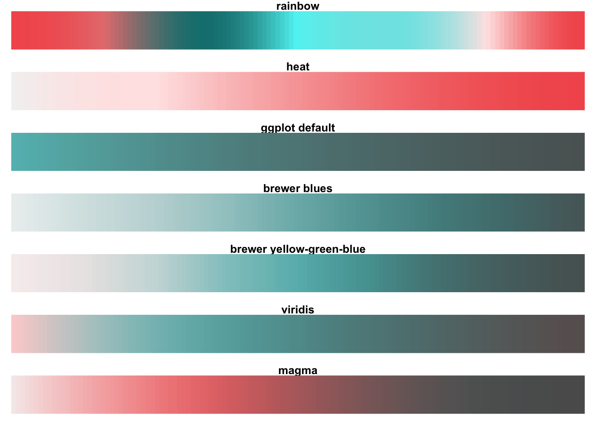

```{css, echo=FALSE}
# CSS for including pauses in printed PDF output (see bottom of lecture)
@media print {
  .has-continuation {
    display: block !important;
  }
}
.remark-code-line {
  font-size: 95%;
}
.small {
  font-size: 75%;
}
.scroll-output-full {
  height: 90%;
  overflow-y: scroll;
}
.scroll-output-75 {
  height: 75%;
  overflow-y: scroll;
}
```

```{r setup, include=FALSE}
options(htmltools.dir.version = FALSE)
library(knitr)
library(fontawesome)
knitr::opts_chunk$set(
	fig.align = "center",
	cache = FALSE,
	dpi = 300,
  warning = F,
  message = F,
	fig.height = 5,
	out.width = "80%"
)
```

# Table of Contents

.hi-medgrn[Last Lecture:]

1. [Prologue](#prologue)

2. [Principles of Data Visualization](#datavis)

3. [Getting Started with ggplot2](#ggplot2)

.hi-blue[This Lecture:]

4. [Other Common Charts](#charts)

5. [Exporting Charts](#export)

6. [Colors Schemes](#colors)

6. [Themes](#themes)

7. [Extending ggplot2](#extend)


---
class: inverse, middle
name: prologue

# Prologue

---

# Prologue

Packages we'll use for today's examples:
  
```{r}
pacman::p_load(dslabs, ggrepel, tidyverse)
```


---

# Prologue

Additional packages if you want to replicate the color schemes later on:

```{r}
pacman::p_load(RColorBrewer, viridis, Polychrome, broman)
```


---

# Prologue

Additional packages if you want to replicate the theme/plot extensions:

```{r}
pacman::p_load(ggtheme, showtext, gganimate, gifski, ggExtra)
```

---


class: inverse, middle
name: charts

# Common Charts

---
# Common Charts

Now that we've seen an example of the complex plots we can create with .hi-slate[ggplot2], let's take a step back and talk through the .hi-medgrn[geoms] we'll need for common charts and some useful .hi-purple[customization settings].

.pull-left[
.center[.hi-medgrn[This Lecture]]
***
  * Line
  * Scatterplot
  * Histogram
  * Ridge Plots
  * Kernel Densities
]
.pull-right[
.center[.hi-blue[Later this Semester]]
***
  * Ribbons
  * Dot and Whisker Plots
  * Event Study Plots
  * Maps
]

---
# Other Common Charts

Now that we're up to speed with the syntax of .hi-slate[ggplot2], let's work through some more techniques with other chart types.

To practice, let's load in a more complete version of the [.hi-dkorange[gapminder data]](https://www.gapminder.org/data/):

``` {r}
# run below line if you have gapminder package loaded
#try(detach("package:gapminder", unload = TRUE))

data(gapminder) 
```

---

# Line Chart (*geom_line*)

How has average life expectancy in the US evolved from 1960-2016?

``` {r line1, out.width = "66%"}
filter(gapminder, country == "United States") %>%
  ggplot()+
  geom_line(aes(x = year, y = life_expectancy))
```


---
  
# Points Connected with a Line
  
``` {r line1b, out.width = "70%"}
filter(gapminder, country == "United States") %>%
  ggplot(aes(x = year, y = life_expectancy)) +
  geom_line(color = "blue") +
  geom_point(color = "red") 

```


---
  
# Layer Order: Lowest Layer on Top
  

``` {r line1c, out.width = "70%"}
filter(gapminder, country == "United States") %>%
  ggplot(aes(x = year, y = life_expectancy)) +
  geom_point(color = "red") +
  geom_line(color = "blue", linewidth = 2, alpha = 0.5)


```

---
  
# Modify Titles with *labs()*
  

``` {r line2, out.width="58%"}
filter(gapminder, country == "United States") %>%
  ggplot() +
  geom_line(aes(x = year, y = life_expectancy)) +
  labs(title = "Life Expectancy in the United States", #<<
       subtitle = "1960-2016", #<<
       x = "Year", #<<
       y = "Life Expectancy") #<<
```


---
  
# Change Axis Limits with *lims()*
  
``` {r line3, out.width = "60%"}
filter(gapminder, country == "United States") %>%
  ggplot() +
  geom_line(aes(x = year, y = life_expectancy)) +
  labs(title = "Life Expectancy in the United States",  subtitle = "1960-2016", x = "Year", y = "Life Expectancy") +
  lims(y = c(65, 80), x = c(1980, 2000)) #<<
```


---
  
# Customize Axis Scales
  
Change limits/breaks/labels for a .hi-purple[specific axis] with `scale_x/y_type()` layers (`type` one of "discrete", "continuous", "date", or "manual")

``` {r line4a, out.width = "60%", eval = F}
pacman::p_load(lubridate)
filter(gapminder, country == "United States") %>%
  # add a date-formatted version of our year variable
  mutate(year_date = paste("01/01/",year) %>% mdy())  %>%
  ggplot() +
  geom_line(aes(x = year_date, y = life_expectancy)) +
  # Format continuous y axis
  scale_y_continuous(name = "Life Expectancy", #<<
                     breaks = seq(65, 80, 5), #<<
                     labels = paste0( seq(65, 80, 5), " Years"), #<<
                     limits = c(65, 80)) + #<<
  # format date x axis
  scale_x_date(name = "Year", #<<
               date_breaks = "6 years", #<<
               date_labels = "%Y") #<<
```

---

# Customize Axis Scales: The Chart
  

``` {r line4a_eval, echo = F}
pacman::p_load(lubridate)
filter(gapminder, country == "United States") %>%
  # add a date-formatted version of our year variable
  mutate(year_date = paste("01/01/",year) %>% mdy())  %>%
  ggplot() +
  geom_line(aes(x = year_date, y = life_expectancy)) +
  # Format continuous y axis
  scale_y_continuous(name = "Life Expectancy", #<<
                     breaks = seq(65, 80, 5), #<<
                     labels = paste0( seq(65, 80, 5), " Years"), #<<
                     limits = c(65, 80)) + #<<
  # format date x axis
  scale_x_date(name = "Year", #<<
               date_breaks = "6 years", #<<
               date_labels = "%Y") #<<
```

---

# Mappings: Multiple Series
  
Add a `linetype` or `color` aesthetic to add a separate line for each value of a categorical variable].

--
  
What are trends in life expectancy for the G-7 countries? 
  
``` {r line4b, out.width = "60%", eval = F}
g7 <- c("United States", "United Kingdom", "Germany", "Italy", "France", "Canada", "Japan")
#filter to G-7 countries
filter(gapminder, country %in% g7) %>%
  ggplot() +
  geom_line(aes(x = year, y = life_expectancy,
                linetype = country #<<
  )) 
```


---

# Mappings: Multiple Series (*linetype*)
  
What are trends in life expectancy for the G-7 countries? 
  
``` {r line4b_eval, out.width = "90%", echo = F}
g7 <- c("United States", "United Kingdom", "Germany", "Italy", "France", "Canada", "Japan")
#filter to G-7 countries
filter(gapminder, country %in% g7) %>%
  ggplot() +
  geom_line(aes(x = year, y = life_expectancy,
                linetype = country #<<
  )) 
```

---


# Mappings: Multiple Series (*color*)
  
What are trends in life expectancy for the G-7 countries? 
  
``` {r line5, out.width = "60%", eval = F}
# filter to G-7 countries
filter(gapminder, country %in% g7) %>%
  ggplot() +
  geom_line(aes(x = year, y = life_expectancy,
                color = country #<<
  )) 
```


---


# Mappings: Multiple Series (*color*)
  
What are trends in life expectancy for the G-7 countries? 
  
``` {r line5_eval, out.width = "90%", echo = F}
# filter to G-7 countries
filter(gapminder, country %in% g7) %>%
  ggplot() +
  geom_line(aes(x = year, y = life_expectancy,
                color = country #<<
  )) 
```


---
  
# Adding Text Labels
  
.hi-blue[Text labels] are generally more effective than legends
* `geom_text` from .hi-slate[ggplot] or `geom_text_repel` from .hi-slate[ggrepel] for text
* `geom_label_repel` from .hi-slate[ggrepel] for text + boxes

Try adding text labels to our chart:
``` {r line6, out.width = "60%", eval = F}
# filter to G-7 countries
filter(gapminder, country %in% g7) %>%
  ggplot(aes(x = year, y = life_expectancy)) +
  geom_line(aes(linetype = country)) +
  geom_text(aes(label = country)) + #<<
  theme(legend.position = "none") #<<
```


---
  
# Adding Text Labels
  
Try adding text labels to our chart:
``` {r line6_eval, out.width = "90%", echo = F}
# filter to G-7 countries
filter(gapminder, country %in% g7) %>%
  ggplot(aes(x = year, y = life_expectancy)) +
  geom_line(aes(linetype = country)) +
  geom_text(aes(label = country)) + #<<
  theme(legend.position = "none") #<<
```


---
  
# Adding Text Labels (At Specific Points)
  
Whoops! By default `geom_text` adds text labels .hi-purple[at every data point.]

--
  
To add labels at .hi-medgrn[specific points], we can  .hi-medgrn[manually define the x/y locations] for `geom_text`


``` {r line7, out.width = "60%", eval = F}
g7_labs <- data.frame(country = g7,  #<<
                      x = seq(1970, 2016, length.out = length(g7)), #<<
                      y = seq(65, 85, length.out = length(g7))) #<<

# filter to G-7 countries
filter(gapminder, country %in% g7) %>%
  ggplot(aes(x = year, y = life_expectancy)) +
  geom_line(aes(linetype = country)) +
  geom_text(data = g7_labs, # switch data object #<< 
            aes(x=x, y=y, label = country)) + #<<
  theme(legend.position = "none") 
```

---
  
# Adding Text Labels (At Specific Points)
  
``` {r line7_eval, out.width = "95%", echo = F}
g7_labs <- data.frame(country = g7, 
                      x = seq(1970, 2016, length.out = length(g7)),
                      y = seq(65, 85, length.out = length(g7)))

# filter to G-7 countries
filter(gapminder, country %in% g7) %>%
  ggplot(aes(x = year, y = life_expectancy)) +
  geom_line(aes(linetype = country)) +
  geom_text(data = g7_labs, # switch data object #<< 
            aes(x=x, y=y, label = country)) + #<<
  theme(legend.position = "none") 
```


---
  
# Adding Text Labels (At Specific Points)
  
Add text + boxes with `geom_label_repel` 

``` {r line8, out.width = "95%", eval = F}
# get a label x/y point for each country
g7_labs <- filter(gapminder, country %in% g7) %>%
  mutate(order = rep(seq(1:7), 57)) %>%
  filter(year == 1960+10*(order-1)) 

filter(gapminder, country %in% g7) %>%
  ggplot(aes(x = year, y = life_expectancy)) +
  geom_line(aes(color = country)) +
  geom_label_repel(data = g7_labs, # switch data object #<< 
                   aes(label = country, fill = country), #<<
                   min.segment.length = unit(0, "lines")) + #<<
  theme(legend.position = "none") 
```


---
  
# Adding Text Labels (At Specific Points)
  
Add text + boxes with `geom_label_repel` 

``` {r line8_eval, out.width = "90%", echo = F}
# get a label x/y point for each country
g7_labs <- filter(gapminder, country %in% g7) %>%
  mutate(order = rep(seq(1:7), 57)) %>%
  filter(year == 1960+10*(order-1)) 

filter(gapminder, country %in% g7) %>%
  ggplot(aes(x = year, y = life_expectancy)) +
  geom_line(aes(color = country)) +
  geom_label_repel(data = g7_labs, # switch data object #<< 
                   aes(label = country, fill = country), #<<
                   min.segment.length = unit(0, "lines")) + #<<
  theme(legend.position = "none") 
```

---

# Scatterplot (*geom_point*)

How have fertility rates and life expectancies co-evolved over time?
  
First, plotting the data from 1962:

```{r scatter, warning=FALSE, out.width = "55%"}
filter(gapminder, year == 1962) %>%
  ggplot(aes(fertility, life_expectancy)) + # omitting x/y = since in expected order
  geom_point()
```

---
  
# Faceting
  
  
.hi-blue[Stratify] (by continent, and compare 1962 to 2012) with `facet_grid`:

```{r scatter-facet, warning = FALSE, out.width = "60%"}
    filter(gapminder, year %in% c(1962, 2012)) %>%
      ggplot(aes(fertility, life_expectancy, col = continent)) +
      geom_point() +
      facet_grid(continent ~ year)  # "row ~ column" #<<
```


---

# Faceting

.font80[Show Europe vs. Asia for 5 different years:]
.small[
```{r fertility-versus-life-expectancy-five-years-tall, out.width="90%", fig.height=3.5}
years = c(1962, 1980, 1990, 2000, 2012)
continents = c("Europe", "Asia")
gapminder %>% 
  filter(year %in% years & continent %in% continents) %>%
  ggplot( aes(fertility, life_expectancy, col = continent)) +
    geom_point() +
    facet_grid(. ~ year) #<<
```
]

---

# Faceting

.font80[Too narrow? Wrap rows with `facet_wrap`:]
.small[
```{r fertility-versus-life-expectancy-five-years, out.width="90%", fig.height=3.5}
years = c(1962, 1980, 1990, 2000, 2012)
continents = c("Europe", "Asia")
gapminder %>% 
  filter(year %in% years & continent %in% continents) %>%
  ggplot( aes(fertility, life_expectancy, col = continent)) +
    geom_point() +
    facet_wrap(~year, nrow = 2) # can also use ncol  #<<
```
]

---

# Faceting

.font80[An important thing `facet` gives us is .hi-medgrn[common axis scales]. Otherwise graphs look like this:]
.small[
```{r facet-without-fixed-scales, warning=FALSE, out.width="90%", fig.height=3.5}
years = c(1962, 1980, 1990, 2000, 2012)
continents = c("Europe", "Asia")
gapminder %>% 
  filter(year %in% years & continent %in% continents) %>%
  ggplot( aes(fertility, life_expectancy, col = continent)) +
    geom_point() +
    facet_wrap(~year, scales = "free")
```
]


---

# Cleveland Dot Plots

.hi-medgrn[Cleveland dot plots] are uncluttered and can be .hi-medgrn[more effective] than .hi-blue[bar/column charts].
- Especially when the x-intercept doesn't mean much.
- Or when plotting multiple values per category.

.hi-purple[Structure:]
  * Categorical variable on y axis (easiest with factor)
  * points as values on x axis
  
```{r, fig.height=3, eval = F}
gapminder %>% mutate(gdp_percapita = gdp/population) %>%
  filter(year == 1970 & !is.na(gdp_percapita) & continent=="Asia") %>%
  mutate() %>%
  ggplot(aes(gdp_percapita, country)) +
    geom_point(size=2) +
    scale_x_log10() # log 10 scale for ease of viewing
```

---
# Cleveland Dot Plots

.hi-medgrn[Cleveland dot plots] are uncluttered and can be more effective than bar charts.
</br>
</br>
</br>
</br>

.small[
```{r, , fig.height=3.5, echo = F}
gapminder %>% mutate(gdp_percapita = gdp/population) %>%
  filter(year == 1970 & !is.na(gdp_percapita) & continent=="Asia") %>%
  mutate() %>%
  ggplot(aes(gdp_percapita, country)) +
    geom_point(size=2) +
    scale_x_log10()
```
]


---

# Cleveland Dot Plots

Use `reorder` to conditionally reorder a factor (i.e. countries by GDP)

.small[
```{r, fig.height=3.5}
gapminder %>% mutate(gdp_percapita = gdp/population) %>%
  filter(year == 1970 & !is.na(gdp_percapita) & continent=="Asia") %>%
  mutate(country = reorder(country, gdp_percapita)) %>% #<<
  ggplot(aes(gdp_percapita, country)) +
    geom_point(size=2) +
    scale_x_log10()
```
]


---

# Cleveland Dot Plots

Also useful when plotting .hi-blue[multiple values per category].

.small[
```{r, fig.height=3.5}
gapminder %>% mutate(GDP_percapita = gdp/population) %>%
  filter(year %in% c(1970, 1980) & !is.na(GDP_percapita) & continent=="Asia") %>%
  mutate(country = reorder(country, GDP_percapita)) %>%
  ggplot(aes(GDP_percapita, country)) +
    geom_line(aes(group = country)) + # add line connecting gdp values per country #<<
    geom_point(size=2, aes(color = factor(year))) + # add point for 1970 + 1980 values on top of line segment #<<
    scale_x_log10()
```
]
---


# Ridge Plots

Using .hi-slate[ggridges] for staggered densities (a la [.hi-dkorange[Joy Division's "Unknown Pleasures"]](https://www.rba-acoustics.co.uk/celebrating-manchester-the-origin-of-joy-divisions-famous-album-cover/))

.small[
```{r ridge-plot, message=FALSE, out.width = "60%"}
pacman::p_load(ggridges)
gapminder %>% mutate(gdp_percapita = gdp/population) %>%
  filter(year == 1970 & !is.na(gdp_percapita)) %>%
  ggplot(aes(gdp_percapita, continent)) + 
    geom_density_ridges() + #<<
    scale_x_log10()
```
]

---

# Histograms with *geom_hist*

In this case histograms are hard to view with so many continents

.small[
```{r, out.width = "70%"}
gapminder %>% mutate(gdp_percapita = gdp/population) %>%
  filter(year %in% c(1960, 2010) & !is.na(gdp_percapita)) %>%
  ggplot(aes(gdp_percapita, fill = continent)) + #<<
    geom_histogram(alpha=0.4) #<<
```
]


---

# Histograms with *geom_hist*

In this case histograms are hard to view with so many continents

.small[
```{r, out.width = "70%"}
gapminder %>% mutate(gdp_percapita = gdp/population) %>%
  filter(year %in% c(1960, 2010) & !is.na(gdp_percapita)) %>%
  ggplot(aes(gdp_percapita, fill = continent)) + #<<
    geom_histogram(alpha=0.4) #<<
```
]

---

# Stacked Density Plots

Stacked densities on \[0,1\] scale are similarly hard to view
.small[
```{r, out.width = "66%"}
gapminder %>% mutate(gdp_percapita = gdp/population) %>%
  filter(year %in% c(1960, 2010) & !is.na(gdp_percapita)) %>%
  ggplot(aes(gdp_percapita, fill = continent)) +
    geom_density(alpha=0.3, position = "stack") + #<<
    facet_grid(year ~ .) 
```
]

---

# Stacked Density Plots

Easier to compare with log 10 transformation
.small[
```{r, out.width = "66%"}
gapminder %>% mutate(gdp_percapita = gdp/population) %>%
  filter(year %in% c(1960, 2010) & !is.na(gdp_percapita)) %>%
  ggplot(aes(gdp_percapita, fill = continent)) +
    geom_density(alpha=0.3, position = "stack") + 
    facet_grid(year ~ .) + scale_x_log10() #<<
```
]


---

# Stacked Density Plots

Scale each continent by its number of countries using the  .hi-medgrn[computed variable] `..count..`:

.small[
```{r, out.width = "55%"}
gapminder %>% mutate(GDP_percapita = gdp/population) %>%
  filter(year %in% c(1960, 2010) & !is.na(GDP_percapita)) %>%
  ggplot(aes(GDP_percapita, y=..count.., fill = continent)) + #<<
    scale_x_continuous(trans = "log10") + 
    geom_density(alpha=0.3, position = "stack") + 
    facet_grid(year ~ .) + scale_x_log10()
```
]

---

# Stacked Density Plots

And weight countries within each continent by its population:

.small[
```{r, out.width = "60%"}
gapminder %>% mutate(GDP_percapita = gdp/population) %>%
  filter(year %in% c(1960, 2010) & !is.na(GDP_percapita)) %>%
  ggplot(aes(GDP_percapita, y=..count.., weight=population, fill = continent)) + #<<
    geom_density(alpha=0.3, position = "stack") + 
    facet_grid(year ~ .) +
    scale_x_log10()
```
]


---
class: inverse, middle
name: export

# Exporting Graphs

---
  
# Exporting Graphs
  
You can save your .hi-slate[ggplot2]-based figures using `ggsave()`.

.hi-blue[Option 1:] By default, `ggsave()` saves the last plot printed to the screen.
* i.e. what's currently displayed in the "Plots" viewer
  * saves to the working directory
```{R, ex-ggsave-1a, eval = F}
# Create a simple scatter plot
filter(gap_full, year == 2000) %>%
ggplot(aes(x = fertility, y = life_expectancy)) +
geom_point()

# Save our simple scatter plot
ggsave(filename = "simple_scatter.pdf")
```

- This example creates a PDF. Change to `".png"` for PNG, etc.
- Optional arguments: `path`, `width`, `height`, `dpi`.
---

# Exporting Graphs

For example, to save a print quality (300 dpi) 8in by 6in `".png"` file to the "output" subfolder, we can modify our `ggsave` call to

```{R, ex-ggsave-1b, eval = F}
# Save our simple scatter plot
ggsave(filename = "simple_scatter.png",
       path = "output/", #<<
       width = 8, #<<
       height = 6, #<<
       units = "in", #<<
       dpi = "print"
       )
```

---
# Exporting Graphs

.hi-dkgrn[Option 2:] You can first assign your `ggplot()` objects to memory:
```{R, ex-gg-assign, eval = F}
# Create a simple scatter plot named 'gg_points'
points_2010 <- filter(gap_full, year == 2010) %>%
  ggplot(aes(x = fertility, y = life_expectancy)) +
  geom_point()
```

And then save this figure by name using the `plot` argument:
```{R, ex-ggsave-2, eval = F}
# Save our simple scatter plot name 'ggsave'
ggsave(
  # can add subfolder directly in filename
  filename = "output/simple_scatter.pdf", 
  plot = points_2010 #<<
)
```

---

# Exporting Graphs

In what format should you save your graphics?

.hi-purple[Vector] graphics are composed of .hi-purple[formulas or paths].
- "Draw a straight line from (0, 0) to (13, 4)."
- Infinitely zoom-able. Preserves all underlying information.
- May be slow to load when complex.
- Fully modifiable in vector art software (i.e. Adobe Illustrator)
- `.pdf` or `.svg`.

.hi-medgrn[Raster] graphics are composed of .hi-medgrn[pixels] (a grid of squares with color information).
- Only an approximation to the underlying shapes or points.
- Work better with Microsoft Office and HTML.
- The original format of photographs.
- Usually best: `.png`. Also `.jpeg`, `.gif`.


---
class: inverse, middle
name: colors

# Colors Schemes

---

# Color Schemes


Choose a .hi-medgrn[sequential] color scheme when your values are ordered in .hi-medgrn[only one direction].
- Low to high; values are all positive; zero is defined arbitrarily.
.small[
```{r, out.width="85%"}
pacman::p_load(RColorBrewer)
display.brewer.all(type="seq")
```
]
---

# Color Schemes

Choose a .hi-blue[diverging] color scheme when your values are ordered in .hi-blue[two directions relative to a center].
- Positive vs. negative; vote shares relative to 50%.
.small[
```{r, out.width="85%"}
display.brewer.all(type="div")
```
]
---

# Color Schemes

Choose a .hi-dkgrn[qualitative] color scheme when your values have .hi-dkgrn[no ordering].
- Only need to distinguish among categories.
.small[
```{r, out.width="85%"}
display.brewer.all(type="qual")
```
]
---

# Use Established Color Schemes

There are several great color schemes available in R created by professional visual designers. 

- .hi-slate[RColorBrewer] is based on the research of cartographer Cynthia Brewer. Her [.hi-dkorange[ColorBrewer]](https://colorbrewer2.org/) website lets you choose a color scheme by value ordering and whether you need it to be colorblind safe, printer friendly, or photocopy safe.

- .hi-slate[viridis] schemes are designed to span a large perceptual range while remaining perceptually uniform, robust to colorblindness, and pretty. (The next few slides show diagrams from the the package's [.hi-dkorange[vignette]](https://cran.r-project.org/web/packages/viridis/vignettes/intro-to-viridis.html).)

---

# Use Established Color Schemes

Palettes available in .hi-slate[viridis]:

```{r, echo=F, out.width="100%"}
include_graphics("images/viridis.png")
```


---

# Comparing Palettes

Compare `rainbow` and `heat` from base R, the default .hi-slate[ggplot2] palette, and palettes from .hi-slate[RColorBrewer] and .hi-slate[viridis]:

```{r, out.width="80%", echo=F}
include_graphics("images/v-comparison.png")
```

---

# Consider Colorblindness

Green-Blind (Deuteranopia):

```{r, out.width="80%", echo=F}
include_graphics("images/v-compare-greenblind.png")
```


---

# Consider Colorblindness

Red-Blind (Protanopia):

```{r, out.width="80%", echo=F}
include_graphics("images/v-compare-redblind.png")
```


---

# Consider Colorblindness

Blue-Blind (Tritanopia):

```{r, out.width="80%", echo=F}

```

---

# Consider Printer-Friendliness

Grayscale:

```{r, out.width="80%", echo=F}
include_graphics("images/v-compare-grayscale.png")
```
---


# Other Established Color Schemes

Other packages for useful/fun color schemes:

- .hi-slate[Polychrome] has large .hi-medgrn[qualitative palettes] and functions for checking how palettes will look to a person with color deficit vision

- .hi-slate[broman] has Crayola crayon colors.

---
# Polychrome: glasbey Palette
.small[]
```{r}
pacman::p_load(Polychrome)
data(glasbey)
swatch(glasbey)
```
]
---
# Polychrome: colorsafe Palette
.small[
```{r}
pacman::p_load(Polychrome)
data(colorsafe)
swatch(colorsafe)
```
]

---
# Broman: brocolors

.small[
```{r}
pacman::p_load(broman)
plot_crayons()
```
]


---
class: inverse, middle
name: themes

# Themes

---

# Themes

.hi-slate[ggplot2]'s default theme is now fairly iconic - but that doesn't mean we can't do better.

--

.hi-blue[Option 1: Pre-Existing Themes]
  * Default .hi-slate[ggplot2] choice is `theme_gray`
  * Alternate .hi-slate[ggplot2] themes: `theme_bw`, `theme_linedraw`, `theme_light`, `theme_dark`, `theme_minimal`, `theme_classic`, `theme_void`
  * Additional themes in .hi-slate[ggthemes]
    * i.e. want to replicate known appearances from [.hi-dkorange[Excel/Stata, The Economist, FiveThirtyEight, or WSJ]](https://github.com/jrnold/ggthemes)
    
---

# Themes

.hi-slate[ggplot2]'s default theme is now fairly iconic - but that doesn't mean we can't do better.

.hi-medgrn[Option 2: Create Your Own!]
  * Every element of the plot is customizable (gridlines, fonts, legends, margins, etc.)
  * Use `theme` either on-the-fly for small tweaks or store a complete custom theme in memory for regular use

---
# Other ggplot2 Themes: *theme_bw*

```{r, out.width = "70%"}
filter(gapminder, year == 1962) %>%
  ggplot(aes(fertility, life_expectancy, color = continent)) +
    geom_point() +
    theme_bw() #<<
```

---
# Other ggplot2 Themes: *theme_minimal*


```{r, out.width = "70%"}
filter(gapminder, year == 1962) %>%
  ggplot(aes(fertility, life_expectancy, color = continent)) +
    geom_point() +
    theme_minimal() #<<
```

---
# Other ggplot2 Themes: *theme_classic*


```{r, out.width = "70%"}
filter(gapminder, year == 1962) %>%
  ggplot(aes(fertility, life_expectancy, color = continent)) +
    geom_point() +
    theme_classic() #<<
```

---
# Other ggplot2 Themes: *theme_void*


```{r, out.width = "70%"}
filter(gapminder, year == 1962) %>%
  ggplot(aes(fertility, life_expectancy, color = continent)) +
    geom_point() +
    theme_void() #<<
```
---
# ggtheme Themes: *theme_stata*

```{r, out.width = "70%"}
pacman::p_load(ggthemes)
filter(gapminder, year == 1962) %>%
  ggplot(aes(fertility, life_expectancy, color = continent)) +
    geom_point() +
    theme_stata() #<<
```

---
# ggtheme Themes: *theme_economist*

```{r, out.width = "70%"}
filter(gapminder, year == 1962) %>%
  ggplot(aes(fertility, life_expectancy, color = continent)) +
    geom_point() +
    theme_economist() #<<
```

---
# ggtheme Themes: *theme_wsj*

```{r, out.width = "70%"}
filter(gapminder, year == 1962) %>%
  ggplot(aes(fertility, life_expectancy, color = continent)) +
    geom_point() +
    theme_wsj() #<<
```

---
# ggtheme Themes: *theme_excel*

```{r, out.width = "70%"}
filter(gapminder, year == 1962) %>%
  ggplot(aes(fertility, life_expectancy, color = continent)) +
    geom_point() +
    theme_excel() #<<
```

---
# Creating Custom Themes

Alternatively, you can create a .hi-medgrn[custom theme] by tweaking [.hi-dkorange[any and all plot elements]](https://ggplot2.tidyverse.org/reference/element.html)
  * Specify elements and specifications within `theme`
  * Either inline or as separate theme object in memory
  * Full list of elements [.hi-dkorange[here]](https://ggplot2.tidyverse.org/reference/theme.html)

---
# Custom Themes: Legend Position

.small[
```{r, out.width = "70%"}
theme_plot <- filter(gapminder, year == 1962) %>%
  ggplot(aes(fertility, life_expectancy, color = continent)) +
    geom_point() 

theme_plot +
  theme(legend.position = "bottom") #<<
```
]
---
# Custom Themes: Background Fill Color

.small[
```{r, out.width = "75%"}
theme_plot +
  theme(legend.position = "bottom",
        panel.background = element_rect(fill = NA)) # change to white #<<
```
]
---
# Custom Themes: Gridlines

.small[
```{r, out.width = "70%"}
theme_plot +
  theme(legend.position = "bottom",
        panel.background = element_rect(fill = NA), # change to white 
         panel.grid.major = element_line(color = "grey95", linewidth = 0.3), # change color of major grid lines (lines at displayed values) #<<
  panel.grid.minor = element_line(color = "grey95", linewidth = 0.3)) #change color of minor grid lines (lines between displayed values) #<<

```
]

---
# Custom Themes: Tickmarks

.small[
```{r, out.width = "65%"}
theme_plot +
  theme(legend.position = "bottom",
        panel.background = element_rect(fill = NA), # change to white 
         panel.grid.major = element_line(color = "grey95", linewidth = 0.3), # change color of major grid lines (lines at displayed values) 
  panel.grid.minor = element_line(color = "grey95", linewidth = 0.3), #change color of minor grid lines (lines between displayed values) 
    axis.ticks = element_line(color = "grey95", linewidth = 0.3)) # make axis tick marks the same color as grid lines #<<
```
]


---
# Custom Themes: Fonts 

Use .hi-slate[showtext] to add a custom font
  * i.e. add any [.hi-dkorange[Google Font]](https://fonts.google.com/)
    * I like Lato
  * `showtext_auto` to automatically use .hi-slate[showtext] in all plots
  * `showtext_begin/end` to turn on and off when desired
  
```{r, out.width = "65%"}
# Name of Font Family, what we'll refer to it as in R
font_add_google("Schoolbell", "bell")
```


---
# Custom Themes: Fonts 


With default font: 

.small[
```{r, out.width = "65%"}
theme_plot +
  labs(title = "Relationship Between Fertility and Life Expectancy") +
  theme(plot.title=element_text(size=16)) 
```
]


---
# Custom Themes: Fonts 


With custom font: 

.small[
```{r, out.width = "65%"}
showtext_auto()

theme_plot +
  labs(title = "Relationship Between Fertility and Life Expectancy") +
  theme(plot.title=element_text(size=48, family = "bell")) #<<
```
]


---
class: inverse, middle
name: extend

# Extending ggplot2


---

# Animations with *gganimate*


```{R cache=TRUE, dev="png", ex-gganimate, include=FALSE}
# The package for animating ggplot2
pacman::p_load(gganimate, gapminder)

# As before
gg = ggplot(
  data = gapminder::gapminder %>% filter(continent != "Oceania"),
  aes(gdpPercap, lifeExp, size = pop, color = country)
) +
  geom_point(alpha = 0.7, show.legend = FALSE) +
  scale_colour_manual(values = country_colors) +
  scale_size(range = c(2, 12)) +
  scale_x_log10("GDP per capita", label = scales::comma) +
  facet_wrap(~continent) +
  theme_light(base_size = 16) +
  theme(panel.border = element_rect(color = "grey90", fill = NA)) +
  # Here come the gganimate-specific bits
  labs(title = "Year: {frame_time}") + #<<
  ylab("Life Expectancy") +
  transition_time(year) + #<<
  ease_aes("linear") #<<
# Save the animation
anim_save(
  animation = gg,
  filename = "output/ex_gganimate.gif",
  width = 10.5,
  height = 7,
  units = "in",
  res = 150,
  nframes = 56
)
```

```{r, echo=F, out.width="85%"}

```

.small[Image and code from [.hi-dkorange["Plotting in R"]](https://raw.githack.com/edrubin/EC525S19/master/NotesLab/05RPlot/05RPlot.html) by Edward Rubin, used with permission, and excluded from the overall CC license.]

---

# Marginal Distributions

Add marginal distributions to plot axes with .hi-slate[ggExtra]


.small[
```{r, out.width = "65%"}
# add marginal distribution to X axis
ggExtra::ggMarginal(theme_plot, margins = "x",
           type = "histogram", size = 2, fill = "aquamarine")
```
]

---
# Table of Contents

.hi-medgrn[Last Lecture:]

1. [Prologue](#prologue)

2. [Principles of Data Visualization](#datavis)

3. [Getting Started with ggplot2](#ggplot2)

.hi-blue[This Lecture:]

4. [Other Common Charts](#charts)

5. [Exporting Charts](#export)

6. [Colors Schemes](#colors)

6. [Themes](#themes)

7. [Extending ggplot2](#extend)


```{r gen_pdf, include = FALSE, cache = FALSE, eval = FALSE}
infile = list.files(pattern = 'Pt2.html')
pagedown::chrome_print(input = infile, timeout = 200)
```
