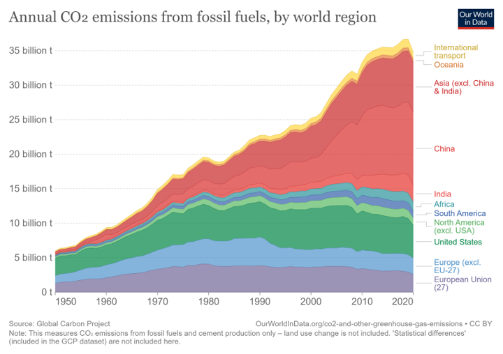
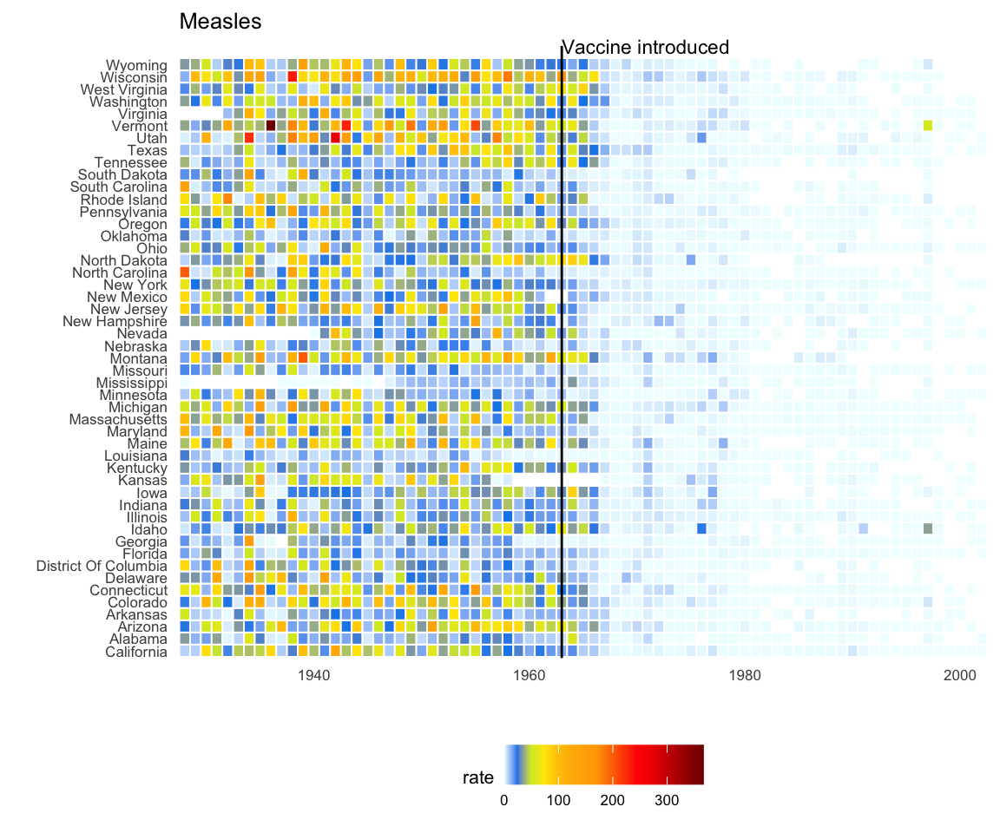
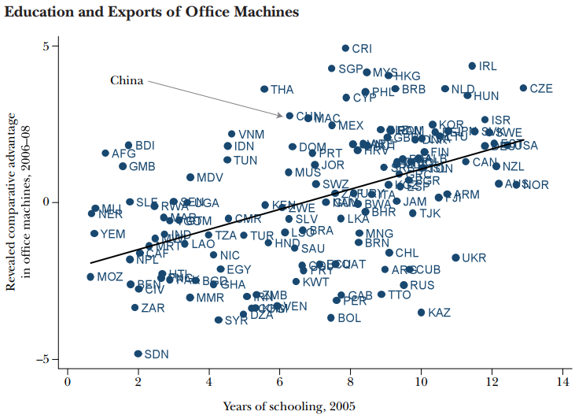
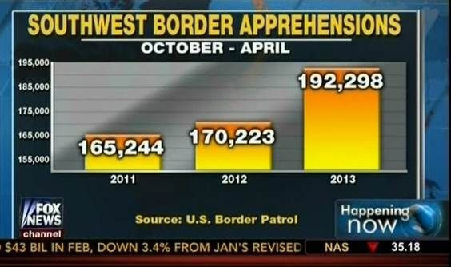

```{css, echo=FALSE}
# CSS for including pauses in printed PDF output (see bottom of lecture)
@media print {
  .has-continuation {
    display: block !important;
  }
}
.remark-code-line {
  font-size: 95%;
}
.small {
  font-size: 75%;
}
.scroll-output-full {
  height: 90%;
  overflow-y: scroll;
}
.scroll-output-75 {
  height: 75%;
  overflow-y: scroll;
}
```

```{r setup, include=FALSE}
options(htmltools.dir.version = FALSE)
library(knitr)
library(fontawesome)
knitr::opts_chunk$set(
	fig.align = "center",
	cache = FALSE,
	dpi = 300,
  warning = F,
  message = F,
	fig.height = 5,
	out.width = "80%"
)
```

# Table of Contents

.hi-medgrn[This Lecture:]

1. [Prologue](#prologue)

2. [Principles of Data Visualization](#datavis)

3. [Getting Started with ggplot2](#ggplot2)

.hi-medgrn[Next Lecture:]

4. [Other Common Charts](#charts)

5. [Exporting Charts](#export)

6. [Colors and Themes](#themes)

7. [Extending ggplot2](#extend)


---
class: inverse, middle
name: prologue

# Prologue

---

# Prologue

Packages we'll use for today's examples:
  
```{r}
pacman::p_load(dslabs, gapminder, tidyverse)
```

Additional packages if you want to replicate the plots in the "Principles of Data Visualization" section:

```{r}
pacman::p_load(ggrepel, readxl)
```
---

# Data Visualization

Being able to .hi-medgrn[visualize data well] is a critical skill for economists and data scientists.

  * Effectively communicate a message
  * Engage a reader/audience
  * Discover patterns in the underlying data


--

To do this in R, we're going to use the incredibly powerful .hi-slate[ggplot2] package, but before we do, let's chat about...

---
class: inverse, middle
name: datavis

# Principles of Data Visualization

---

# Principles of Data Visualization

We're going to focus on the .hi-medgrn[punchline] of the principles of data visualization today.

If you want more of the .hi-blue[setup], there are excellent resources available:

  * [.hi-dkorange[Introduction to Data Science]](http://rafalab.dfci.harvard.edu/dsbook/r-basics.html)   by Rafael A. Irizarry
  * [.hi-dkorange[Data Visualization a Practical Introduction]](https://socviz.co/)  by Kieran Healy
  * [.hi-dkorange["Creating Effective Figures and Tables" talk]](https://github.com/kbroman/Talk_Graphs?tab=readme-ov-file)  by Karl Broman
  * [.hi-dkorange[An Economist's Guide to Visualizing Data]](https://www.aeaweb.org/articles?id=10.1257/jep.28.1.209)  by Jonathan A. Schwabish (JPE 2014)
  * [.hi-dkorange[Modern Data Science with R, 2nd Ed.]](https://mdsr-book.github.io/mdsr2e/ch-vizI.html)  by Baumer, Kaplan, and Horton
  * [.hi-dkorange[from Data to Viz (finding the appropriate graph)]](https://www.data-to-viz.com/) 
  * [.hi-dkorange[R Graph Gallery]](https://r-graph-gallery.com/)

---

# Effective Charts

An .hi-medgrn[effective graph or chart]
  * Conveys information clearly
  * Summarizes data quickly
  * Helps identify salient features or patterns
  * Conveys complex relationships in easy-to-communicate visuals

---

# Effective Charts
.center[

]
---

# Poorly Constructed Charts

On the other hand, .hi-blue[poorly constructed charts]
  * Unintentionally obscure or purposefully misreport true relationships
  * Convey too much information without the necessary orienting information easily accessible
  * Are completely uninterpretable
---

# Imperfect Charts
.center[

]


.footnote[Source: [.hi-dkorange[Wall Street Journal, 2/11/2015]](http://graphics.wsj.com/infectious-diseases-and-vaccines/).]


---

# Dishonest Charts
.center[

]


.footnote[Source: [.hi-dkorange[McGarry, 8/15/2016 (Mashable)]](https://mashable.com/article/zika-graph-gets-it-wrong/).]

---

# Principles of Data Visualization

When constructing charts, we need to keep in mind several .hi-slate[key principles:]


.hi-blue[1\. Show the Data]

.hi-medgrn[2\. Reduce the Clutter]

.hi-purple[3\. Integrate the Text and the Graph]

---
# Show the Data

We use graphs to help readers/listeners understand a story. The data are the .hi-blue[most important part] of this.
  * Present the data in the .hi-medgrn[clearest way possible]
  * However, that doesn't mean we have to show .hi-purple[all the data]

---
# Show the Data

```{r, echo = F, out.width = "95%"}
# read in the co2 emissions data
co2 <- read_csv("data/annual-co2-emissions-per-country.csv",
         col_names = c("country", "code", "year", "emissions")) %>%
  filter(year == 2022,
         country %in% c("Azerbaijan", "Bulgaria", "Croatia",  "Cyprus",
                        "Estonia", "Iceland", 
                        "Latvia", "North Macedonia",
                        "Denmark", "Slovakia", "Slovenia", "Sri Lanka", 
                        "Luxembourg",  "Trinidad and Tobago", "United States")) %>%
  select(country, emissions)

# read in oil consumption
oil <- readxl::read_xlsx("data/Statistical Review of World Energy Data.xlsx",
                         sheet = "Oil Consumption - Barrels",
                         skip = 2)[,c(1,59)] 
colnames(oil) <-  c("country", "k_barrel_day")
                    
oil <- oil %>%
    filter(country %in% c("Azerbaijan", "Bulgaria", "Croatia",  "Cyprus",
                        "Estonia", "Iceland", 
                        "Latvia", "North Macedonia",
                        "Denmark", "Slovakia", "Slovenia", "Sri Lanka", 
                        "Luxembourg",  "Trinidad & Tobago", "US"))  %>%
  mutate(country = case_when(
    country == "Trinidad & Tobago" ~ "Trinidad and Tobago",
    country == "US" ~ "United States",
    TRUE ~ country
  ))

plot_df <- left_join(co2, oil, by = "country") %>%
  mutate(bbl = k_barrel_day*1000*365,
         emissions = as.numeric(emissions))

plot_df %>%
  ggplot() +
  geom_point(aes(x = bbl, y = emissions)) +    
  # geom_text(aes(x = bbl, y = emissions, label = country), size = 5,
  #           check_overlap = T, position = "dodge") +
  labs(title = "Oil Consumption and CO2 Emissions in 2022",
       x = "Barrels of Oil Consumed",
       y = "Annual CO2 emissions (tons)")

```


---
# Show the Data (Clearly)

```{r, echo = F, out.width = "95%"}
plot_df <- mutate(plot_df, bbl_10k = bbl/10000,
         emissions_m = emissions/1000000)

filter(plot_df, country != "United States") %>%
  ggplot() +
  geom_point(aes(x = bbl_10k, y = emissions_m)) +
  labs(title = "Oil Consumption and CO2 Emissions in 2022",
    x = "Annual Oil Consumption (10K bbl)",
       y = "Annual CO2 emissions (M tons)")

```

---
# Reduce the Clutter

Ask yourself: What is the .hi-blue[central message] you are trying to communicate?

Decide, then build your plot around that message.
  - Make that message as .hi-pink[easy to see as you can].
  - .hi-medgrn[Remove the clutter:]  get rid of any features of the visualization that do not contribute to the central message.

---
# Example of A "Clutterplot"

  .center[
  
  ]

  
 .footnote[Image is from [.hi-dkorange["An Economist's Guide to Visualizing Data" by Jonathan Schwabish]](https://www.aeaweb.org/articles?id=10.1257/jep.28.1.209) and excluded from the overall CC license.] 

---
# Reduce the Clutter

  
  .center[
  
  ]
  
  
 .footnote[Image is from [.hi-dkorange["An Economist's Guide to Visualizing Data" by Jonathan Schwabish]](https://www.aeaweb.org/articles?id=10.1257/jep.28.1.209) and excluded from the overall CC license.] 
---

# Integrate the Text and the Graph

Research reports often suffer from the .hi-medgrn[slideshow effect]
  * Writer narrates the graph's text elements

--

.hi-purple[Better: integrate the text and the graph!]
  * Visuals are built to .hi-pink[complement the text]
  * Charts contain enough information to .hi-pink[fully stand alone]
  * Place labels/legend elements .hi-pink[close to the element its referencing]
---

# Disconnected Text and Graph

```{r, echo = F, out.width = "95%"}
filter(plot_df, country != "United States") %>%
  ggplot() +
  geom_point(aes(x = bbl_10k, y = emissions_m, color = country)) +
  labs(title = "Oil Consumption and CO2 Emissions in 2022",
    x = "Annual Oil Consumption (10K bbl)",
       y = "Annual CO2 emissions (M tons)")

```
---

# Integrate the Text and the Graph

```{r, echo = F, out.width = "95%"}
pacman::p_load(ggrepel)
filter(plot_df, country != "United States") %>%
  ggplot() +
  geom_point(aes(x = bbl_10k, y = emissions_m)) +
  geom_label_repel(aes(x = bbl_10k, y = emissions_m, label = country),
                  box.padding   = 0.35, 
                  point.padding = 0.5,
                  segment.color = 'grey50') +
  labs(title = "Oil Consumption and CO2 Emissions in 2022",
    x = "Annual Oil Consumption (10K bbl)",
       y = "Annual CO2 emissions (M tons)")

```

---
# Principles of Data Visualization

Many of the charts that *don't* follow these principles often violate either

--

.hi-blue[1\. Area Principle]: the area occupied by the chart element reflects its full value 
  * .hi-slate[Common violation:] bar/column chart axis doesn't start at zero
  
--

.hi-blue[2\. White Space Rule]: if there's too much white space, .hi-slate[refocus the plot]
  * Remove unnecessary outliers
  * Split into multiple panels
  * Change axis scales (e.g. logarithmic - but know your audience!)

---
#  Violating the Area Principle

  .center[
  
  ]

 .footnote[Image is from [.hi-dkorange["Introduction to Data Science" by Rafael A. Irizarry]](http://rafalab.dfci.harvard.edu/dsbook/data-visualization-principles.html)]   
 
---
# Violating the Area Principle

  .center[
  
  ]
  
  
 .footnote[Image is from [.hi-dkorange["Introduction to Data Science" by Rafael A. Irizarry]](http://rafalab.dfci.harvard.edu/dsbook/data-visualization-principles.html)]    

---
# Violating the Area Principle (Again)

  .center[
  
  ]
  
 .footnote[Image is from [.hi-dkorange["Introduction to Data Science" by Rafael A. Irizarry]](http://rafalab.dfci.harvard.edu/dsbook/data-visualization-principles.html)]  

---
# NOT an Area Principle Violation

Note that we *don't* need to include 0 if we use .hi-medgrn[position] rather than length:

```{r, echo = F, out.width = "80%"}
  plot_df %>% 
  mutate(emissions = emissions/100000,
         Continent = c(
       "Asia", "Europe", "Europe", "Asia", "Europe", 
        "Europe", "Europe", "Europe", "Europe", "Europe",
        "Europe", "Europe", "Asia", "South America", "North America"
      )) %>%
  filter(Continent %in% c("Asia", "Europe")) %>%
  ggplot() +
  geom_point(aes(x = Continent, y = emissions)) +
  labs(title = "CO2 Emissions in 2022",
    x = "Continent",
    y = "Total 2022 CO2 emissions (100K tons)") +
    scale_y_continuous(breaks = seq(1000, 1500, 250))
```

---
class: inverse, middle
name: ggplot2

# Getting Started with ggplot2

---

# Elements of ggplot2

.hi-slate[ggplot2] is one of the most popular packages in the entire R canon. 
- Built upon some deep visualization theory: i.e. [.hi-dkorange[Leland Wilkinson's "The Grammar of Graphics"]](https://www.amazon.com/Grammar-Graphics-Statistics-Computing/dp/0387245448).

There's a lot to say about .hi-slate[ggplot2]'s implementation of this "grammar of graphics" (gg) approach, but the three key elements are:

1. Your plot ("the visualization") is linked to your variables ("the data") through various .hi-blue[aesthetic mappings.]

2. Once the aesthetic mappings are defined, you can represent your data in different ways by choosing different .hi-medgrn[geoms] (i.e. "geometric objects" like points, lines or bars).

3. You build your plot in .hi-purple[layers].

---

# Elements of ggplot2

1. Link plots to variables through .hi-blue[aesthetic mappings]
1. Represent data using .hi-medgrn[geoms]
1. Build your plot in .hi-purple[layers]

</br>

That's kind of abstract. Let's review each element in turn with some actual plots, using panel data on life expectancy, population size, and GDP per capita for 142 countries since the 1950s from the .hi-slate[gapminder] package

---

# 1. Aesthetic Mappings

```{r, aesthetics0, out.width = "80%"}
ggplot(data = gapminder, mapping = aes(x = gdpPercap, y = lifeExp)) + 
  geom_point()
```


---

# 1. Aesthetic Mappings

```{r aesthetics1a, eval=FALSE}
ggplot(data = gapminder, #<<
       mapping = aes(x = gdpPercap, y = lifeExp)) + #<<
  geom_point()
```

Focus on the top two lines, which contain the initialising `ggplot()` function call. This function accepts various arguments, including:
* Where the data come from 
  * i.e. `data = gapminder`
* What the aesthetic mappings are 
  * i.e. `mapping = aes(x = gdpPercap, y = lifeExp)`
  * Here we're setting the mapping .hi-medgrn[globally] (applies to all subsequent geom layers)
---

# 1. Aesthetic Mappings

```{r aesthetics1b, eval=FALSE}
ggplot(data = gapminder,  #<<
       mapping = aes(x = gdpPercap, y = lifeExp)) +  #<<
  geom_point()
```

The aesthetic mappings here are pretty simple: They just define an x-axis (GDP per capita, `x`) and a y-axis (life expectancy, `y`).
- To get a sense of the power and flexibility that comes with this approach, however, consider what happens if we add more aesthetics to the plot call...

---

# 1. Aesthetic Mappings

```{r aesthetics2a, dev='svg', out.width = "70%"}
ggplot(data = gapminder, 
       aes(x = gdpPercap, y = lifeExp,  
           size = pop, col = continent)) +  #<<
  geom_point(alpha = 0.3) ## "alpha" controls transparency. Takes a value between 0 and 1.
```

---

# 1. Aesthetic Mappings

```{r aesthetics2b, dev='svg', eval = F}
ggplot(data = gapminder, 
       aes(x = gdpPercap, 
           y = lifeExp, # set x/y variables
           size = pop, # scale point size with value of "pop" 
           col = continent # change color on value of "continent"
           )
       ) +  
  geom_point(alpha = 0.3) # "alpha" controls transparency in [0,1]
```

Note that I've dropped the `mapping =` part of the ggplot call. Most people just start with `aes(...)`, since .hi-slate[ggplot2] knows the order of the arguments.

---

# 1. Aesthetic Mappings

We can specify aesthetic mappings .hi-medgrn[locally in the geom layer too].
```{r aesthetics3a, dev='svg', out.width = "62%"}
## First aes: applicable to all geoms
ggplot(data = gapminder, aes(x = gdpPercap, y = lifeExp)) + 
## Next aes: specific to this geom only
  geom_point(aes(size = pop, col = continent), alpha = 0.3)
```

---

# 1. Aesthetic Mappings

.hi-medgrn[Data] can be declared .hi-medgrn[locally too].
```{r aesthetics3b, dev='svg', out.width = "45%"}
## First aes: applicable to all geoms
ggplot() + 
## Next aes: specific to this geom only
  geom_point(data = gapminder, 
             aes(x = gdpPercap, y = lifeExp, size = pop, col = continent), alpha = 0.3)
```

---

# 1. Aesthetic Mappings

Oops. What went wrong here?
```{r aesthetics_mistake, warning=FALSE,dev='svg', out.width = "60%"}
ggplot(data = gapminder, aes(x = gdpPercap, y = lifeExp)) + 
  geom_point(
    aes(size = "big", col="black"), 
        alpha = 0.3) 
```


---

# 1. Aesthetic Mappings

Oops. What went wrong here?
```{r aesthetics_mistake_b, eval = FALSE}
ggplot(data = gapminder, aes(x = gdpPercap, y = lifeExp)) + 
  geom_point(
    aes(size = "big", col="black"), #<<
    alpha = 0.3)
```

.hi-slate[Answer:] Aesthetics must be mapped to .hi-medgrn[variables], not descriptions!

---

# 1. Aesthetic Mappings

Instead of repeating the same ggplot2 call every time, we can.hi-purple[store it in memory] as an intermediate plot object that we can re-use.<sup>1</sup>

```{r p, dev='svg'}
p <- ggplot(data = gapminder, aes(x = gdpPercap, y = lifeExp))
```

.footnote[<sup>1</sup> We can store anything in memory! It's like R's version of the [.hi-dkorange[Portlandia "put a bird on it" sketch]](https://www.youtube.com/watch?v=GNpIOlDhigw)]
---

# 2. Geoms

You can invoke and combine different .hi-medgrn[geoms] to generate .hi-medgrn[different visualizations].

```{r geoms1, dev='svg', out.width = "60%"}
p + 
  geom_point(alpha = 0.3)  +
  geom_smooth(method = "loess") # add local polynomial regression fit
```

---
  
# 2. Geoms
  
  .hi-medgrn[Aesthetics] can be applied .hi-blue[differentially across geoms].

```{r geoms2, dev='svg', out.width = "65%"}
p + 
  geom_point(aes(size = pop, col = continent), alpha = 0.3)  +
  geom_smooth(method = "loess") 
```

---

# 2. Geoms
  
  The previous plot provides a good illustration of the power (or effect) that comes from assigning aesthetic mappings "globally" vs in the individual geom layers "locally".
- Compare: What happens if you run the below code chunk?
  
```{r geoms3, eval=FALSE}
ggplot(data = gapminder, aes(x = gdpPercap, y = lifeExp, size = pop, col = continent)) +
  geom_point(alpha = 0.3)  +
  geom_smooth(method = "loess") 
```


---
  
# 2. Geoms (cont.)
  
  Similarly, note that some geoms only accept a subset of mappings. E.g. `geom_density()` doesn't know what to do with the "y" aesthetic mapping.

```{r geoms4, error=TRUE, dev='svg', out.width = "70%"}
p + geom_density()
```

---

# 2. Geoms (cont.)

We can fix that by being more careful about how we build the plot.

```{r geoms5, dev='svg', out.width = "70%"}
ggplot(data = gapminder) + ## i.e. No "global" aesthetic mappings"
  geom_density(aes(x = gdpPercap, fill = continent), alpha=0.3)
```

---
# 3. Build your Plot in Layers
  
  We've already seen how we can chain (or "layer") consecutive plot elements using the `+` connector.
- The fact that we can create and then re-use an intermediate plot object (e.g. `p`) is testament to this.

But it bears repeating: you can build out some .hi-medgrn[truly impressive complexity and transformation] of your visualization through this simple layering process.
- You don't have to transform your original data; .hi-slate[ggplot2] takes care of all of that.
- For example...
---
# 3. Build your Plot in Layers
  .center[(See next slide for figure)]
```{r layers1, out.width = "70%"}
p2 <- p +
  geom_point(aes(size = pop, col = continent), alpha = 0.3) +
  scale_color_brewer(name = "Continent", palette = "Set1") + ## Different colour scale
  scale_size(name = "Population", labels = scales::comma) + ## Different point (i.e. legend) scale
  scale_x_log10(labels = scales::dollar) + ## Switch to logarithmic scale on x-axis. Use dollar units.
  labs(x = "Log (GDP per capita)", y = "Life Expectancy") + ## Better axis titles
  theme_minimal() ## Try a minimal (b&w) plot theme
```

---
# 3. Build your Plot in Layers 
  
```{r layers2, echo=FALSE, dev='svg'}
p2
```


---
# Table of Contents

.hi-medgrn[This Lecture:]

1. [Prologue](#prologue)

2. [Principles of Data Visualization](#datavis)

3. [Getting Started with ggplot2](#ggplot2)

.hi-medgrn[Next Lecture:]

4. [Other Common Charts](#charts)

5. [Exporting Charts](#export)

6. [Colors and Themes](#themes)

7. [Extending ggplot2](#extend)


```{r gen_pdf, include = FALSE, cache = FALSE, eval = FALSE}
infile = list.files(pattern = 'Visualization.html')
pagedown::chrome_print(input = infile, timeout = 200)
```