```{css, echo=FALSE}
# CSS for including pauses in printed PDF output (see bottom of lecture)
@media print {
  .has-continuation {
    display: block !important;
  }
}
.remark-code-line {
  font-size: 95%;
}
.small {
  font-size: 75%;
}
.scroll-output-full {
  height: 90%;
  overflow-y: scroll;
}
.scroll-output-75 {
  height: 75%;
  overflow-y: scroll;
}
```

```{r setup, include=FALSE}
options(htmltools.dir.version = FALSE)
library(knitr)
library(fontawesome)
knitr::opts_chunk$set(
	fig.align = "center",
	cache = FALSE,
	dpi = 300,
  warning = F,
  message = F,
	fig.height = 5,
	out.width = "80%"
)
```

# Table of Contents

1. [Prologue](#prologue)

2. [APIs](#api)

3. [Explicit API Endpoint, No Key](#nokey)

4. [Explicit API Endpoint with Key](#key)

5. [Hidden APIs](#hidden)

6. [Considerate Web Scraping](#consider)

---
class: inverse, middle
name: prologue

# Prologue

---
# Client-Side

.hi-medgrn[Last time], we learned workflows for scraping .hi-medgrn[server-side] websites.
  - Static sites with .hi-slate[rvest]
  - Dynamic or interactive sites with .hi-slate[selenider] and  .hi-slate[rvest]

.hi-purple[Today], we'll turn our attention to .hi-purple[client-side] websites.


---
# Packages for Today

First, a few packages for today:
```{r}
pacman::p_load(lubridate, tidyverse, jsonlite, httr, usethis, fredr, XML, robotstxt)
```

--

Also recommended: [JSONView](https://jsonview.com/), a browser extension for Firefox and Chrome that renders JSON output nicely.

---
class: inverse, middle
name: apis

# APIs

---
# Client-Side Web Sites

Recall that websites built using a .hi-purple[client-side] framework typically involve the following steps:
  - Visit a URL containing an .hi-medgrn[empty template] of static content
  - In the process of opening the URL, your browser sends a .hi-pink[request] to the host server
  - If the request is valid, the server issues a .hi-blue[response] and populates the page dynamically with the requested data
  - The final page you see is thus a mix of static and dynamic content 

---
# APIs

An .hi-medgrn[API (Application Programming Interface)] is a set of rules that carries out all this requesting, responding, and rendering. Some key concepts:

* .hi-slate[Server:] A powerful computer that runs an API.
* .hi-slate[Client:] A program that exchanges data with a server through an API.
* .hi-slate[Protocol:] The "etiquette" underlying how computers talk to each other (e.g. HTTP).
* .hi-slate[Methods:] The "verbs" that clients use to talk with a server.
  - The main one that we’ll be using is GET (i.e. ask a server to retrieve information).
  - Other common methods are POST, PUT and DELETE.
  
---
# APIs

An .hi-medgrn[API (Application Programming Interface)] is a set of rules that carries out all this requesting, responding, and rendering. Some key concepts:

* .hi-slate[Request:] What the client asks of the server (see Methods above).
* .hi-slate[Response:] The server’s response. This includes:
  - Status Code (e.g. “404” if not found, or “200” if successful).
  - Header (i.e. meta-information about the response).
  - Body (i.e. the actual content that we’re interested in).

---
# API Endpoints

With web APIs, we can access information *directly* from the API database if we can specify the correct URL, known as an .hi-medgrn[API endpoint].

  - Similar to normal URLs, but the resulting page is... visually unappealing 


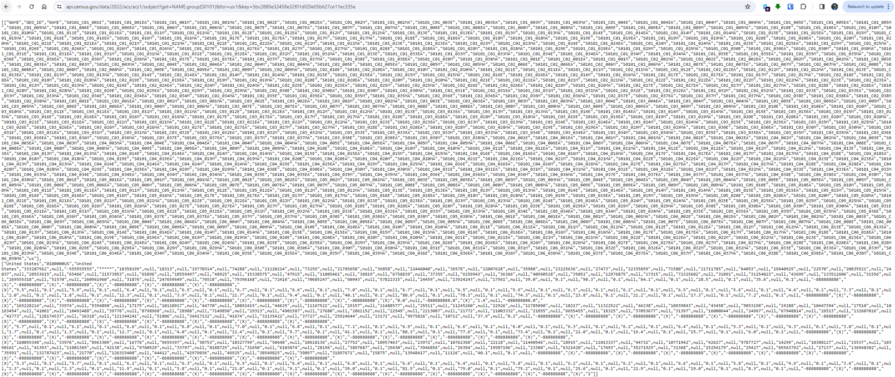


---
# API Endpoints

The reason the site looks like hot `r fa('trash')` is that its structured and formatted in a very particular way (that can be read directly into R!).

Usually these pages are formatted in one of two ways: XML or JSON
  - We don't need too worry too much about the particular syntax of either

--

In general there are .hi-blue[three types] of API Endpoints:

1. .hi-purple[Explicit] API Endpoint, .hi-medgrn[no API Key]
1. .hi-purple[Explicit] API Endpoint, .hi-dkgrn[API Key Required]
1. .hi-pink[Hidden] API Endpoints

--

Let's work through an example workflow for each. But first...


---

# Some APIs that are free & legal

Some fun APIs:
* [TikTok (unofficial)](https://github.com/davidteather/TikTok-Api)
* [Twitter](https://developer.twitter.com/en/docs/twitter-api)
* [Spotify](https://developer.spotify.com/documentation/web-api/)
* [YouTube](https://developers.google.com/youtube/v3/getting-started)

This list of [Public APIs](https://github.com/public-apis/public-apis) has many more.

---

# R API Packages

Many R packages have been built to make working with APIs easier. Some examples:
* .hi-slate[tidycensus] for [American Community Survey microdata and other Census Bureau data](https://walker-data.com/tidycensus/)
* .hi-slate[fredr] for [more easily doing what we will do today](https://cran.r-project.org/web/packages/fredr/vignettes/fredr.html)
* .hi-slate[Quandl] for [Nasdaq and other financial information](https://github.com/quandl/quandl-r)
* .hi-slate[rtweet] for [Twitter data](https://github.com/ropensci/rtweet)
* .hi-slate[rnoaa] for [NOAA weather data](https://github.com/ropensci/rnoaa)
* .hi-slate[prism] for [PRISM gridded climate data](https://github.com/ropensci/prism) (we'll work with this later on)
* .hi-slate[TADA] for [Water Quality Portal Data (EPA, USGS)](https://github.com/USEPA/TADA) 
* .hi-slate[rnassqs] for USDA's [QuickStats API](https://github.com/ropensci/rnassqs) (agricultural data)
* .hi-slate[osmdata] for [OpenStreetMap spatial data](https://cran.r-project.org/web/packages/osmdata/vignettes/osmdata.html)


---
class: inverse, middle
name: nokey

# Explicit API Endpoint, No Key

---
# Explicit API Endpoint, No Key

Let's work through an example of the first type of API: .hi-purple[explicit API without a key].

--

Let's use the impressive [NYC Open Data](https://opendata.cityofnewyork.us/) to look at... `r fa('tree')`.

Seriously, trees. 

---
# Application 1: NYC Tree Census

First, open the [Tree Census page](https://data.cityofnewyork.us/Environment/2015-Street-Tree-Census-Tree-Data/uvpi-gqnh/about_data) in your browser (if you haven't done so already)

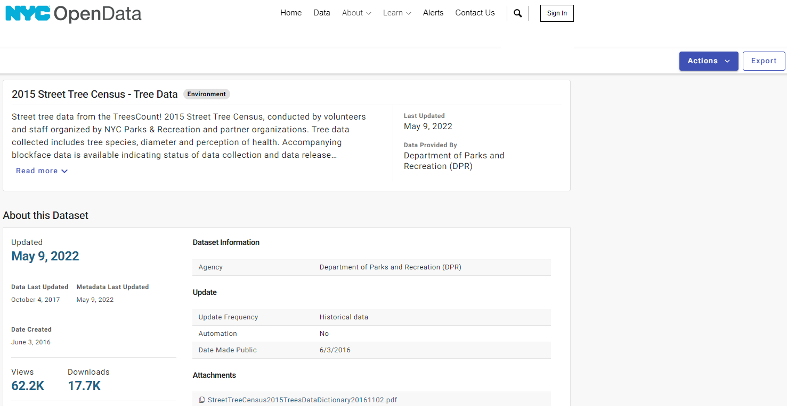

---
# Application 1: NYC Tree Census

Click on .hi-medgrn[Actions > API] in upper-right to display the API Endpoint

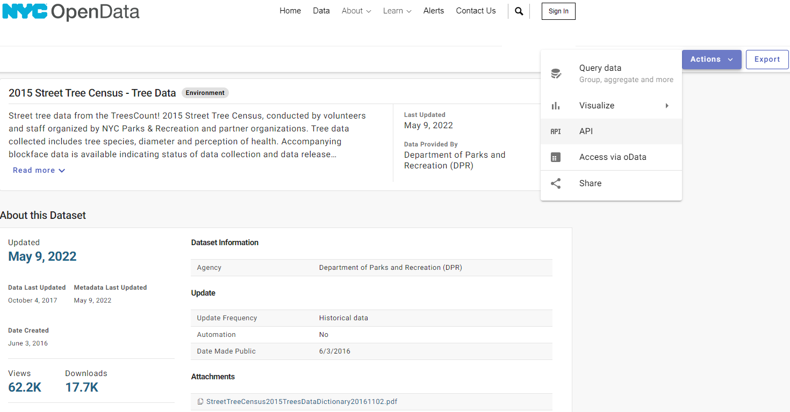

---
# Application 1: NYC Tree Census

Click on .hi-medgrn[Actions > API] in upper-right to display the API Endpoint

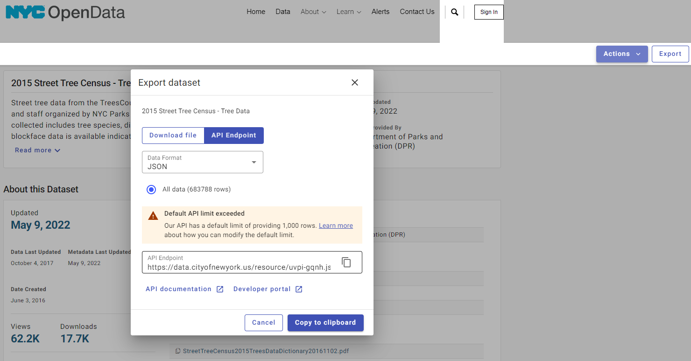

---
# Application 1: NYC Tree Census

Copy/Paste or clickc "go to" to open the API endpoint link in another tab. You'll see a bunch of JSON text.

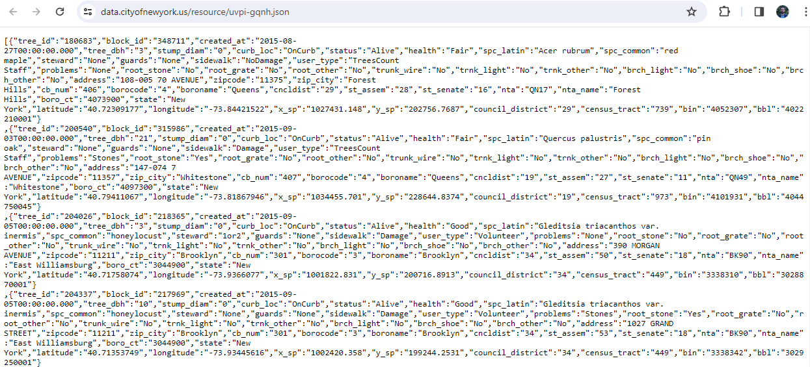

---
# Application 1: NYC Tree Census

If you installed JSONView, it will look a lot nicer
  * A lot like a transposed dataframe row...
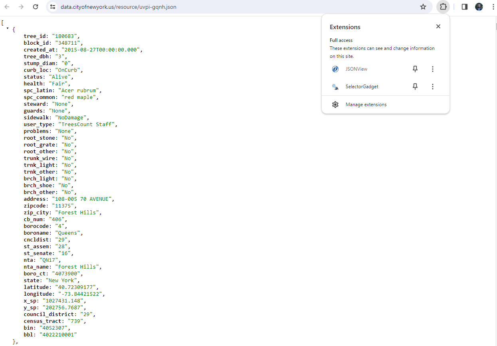

---
# Load JSON into R

Next, use the `fromJSON()` function in the [excellent .hi-slate[jsonlite] package](https://cran.r-project.org/web/packages/jsonlite/index.html) to read JSON into R.

```{r}
nyc_trees <- fromJSON("https://data.cityofnewyork.us/resource/uvpi-gqnh.json") %>% 
  as.data.frame()
nyc_trees
```

---
# Aside: API Limits

Note that while the full census of NYC trees contains over 700,000 trees, we only downloaded a small portion.

By default, the API limits us to 1,000 rows.

--

For our use case (seeing an example of the workflow) this isn't an issue, but [reading the documentation](https://dev.socrata.com/docs/queries/limit.html) reveals a way to get around that (if so desired).

.hi-slate.center[Punchline: always read the API documentation!]

---
# Work with the Data

Now we have the data, accessed through an API Endpoint!

--

Seriously, that's it. Now we can do whatever we want with the data - how about plotting it?
.small[
```{r, eval = F}
nyc_trees %>% 
  select(longitude, latitude, stump_diam, spc_common, spc_latin, tree_id) %>% 
  mutate_at(vars(longitude:stump_diam), as.numeric) %>% 
  ggplot(aes(x=longitude, y=latitude, size=stump_diam)) + 
  geom_point(alpha=0.5) +
  scale_size_continuous(name = "Stump Diameter") +
  labs(
    x = "Longitude", y = "Latitude",
    title = "Sample of New York City trees",
    caption = "Source: NYC Open Data"
    ) +
  theme_minimal()
```
]

---
# Plotting Some Trees

.small[
```{r, echo = F}
nyc_trees %>% 
  select(longitude, latitude, stump_diam, spc_common, spc_latin, tree_id) %>% 
  mutate_at(vars(longitude:stump_diam), as.numeric) %>% 
  ggplot(aes(x=longitude, y=latitude, size=stump_diam)) + 
  geom_point(alpha=0.5) +
  scale_size_continuous(name = "Stump Diameter") +
  labs(
    x = "Longitude", y = "Latitude",
    title = "Sample of New York City trees",
    caption = "Source: NYC Open Data"
    ) +
  theme_minimal()
```

---
class: inverse, middle
name: key

# Explicit API Endpoint with Key

---

# Explicit API Endpoint with Key

For the second application, we're going to focus on the more common circumstance: an API endpoint that .hi-purple[requires an API key].

An .hi-purple[API key] is a way to add a unique ID signature to every API call you make
  * Required for all APIs linked to gov't agencies or institutions (e.g. Census, BEA).
  
--

Let's do an application working with the [Federal Reserve Bank of St. Louis (FRED) API](https://fred.stlouisfed.org/docs/api/fred/)

---

# Application 2: FRED API

FRED makes available a [ton of U.S. economic data](https://fred.stlouisfed.org/) that can easily be accessed via API.

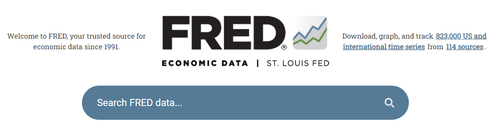


The only real difference from the last example: we first have to .hi-medgrn[register for an API key]

---

# Application 2: FRED API

First, navigate to the [FRED API page](https://fred.stlouisfed.org/docs/api/fred/)

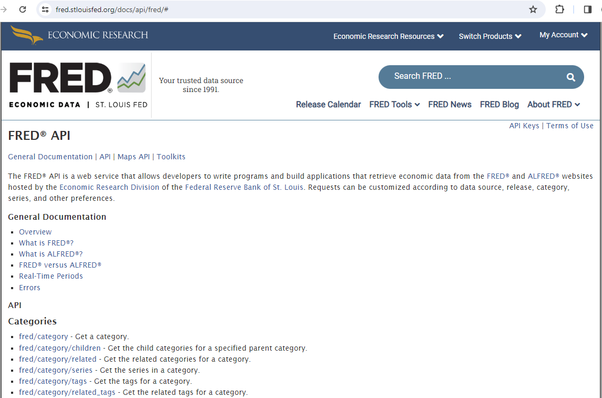


---

# Application 2: FRED API

Click on "API Keys" in the upper-right then "Request or view your API keys"

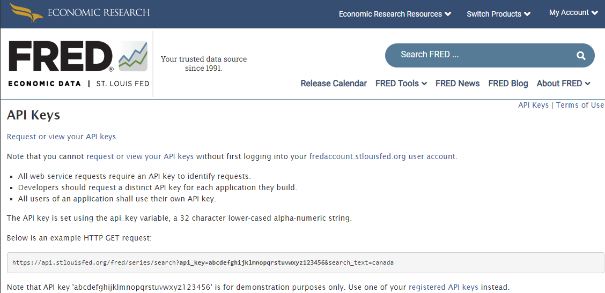


---

# Application 2: FRED API

Make an account, then request an API Key
  * My Account > API Keys > Request API Key
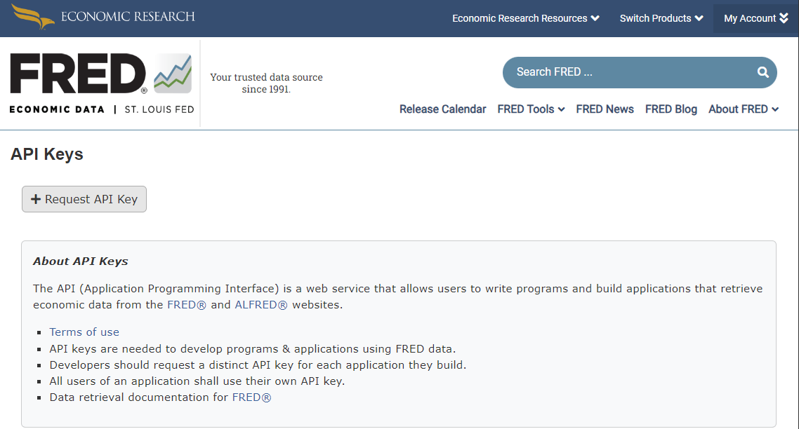

---

# Setting API Keys in R

Treat your API keys .hi-blue[like passwords]
  * You're responsible for following API terms & conditions, and you can't control that if someone else is using your key
  
--

This means we shouldn't ever .hi-medgrn[harcode API keys into R scripts].

Instead, we can define them as .hi-purple[environment variables], either
  1. For the current R session only
  1. Globally across all R sessions
  
---

# Environment Variables: Current Session

To define an environment variable for .hi-medgrn[your current session only], run the following .hi-slate[in your console:]<sup>1</sup>

```{r, eval = F}
Sys.setenv(FRED_API_KEY = "abcdefghijklmnopqrstuvwxyz0123456789")
```

Replacing the fake API with your actual API.

You can then use an environment variable in your script with

```{r, eval = F}
# assign to R object and print out
my_key <- Sys.getenv("FRED_API_KEY")
my_key
```

.footnote[<sup>1</sup> setting `Sys.setenv()` in scripts defeats the entire purpose!]
---

# Environment Variables: Globally

To set an environment variable .hi-purple[globally across all sessions], we'll need to add a special `~/.Renviron` file.
  * Text file that lives in your home directory (hence the `~/` path)
  
--

To edit, we can use the ``usethis::edit_r_environ()` function:

```{r}
usethis::edit_r_environ()
```

---

# Environment Variables: Globally

This opens your `~/.Renviron` file in a new tab, where you can easily add a line defining your API key.

.cetner[
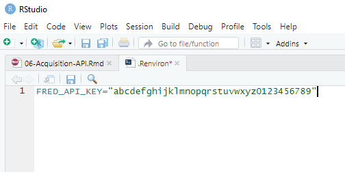
]

Hit save, then restart R or refresh your environment session to use it:

```{r}
## Only necessary when reading in a new Renviron variable
readRenviron("~/Renviron")
```

---

# Using the FRED API

With your API key set, let's figure out how to use the FRED API.

Looking at the [FRED API documentation](https://fred.stlouisfed.org/docs/api/fred/) you'll see
  * There are many types of requests you can make of FRED using the API
  * If we want the underlying data for a data series, we want the [fred/series/observations](https://research.stlouisfed.org/docs/api/fred/series_observations.html) path.

---

# Using the FRED API

Clicking the link takes us to [specific documentation for that path]
  (https://fred.stlouisfed.org/docs/api/fred/series_observations.html)

Here we can learn
  1. In which .hi-blue[file formats] the API will return data
    * XML, JSON, zipped tab delimited, zipped Excel
  1. The exact .hi-medgrn[syntax] for making a request
    * Potentially specific to each format
  1. The .hi-purple[parameters] that you can provide
    * e.g. function arguments
    
    

---

# Using the FRED API

One required parameter is `series_id`.
* Let's look at the median home listing price in East Lansing.
* By searching the FRED website, I found that the [ID](https://fred.stlouisfed.org/series/MELIPRMSA29620) for this series is `MELIPRMSA29620`.

For the `file_type`, you can use either XML or JSON.
* Both can easily be read into R.
* Since we already saw JSON, let's try using XML.

.hi-slate[Try out the API right in your browser.] Paste this into your location bar, replacing the fake API key with your own:

`https://api.stlouisfed.org/fred/series/observations?series_id=MELIPRMSA29620&api_key=abcdefghijklmnopqrstuvwxyz123456&file_type=json`

---

# Using the FRED API

To use the API in R, we'll use the tidyverse package .hi-slate[httr]. First we need to define some variables with the information we need:
```{r}
url = "https://api.stlouisfed.org/" # base URL
endpoint = "fred/series/observations" # endpoint path
params = list(api_key = Sys.getenv("FRED_API_KEY"), # API key
              file_type = "json", # format
              series_id = "MELIPRMSA29620") # series we want
```

Now we can use the `GET` method to request data from the server:
```{r, results=F}
response = httr::GET(url = url, path = endpoint, query = params)
response
```
```
Response [https://api.stlouisfed.org/fred/series/observations?api_key=[YOUR_API_KEY]&file_type=json&series_id=MELIPRMSA29620]
  Date: 2024-02-19 20:23
  Status: 200
  Content-Type: application/json; charset=UTF-8
  Size: 9.11 kB

```

---

# Using the FRED API

The response is a complex list object. Extracting the XML content:
```{r, results = F}
json <- response %>%
  httr::content(type = "text") %>% # from httr package
 jsonlite::fromJSON() # Parse the JSON file
```

--

Viewing this object reveals that what we really want is the `json$observations` data frame.

```{r}
el_house_prices <- json$observations
el_house_prices
```


---

# Using the FRED API

Cleaning up a little bit:
```{r}
el_house_prices <- mutate(el_house_prices,
    date = ymd(date),
    median_price = as.numeric(value)
  ) %>%
  select(date, median_price)
el_house_prices
```

---

# Using the FRED API

Plotting:

```{r, out.width = "90%", fig.height = 4, eval = F}
drop_na(el_house_prices) %>%
ggplot(aes(x = date, y = median_price)) + 
  geom_line() +
  theme_minimal() +
  scale_y_continuous(labels = scales::label_dollar(),
                     name = "Median House Price") +
 scale_x_date(name = NULL,
               date_breaks = "1 year", 
               date_labels = "%Y") +
  labs(title = "Median Home Prices in Lasning-East Lansing MSA")
```


---

# Using the FRED API

Plotting:

```{r, echo = F}
drop_na(el_house_prices) %>%
ggplot(aes(x = date, y = median_price)) + 
  geom_line() +
  theme_minimal() +
  scale_y_continuous(labels = scales::label_dollar(),
                     name = "Median House Price") +
 scale_x_date(name = NULL,
               date_breaks = "1 year", 
               date_labels = "%Y") +
  labs(title = "Median Home Prices in Lasning-East Lansing MSA")
```

---

# Challenge

.hi-medgrn[How has East Lansing's pandemic housing market compared with other cities?]
* Get similar data from 2-3 other housing markets you're interested in.
* Plot time-series graphs for each housing market.
* More advanced: combine all the results in 1 dataframe (keep it tidy!).

    
---
class: inverse, middle
name: hidden

# Hidden APIs

---
# Hidden APIs

The third kind of APIs are known as .hi-blue[Hidden APIs]. 

These are endpoints used for a website's .hi-medgrn[Internal page generation] and is not intended for public use. 
  * For example, Airbnb uses or has used a hidden API to display search results on its web interface.
  * Grant McDermott has an [example](https://raw.githack.com/uo-ec607/lectures/master/07-web-apis/07-web-apis.html#Application_3:_World_rugby_rankings) of how to find and use hidden APIs.
  * We're not going to go in-depth into hidden API access because...
  
---
# Hidden APIs

One caveat: the legality of using hidden APIs is .hi-blue[less clear]
  * In April 2022 (*HiQ Labs v. LinkedIn*), the Ninth Circuit Court of Appeals held that webscraping is legal in the U.S. so long as the data is .hi-purple[publicly available]
  * Do hidden APIs constitute publicly available information?

--

Even if generally legal, web scraping may be a violation of a website's Terms & Conditions
  * Airbnb: "Do not use bots, crawlers, scrapers, or other automated means to access or collect data or other content from or otherwise interact with the Airbnb Platform."
  * Your IP could be blocked or your account could be blocked/blacklisted
  
  
---
class: inverse, middle
name: consider

# Considerate Web Scraping

---
# Considerate Web Scraping

In addition to our internal evaluation of

  > Just because we can, doesn't mean we should

another useful tool in this process is .hi-medgrn[checking for and reading the robots.txt file].


Many sites have a `robots.txt` file that outlines what parts of the site web crawlers *can* and *can't* access.

  * Specific pages or API endpoints
  * Specific types of users
  
  
---
# Considerate Web Scraping

The `robotstxt` package makes it easy to check for and read these files. For example, Wikipedia:
.small[
```{r}
get_robotstxt(domain = "https://www.wikipedia.org")
```
]

---
# Considerate Web Scraping

.hi-medgrn[Best Practices] for considerate web scraping:

  * Check the `robots.txt` file and scrape what's allowed
  * If no  `robots.txt` file exists, stick to
    1. Public information
    1. Scraped at a reasonable speed (i.e. human frequency)
  * Scrape the data .hi-blue[once], not .hi-dkgrn[every time you run the script]
  * Ask yourself: "would I feel comfortable having an undergrad RA scrape this?"


---

# Table of Contents

1. [Prologue](#prologue)

2. [APIs](#api)

3. [Explicit API Endpoint, No Key](#nokey)

4. [Explicit API Endpoint with Key](#key)

5. [Hidden APIs](#hidden)

6. [Considerate Web Scraping](#consider)

```{r gen_pdf, include = FALSE, cache = FALSE, eval = FALSE}
infile = list.files(pattern = 'API.html')
pagedown::chrome_print(input = infile, timeout = 200)
```