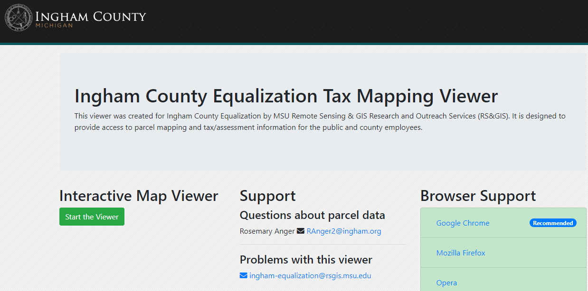
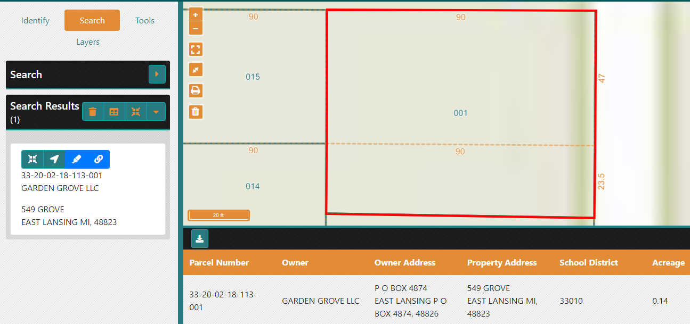
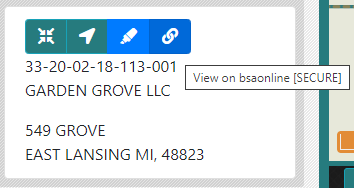
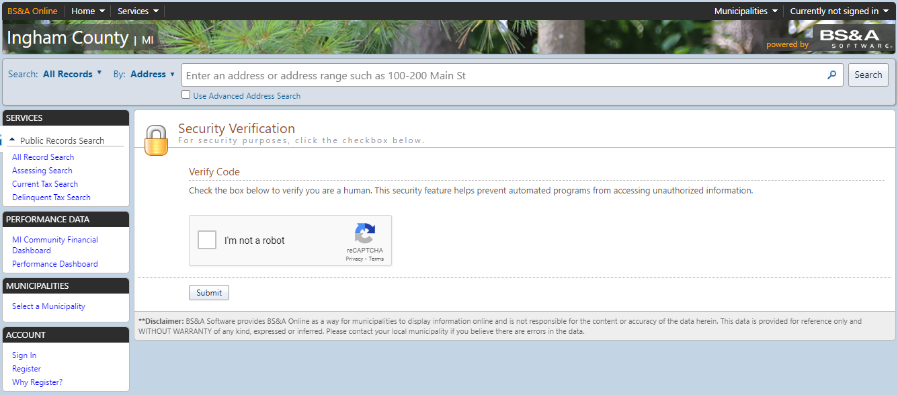
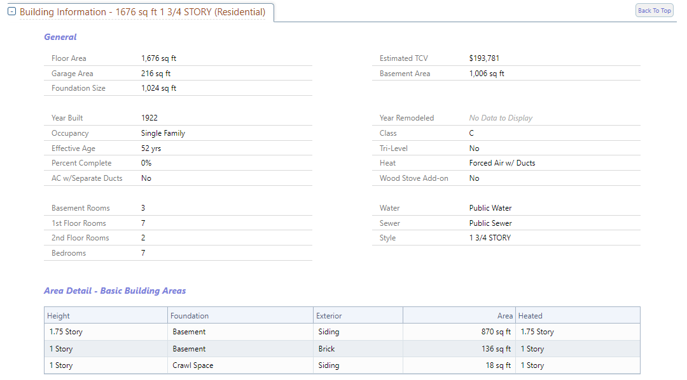
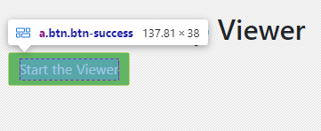
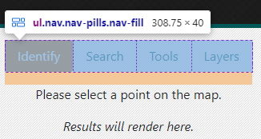
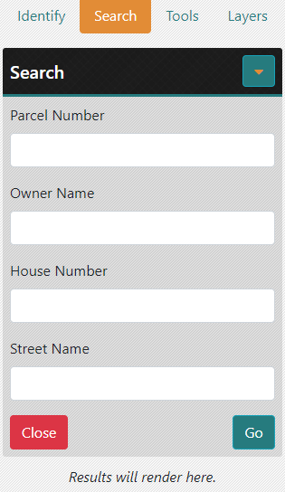
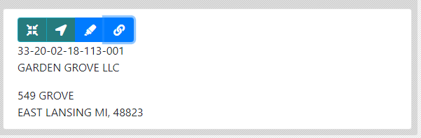
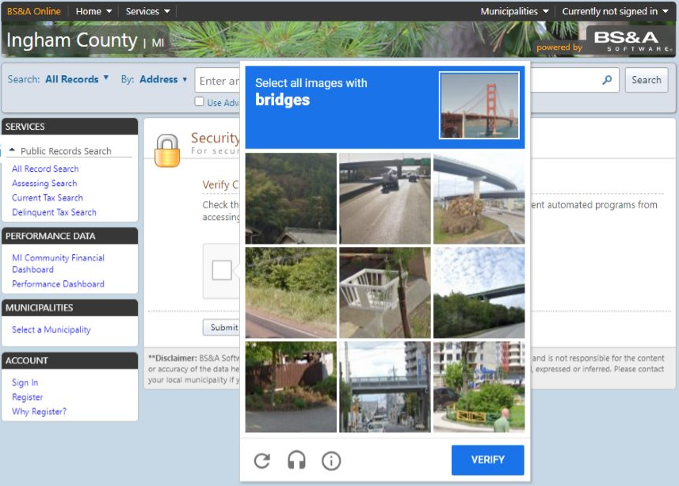

```{css, echo=FALSE}
# CSS for including pauses in printed PDF output (see bottom of lecture)
@media print {
  .has-continuation {
    display: block !important;
  }
}
.remark-code-line {
  font-size: 95%;
}
.small {
  font-size: 75%;
}
.scroll-output-full {
  height: 90%;
  overflow-y: scroll;
}
.scroll-output-75 {
  height: 75%;
  overflow-y: scroll;
}
```

```{r setup, include=FALSE}
options(htmltools.dir.version = FALSE)
library(knitr)
library(fontawesome)
knitr::opts_chunk$set(
	fig.align = "center",
	cache = FALSE,
	dpi = 300,
  warning = F,
  message = F,
	fig.height = 5,
	out.width = "80%"
)
```

# Table of Contents

1. [Prologue](#prologue)

2. [Scraping Dynamic Websites](#dynamic)


---
class: inverse, middle
name: prologue

# Prologue


---
# Packages for Today

While we now have a thorough understanding of how to scrape content from .hi-medgrn[static websites], those aren't the only type of sites we'll interact with.

To explore this we'll need the following packages:

```{r}
pacman::p_load(rvest, tidyverse, chromote, selenider)
```

---
class: inverse, middle
name: dynamic

# Scraping Dynamic Websites

---
# Dynamic Websites

.hi-medgrn[Dynamic websites] are those are rendered dynamically and require .hi-medgrn[interaction] in order to obtain desired information.

While .hi-slate[rvest] can help us retrieve urls and element contents, it can't interact with .hi-purple[dynamically-generated or interactive] websites.<sup>1</sup>

--

To do that, we're going to take advantage of .hi-blue[browser automation] methods.

.footnote[<sup>1</sup> .hi-slate[rvest] has some experimental functionality for live site interaction, but it is not as complete as the other options we'll see shortly.]

---
# Browser Automation

The main idea behind browser automation is this:

  > If a website requires pointing/clicking/typing to reveal the contents we want, why not have software "drive" a browser for us?
  
--

.pull-left[.hi-medgrn.center[Old Approach: RSelenium]
  * R bindings for the Selenium webdriver
  * Requires some additional software (i.e. Docker)
  * Additional steps to get it working with Mac OS X
]
--
.pull-right[
.hi-purple.center.underline[New Approach: selenider]
  * Uses .hi-slate[chromote] or Selenium automation tools to drive a Chrome browser
  * Syntax more closely matches tidyverse
  * Can't do some more complex things yet (i.e. click-and-hold, click a point)
]

---

# Application: EL Properties

Let's work through an example of an interactive workflow for .hi-medgrn[property characteristics in East Lansing].
  
Suppose you want to obtain property information for a known address within East Lansing. The city has a handy [interactive map viewer](https://ingham-equalization.rsgis.msu.edu/) for tax assessment info.

.center[
]


---

# Application: EL Properties

Suppose we wanted to get information about the property at 549 Grove St. from the parcel map.

Doing this takes a couple steps:
  1. Launch the [Map Viewer](https://ingham-equalization.rsgis.msu.edu/Viewer)
  1. Click on "Search"
  1. Type address components (number and street name) into the search bar, hit Go
  1. Click on "Snap to Result" button to zoom in on the parcel
  1. Click on "Toggle Table" to show information

---

# Application: EL Properties

*Unfortunately*, this doesn't have the property details we are interested in.

.center[
]

---

# Application: EL Properties

*Fortunately*, there is a link to more information on a different site:


.center[
]

---

# Application: EL Properties

Which *unfortunately* [requires verification](https://bsaonline.com/SiteSearch/SiteSearchDetails?SearchFocus=Assessing&SearchCategory=Parcel+Number&SearchText=33-20-02-18-113-001&uid=383&PageIndex=1&ReferenceKey=33-20-02-18-113-001&ReferenceType=0&SortBy=&SearchOrigin=0&RecordKey=1%3d33-20-02-18-113-001&RecordKeyType=1%3d0&sitetransition=true)

.center[
]


---

# Application: EL Properties

Which *fortunately* has the characteristics we want once we get past this!


.center[
]


---
# Workflow

Let's now work through these steps in the context of an automated browser workflow:
  1. Launch an automated browser session
  1. Navigate to the Map Viewer
  1. Search by street name + house number
  1. Retrieve displayed info
  1. Click detail link
  1. Pass verification test
  1. Scrape desired info

---
# 1. Launch Automated Session

First, we need to .hi-medgrn[initiate an automated browser session] with `selenider_session()`.<sup>2</sup>

```{r}
session <- selenider_session(
  "chromote", # set backend to chromote
  timeout = 10 # set timeout to 10 sec
)
```

--

We've now created a .hi-blue[local session]
  * Accessed anywhere in a given script/RMarkdown file
  * Closes automatically when the script/file finishes
  * If started within a function, closes when the function is done running

.footnote[<sup>2</sup> The full list of .hi-slate[selenider] functions can be found [here](https://ashbythorpe.github.io/selenider/reference/index.html)]
---
# View the Session

If you want to  .hi-blue[view the browser session], we need to add the argument

.center[`options = chromote_options(headless = F)`]

Which will open the session in your Chrome browser

```{r, eval = F}
session <- selenider_session(
 options = chromote_options(headless = F), # view the session
  "chromote", # set backend to chromote
  timeout = 10 # set timeout to 10 sec
)
```
---
# 2. Navigate to Map Viewer

Let's start by navigating to the main [Tax Mapping Viewer page](https://ingham-equalization.rsgis.msu.edu/) and launch the viewer

  * `open_url("URL")`
  
```{r}
  open_url("https://ingham-equalization.rsgis.msu.edu/")
```

---
# 2. Navigate to Map Viewer

Check that we ended up at the desired url:

```{r}
current_url()
```
---

#  Global Functions

Other actions that apply globally to the entire page:

| Function | Task |
| -------  | -----|
| `open_url()` | navigate to the indicated url |
| `current_url()` | get the current url |
| `get_page_source()` | get the page's HTML|
| `back(), forward()` | navigate forward or back|
| `reload(), refresh()` | reload the current page|
| `take_screenshot()` | take screenshot of current image|
| `execute_js_fn(), execute_js_expr()` | execute a JavaScript function |


---
# 2. Navigate to Map Viewer

Now we'll .hi-medgrn[click the "Start the Viewer" button] to launch the app.

.hi-slate[Involved Steps:] 
  * .hi-blue[Select] the button element by its CSS selector (`find_element()`)
  * .hi-medgrn[Scroll to] the button (`elem_scroll_to()`)
  * .hi-purple[Click] the button (`elem_click()`)
 
---
# Selection Functions

Some additional selection functions:

| Function | Task |
| -------  | -----|
| `s(), ss()` | select HTML elements (without specifying the session)|
| `find_element()` | find a single HTML child element (yields a `selenider-element` object) |
| `find_elements()` | find multiple HTML child elements (yields a `selenider-elements` object) |
| `elem_filter(), elem_find()` | extract a subset of HTML elements|

---
# Element Properties

And functions for obtaining element properties

| Function | Task |
| -------  | -----|
| `elem_attr(), elem_attrs(), elem_value()` | Get attributes of an element|
| `elem_css_property()` | Get a CSS property of an element|
| `elem_name()` | Get the tag name of an element |
| `elem_size(), length(selenider-elements)` | get the number of elements in a collection|
| `elem_text()` | Get the text inside an element |
| `elem_equal()` | Test if two elements are equal|

---
# Actions
| Function | Task |
| -------  | -----|
| `elem_click(), elem_double_click(), elem_right_click()` | Click on an element|
| `elem_hover(), elem_focus` | Hover over an element|
| `elem_scroll_to()` | Scroll to an element |
| `elem_select()` |Select an HTML element|
| `elem_set_value(), elem__send_keys(), elem_clear_value()` | Set the value of an input |
| `elem_submit()` | Submit an element|
| `keys` | list of special keys |

---
# 2. Navigate to Map Viewer

.pull-left[
```{r}
session %>%
  find_element("a.btn.btn-success") %>% # select the button by CSS Selector
  elem_text()
```
]
.pull-right[
.center[
]
]

```{r}
session %>%
  find_element("a.btn.btn-success") %>%
  elem_scroll_to() %>% # move the cursor to the button
  elem_click() # click the button
current_url()
```

---
# 3. Search by Address

We next want to select + click on the "Search" tab button.

To do this, we'll take advantage of .hi-medgrn[relative position] selector functions.

| Function | Task |
| -------  | -----|
| `elem_parent()` | select the element that contains the current element |
| `elem_ancestors()` | select every element containing the current element (children, grandchildren, etc.|
| `elem_siblings()` | select every element which has the same parent as the current element (e.g. list) |
| `elem_children()` | select every element connected to and directly below the current element |
| `elem_descendants()` | select every element that is contained by the current element (any type of ancestor)|


---
# 3. Search by Address

Select + click on the "Search" tab button.

.less-left[
.center[
]]

.more-right[
```{r}
session %>%
  find_element("nav.info-panel") %>% # get full nav panel
  elem_children()
```
]

---
# 3. Search by Address

Select + click on the "Search" tab button.

.less-left[
.center[
]]

.more-right[
```{r}
session %>%
  find_element("ul.nav.nav-pills.nav-fill") %>% # just the button menu
  elem_children()
```
]
---
# 3. Search by Address

We can also use .hi-medgrn[condition functions] to help with selection.
.small[
| Function | Task |
| -------  | -----|
| `has_text(), has_exact_text()` | has text that partially or fully matches |
| `has_attr(), attr_contains(), has_value()` | does the attribute match a value |
| `has_css_property()` | does an element's CSS property match a value (class, id, title, etc.)|
| `has_name()` | does an element have a tag name |
| `has_length(), has_size(), has_at_least()` | does a collection have a certain number of elements |
| `is_present(), is_in_dom(), is_absent()` | does an element exist|
| `is_visible(), is_displayed(), is_hidden(), is_invisible()` | is an element visible|
]
---
# 3. Search by Address

We can also use .hi-medgrn[condition functions] to help with selection.
  * `find_elements()` to yield a `selenider_element`
  * `elem_find()` to extract a specific subset of HTML elements
    * `has_text()` to grab the element with the text "Search"
  * `elem_click()` to click the selected button.
  
```{r}
session %>%
  find_element("ul.nav.nav-pills.nav-fill") %>% 
  find_elements("li.nav-item") %>%
  elem_find(has_text("Search")) %>%
  elem_click()
```

---
# 3. Search by Address

Checking to make sure we've activated the "Search" menu tab:

```{r}
session %>%
  find_element("ul.nav.nav-pills.nav-fill") %>% 
  elem_children()
```
See the `nav-link active` class on the second element with the "Search" text?

---
# 3. Search by Address

Now .hi-purple[enter text] into the desired fields


.less-left[
.center[
]]

.more-right[
```{r}
# Find house number field
session %>%
  find_element("div.service-accord") %>%
  elem_children()
```
]


---
# 3. Search by Address

Now .hi-purple[enter text] into the desired fields


.less-left[
.center[
]]

.more-right[
```{r}
# Find house number field
session %>%
  find_element("div.__content") %>%
  elem_children()
```
]


---
# 3. Search by Address

Now .hi-purple[enter text] into the desired fields and click "Go"

.less-left[
.center[
]]

.more-right[
```{r}
# set house number
ss("div.service-input.form-group") %>%
  elem_find(has_text("House")) %>%
  find_element("input") %>% 
  elem_set_value("549") 

# set street name
ss("div.service-input.form-group") %>%
  elem_find(has_text("Street")) %>%
  find_element("input")  %>% 
  elem_set_value("Grove") 

# Click button
  ss("button.btn.btn-info") %>%
    elem_find(has_text("Go")) %>%
    elem_scroll_to() %>%
    elem_click()
```
]

---
# 4. Retrieve Displayed Info
.center[
]

```{r}
session %>%
  find_element("div.result-item") %>%
  read_html() %>%
  html_text2() %>%
  str_replace_all("\n\n", "\n") %>%
  str_split("\n")
```

---
# 5. Follow Detail Link

```{r}
s("a.btn.btn-primary") %>%
 elem_attr("href") %>%
 open_url()

current_url()
```
---
# 6. Pass Verification Test

Here's where things break down a bit. 

--

We can get our browser to click the "Verify" button
```{r, eval = F}
 s("#GetUserValidationInfo") %>%
     elem_scroll_to() %>%
     elem_click()
```
--

But then we get... the dreaded captcha

.center[
]

---
# 6-7. Pass Verification Test + Scrape

While I have yet to figure out a way around one of these image recognition captchas, here's a .hi-medgrn[semi-automated workaround:]
  * Wait a set amount of time until an HTML element is present with `elem_expect()` and `is_present()`
    * i.e. element from the results page after the captcha
  * Manually complete the captcha (must be viewing the session!)
  * Proceed to scrape what's on the page
  
```{r, eval = F}
details <- ss("div.record-details-collapsible-box") %>%
  elem_find(has_text("Building Information")) %>%
  find_element("div.widthContainer table.detailTable") %>%
  elem_expect(is_present, timeout = 60) %>% # wait up to 60 seconds to manually complete the captcha
  read_html() %>%
  html_table() %>%
  as.data.frame()

details
```
---

# Scraping Dynamic/Interactive Websites

Methods for scraping dynamic or interactive websites opens up a huge range of possibilities.
  * Iterative process of 
    * Interact with the website and its elements
    * Extract element contents as with static sites
  * Interactive workflows are generally more complex, so worth thinking about tradeoff between just brute forcing vs. coding up a scraping routine
  
  

---

# Table of Contents

1. [Prologue](#prologue)

2. [Scraping Dynamic Websites](#dynamic)


```{r gen_pdf, include = FALSE, cache = FALSE, eval = FALSE}
infile = list.files(pattern = 'Dynamic.html')
pagedown::chrome_print(input = infile, timeout = 200)
```