```{css, echo=FALSE}
# CSS for including pauses in printed PDF output (see bottom of lecture)
@media print {
  .has-continuation {
    display: block !important;
  }
}
.remark-code-line {
  font-size: 95%;
}
.small {
  font-size: 75%;
}
.scroll-output-full {
  height: 90%;
  overflow-y: scroll;
}
.scroll-output-75 {
  height: 75%;
  overflow-y: scroll;
}
```

```{r setup, include=FALSE}
options(htmltools.dir.version = FALSE)
library(knitr)
library(fontawesome)
knitr::opts_chunk$set(
	fig.align = "center",
	cache = FALSE,
	dpi = 300,
  warning = F,
  message = F,
	fig.height = 5,
	out.width = "80%"
)
```

# Table of Contents

1. [Prologue](#prologue)

2. [Scraping Static Websites](#static)

3. [Interacting with Static Websites](#interact)


---
class: inverse, middle
name: prologue

# Prologue


---
# Packages for Today

Today we'll pick up with scraping static websites.

For this we'll need the following packages:

```{r}
pacman::p_load(lubridate, rvest, stringr, tiydverse)
```
---
class: inverse, middle
name: static

# Scraping Static Websites

---
# Scraping Static Sites

Last time we saw how to use .hi-slate[rvest] functions to scrape information from .hi-medgrn[HTML Tables].
  * .hi-blue[Biggest Challenge:] finding the right CSS selectors
  
--

<br>

Sometimes, however, the data we want to scrape *aren't* in a nice table format already.

Let's work through an example: .hi-yellow[Yellow Pages]. 

---

# Application 2: Yellow Pages

Let's say you got excited by all this marathon talk and want to start running.

--
.less-left[
Naturally, you go to [Yellowpages.com](https://www.yellowpages.com/east-lansing-mi/running-stores) and search for "running stores" in East Lansing]
.more-right[
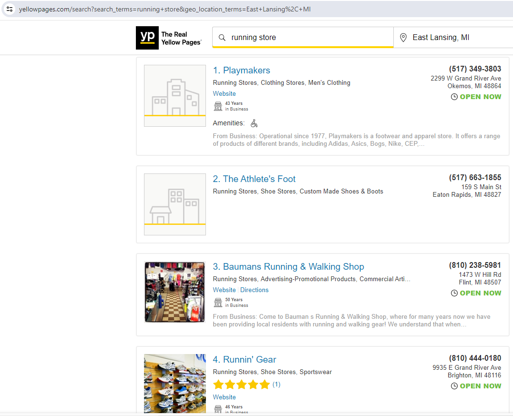
]

---
# SelectorGadget vs. Source

Let's scrape the descriptive info for each of the stores to help us figure out where to go first.

Try using SelectorGadget to find the selector for the info in [Playmakers](https://playmakers.com/)' box.

.center[
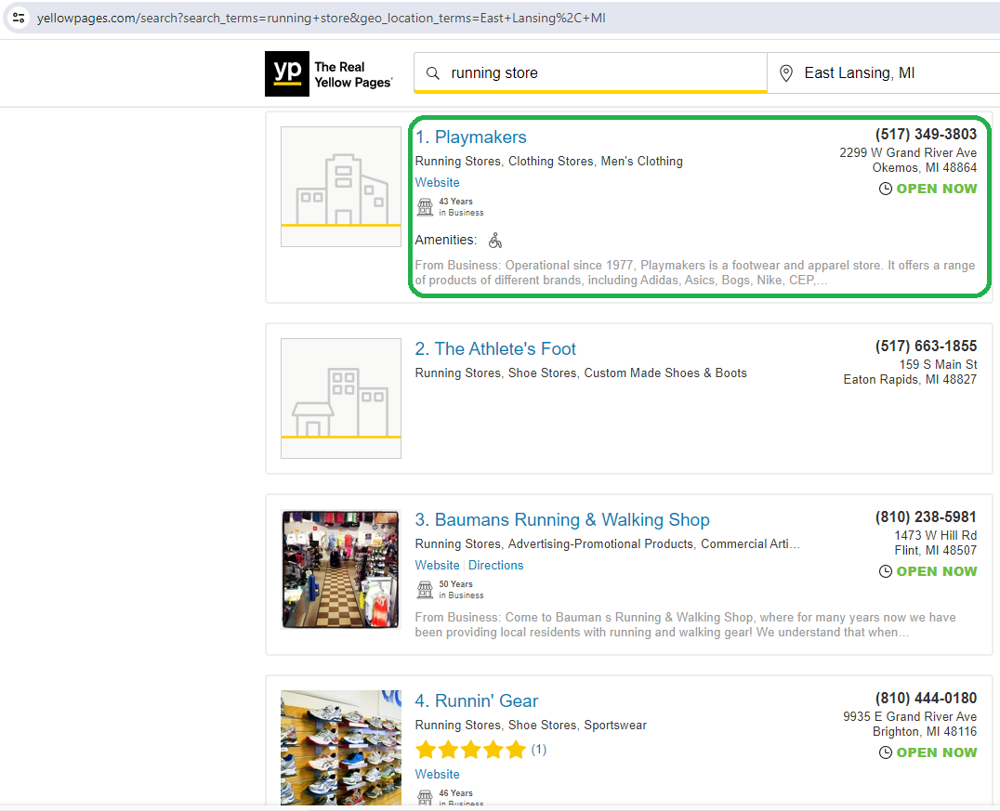
]


---
# SelectorGadget vs. Source

Were you able to get it? I wasn't. `r fa('face-frown')`

--

This is an example of a case where we need to .hi-blue[inspect the source] to find the selector. Give it a try now!


---
# SelectorGadget vs. Source

After a little digging you'll find the selector to be `"div.info"`

.center[
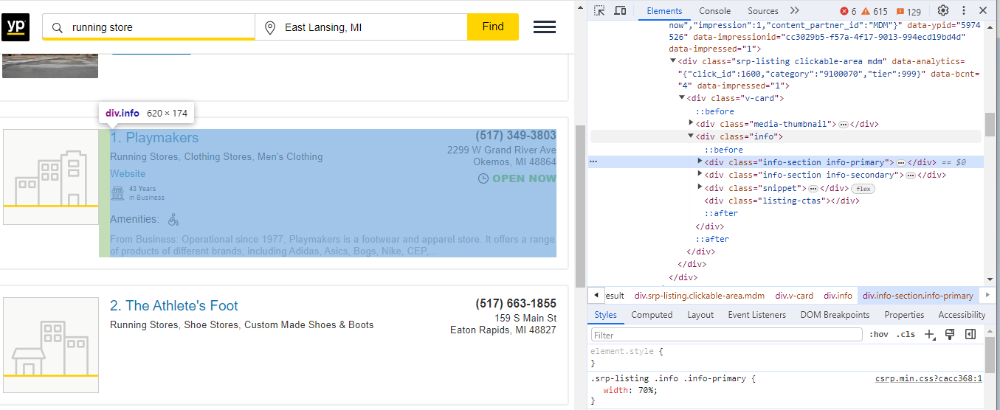
]


---
# SelectorGadget vs. Source

.hi-medgrn[One hiccup:] this selector isn't unique!

.center[
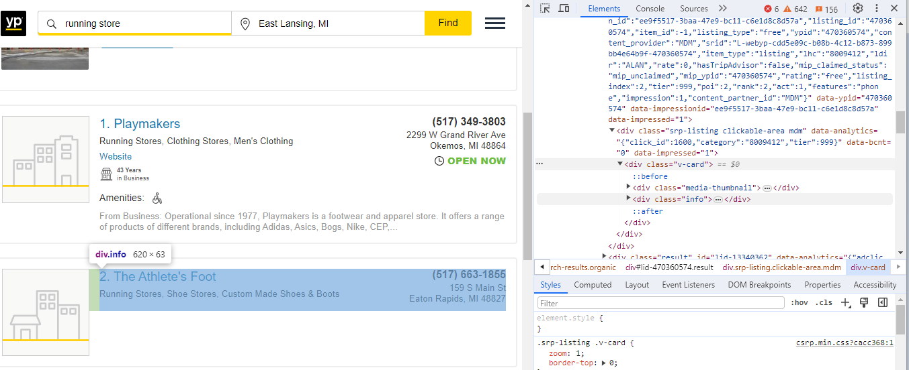
]

---
# Duplicate Elements with html_elements()

.hi-blue[Solution:] use `html_elements()` to retrieve .hi-blue[all matching elements at once]

```{r}
page1 <- read_html("https://www.yellowpages.com/east-lansing-mi/running-stores") %>%
  html_elements("div.info")
page1
```
---
# Application 2: Yellow Pages

We got back a .hi-medgrn[list] with 7 elements, one for each of the stores listed on the first page of search results.

What does the .hi-pink[Playmakers element] (first list object) contain?

```{r}
page1[[1]]
```

---
# Application 2: Yellow Pages

Turns out, .hi-purple[more elements!]

.less-left[
.font80[
1. `info-section info-primary`
1. `info-section info-secondary`
1. `snippet`
1. `listing-ctas`
]
]
--

.more-right[
This makes sense based on the source code:

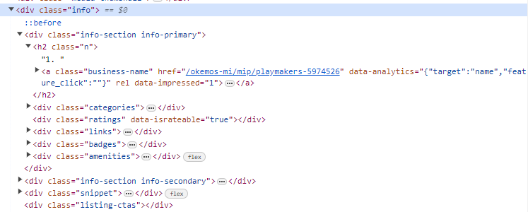
]

---
# Application 2: Yellow Pages

Let's start by retrieving the primary info as a table
  * Start with section element type and a period (`"div."`)
  * Replace spaces in class with periods
  * Parse as table with `html_table()`

```{r}
inf_prim <- page1[[1]] %>% # start with first listing box
  html_element("div.info-section.info-primary") %>% # grab primary info
  html_table()

inf_prim
```

---
# Application 2: Yellow Pages

Oops, that doesn't work here. Turns out our primary info box contains more divisions/elements!

```{r}
inf_prim <- page1[[1]] %>% # start with first listing box
  html_element("div.info-section.info-primary") 

inf_prim
```


---
# Application 2: Yellow Pages

Let's try retrieving just the .hi-blue[business name] element

```{r}
name <- page1[[1]] %>% # start with first listing box
  html_element("div.info-section.info-primary") %>% # get primary info division
  html_element("a.business-name") 

name
```

---
# Application 2: Yellow Pages

Here we've got an `<a>` class, which is the HTML tag for a .hi-purple[hyperlink].

--

This means we could do one of two things:

.hi-blue[1\. Retrieve the Text (Business Name)]

.hi-medgrn[2\. Retrieve the Link (Business Page)]


---
# Retrieve Text with *html_text()*

.hi-blue[1\. Retrieve the Text (Business Name):]
  * `html_text()` retrieves the .hi-pink[raw text]
  * `html_text2()` retrieves text .hi-purple[as it appears online]
    * Here there's no difference
  
```{r}
name %>% html_text() # get raw text portion of element
name %>% html_text2() # get text as it appears online
```
---
# Retrieve Link with *html_attr()*

.hi-medgrn[2\. Retrieve the Link (Business Page):]
  * `html_attr()` gets an attribute with a particular name (here the hyperlink, or "href")
  
```{r}
name %>%
  html_attr("href") # get link portion of element (link after "href =")
```

This gets us the portion of the url after `yellowpages.com` for the business page.


---
# Application 2: Yellow Pages

Next, let's switch over to the store page which contains a lot more detailed info.


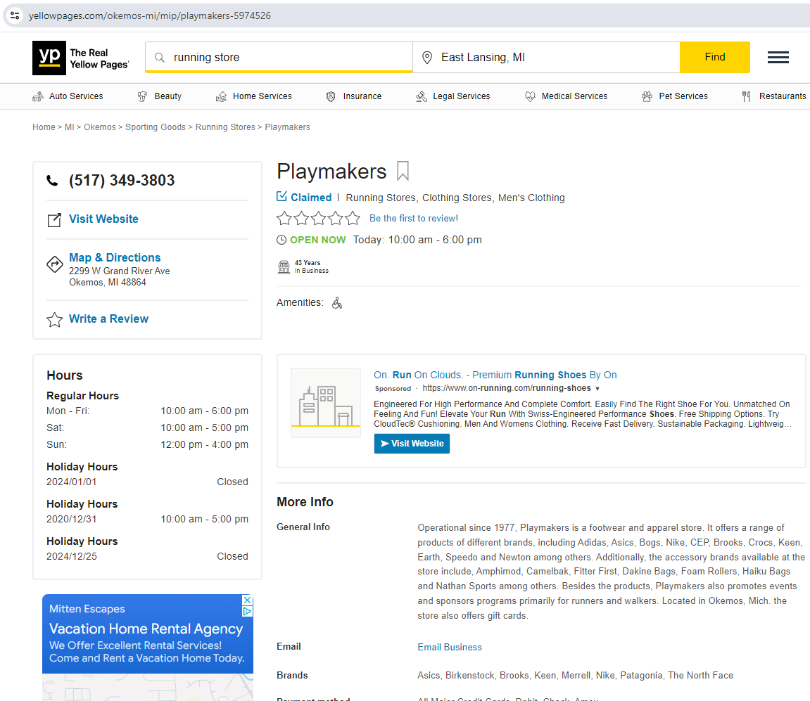


---
# Application 2: Yellow Pages

Let's start by grabbing the .hi-blue[categories]. 
  * Retrieve the page using the url we just grabbed
  * Grab the division we want ("categories")
  * Parse as text
  * Split on comma/space, trim extra white space
  
```{r}
link <- paste0("https://yellowpages.com/", name %>% html_attr("href"))
pm <- read_html(link)
pm %>% html_element("div.categories") %>%
  html_text() %>%
  str_split(", ") %>%
  str_squish()
```


---
# Application 2: Yellow Pages

Next let's get the "Other Information" contents.

```{r}
pm %>% html_element("dd.other-information") %>%
  html_text()
```

---
# Application 2: Yellow Pages

Using `html_text()` gets us non-breaking spaces (`&nbsp;`). 

Switching to `html_text2()` looks more like we expect:
```{r}
pm %>% html_element("dd.other-information") %>%
  html_text2()
```

Where `\n` is the HTML for line break

---
# Challenge

.hi-Slate[Challenge:] when is Playmakers open?
  * Use the page source to find the selector for the contents of the "Hours" box (Regular Hours through Holiday Hours)
  * Format it as a table with two variables:
    1. "Days"
    2. "Business Hours"
  * Remove the colon from regular hours days

```{r}
```


---
# Challenge

.hi-Slate[Challenge:] when is Playmakers open?
  * Use the page source to find the selector for the contents of the "Hours" box (Regular Hours through Holiday Hours)
  * Format it as a table with two variables:
    1. "Days"
    2. "Business Hours"
  * Remove the colon from regular hours days

```{r}
hours <- pm %>% html_element("dd.open-hours")
hours_df <- hours %>% html_table() 
colnames(hours_df) <- c("Days", "Business Hours")

hours_df <- dplyr::mutate(hours_df, 
                   Days = str_replace(Days, ":$", ""))
```

---
# Summary: Static Scraping

When scraping static web content rendered server-side:

  * Start by finding the relevant CSS selectors
  * Use the .hi-slate[rvest] package to read in the HTML document and parse it
    * .hi-medgrn[Tabular workflow:] `read_html(URL) %>% html_elements(CSS_Selectors) %>% html_table()`
    * Might need other functions depending on content type (e.g. `html_text/text2(), html_attr(), html_children()`)
    
    
---
class: inverse, middle
name: interact

# Interacting with Static Sites

---
# Interacting with Static Sites

While scraping a .hi-purple[known url] is pretty cool, we can do more than that.

--

We already saw one way to progress through a url chain, but we can .hi-blue[go deeper].

--


We can go 
--
.hi-medgrn[into].
--
.hi-medgrn[ the].
--
.hi-medgrn[ matrix].


---
# Interacting with Static Sites

Let's go back to the beginning with our Yellow Pages workflow.

Suppose instead you wanted to
  1. Enter a search term (i.e. "running store") and execute a search from the home page
  1. Retrieve all business URLs from the first page
  1. Navigate to the next page and repeat the process
  
We can do this with .hi-slate[rvest].

---
# Interacting with Web Forms

To .hi-medgrn[interact with web forms], we'll use the below workflow:
  * Retrieve a target form with `html_form()`
  * Fill in the form's required elements with `html_form_set()`
  * Submit the form with `html_form_submit()`
  * Read the resulting url with `html_read()`.
  
Let's practice this.

---
# Interacting with Web Forms 

Start by navigating to [Yellowpages.com](https://www.yellowpages.com/) (the main page).


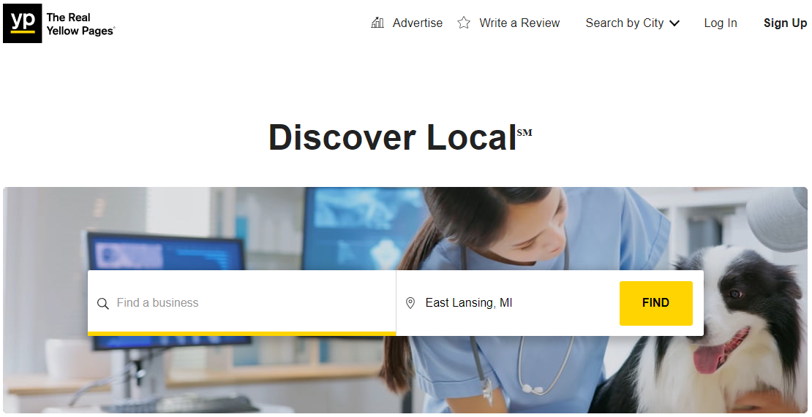

---
# Interacting with Web Forms

Conveniently, there's just one form here, `search-form`

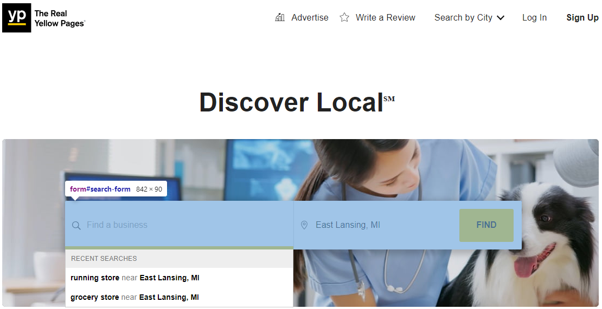

---
# Interacting with Web Forms

Use `html_form()` to extract the first/only form from the homepage:

```{r}
yp <- read_html("https://www.yellowpages.com/")
# grab the search form
search <- html_form(yp)[[1]]
```

---
# Interacting with Web Forms

Every web form has several different .hi-blue[fields] we'll need to fill or interact with

```{r}
search
```

Here we've got:
  * 2 .hi-medgrn[text fields:] "search_terms" and "geo_location_terms" that need contents
  * 1 .hi-purple[button] named "find" we'd click when manually searching

---
# Filling Web Forms with *html_form_set()*

Let's set up our search for "running store" in Grand Rapids, MI

```{r}
search_set <- html_form_set(search, 
                            search_terms = "Running Store", 
                            geo_location_terms = "Grand Rapids, MI")
```
---
# Submitting Web Forms

Submitting the form and getting the response:
```{r}
resp <- html_form_submit(search_set) # submit the form
resp
```

---
# Web Form Response

Submitting the form gets us a `response` class object, containing some useful components, including the resulting url:

```{r}
resp$url
```

--

And we can read the response url as we usually do


```{r}
# get the result url's html
page1 <- read_html(resp)
```

---
# Web Form Response

And we're now back to the standard search results first page: 

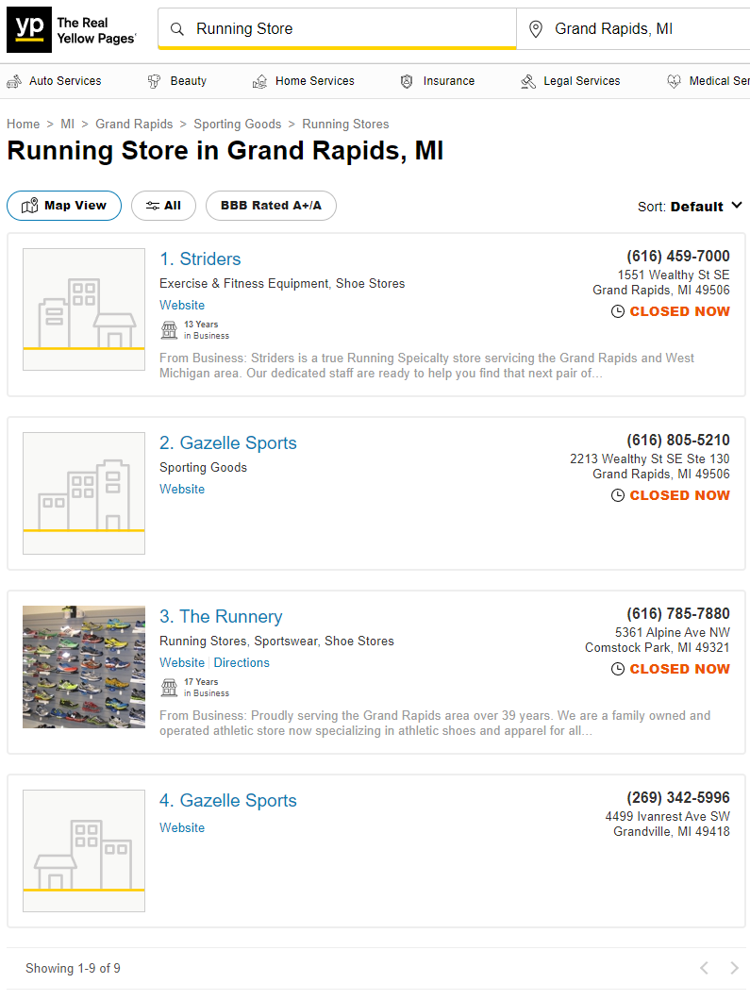

---
# Static Scraping

We could now combine what we've learned to
  1. Scrape info for each business on the page
  1. Scrape urls for each of the business pages
  1. Iteratively navigate to each business page and scrape more detailed info
  
We'll revisit this idea when we talk about .hi-medgrn[writing custom functions], but for now...

Let's chat about navigating pages.

---
# Navigating Search Pages

First we'll need a search/geography with a *lot* of results: ["restaurant" in New York, NY](https://www.yellowpages.com/search?search_terms=restaurant&geo_location_terms=New+York%2C+NY)
.center[
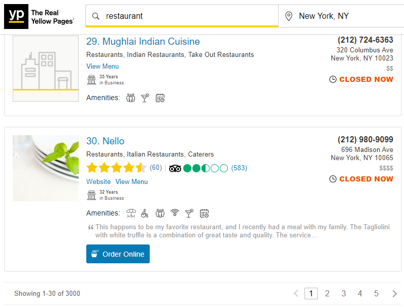
]
---
# Navigating Search Pages

Let's take a look at the page navigation menu at the bottom.

--

The main element is an .hi-medgrn[unordered list] `ul`

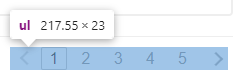

--

With each .hi-blue[list element] denoted by `li`

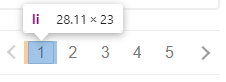

--

And each element containing a .hi-pink[hyperlink] `a` to that page 

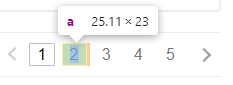

---
# Navigating Search Pages

Let's retrieve the search page url.

```{r}
ny_rest <- read_html("https://www.yellowpages.com/search?search_terms=restaurant&geo_location_terms=New+York%2C+NY")
```

--

How many unordered lists are on the page?

```{r}
ny_rest %>% html_elements("ul") %>% length()
```

Okay, so not just the one that we want.

---
# Navigating Search Pages

While we could look at all the unordered list elements' contents and figure out which is the one we want, a more effective way is to take advantage of .hi-medgrn[parent/child relationships and nesting of elements.]

--

If we explore the source code, we can learn that the `ul` element we want is contained within the `div.pagination` element:

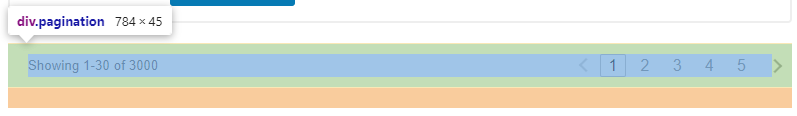


---
# Navigating Search Pages

As a result, stringing together two element selection steps will get us what we want:

```{r}
# checking to see if "div.pagination" is unique
ny_rest %>% html_elements("div.pagination") %>% length() 
# and the unorder list within that container:
ny_rest %>% html_elements("div.pagination") %>% html_elements("ul") %>% length()

# now retrieve the page list
pages <- ny_rest %>% 
  html_elements("div.pagination") %>%
  html_elements("ul")
```


---
# Navigating Search Pages

We can then use the .hi-medgrn[nth child selector] to figure out which of the buttons has the links we want:

```{r}
pages %>% html_element(":nth-child(1)")
```
First child (`:nth-child(1)`) is the "back" arrow 
  * Link currently disabled since we're on the first page

---
# Navigating Search Pages

We can then use the .hi-medgrn[nth child selector] to figure out which of the buttons has the links we want:

```{r}
pages %>% html_element(":nth-child(2)")
```
Second child (`:nth-child(2)`) is the first page (1)
  * Link currently disabled since we're already on that page


---
# Navigating Search Pages

We can then use the .hi-medgrn[nth child selector] to figure out which of the buttons has the links we want:

```{r}
pages %>% html_element(":nth-child(3)")
```
Third child (`:nth-child(3)`) is the next page (2)
  * Link active!


---
# Navigating Search Pages

Retrieving the attributes for the second search page link:

```{r}
pages %>% 
  html_element(":nth-child(3)") %>%
  html_element("a") %>%
  html_attrs()
```
---
# Navigating Search Pages

And scraping the second page url:

```{r}
page2_url <- pages %>% 
  html_element(":nth-child(3)") %>%
  html_element("a") %>%
  html_attr("href")

page2 <- read_html(paste0("https://www.yellowpages.com", page2_url))

```


---
# Navigating Search Pages

Checking to make sure we made it to page 2:
.pull-left[
```{r}
page2 %>%
  # grab first business name
  html_element("a.business-name") %>%
  html_text()
```
]
.pull-right[
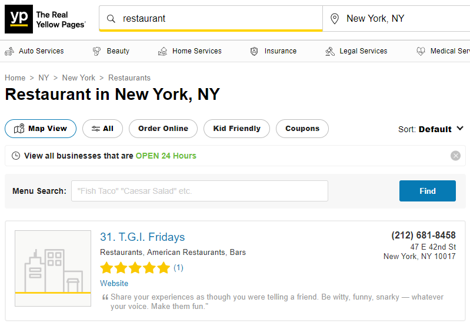
]

---
# Navigation by URL Patterns

Sometimes we can .hi-medgrn[identify shortcuts] to our scraping process - in this case, that's with a .hi-blue[url pattern].


--

Let's look closer at the search response url and the page 2 url:

```{r}
resp$url
page2_url
```
---
# Navigation by URL Patterns

First let's decompose the search url (leaving out the yellowpages.com part):

`/search?search_terms=`.hi-medgrn[`Running%20Store`]`&geo_location_terms=`.hi-medgrn[`Grand%20Rapids%2C%20MI`]

--

This reveals a pattern: if we know the search term and geography we want to search, we can .hi-blue[bypass the search form entirely.]
  * `%20` the ASCII symbol for space
  * `%2C` the ASCII symbol for comma
  
For example, Indian restaurants in Ann Arbor:

`search?search_terms=`.hi-pink[`Indian%20Restaurant`]`&geo_location_terms=`.hi-pink[`Ann%20Arbor%2C%20MI`]
---
# Navigation by URL Patterns

A similar pattern exists in the search page url:

`"/search?search_terms=`.hi-medgrn[`restaurant`]`&geo_location_terms=`.hi-medgrn[`New%20York%2C%20NY&page=2`]

This means that we can go directly to a given page of search results without ever manually searching!

Often once we start interacting with a website we'll find shortcuts like these that will greatly speed up an automated scraping routine.


---
# Scraping Dynamic Sites

Note that .hi-slate[rvest] has an experimental set of features built around `read_html_live()` and the `LiveHTML` object that does the same thing
  * Requires Google Chrome is installed on your machine
  * Uses the `chromote` package to run a live browser in the background
  
---

# Table of Contents

1. [Prologue](#prologue)

2. [Scraping Static Websites](#static)

3. [Interacting with Static Websites](#interact)


```{r gen_pdf, include = FALSE, cache = FALSE, eval = FALSE}
infile = list.files(pattern = 'Static.html')
pagedown::chrome_print(input = infile, timeout = 200)
```