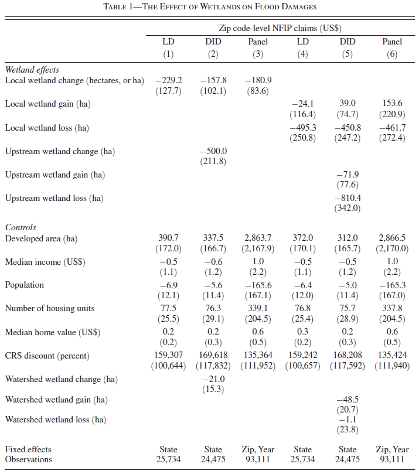
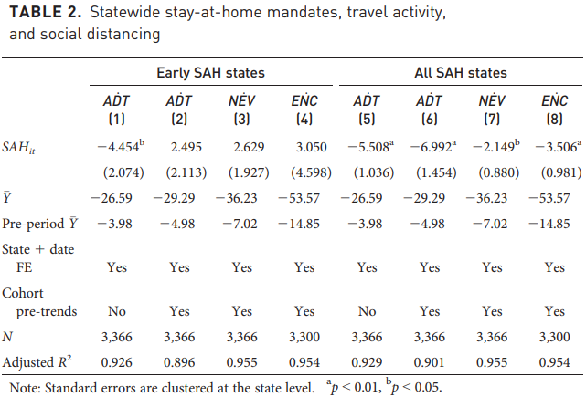

```{css, echo=FALSE}
# CSS for including pauses in printed PDF output (see bottom of lecture)
@media print {
  .has-continuation {
    display: block !important;
  }
}
.remark-code-line {
  font-size: 95%;
}
.small {
  font-size: 75%;
}
.scroll-output-full {
  height: 90%;
  overflow-y: scroll;
}
.scroll-output-75 {
  height: 75%;
  overflow-y: scroll;
}
```

```{r setup, include=FALSE}
options(htmltools.dir.version = FALSE)
library(knitr)
library(fontawesome)
knitr::opts_chunk$set(
	fig.align = "center",
	cache = FALSE,
	dpi = 300,
  warning = F,
  message = F,
	fig.height = 5,
	out.width = "80%"
)
```

# Table of Contents


6. [Regression Output](#out)
  
7. [IV Regression](#iv)

8. [Difference-in-Differences](#did)

9. [Event Study and Dynamic Treatment Effects](#event)

  
---
class: inverse, middle
name: prologue

# Prologue


---
# Empirical Analysis

We've spent the first half of our course building a .hi-medgrn[foundational knowledge] of data manipulation in R. 


While cleaning, wrangling, and visualizing data can be fun, it's generally not the end goal - that's usually some form of .hi-blue[statistical/econometric analysis].

--

Over the next weeks we're going to focus on the analysis side, using both .hi-purple[traditional] and .hi-pink[non-traditional] methods.

---
# Empirical Analysis

.pull-left[
.center.hi-purple[This Lecture: Regression]
  * Standard regression: `lm()`
  * Fixed effects regression: .hi-slate[fixest] and `feols`
  * Formulas
  * Choice of standard errors
  * Regression Tables
  * Visualizing regression output 
  * IV Regression
  * Diff-in-Diff
    * Staggered Adoption
  * Event Study and Sun-Abraham estimator
]

.pull-right[
.center.hi-pink[Next Lecture: Synthetic Control Methods]
  * Canonical Synthetic Control
  * Synthetic Diff-in-Diff
    * Uniform Adoption
    * Staggered Adoption
  * Partially Pooled Synthetic Control
]


---
# Prologue

Packages we'll use today:

```{r, eval = F}
remotes::install_github("lrberge/fixest")
```

```{r}
if (!require("pacman")) install.packages("pacman")
pacman::p_load(broom, fixest, stargazer, tidyverse)

options(scipen=999) # disable scientific notation
```


---
# Prologue

As well, let's load data necessary to replicate results from [Taylor and Druckenmiller AER (2022)](https://www.aeaweb.org/articles?id=10.1257/aer.20210497)<sup>1</sup>

```{r}
wl_df <- read_csv("data/zip_PANEL_data.csv") %>%
  drop_na(county_fips, state_fips, claims)

wl_ld_df <- read_csv("data/zip_LD_data.csv")

coastal <- read_csv("data/coastal_zips.csv")

did_df <- left_join(wl_ld_df, coastal, by = "zip") %>%
  filter(coastal == FALSE)

rm(wl_ld_df, coastal)
```

.footnote[<sup>1.</sup> There is a *lot* of great stuff in this paper and it's all super replicable and well-documented. I highly recommend checking it out if you're curious (only caution is that there are some *big* files in there).]


---
class: inverse, middle
name: out

# Regression Output

---  

# Regression Output

Running regression is fun and all, but generally we don't just want it internal to R. Rather, we want some nicely formatted .hi-medgrn[regression output] 
  
  * Regression Tables
  * Regression Plots

---

# Regression Output

To see convenient ways to get regression output, let's run a model looking at the relationship between NFIP claims and 

  1. Same zipcode wetlands
  1. Wetlands upstream of the zipcode (that could help prevent flood damage)
  1. Wetlands upstream or downstream of the zipcode 

We'll add in state fixed effects and control for population, housing value, and income:

.hi-blue[Q:] Using `feols()`, how can we write this?


---  

# Regression Output

  1. Developed area (hectares)
  1. Indicators for developed area in each of the following bins:
    * [Min, 1st Quartile), [1st Quartile, Median), [Median, 3rd Quartile), [3rd Quartile, Max]
  1. We'll add in state fixed effects and control for population, housing value, and income:
  1. Robust SE


---

# Regression Output

We *could* write a bunch of code using .hi-purple[conditional logic:]

```{r}
wl_df <- mutate(wl_df,
                dev_area_1 = ifelse(developed_ha < quantile(developed_ha, 0.25), 1,0),
                dev_area_2 = ifelse(developed_ha >= quantile(developed_ha, 0.25) & developed_ha < quantile(developed_ha, 0.5), 1,0),
                dev_area_3 = ifelse(developed_ha >= quantile(developed_ha, 0.5) & developed_ha < quantile(developed_ha, 0.75), 1,0),
                dev_area_4 = ifelse(developed_ha >= quantile(developed_ha, 0.75), 1,0)
                )

select(wl_df, developed_ha, starts_with("dev_")) %>% summarise(across(where(is.numeric), c(min, max)))
```

---

# Bins

Alternatively, we could use the `percent_rank()` function in .hi-slate[tidyverse]:
```{r}
wl_df <- mutate(wl_df,
                dev_area_1b = ifelse(percent_rank(developed_ha) < 0.25, 1,0),
                dev_area_2b = ifelse(percent_rank(developed_ha) >= 0.25 & percent_rank(developed_ha) < 0.5, 1,0)
)

identical(wl_df$dev_area_1, wl_df$dev_area_1b)
identical(wl_df$dev_area_2, wl_df$dev_area_2b)

```

---

# Regression Output

1. Wetland area (hectares)
1. Indicators for developed area in each of the following bins:
  * [Min, 1st Quartile), [1st Quartile, Median), [Median, 3rd Quartile), [3rd Quartile, Max]
1. We'll add in state fixed effects and control for population, housing value, and income:
1. Robust SE

Let's specify our regression:

```{r}
out_reg <- feols(claims ~ wetland_ha + dev_area_1 + dev_area_2 + dev_area_3 + dev_area_4 +
                   population + housing_value + income | state_fips, data = wl_df, vcov = "hetero")
```


---

# Regression Output

Looking at our regression output:

```{r}
summary(out_reg)
```

---
# Bins

Even more alternatively, we could use the `bins()` function to first add a bin membership factor variable:
```{r}
bins <- bin(wl_df$developed_ha, "cut::p25[p50[p75[p100]")
wl_df <- mutate(wl_df, dev_bins = bins)
head(wl_df$dev_bins)

quantile(wl_df$developed_ha, 0.25)
```

---
# Bins

And then use the `i()` helper function in `feols()` to treat the variable as a factor:
.font80[
```{r}
out_reg <- feols(claims ~ wetland_ha + 
                   i(dev_bins, ref = "[793.156; 7339.131]") +
                   population + housing_value + income | state_fips, data = wl_df, vcov = "hetero")
coeftable(out_reg)
```
]

---
# Bins

We can manually change the reference category by adding the `ref` argument and the variable value to omit: 
  
```{r}
feols(claims ~ wetland_ha + i(dev_bins, ref = "[793.156; 7339.131]") +
                   population + housing_value + income | state_fips, data = wl_df, vcov = "hetero") %>%
  summary()
```

---
# Regression Table

To format our data as a regression table we have two choices

  1. Use .hi-slate[stargazer] on the summary dataframe (or `lm` object)
    * Works well for summary statistics tables too
  1. Use `etable()` to create a well-formatted regression table
    * Works on one or multiple `fixest` objects
    
---
# Stargazer

The `stargazer` package has great functionality for obtaining tables in HTML, LaTeX, or plain text format
  * Also the preferred method for regression tables with `lm()` or `felm()` objects
  * Doesn't play nice with `fixest` objects

--

For example, let's say you want to produce a .hi-medgrn[summary statistics table] for our included variables:

```{r}
sumstats <- select(wl_df, claims, wetland_ha, starts_with("dev_area_")) %>%
  stargazer(type ="text")
```


---
# Stargazer


This empty table reveals one restriction of `stargazer`: it requires the input be formatted as a .hi-medgrn[data frame].

    
```{r}
sumstats <- select(wl_df, claims, wetland_ha, starts_with("dev_area_")) %>%
  as.data.frame() %>%
  stargazer(type = "text")
```


---
# Stargazer


We can easily get LaTeX output:
    
```{r}
sumstats <- select(wl_df, claims, wetland_ha, starts_with("dev_area_")) %>%
  as.data.frame() %>%
  stargazer(type = "latex")
```


---
# Stargazer


Or HTML:

```{r, eval = F}
sumstats <- select(wl_df, claims, wetland_ha, starts_with("dev_area_")) %>%
  as.data.frame() %>%
  stargazer(type = "html")
```
<table style="text-align:center"><tr><td colspan="6" style="border-bottom: 1px solid black"></td></tr><tr><td style="text-align:left">Statistic</td><td>N</td><td>Mean</td><td>St. Dev.</td><td>Min</td><td>Max</td></tr>
<tr><td colspan="6" style="border-bottom: 1px solid black"></td></tr><tr><td style="text-align:left">claims</td><td>131,588</td><td>109,330.100</td><td>3,155,095.000</td><td>0.000</td><td>418,203,035.000</td></tr>
<tr><td style="text-align:left">wetland_ha</td><td>131,588</td><td>1,301.656</td><td>4,533.807</td><td>0.000</td><td>261,518.300</td></tr>
<tr><td style="text-align:left">dev_area_1</td><td>131,588</td><td>0.250</td><td>0.433</td><td>0</td><td>1</td></tr>
<tr><td style="text-align:left">dev_area_2</td><td>131,588</td><td>0.250</td><td>0.433</td><td>0</td><td>1</td></tr>
<tr><td style="text-align:left">dev_area_3</td><td>131,588</td><td>0.250</td><td>0.433</td><td>0</td><td>1</td></tr>
<tr><td style="text-align:left">dev_area_4</td><td>131,588</td><td>0.250</td><td>0.433</td><td>0</td><td>1</td></tr>
<tr><td style="text-align:left">dev_area_1b</td><td>131,588</td><td>0.250</td><td>0.433</td><td>0</td><td>1</td></tr>
<tr><td style="text-align:left">dev_area_2b</td><td>131,588</td><td>0.250</td><td>0.433</td><td>0</td><td>1</td></tr>
<tr><td colspan="6" style="border-bottom: 1px solid black"></td></tr></table>

---
# Stargazer

Built-in styles also allow you to easily replicate the appearance of tables in several popular journals

```{r, eval = F}
sumstats <- select(wl_df, claims, wetland_ha, starts_with("dev_area_")) %>%
  as.data.frame() %>%
  stargazer(style = "aer", type = "html")
```

<table style="text-align:center"><tr><td colspan="6" style="border-bottom: 1px solid black"></td></tr><tr><td style="text-align:left">Statistic</td><td>N</td><td>Mean</td><td>St. Dev.</td><td>Min</td><td>Max</td></tr>
<tr><td colspan="6" style="border-bottom: 1px solid black"></td></tr><tr><td style="text-align:left">claims</td><td>131,588</td><td>109,330.100</td><td>3,155,095.000</td><td>0.000</td><td>418,203,035.000</td></tr>
<tr><td style="text-align:left">wetland_ha</td><td>131,588</td><td>1,301.656</td><td>4,533.807</td><td>0.000</td><td>261,518.300</td></tr>
<tr><td style="text-align:left">dev_area_1</td><td>131,588</td><td>0.250</td><td>0.433</td><td>0</td><td>1</td></tr>
<tr><td style="text-align:left">dev_area_2</td><td>131,588</td><td>0.250</td><td>0.433</td><td>0</td><td>1</td></tr>
<tr><td style="text-align:left">dev_area_3</td><td>131,588</td><td>0.250</td><td>0.433</td><td>0</td><td>1</td></tr>
<tr><td style="text-align:left">dev_area_4</td><td>131,588</td><td>0.250</td><td>0.433</td><td>0</td><td>1</td></tr>
<tr><td style="text-align:left">dev_area_1b</td><td>131,588</td><td>0.250</td><td>0.433</td><td>0</td><td>1</td></tr>
<tr><td style="text-align:left">dev_area_2b</td><td>131,588</td><td>0.250</td><td>0.433</td><td>0</td><td>1</td></tr>
<tr><td colspan="6" style="border-bottom: 1px solid black"></td></tr></table>

---
# Stargazer

Built-in styles also allow you to easily replicate the appearance of tables in several popular journals

```{r, eval = F}
sumstats <- select(wl_df, claims, wetland_ha, starts_with("dev_area_")) %>%
  as.data.frame() %>%
  stargazer(style = "qje", type = "html")
```

<table style="text-align:center"><tr><td colspan="6" style="border-bottom: 1px solid black"></td></tr><tr><td style="text-align:left">Statistic</td><td>N</td><td>Mean</td><td>St. Dev.</td><td>Min</td><td>Max</td></tr>
<tr><td colspan="6" style="border-bottom: 1px solid black"></td></tr><tr><td style="text-align:left">claims</td><td>131,588</td><td>109,330.100</td><td>3,155,095.000</td><td>0.000</td><td>418,203,035.000</td></tr>
<tr><td style="text-align:left">wetland_ha</td><td>131,588</td><td>1,301.656</td><td>4,533.807</td><td>0.000</td><td>261,518.300</td></tr>
<tr><td style="text-align:left">dev_area_1</td><td>131,588</td><td>0.250</td><td>0.433</td><td>0</td><td>1</td></tr>
<tr><td style="text-align:left">dev_area_2</td><td>131,588</td><td>0.250</td><td>0.433</td><td>0</td><td>1</td></tr>
<tr><td style="text-align:left">dev_area_3</td><td>131,588</td><td>0.250</td><td>0.433</td><td>0</td><td>1</td></tr>
<tr><td style="text-align:left">dev_area_4</td><td>131,588</td><td>0.250</td><td>0.433</td><td>0</td><td>1</td></tr>
<tr><td style="text-align:left">dev_area_1b</td><td>131,588</td><td>0.250</td><td>0.433</td><td>0</td><td>1</td></tr>
<tr><td style="text-align:left">dev_area_2b</td><td>131,588</td><td>0.250</td><td>0.433</td><td>0</td><td>1</td></tr>
<tr><td colspan="6" style="border-bottom: 1px solid black"></td></tr></table>
---
# Stargazer

We can also use stargazer to build regression tables directly with `lm` output:

```{r, eval = F}
lm1 <- lm(claims ~ wetland_ha, data = wl_df)
lm2 <- lm(claims ~ wetland_ha + population, data = wl_df)
lm3 <- lm(claims ~ wetland_ha + population + housing_value, data = wl_df)

stargazer(lm1, lm2, lm3, style = "aer", type = "html")
```

<table style="text-align:center"><tr><td colspan="4" style="border-bottom: 1px solid black"></td></tr><tr><td style="text-align:left"></td><td colspan="3">claims</td></tr>
<tr><td style="text-align:left"></td><td>(1)</td><td>(2)</td><td>(3)</td></tr>
<tr><td colspan="4" style="border-bottom: 1px solid black"></td></tr><tr><td style="text-align:left">wetland_ha</td><td>5.948<sup>***</sup></td><td>6.758<sup>***</sup></td><td>7.492<sup>***</sup></td></tr>
<tr><td style="text-align:left"></td><td>(1.918)</td><td>(1.932)</td><td>(2.035)</td></tr>
<tr><td style="text-align:left"></td><td></td><td></td><td></td></tr>
<tr><td style="text-align:left">population</td><td></td><td>10.203<sup>***</sup></td><td>9.821<sup>***</sup></td></tr>
<tr><td style="text-align:left"></td><td></td><td>(0.633)</td><td>(0.676)</td></tr>
<tr><td style="text-align:left"></td><td></td><td></td><td></td></tr>
<tr><td style="text-align:left">housing_value</td><td></td><td></td><td>0.136<sup>**</sup></td></tr>
<tr><td style="text-align:left"></td><td></td><td></td><td>(0.065)</td></tr>
<tr><td style="text-align:left"></td><td></td><td></td><td></td></tr>
<tr><td style="text-align:left">Constant</td><td>101,588.300<sup>***</sup></td><td>4,782.748</td><td>-14,013.890</td></tr>
<tr><td style="text-align:left"></td><td>(9,048.768)</td><td>(10,996.950)</td><td>(14,584.390)</td></tr>
<tr><td style="text-align:left"></td><td></td><td></td><td></td></tr>
<tr><td style="text-align:left">Observations</td><td>131,588</td><td>129,966</td><td>125,059</td></tr>
<tr><td style="text-align:left">R<sup>2</sup></td><td>0.000</td><td>0.002</td><td>0.002</td></tr>
<tr><td style="text-align:left">Adjusted R<sup>2</sup></td><td>0.000</td><td>0.002</td><td>0.002</td></tr>
<tr><td style="text-align:left">Residual Std. Error</td><td>3,154,992.000 (df = 131586)</td><td>3,171,444.000 (df = 129963)</td><td>3,232,906.000 (df = 125055)</td></tr>
<tr><td style="text-align:left">F Statistic</td><td>9.612<sup>***</sup> (df = 1; 131586)</td><td>134.441<sup>***</sup> (df = 2; 129963)</td><td>86.243<sup>***</sup> (df = 3; 125055)</td></tr>
<tr><td colspan="4" style="border-bottom: 1px solid black"></td></tr><tr><td style="text-align:left"><em>Notes:</em></td><td colspan="3" style="text-align:left"><sup>***</sup>Significant at the 1 percent level.</td></tr>
<tr><td style="text-align:left"></td><td colspan="3" style="text-align:left"><sup>**</sup>Significant at the 5 percent level.</td></tr>
<tr><td style="text-align:left"></td><td colspan="3" style="text-align:left"><sup>*</sup>Significant at the 10 percent level.</td></tr>
</table>

---
# Stargazer

`stargazer` has a full suite of options for adding titles, notes, changing variable names, column labeling, etc.
```{r, eval = F}
stargazer(lm1, lm2, lm3, style = "aer", type = "html",
          title = "NFIP Claims and Wetland Area", # chart title
          dep.var.labels = c("NFIP Claims Amount"), # label dep. variable
          covariate.labels = c("Wetland Area (Ha)", "Population", "Housing Value"), # label variables
          ci = c(T,T,T), # replace std errors with conf. intervals
          digits = 4, # include 4 digits
          initial.zero = T, # add intitial zero for values 0-1
          label = "table_ols", # latex label
          note = c("This Table reports regression results of NFIP claims amounts on wetland acreage in a given zipcode, controlling for various factors."), # custom note
          out = "output/stargazer_table.html" # path to save out the table
          )
```
---
# Stargazer

<table style="text-align:center"><caption><strong>NFIP Claims and Wetland Area</strong></caption>
<tr><td colspan="4" style="border-bottom: 1px solid black"></td></tr><tr><td style="text-align:left"></td><td colspan="3">NFIP Claims Amount</td></tr>
<tr><td style="text-align:left"></td><td>(1)</td><td>(2)</td><td>(3)</td></tr>
<tr><td colspan="4" style="border-bottom: 1px solid black"></td></tr><tr><td style="text-align:left">Wetland Area (Ha)</td><td>5.9476<sup>***</sup></td><td>6.7584<sup>***</sup></td><td>7.4920<sup>***</sup></td></tr>
<tr><td style="text-align:left"></td><td>(2.1877, 9.7075)</td><td>(2.9726, 10.5442)</td><td>(3.5032, 11.4808)</td></tr>
<tr><td style="text-align:left"></td><td></td><td></td><td></td></tr>
<tr><td style="text-align:left">Population</td><td></td><td>10.2027<sup>***</sup></td><td>9.8212<sup>***</sup></td></tr>
<tr><td style="text-align:left"></td><td></td><td>(8.9614, 11.4439)</td><td>(8.4968, 11.1455)</td></tr>
<tr><td style="text-align:left"></td><td></td><td></td><td></td></tr>
<tr><td style="text-align:left">Housing Value</td><td></td><td></td><td>0.1361<sup>**</sup></td></tr>
<tr><td style="text-align:left"></td><td></td><td></td><td>(0.0087, 0.2636)</td></tr>
<tr><td style="text-align:left"></td><td></td><td></td><td></td></tr>
<tr><td style="text-align:left">Constant</td><td>101,588.3000<sup>***</sup></td><td>4,782.7480</td><td>-14,013.8800</td></tr>
<tr><td style="text-align:left"></td><td>(83,853.0500, 119,323.6000)</td><td>(-16,770.8700, 26,336.3700)</td><td>(-42,598.7600, 14,570.9900)</td></tr>
<tr><td style="text-align:left"></td><td></td><td></td><td></td></tr>
<tr><td style="text-align:left">Observations</td><td>131,588</td><td>129,966</td><td>125,059</td></tr>
<tr><td style="text-align:left">R<sup>2</sup></td><td>0.0001</td><td>0.0021</td><td>0.0021</td></tr>
<tr><td style="text-align:left">Adjusted R<sup>2</sup></td><td>0.0001</td><td>0.0020</td><td>0.0020</td></tr>
<tr><td style="text-align:left">Residual Std. Error</td><td>3,154,992.0000 (df = 131586)</td><td>3,171,444.0000 (df = 129963)</td><td>3,232,906.0000 (df = 125055)</td></tr>
<tr><td style="text-align:left">F Statistic</td><td>9.6124<sup>***</sup> (df = 1; 131586)</td><td>134.4405<sup>***</sup> (df = 2; 129963)</td><td>86.2428<sup>***</sup> (df = 3; 125055)</td></tr>
<tr><td colspan="4" style="border-bottom: 1px solid black"></td></tr><tr><td style="text-align:left"><em>Notes:</em></td><td colspan="3" style="text-align:left"><sup>***</sup>Significant at the 1 percent level.</td></tr>
<tr><td style="text-align:left"></td><td colspan="3" style="text-align:left"><sup>**</sup>Significant at the 5 percent level.</td></tr>
<tr><td style="text-align:left"></td><td colspan="3" style="text-align:left"><sup>*</sup>Significant at the 10 percent level.</td></tr>
</table>

<table style="text-align:center"><caption><strong>NFIP Claims and Wetland Area</strong></caption>
<tr><td colspan="1" style="border-bottom: 1px solid black"></td></tr><tr><td>This Table reports regression results of NFIP claims amounts on wetland acreage in a given zipcode, controlling for various factors.</td></tr>
<tr><td colspan="1" style="border-bottom: 1px solid black"></td></tr></table>

---
# etable

While we can't use stargazer with `fixest` objects, the package provides the equivalent `etable()` function that allows for fully professional regression tables.

Suppose we wanted to show the value of our wetland coefficient across several different fixed effects specifications:

```{r}
reg_state <- feols(claims ~ wetland_ha + i(dev_bins, ref = "[793.156; 7339.131]") +
                   population + housing_value + income | state_fips, data = wl_df, vcov = "hetero") 
reg_cty <- feols(claims ~ wetland_ha + i(dev_bins, ref = "[793.156; 7339.131]") +
                   population + housing_value + income | county_fips, data = wl_df, vcov = "hetero") 
reg_styr <- feols(claims ~ wetland_ha + i(dev_bins, ref = "[793.156; 7339.131]") +
                   population + housing_value + income | state_fips + year, data = wl_df, vcov = "hetero") 
reg_ctyr <- feols(claims ~ wetland_ha + i(dev_bins, ref = "[793.156; 7339.131]") +
                   population + housing_value + income | county_fips + year, data = wl_df, vcov = "hetero") 
```


---
# etable

Putting together the regression table:

```{r}
etable(reg_state, reg_cty, reg_styr, reg_ctyr,
       title = "Fixed Effects Progression",
       fixef_sizes = T, 
       digits = 4, # digits for coefficients and std. errors
       digits.stats = 4, # digits for fit stats
       tex = F # whether output is LaTex (T) or a df (F)
       )
```


---
# etable

Another convenient feature of `etable`: we can .hi-medgrn[change standard error estimators] on the fly!

```{r}
etable(reg_state, reg_cty, reg_styr, reg_ctyr,
       title = "Fixed Effects Progression",
       fixef_sizes = T, 
       digits = 4, # digits for coefficients and std. errors
       digits.stats = 4, # digits for fit stats
       tex = F, # whether output is LaTex (T) or a df (F)
       se = "standard"
       )
```


---
# etable

.hi-blue[More efficient:] take advantage of .hi-blue[stepwise functions] for multiple estimation:

```{r}
regs_fe <- feols(claims ~ wetland_ha + i(dev_bins, ref = "[793.156; 7339.131]") +
                   population + housing_value + income | 
                  sw0(state_fips, county_fips, state_fips + year, county_fips + year), 
                  data = wl_df, vcov = "hetero") 
etable(regs_fe)
```
---
# etable

The `dict` argument also makes it straightforward to replace variable names:

```{r}
etable(regs_fe,
       dict = c(wetland_ha = "Wetland Area (Ha)",
                dev_bins = "Developed Area",
                state_fips = "State",
                county_fips = "County",
                year = "Year"))
```

---
# etable

You can also set up a default dictionary with `setFixest_dict()` that can be used in all following tables.

```{r}
# set dictionary for use across the entire script
setFixest_dict(c(wetland_ha = "Wetland Area (Ha)",
                dev_bins = "Developed Area",
                state_fips = "State",
                county_fips = "County",
                year = "Year"))

# Variables are automatically re-labeled
etable(regs_fe)
```

---
# etable

This is only a [fraction of the settings](https://lrberge.github.io/fixest/reference/etable.html) available. Don't worry, we'll get more practice with them in the remainder of the lecture (and in the next problem set)!


---
class: inverse, middle
name: iv

# IV Regression

---

# IV Regression

`fixest` also makes it easy to estimate IV regressions. 

All we need is to add our IV formula after a second `|`

.center[
`feols(y ~ x_1 +... + X_n | fe_1 + ... + fe_n`
`| x_endo1 + x_endo2 ~ x_inst1 + x_inst2, data = df)`
]

  * `x_endo`: the endogenous regressor(s)
  * `x_inst`: the instrument(s)
  

---

# IV Regression


Let's suppose that  wetland area in 2016 was endogenous due to recent policies, but that the area in 2001 was a valid instruments<sup>2</sup>. Using the `did_df` data:

```{r}
iv_1 <- feols(claims_2016_3yr ~ developed_ha_2016 + population_2016 +  
              income_2016 + housing_value_2016 |
              state_fips | wetland_ha_2016 ~ wetland_ha_2001, 
              data = did_df)
```


.footnote[<sup>2</sup> This is purely a toy example - there isn't an endogeneity issue in the paper.]

---

# IV Regression

By default, `summary()` now reports the .hi-blue[second stage results].
```{r}
summary(iv_1)
```
---

# IV Regression

We can get .hi-medgrn[first-stage results] with the  `stage = 1` argument: 
```{r}
summary(iv_1, stage = 1)
```
---

# IV Regression

Or both at the same time with `stage = 2:1` or `1:2`

```{r}
summary(iv_1, stage = 1:2)
```

---
# IV Regression

And the output table (adding a few IV fit statistics):
.font70[
```{r}
etable(iv_1, stage = 1:2, fitstat = ~ . + ivfall + ivwaldall)
```
]

---
class: inverse, middle
name: did

# Difference-in-Differences

---

# Difference-in-Differences

Let's now replicate some actual results from the paper: the .hi-medgrn[upstream/downstream diff-in-diff].

--

$$\Delta F_{is} = \beta \Delta W_{is} + \gamma \Delta W_{is}^{UP} + \lambda \Delta W_{is}^{ALL} + \theta \Delta X_{is} + \alpha_s + \epsilon_{is}$$
  * $\Delta F_{is}$: the change in flood insurance claims from 2001 to 2016
  * $\Delta W_{is}$: the change in .hi-slate[within-zipcode] wetland area from 2001 to 2016
  * $\Delta W_{is}^{UP}$: the change in .hi-slate[upstream] wetland area from 2001 to 2016
  * $\Delta W_{is}^{ALL}$: the change in .hi-slate[upstream and downstream] wetland area from 2001 to 2016
  * $\Delta X_{is}$: the change in time-varying covariates from 2001 to 2016
  * $\alpha_s$ state fixed effects

---

# Difference-in-Differences


$$\Delta F_{is} = \beta \Delta W_{is} + \gamma \Delta W_{is}^{UP} + \lambda \Delta W_{is}^{ALL} + \theta \Delta X_{is} + \alpha_s + \epsilon_{is}$$

Diff-in-diff style coefficients<sup>2</sup> of interest are 
  * $\beta$: the effect of "local" wetlands (within the same zipcode)
  * $\gamma:$ the differential effect of upstream wetlands
    * i.e. the "direct protective services" of the wetland

---

# Difference-in-Differences


$$\Delta F_{is} = \beta \Delta W_{is} + \gamma \Delta W_{is}^{UP} + \lambda \Delta W_{is}^{ALL} + \theta \Delta X_{is} + \alpha_s + \epsilon_{is}$$

```{r}
did_reg <- feols(claims_2001_2016 ~ wetland_2001_2016 + 
                      wetlands_change_up + wetlands_change_all + 
                      developed_2001_2016 + 
                      income_2001_2016 + 
                      population_2001_2016 + 
                      housing_units_2001_2016 + 
                      housing_value_2001_2016 + 
                      CRS_2001_2016 
                    |state_fips, cluster = ~county_fips, data = did_df)
```

---

# Difference-in-Differences


$$\Delta F_{is} = \beta \Delta W_{is} + \gamma \Delta W_{is}^{UP} + \lambda \Delta W_{is}^{ALL} + \theta \Delta X_{is} + \alpha_s + \epsilon_{is}$$

```{r}
coeftable(did_reg)
```

---

# Difference-in-Differences

Comparing to the published paper results (Column 2):
.center[

]

---

# Difference-in-Differences

Historically, we've thought mostly about whether .hi-medgrn[parallel trends] are likely to hold for validity of our difference-in-differences estimator.

.hi-medgrn[Logic:] 
  * Control and treated groups are trending similarly prior to treated group receiving treatment
  * Ensures validity of control group's post-treatment trend as counterfactual for treatment group absent the treatment
  
--

Most often (and especially with staggered adoption timing), we estimate these models in the canonical two-way fixed effects specification (TWFE)

$$Y_{it} = \beta T_{it} + \delta_t + \alpha_i + \epsilon_{it}$$
---

# Difference-in-Differences

However, recent literature has shown that even if parallel trends hold, our estimates might still be biased

  * Due to unintended weighting of all possible 2x2 comparisons ([Goodman-Bacon (2021)](https://www.sciencedirect.com/science/article/pii/S0304407621001445))
  * Resulting weights may even be negative ([de Chaisemartin and D'Haultfoeuille (2020)](https://www.aeaweb.org/articles?id=10.1257/aer.20181169))
  
--

We'll get into some .hi-medgrn[alternate estimators] that overcome these limitations soon (and next lecture), but for now let's chat briefly about another situation that warrants a different empirical specification: .hi-blue[dynamic treatment effects]

---
class: inverse, middle
name: event

# Event Study and Dynamic Treatment Effects
---
---  
# Dynamic Treatment Effects

Recall the TWFE diff-in-diff model:

$$Y_{it} = \beta T_{it} + \delta_t + \alpha_i + \epsilon_{it}$$

This yields an estimate of $\beta$, the .hi-medgrn[average treatment effect for the treated (ATT)].
  
  * Average across all treated units
  * Average across all post-treatment time periods

--

However, there are plenty of settings where we might expect .hi-blue[dynamic treatment effects]: treatment effects that differ by the amount of time since receiving treatment.

---

# Event Study

This is where .hi-purple[event study]<sup>2</sup> comes in. 

.hi-pink[Idea:] instead of a single $\hat\beta$ estimate a vector of treatment effects $\hat\beta^k$
  * Each coefficient estimates a period-specific ATT for being $k$ time periods relative to receiving treatment 
    * i.e. ATT 1 day post-treatment may look quite different than 100 days post-treatment
  
--

Estimating this requires thinking about time in an alternate fashion (no, this isn't a multiverse situation)...

.footnote[<sup>2.</sup> Note that the "original" event study methods refer to techniques in finance related to the impact of various "events" on stock prices, generally for a single asset. The event studies we're talking about today refer to the approach used in applied economics for estimating dynamic treatment paths.]

---

# Time-to-Event Data

To work through this, let's use some data I'm pretty familiar with: COVID-19 stay-at-home mandate data.


```{r}
sah <- read_csv("data/sah.csv") %>% 
  drop_na(cadt) %>%
  select(state, date, weekday, cadt, visits, mandate_date)

head(sah)
```

---

# Aside: Diff-in-Diff

Here we have information on the unit (`state`), the time period (`date`), and the date of treatment (`mandate_date`).

  * States adopted mandates at different times $\Rightarrow$ .hi-blue[staggered adoption]
  
To estimate the TWFE diff-in-diff, we just need a treatment indicator

  * $= 1$ for treated units after treatment occurred
    * mandate-adopting states post-mandate adoption
  * $=0$ for treated units prior to treatment
      * mandate-adopting states prior to mandate adoption
  * $=0$ for control units
    * states that never adopted a statewide stay-at-home mandate

---

# Aside: Diff-in-Diff

To estimate the TWFE diff-in-diff, we just need a treatment indicator.

First, identify which states ever adopted a stay-at-home mandate:

```{r}
sah_did <-   group_by(sah, state) %>%
  # get state-specific max value of mandate adoption date
  dplyr::mutate(sah_max = max(mandate_date, na.rm = T))
```

This should yield a date for adopting states, and `-Inf` for non-adopters (i.e. pure controls)

```{r}
unique(sah_did$sah_max)
```

---

# Aside: Diff-in-Diff

Next, determine whether we are in the post-adoption period for our adopting states (i.e. our treatment dummy):

```{r}
# note: data are still grouped by state
sah_did <- dplyr::mutate(sah_did,
      post_treat = case_when(
        sah_max == -Inf ~ 0, # 0 for pure controls
        date >= mandate_date ~ 1, # 1 for adopting states in post-period
        TRUE ~ 0 # 0 for adopting states pre-treatment
      )
      ) %>%
  ungroup()

summary(sah_did$post_treat)
```
---

# Aside: Diff-in-Diff

Estimating the TWFE diff-in-diff for the impact of stay-at-home on average distance traveled:

```{r}
did_1 <- feols(cadt ~ post_treat | state + date, data = sah_did, cluster = ~ state)
summary(did_1)
```
---

# Aside: Diff-in-Diff

Comparing to results from [Sears et al. (2023)](https://doi.org/10.1086/721705) (Column 5):

.center[

]

---

# Diff-in-Diff: Weighting Issues

If we decompose the overall ATT into each 2x2 estimator, we can see can get more information as to which comparisons are driving our treatment effects:

```{r}
pacman::p_load(bacondecomp)

# first, get outcome residualized of fixed effects
sah_did <- sah_did %>%
  dplyr::mutate(cadt_r = feols(cadt ~ 0 | state + date, data = sah_did)$residuals,
                date_num = as.numeric(date))


# run decomp of residualized outcome on treatment
decomp <- bacon(cadt_r ~ post_treat,
                     data = sah_did,
                     id_var = "state",
                     time_var = "date_num",
                quietly = T) %>%
      mutate(full_att = sum(estimate*weight)) 
```

---

# Aside: Bacon Decomposition

Looking at the different weights:
.font90[
```{r}
decomp_tab <- decomp %>%
    dplyr::select(type, weight, estimate, full_att) %>%
      dplyr::mutate(att = weight*estimate) %>%
      group_by(type)  %>%
      mutate(group_weight = sum(weight)) %>%
      mutate(group_att = sum(att)/group_weight) %>%
      summarise(weight = sum(weight), 
                estimate = mean(estimate), 
                att = mean(group_att), 
                count = n(),
                overall_att = mean(full_att))
decomp_tab
```   
]

---

# Aside: Bacon Decomposition

Which shows us that the overall ATT estimated from the difference-in-differences is equal to 

$$ .23 \hat\beta^{Early~vs.~Late} + 0.22 \hat\beta^{Late~vs.~Early} + 0.56 \hat\beta^{Treated~vs.~Untreated}$$

```{r}
# Recover overall ATT as weighted combination of 2x2 comparisons:

sum(decomp_tab$weight*decomp_tab$att)
```

Comparing to the diff-in-diff ATT:

```{r}
coeftable(did_1)
```
---
# Aside: Bacon Decomposition

We can also plot the individual 2x2 estimates to see how much heterogeneity there is:

```{r, eval = F}
ggplot(decomp) +
      aes(shape = factor(type)) +
      geom_point( aes(x = weight, y = estimate), alpha = 0.4) +
      geom_hline(yintercept = 0) +
      labs(x = "Weight", y = "Estimate", shape = "Type") +
      theme_minimal() + 
      theme(legend.position = "none") +
      facet_grid(rows = vars(type), space = "fixed", scales = "fixed")
```

---
# Aside: Bacon Decomposition

We can also plot the individual 2x2 estimates to see how much heterogeneity there is:

```{r, echo = F}
ggplot(decomp) +
      aes(shape = factor(type)) +
      geom_point( aes(x = weight, y = estimate), alpha = 0.4) +
      geom_hline(yintercept = 0) +
      labs(x = "Weight", y = "Estimate", shape = "Type") +
      theme_minimal() + 
      theme(legend.position = "none") +
      facet_grid(rows = vars(type), space = "fixed", scales = "fixed")
```    

---
# Aside: Bacon Decomposition

The decomposition reveals several things.

  1. The most weight is given to the Treated vs. Pure Control comparison, which has the largest magnitude ATT
  1. All Treated vs. Control estimates are negative
  1. Lots of heterogeneity in Early vs. Late or Late vs. Early comparisons
    - Some are even positive!


---

# Event Study

One thing that might be affecting these early/late comparisons is .hi-medgrn[dynamic treatment effects]

  * We have more post-treatment observations for early adopters, fewer for late adopters
  * If treatment response is dynamic, we miss that by averaging over the full post-treatment period
  
--

Estimating an event study will allow us to re-center our coefficients on .hi-blue[event time] and directly observe these dynamics.

---

# Event Study

The first step is to code up an .hi-blue[event time] variable
  
  * $=-7$ on the date 7 days prior to adoption (specific to each county)
  * $=-1$ on the day prior to adoption
  * $=0$ on the date of mandate adoption
  * $=1$ on the first day after adoption
  * $=14$ on the date two weeks after adoption
  * etc.
  

---

# Event Time Variable

The first step is to code up an .hi-blue[event time] variable

```{r}
sah_es <- group_by(sah_did, state) %>%
  mutate(event_time = case_when(
    # for treated states, set event_time by comparing date to mandate_date (numerically)
    !is.na(mandate_date) ~ as.numeric(date) - as.numeric(mandate_date),
    # for controls, set event time = Inf for control units
    TRUE ~ Inf
  ))
```


---

# Event Time Variable

Checking an adopting state:

.font80[
```{r}
filter(sah_es, state == "CA", event_time %in% -7:7) %>%
  select(state, date, mandate_date, event_time)
```
]

---


# Event Time Variable

And a control state:

.font80[
```{r}
filter(sah_es, state == "AR") %>%
  select(state, date, mandate_date, event_time)
```
]

---

# Event Time

Perfect! We can now see the re-centering by looking at the distribution of treatment status relative to the .hi-medgrn[date]:

```{r}
date_freq <- sah_es %>%
  group_by(date) %>%
  summarise(count = sum(post_treat ==1)) %>%
  ggplot() +
    geom_col(aes(y = count, x = date), fill = "dodgerblue", alpha = 0.65) +
  geom_vline(aes(xintercept = ymd("2020-03-19")), linetype = "dashed") +
  theme_minimal()
```
---

# Event Time

And the distribution of treatment status relative to .hi-blue[event-time]:

```{r}
eventtime_freq <- sah_es %>%
  group_by(event_time) %>%
  summarise(count = sum(post_treat ==1)) %>%
  filter(event_time < Inf) %>%
  ggplot() +
  geom_col(aes(y = count, x = event_time), fill = "forestgreen", alpha = 0.65) +
  geom_vline(aes(xintercept = 0), linetype = "dashed") +
  theme_minimal()
```
---

# Date-time vs. Event Time

And comparing the two shows the difference under staggered adoption

.pull-left[
```{r, echo = F, out.width="175%"}
date_freq
```
]
.pull-right[
```{r, echo = F, out.width="175%"}
eventtime_freq
```
]

  * By date: frequency of treated states increases over time as more states adopt stay-at-home mandates
  * By event-time: flip from no treated to fully treated at event time 0
    * Frequencies fall off for later event times as we don't have as many post-treatment event times for late adopters

---


# Binning Endpoints

Before we calculate our dynamic treatment vector, we might want to .hi-medgrn[bin the endpoints]
  
  * Set every event-time $\leq -24$ to $24$
  * Set every event-time $\geq -21$ to $21$
  
This accomplishes two goals:
  
  1. Helps with weak identification issues
    * i.e. only CA has event times 39-41
  1. Ensures dynamic treatment effects are identified separate from time trends even if we omit pure control units
    * [Schmidheiny and Siegloch (2019)](https://onlinelibrary.wiley.com/doi/10.1002/jae.2971)


---
# Binning Endpoints

.hi-medgrn[Q:] Why -24 and 21 for the endpoints?

--

.hi-blue[A:] these are the max and min event times for .hi-slate[all treated states]

```{r, echo = F, out.width = "70%"}
 sah_es %>%
  group_by(event_time) %>%
  summarise(count = n()) %>%
  filter(event_time < Inf) %>%
  ggplot() +
  geom_col(aes(y = count, x = event_time), fill = "forestgreen", alpha = 0.65) +
  geom_vline(aes(xintercept = -24), linetype = "dashed") +
    geom_vline(aes(xintercept = 21), linetype = "dashed") +
theme_minimal()

```
---
# Binning Endpoints

Coding up a binned event time variable:

```{r}
sah_es <- mutate(sah_es, 
                 event_time_bin = case_when(
                   event_time <= -24 ~ -24, # set to -24 if <= -24
                   event_time >= 21 ~ 21, # set to 21 if >= -21
                   TRUE ~ event_time # if in between, keep current value
                 ))
```

---

# Event Study


Perfect! 

Now to estimate the event study, we need a .hi-medgrn[vector of indicator variables], one for each `event_time`:

$$ \text{-14 Days Since SAH} =1  \text{ if event time } = 14,~0 \text{ otherwise}$$
$$\vdots$$

$$ \text{0 Days Since SAH} =1  \text{ if event time } = 0,~0 \text{ otherwise}$$
$$\vdots$$

$$ \text{7 Days Since SAH} =1  \text{ if event time } = 7,~0 \text{ otherwise}$$
 --
 
 <br> 
 
 We *could* code this by hand ...
 
---

# Event Study and feols

... or we could use the .hi-medgrn[interaction operator] `i()` from .hi-slate[fixest] to automatically do it for us.

Need two things:

  1. Our binned event time variable (have)
  1. A treated unit dummy (need)
  
--

```{r}
sah_es <- group_by(sah_es, state) %>%
  mutate(
    sah_state = ifelse(!is.na(mandate_date),1,0)
    ) %>%
  ungroup()
```

---

# Event Study and feols

Now estimating the event study:
  
  * Using `i()` to create the vector of event-time coefficients automatically
  * Normalizing to the first day prior to adoption (event time -1)

.font100[
```{r}
es_reg <- feols(cadt ~ i(event_time_bin, sah_state, ref = -1) | 
                  state + date, data = sah_es)
```
]

---

# Event Study and feols

Looking at the output reveals all the dynamic treatment effect estimates:
.font70[
```{r}
coeftable(es_reg)
```

---

# Event Study Plots

Unfortunately, this makes for a clunky regression table.

.hi-medgrn[Better:] plot it!

.hi-slate[fixest] makes this super convenient with the `iplot()` function:

```{r, eval = F}
iplot(es_reg,
      ylab = "Change in Average Distance Traveled (%)",
      xlab = "Days Since Stay-at-Home in Effect",
      main = "Event Study, Average Distance Traveled"
)
```


---

# iplot() Output

```{r, echo = F}
iplot(es_reg,
      ylab = "Change in Average Distance Traveled (%)",
      xlab = "Days Since Stay-at-Home in Effect",
      main = "Event Study, Average Distance Traveled"
)
```


---

# Event Study Plots

If you want the fully tidyverse functionality, we can `tidy()` up the regression output and customize the plot ourselves:

```{r}
# get separate data frames for pre and post event times
es_pre <- tidy(es_reg) %>% filter(str_detect(term, "-"))
es_post<- tidy(es_reg) %>% filter(!str_detect(term, "-"))
# make a filler row for the reference period
es_m <- data.frame(term = "event_time_bin::-1:sah_state", estimate = 0, std.error = 0, statistic = 0, p.value = 0)

# combine all into a single figure, add event time and confidence intervals   
es_fig <- rbind(es_pre, es_m, es_post)  %>%
      mutate(event_time = str_extract(term, "-?[0-9]+") %>% as.numeric(),
             ci_l = estimate - qnorm(0.975)*std.error,
             ci_u = estimate + qnorm(0.975)*std.error)
```

---

# Event Study Plots

If you want the fully tidyverse functionality, we can `tidy()` up the regression output and customize the plot ourselves:

```{r, eval = F}
ggplot(es_fig, aes(y = estimate, x = event_time)) +
  # add line and points for estimates at each event-time
  geom_line() +
  geom_point() +
  geom_hline(yintercept = 0, colour = "grey60", linetype = 2, alpha = .3) +
# add dashed line for SAH adoption date
  geom_vline(xintercept = -1, linetype = "dashed", alpha = 0.7, colour = "navy")+
# add ribbon for confidence interval
  geom_ribbon(aes(ymin = ci_l, ymax = ci_u), alpha = 0.2)+
  theme_minimal()
```
---

# Event Study Plots

If you want the fully tidyverse functionality, we can `tidy()` up the regression output and customize the plot ourselves:

```{r, echo = F}
ggplot(es_fig, aes(y = estimate, x = event_time)) +
  # add line and points for estimates at each event-time
  geom_line() +
  geom_point() +
  geom_hline(yintercept = 0, colour = "grey60", linetype = 2, alpha = .3) +
# add dashed line for SAH adoption date
  geom_vline(xintercept = -1, linetype = "dashed", alpha = 0.7, colour = "navy")+
# add ribbon for confidence interval
  geom_ribbon(aes(ymin = ci_l, ymax = ci_u), alpha = 0.2)+
  theme_minimal()
```

---

# Event Study 

The event study plot makes it easy to see a few things

  * .hi-medgrn[Parallel Trends:] If both groups were trending the same prior to treatment period, we'd expect event-time coefficients for $k<0$ to be .hi-slate[indistinguishable from zero]
  * .hi-blue[Dynamic Treatment Effects:] slight rebound in point estimates after a week, but statistically indistinguishable from one another here

--

The lack of parallel trends holding will motivate additional, forefront methods that allow us to obtain a more valid counterfactual.

---

# Table of Contents


6. [Regression Output](#out)
  
7. [IV Regression](#iv)

8. [Difference-in-Differences](#did)

9. [Event Study](#event)


```{r gen_pdf, include = FALSE, cache = FALSE, eval = FALSE}
infile = list.files(pattern = 'Regression-Pt2.html')
pagedown::chrome_print(input = infile, timeout = 200)
```