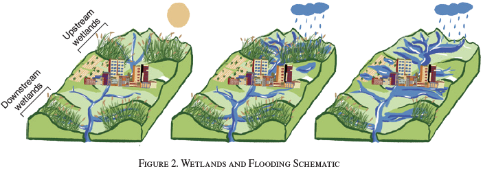

```{css, echo=FALSE}
# CSS for including pauses in printed PDF output (see bottom of lecture)
@media print {
  .has-continuation {
    display: block !important;
  }
}
.remark-code-line {
  font-size: 95%;
}
.small {
  font-size: 75%;
}
.scroll-output-full {
  height: 90%;
  overflow-y: scroll;
}
.scroll-output-75 {
  height: 75%;
  overflow-y: scroll;
}
```

```{r setup, include=FALSE}
options(htmltools.dir.version = FALSE)
library(knitr)
library(fontawesome)
knitr::opts_chunk$set(
	fig.align = "center",
	cache = FALSE,
	dpi = 300,
  warning = F,
  message = F,
	fig.height = 5,
	out.width = "80%"
)
```

# Table of Contents


1. [Prologue](#prologue)

2. [Basic Regression Analysis](#reg)

3. [Fast Fixed Effects Regression](#fix)

4. [(Programmatic) Formulas](#form)

5. [Standard Errors](#se)

  
---
class: inverse, middle
name: prologue

# Prologue


---
# Empirical Analysis

We've spent the first half of our course building a .hi-medgrn[foundational knowledge] of data manipulation in R. 


While cleaning, wrangling, and visualizing data can be fun, it's generally not the end goal - that's usually some form of .hi-blue[statistical/econometric analysis].

--

Over the next weeks we're going to focus on the analysis side, using both .hi-purple[traditional] and .hi-pink[non-traditional] methods.

---
# Empirical Analysis

.pull-left[
.center.hi-purple[This Lecture: Regression]
  * Standard regression: `lm()`
  * Fixed effects regression: .hi-slate[fixest] and `feols`
  * Formulas
  * Choice of standard errors
  * Regression Tables
  * Visualizing regression output 
  * IV Regression
  * Diff-in-Diff
    * Staggered Adoption
  * Event Study and Sun-Abraham estimator
]

.pull-right[
.center.hi-pink[Next Lecture: Synthetic Control Methods]
  * Canonical Synthetic Control
  * Synthetic Diff-in-Diff
    * Uniform Adoption
    * Staggered Adoption
  * Partially Pooled Synthetic Control
]


---
# Prologue

Packages we'll use today:

```{r, eval = F}
remotes::install_github("lrberge/fixest")
```

```{r}
if (!require("pacman")) install.packages("pacman")
pacman::p_load(broom, dslabs, fixest, tictoc, tidyverse)
```

--

as well, let's load data necessary to replicate results from [Taylor and Druckenmiller AER (2022)](https://www.aeaweb.org/articles?id=10.1257/aer.20210497)<sup>1</sup>

```{r}
wl_df <- read_csv("data/zip_PANEL_data.csv") %>%
  drop_na(county_fips, state_fips, claims)
```

.footnote[<sup>1.</sup> There is a *lot* of great stuff in this paper and it's all super replicable and well-documented. I highly recommend checking it out if you're curious (only caution is that there are some *big* files in there).]

---
# Taylor and Druckenmiller AER (2022)

"Wetlands, Flooding, and the Clean Water Act" explores the benefits of wetlands in mitigating flood damage

.center[

]

  * 2020 EPA decision narrowed wetland protections under Clean Water Act
  * Wetlands provide a range of critical ecosystem services that benefit society
  * Private benefits to landowners is relatively small


---
# Taylor and Druckenmiller AER (2022)

"Wetlands, Flooding, and the Clean Water Act" explores the benefits of wetlands in mitigating flood damage

.center[

]

This paper estimates the .hi-medgrn[value of wetlands for flood mitigation]

Let's explore this using regression. 

---
class: inverse, middle
name: reg

# Basic Regression Analysis

---
# Basic Regression Analysis


Suppose we want to estimate the following model: 

$$y_i = \beta_0 + \beta_1 x_{1i} + \beta_2 x_{2i} + \beta_3 x_{3i} + u_i$$


--

We can use base R's `lm()` command (**l**inear **m**odels) to run basic regression analysis:

```{r, eval = F}
lm(y ~ x1 + x2 + x3, data = df)
```

--

.hi-medgrn[Two arguments:]

  1. `formula`: the equation to estimate (`y ~ x1 + x2 + x3`)
  1. `data source`: the dataframe containing the variables (`df`)

---
# Basic Regression Analysis

Let's run a basic simple linear regression of national flood insurance claims  on total wetland area in zipcode $i$:

```{r}
floodreg_1 <- lm(claims ~ wetland_ha, data = wl_df)
```

This adds an `lm` object to memory containing a bunch of useful info

```{r, eval = F}
View(floodreg_1)
```

---
# Basic Regression Analysis

Use the generic `summary()` function to get fairly standard regression output:

```{r}
summary(floodreg_1)
```

---
# Basic Regression Analysis

To retrieve just the .hi-medgrn[coefficients table:]
  * Point estimates and standard errors
  * t stat and p-value (for $\beta = 0$)
  * Stored as a `matrix`
  
```{r}
reg1_coef <- summary(floodreg_1)$coefficients
reg1_coef
```

---
# Basic Regression Analysis

Often we'll want to convert the regression output to a .hi-purple[tidy dataframe].

We can do this using the `tidy()` function from the .hi-slate[broom] package:

```{r}
tidy(floodreg_1, conf.int = TRUE)
```

---
# broom

Note that .hi-slate[broom] has several other useful functions too.

For instance: `glance()` summarizes model metadata (R<sup>2</sup>, AIC, etc.) in a data frame:

```{r ols1_glance}
glance(floodreg_1)
```

---
class: inverse, middle
name: fix

# Fast Fixed Effects Regression

---
# Fast Fixed Effects Regression

Our first regression suggests that a one hectare increase in total wetland area is associated with a $2-10 increase in zipcode-level NFIP claims.

.hi-medgrn[Q:] what's the problem with this regression?

--

.hi-purple[A:] okay, there's definitely more than one. Here are several that immediately stand out:

  * Not accounting for the panel nature of the data
  * Specification of standard errors to account for potential error correlation
  * Other zipcode characteristics likely associated with NFIP claims and wetland area

---

# Fast Fixed Effects Regression

Most regressions you'll run will involve some kind of .hi-pink[fixed effects]
  * unit, time, or both (or multiple in each dimension, or interactive...)

Fortunately for us, the .hi-slate[fixest] ("fast fixed effects") package exists.

  * `feols()` makes estimating models with large number of fixed effects quick and painless
    * Like orders of magnitude faster than alternatives (`lm()`, `reghdfe` in Stata)
  * Handles simple regressions
  * Direct computation of alternate standard errors
  * Methods for Diff-in-Diff, IV, event studies, and other estimators
    * GLM, (nonlinear Max) Likelihood, Sun-Abraham, 
  * Wide range of tools to make producing tables and visuals easy
 
---

# Fast Fixed Effects Regression

First, let's replicate the simple model we ran before using `feols()`: 

```{r}
floodreg_1b <- feols(claims ~ wetland_ha, data = wl_df)
```

Conveniently, the basic syntax is exactly the same.


---

# Fast Fixed Effects Regression

We now have a `fixest` object, which contains more than twice the elements of `lm()`.

We can view the output table similarly with `summary()`:

  
```{r}
summary(floodreg_1b)
```

Which now yields a dataframe, but we can still tidy things up to get simpler variable names (and drop the statistical significance factor)

```{r}
tidy(floodreg_1b)
```

---

# Fast Fixed Effects Regression

Access the coefficients table with `coeftable()`

  
```{r}
coeftable(floodreg_1b)
```

---

# Fast Fixed Effects Regression

View the standard errors individually with `se()`

  
```{r}
se(floodreg_1b)
```
and confidence intervals with `confint()`

```{r}
confint(floodreg_1b, level = 0.95) # get 95% Conf. Int.
```
---
# Fast Fixed Effects Regression

Easily access fitted values and residuals with `$fitted.values` and `$residuals`, and the input data itself with `fixest_data()`
  
```{r, eval = F}
data.frame(
    val = fixest_data(floodreg_1b)$claims[1:10],
    val_hat = floodreg_1b$fitted.values[1:10],
    resid = floodreg_1b$residuals[1:10]
) 
```

---

# Adding Fixed Effects

`feols()` makes it easy to add any sort of .hi-blue[fixed effects] you want to your regression:

.center[
`feols(y ~ x | fe_1 + ... + fe_n, data = df)`
]

  * Add a `|` after your formula and add any fixed effects on the RHS.
  
--

For example, if we want to add state fixed effects to our wetlands model:

```{r}
floodreg_2 <- feols(claims ~ wetland_ha | state_fips, data = wl_df)
coeftable(floodreg_2)
```

---

# Viewing Fixed Effects

By default, we don't get the fixed effects estimates presented as coefficients - rather they're netted off in a computationally-efficient fashion prior to estimation.

If you care about the fixed effects coefficients themselves, you can recover them with `fixef()`:

```{r}
fixef(floodreg_2)
```

---

# Adding Fixed Effects

The resulting `fixest` object contains a lot of information on our fixed effects, including
  * What variables were used for each fixed effect (`fixef_vars`)
  * Coefficient size for each fixed effect dimension (`fixed_size`)

--

If instead we wanted state and year fixed effects:

```{r}
feols(claims ~ wetland_ha | state_fips + year, data = wl_df) %>%
  coeftable()
```

  
---

# Adding Fixed Effects

Or instead interacted county-year fixed effects:<sup>1</sup>

```{r}
floodreg_int_fe <- feols(claims ~ wetland_ha | county_fips^year, data = wl_df)
coeftable(floodreg_int_fe)
floodreg_int_fe$fixef_size
```

.footnote[<sup>1.</sup> Note that the standard errors have defaulted to clustering at the level of the fixed effects - we'll chat more about this shortly.]

---

# Multiple Estimation

`feols()` also makes it easy to run .hi-purple[multiple estimation].<sup>2</sup>

Using both claims $ and housing values as dependent variables:

```{r}
feols(c(claims, housing_value) ~ wetland_ha | county_fips^year, data = wl_df) %>%
  summary()
```

.footnote[<sup>2.</sup> See the handy [multiple estimation vignette](https://lrberge.github.io/fixest/articles/multiple_estimations.html) for more useful multiple estimation tools (e.g. stepwise inclusion of covariates).]

---
class: inverse, middle
name: form

# Programmatic Formulas

---
# Programmatic Formulas

There are time we might want to avoid the usual syntax and use a .hi-medgrn[programmatic formula] for our regression.

--

Suppose we wanted to see the separate effect of woody vs. herbaceous wetland acreage, and include both state and year fixed effects. Instead of typing the formula, we can put it together programmatically:

```{r}
# first, specify the formula components as strings/vectors
depvar <- "claims"

# Use the collapse argument of paste() to combine elements together with the + separator
x <- c("wetland_herb_ha", "wetland_woody_ha") %>% paste(collapse = " + ")
fe <- c("state_fips", "year")  %>% paste(collapse = " + ")

# Combine it all together into a formula
form <- paste(depvar, "~", x, "|", fe) %>%
  as.formula()

form
```

---
# Programmatic Formulas

Once we have a formula object, we can use it as the formula object of `feols()` (or `lm()`):

```{r}
# Use the formula as the first argument of feols
feols(form, data = wl_df) %>% summary()
```

---
class: inverse, middle
name: se

# Standard Errors

---  
---
# Standard Errors
  
Let's take a few minutes to chat about the statistical elephant in the room: .hi-purple[standard errors].

By default, `lm()` uses classical/homoskedastic (IID) standard errors, which you basically should .hi-blue[never] use with observational data.

A distinct advantage of `feols()` is its built-in functionality for .hi-medgrn[alternate standard errors].

.pull-left[

* Heteroskedasticity-robust ("White")
* Clustered
    * Up to four-way
]
.pull-right[

* Newey-West (heteroskedastic and serially correlated errors)
* Driscoll Kray (cross-sectionally and serially correlated)
* Conley (spatially correlated)
]

---

# Standard Errors

Many empirical economic studies report .hi-medgrn[heteroskedasticity-robust] standard errors
  * Also known as White or Eicker-Huber-White standard errors
  
These "Robust" standard errors are .hi-medgrn[agnostic to the form of error dependency].

--

A common alternative is .hi-blue[clustered standard errors], which are often rationalized through .hi-blue[residual dependency across units in the same cluster].
  * i.e.luster by the geographic unit

---

# Standard Errors

Often these standard errors can differ. By a *lot*.

Let's revisit our first OLS estimate. Recall the .hi-pink[homoskedastic] standard errors:
```{r}
floodreg_iid <- feols(claims ~ wetland_ha, data = wl_df, vcov = "iid")
coeftable(floodreg_iid )
se_iid <- coeftable(floodreg_iid)[2,2] %>% round(4)
```
---
# Standard Errors

If we instead use robust standard errors:
```{r}
floodreg_rob <- feols(claims ~ wetland_ha, data = wl_df, 
      vcov = "hetero")
coeftable(floodreg_rob)
se_rob <- coeftable(floodreg_rob)[2,2] %>% round(4)
```
---

# Standard Errors

Alernatively, we may believe that there is likely correlation in error terms for zip codes within the same .hi-pink[county]
```{r}
floodreg_cl_cty <- feols(claims ~ wetland_ha, data = wl_df, 
      cluster = ~ county_fips) 
coeftable(floodreg_cl_cty)
se_cl_cty <- coeftable(floodreg_cl_cty)[2,2] %>% round(4)
```
---

# Standard Errors

Or we might be worried that state policies are determining the correlation:

```{r}
floodreg_cl_st <- feols(claims ~ wetland_ha, data = wl_df, 
      cluster = ~ state_fips) 
coeftable(floodreg_cl_st)
se_cl_st <- coeftable(floodreg_cl_st)[2,2] %>% round(4)
```

---

# Standard Errors

Or that the year also matters:

```{r}
floodreg_cl_styr <- feols(claims ~ wetland_ha, data = wl_df, 
      cluster = ~ state_fips+year) 
coeftable(floodreg_cl_styr)
se_cl_styr <- coeftable(floodreg_cl_styr)[2,2] %>% round(4)
```


---

# Standard Errors

The choice of standard error .hi-purple[dramatically affects statistical significance.]

| Standard Error | Estimate | P-Value |
|---------------|----------|--------|
| Conventional | `r se_iid` | 0.0019 |
| Robust | `r se_rob` | 0.0014 |
| Clustered (County) | `r se_cl_cty` | 0.0158 |
| Clustered (State) | `r se_cl_st` | 0.1287|
| Clustered (State + Year) | `r se_cl_styr` | 0.2795|

State-clustered errors are `r round(se_cl_st/se_rob, 2)` times larger than robust ones. So, which do we choose?

---

# Clustered Standard Errors

When it comes to clustering, it turns out that there are three main misconceptions.<sup>3</sup>

.hi-blue[1: The need for clustering hinges on the presence of non-zero correlation between residuals for units in the same cluster.]

  * Presence of non-zero correlation isn't sufficient to justify clustering
  * Absence of this correlation doesn't rule out clustering as necessary

.footnote[<sup>3</sup> I highly recommend reading ["When You Should Adjust Standard Errors for Clustering?" by Abadie et al.](https://academic.oup.com/qje/article/138/1/1/6750017) in QJE in 2023 for complete discussion.]

---

# Clustered Standard Errors

When it comes to clustering, it turns out that there are three main misconceptions.<sup>3</sup>

  
.hi-medgrn[2: If clustering standard errors makes a difference, you should do it]

  * Leads to overly-conservative standard errors in contexts where clustering isn't justifiable
    * i.e. Random sample across clusters but outcomes positively correlated within clusters

.footnote[<sup>3</sup> I highly recommend reading ["When You Should Adjust Standard Errors for Clustering?" by Abadie et al.](https://academic.oup.com/qje/article/138/1/1/6750017) in QJE in 2023 for complete discussion.]

---

# Clustered Standard Errors

When it comes to clustering, it turns out that there are three main misconceptions.<sup>3</sup>


.hi-purple[3: There are only two choices: fully adjust for clusters, or use robust SEs]

  *  Abadie et al. (2023) show that you can make substantial improvements by combining both
  
.footnote[<sup>3</sup> I highly recommend reading ["When You Should Adjust Standard Errors for Clustering?" by Abadie et al.](https://academic.oup.com/qje/article/138/1/1/6750017) in QJE in 2023 for complete discussion.]


---

# Clustered Standard Errors

In short, it's the .hi-medgrn[sampling process] and the .hi-blue[treatment assignment mechanism] that solely determine the correct level of clustering.

.hi-slate[No clustered sampling:]
  * If you have a random sample with random treatment assignment, clustering isn't appropriate
  * If the sample is a large fraction of the population and treatment effects are heterogeneous across units, robust standard errors are already conservative

---

# Clustered Standard Errors

In short, it's the .hi-medgrn[sampling process] and the .hi-blue[treatment assignment mechanism] that solely determine the correct level of clustering.

  
.hi-slate[Clustered assignment:] 
  * If assignment is perfectly clustered (all units in same cluster have same treatment assignment), clustering is justified
  * If assignment is partially clustered and cluster sizes are large, clustering is justified but standard methods can be extremely conservative

---

# Clustered Standard Errors

In short, it's the .hi-medgrn[sampling process] and the .hi-blue[treatment assignment mechanism] that solely determine the correct level of clustering.

  
.hi-slate[Cluster Sampling:]
  * If clusters themselves are sampled, then adjusting for clustering is justified
  * If the fraction of sampled clusters is small relative to the total in the population, clustered variance estimator is asymptotically correct (regardless of clustered assignment)
  * Same holds if the fraction of sampled clusters is high but only a small fraction of within-cluster observations are sampled
  * In other cases, cluster estimates will be overly conservative

---

# Alternative Standard Errors

`feols()` also makes it easy in case we're concerned about alternate correlation structures

  * Newey-West (heteroskedastic and serially correlated errors)
    * Panel or Time Series
  * Driscoll Kray (cross-sectionally and serially correlated)
    * Panel or Time Series
  * Conley (spatially correlated)
  * Externally-computed covariance matrices<sup>4</sup>
    * i.e. Abadie et al. 2023 Causal cluster variance (CCV), two-stage cluster bootstrap (TSCB)


.footnote[<sup>4</sup> The .hi-slate[sandwich] package allows for a wide range of clustered and bootstrapped standard errors.]
---

# Conley Standard Errors

If we believe in error dependency based on .hi-medgrn[spatial proximity], we can correct for that using .hi-medgrn[Conley standard errors].

For example, if we think this dependency likely extends up to 100km, we can specify Conley standard errors as 
```{r}
feols(claims ~ wetland_ha, data = wl_df, 
      vcov = conley(cutoff = 100)) 
```

---

# Driscoll Kray Standard Errors

Driscoll Kray standard errors provide an estimate robust to both spatial and temporal dependence.

To estimate Driscoll Kray with a 1 year lag:
```{r}
feols(claims ~ wetland_ha, data = wl_df, 
      vcov = DK ~ year) 
```
---

# Driscoll Kray Standard Errors

Driscoll Kray standard errors provide an estimate robust to both spatial and temporal dependence.

Comparing to a two-year lag:
```{r}
feols(claims ~ wetland_ha, data = wl_df, 
      vcov = DK(2) ~ year) 
```


---

# Newey West Standard Errors

[Newey West (1987)](https://www.jstor.org/stable/1913610) provide a heteroskedasticity and autocorrelation consistent covariance estimator.

To estimate Newey West standard errors, we need to specify the panel structure and the desired lag. For a two-year lag:

```{r}
feols(claims ~ wetland_ha, data = wl_df, 
      vcov = NW(2) ~ zip + year) 
```

---

# Table of Contents

1. [Prologue](#prologue)

2. [Basic Regression Analysis](#reg)

3. [Fast Fixed Effects Regression](#fix)

4. [(Programmatic) Formulas](#form)

5. [Standard Errors](#se)


```{r gen_pdf, include = FALSE, cache = FALSE, eval = FALSE}
infile = list.files(pattern = 'Regression.html')
pagedown::chrome_print(input = infile, timeout = 200)
```