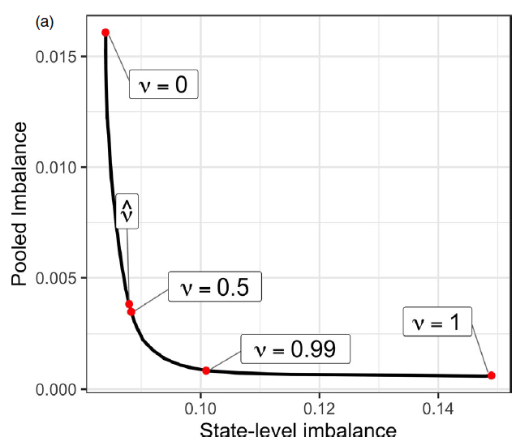
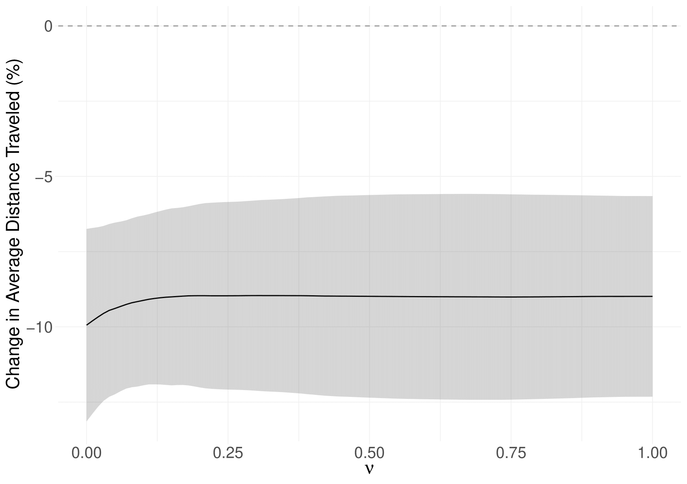

```{css, echo=FALSE}
# CSS for including pauses in printed PDF output (see bottom of lecture)
@media print {
  .has-continuation {
    display: block !important;
  }
}
.remark-code-line {
  font-size: 95%;
}
.small {
  font-size: 75%;
}
.scroll-output-full {
  height: 90%;
  overflow-y: scroll;
}
.scroll-output-75 {
  height: 75%;
  overflow-y: scroll;
}
```

```{r setup, include=FALSE}
options(htmltools.dir.version = FALSE)
library(knitr)
library(fontawesome)

# define colors
red_pink <- "#e64173"
turquoise <- "#20B2AA"
orange <- "#FFA500"
red <- "#fb6107"
blue <- "#3b3b9a"
green <- "#8bb174"
grey_light <- "grey70"
grey_mid <- "grey50"
grey_dark <- "grey20"
purple <- "#6A5ACD"
slate <- "#314f4f"

knitr::opts_chunk$set(
	fig.align = "center",
	cache = FALSE,
	dpi = 300,
  warning = F,
  message = F,
	fig.height = 5,
	out.width = "80%"
)
```

# Table of Contents


1. [Prologue](#prologue)

2. [Synthetic Difference-in-Difference](#synthdid)

3. [Partially Pooled SCM](#pool)
  
---
class: inverse, middle
name: prologue

# Prologue

---
# Prologue

.pull-left[
.center.hi-purple[Part 1]
  * Matching
  * Canonical Synthetic Control
]

.pull-right[
.center.hi-pink[Part 2]
  * Synthetic Diff-in-Diff
    * Uniform Adoption
    * Staggered Adoption
  * Partially Pooled Synthetic Control
]

---
# Prologue

Packages we'll use today:

```{r, eval = F}
# If not installed, add in packages from GitHub not on CRAN
if (!require("augsynth")) remotes::install_github("ebenmichael/augsynth")

```

```{r}
if (!require("pacman")) install.packages("pacman")
pacman::p_load(augsynth, fixest, gsynth, synthdid, tidyverse)
```

--

As well, let's load the event study data from [Sears et al. (2023)](https://doi.org/10.1086/721705) we finished last lecture with (plus some covariates)

```{r}
sah <- readRDS("data/sah_covar.rds")
```

---
# Prologue

Last time we talked through the canonical .hi-medgrn[Synthetic Control Method (SCM)] for comparative case studies.

While it provides an avenue for overcoming violations of parallel trends, it is limited in several ways

  1. Intended for a single treated aggregate unit ("comparative case studies")
  1. Results primarily presented visually
  1. Inference doesn't match our usual approaches

--

What would be *great* is if there were ways of combining the matching benefits of SCM with the identification and structure of our typical econometric approaches...

---
# Prologue

Okay so I've already spoiled this: yes, there are methods that do this - and we're going to learn about them today.

1. Synthetic Difference-in-Differences: using a synthetic control unit as the counterfactual in a difference-in-differences
1. Partially Pooled Synthetic Control: same idea but for event study settings with dynamic treatment effects

--

We refer to these two approaches as .hi-megrn[doubly-robust] estimators, in that you have two chances to be right:
  
  1. In the matching design, or
  2. In the regression specification

---
class: inverse, middle
name: synthdid

# Synthetic Difference-in-Differences

---
# Synthetic Difference-in-Differences

[Synthetic Difference-in-Differences](https://www.aeaweb.org/articles?id=10.1257/aer.20190159) by Arkhangelsky et al. (2021) AER offers a solution to CIA violations in a typical difference-in-differences setting.

--

.hi-medgrn[The gist:]

  1. Re-weight and match pre-exposure trends by constructing a synthetic counterfactual
    * Reduces reliance on parallel trends
  1. Estimate a treatment effect in a standard TWFE regression
  
---
# Synthetic Difference-in-Differences

.hi-blue[More formally:]

Suppose you have .hi-green[balanced panel] with 
  * $T$ time periods
  * $N$ units
    * First $N_{co}$ units are never exposed to treatment (pure controls)
    * Next $N_{tr} = N - N_{co}$ units receive treatment after time $T_{pre}$
      * Can be block adoption or staggered adoption
  
--

You observe

  * The time-varying outcome $Y_{it}$,
  * A binary treatment indicator $W_{it}$,
  * and (optionally) time-varying covariates $X_{it}$
  
i.e. same data requirements as a standard TWFE Diff-in-Diff approach

---
# Synthetic Difference-in-Differences

.hi-blue[The Concern:]  even after conditioning on observables, CIA/parallel trends doesn't hold.

--

.hi-medgrn[The Solution:] construct a synthetic control to use as the counterfactual in a Difference-in-Differences design.

Like with SCM, the goal is to find weights $\hat\omega^{sdid}$ so that the pre-treatment trends in the treated units' outcome align with the synthetic control's:

$$\underbrace{\sum\limits_{i=1}^{N_{co}} \hat\omega^{sdid} Y_{it}}_{Synthetic ~ Control}~~ \approx ~~\underbrace{\frac{1}{N_{tr}} \sum\limits_{i= N_{co}+1}^N Y_{it}}_{Treated}$$
---
# Synthetic Difference-in-Differences

.hi-purple[Choosing Unit Weights:] ensure average outcome for treated unit(s) is roughly parallel to the synthetic counterfactual (i.e. weighted average of control units)

--

Choose .hi-purple[unit weights] $(\hat\omega_0, \hat\omega)$ that yield the arg min of

$$\underbrace{\sum\limits_{t=1}^{T_{pre}}\left(\omega_0 +  \sum\limits_{i=1}^{N_{co}} \omega_i Y_{it} - \frac{1}{N_{tr}} \sum\limits_{i= N_{co}+1}^N Y_{it} \right)^2}_{Sum~Squared~Error} + \underbrace{\zeta^2 T_{pre} ||\omega||^2_2}_{L_2~Regularization~Penalty}$$


---
# Synthetic Difference-in-Differences

$$\underbrace{\sum\limits_{t=1}^{T_{pre}}\left(\omega_0 +  \sum\limits_{i=1}^{N_{co}} \omega_i Y_{it} - \frac{1}{N_{tr}} \sum\limits_{i= N_{co}+1}^N Y_{it} \right)^2}_{Sum~Squared~Error} + \underbrace{\zeta^2 T_{pre} ||\omega||^2_2}_{L_2~Regularization~Penalty}$$

  * Intercept term $\omega_0$ allows synthetic control to match on pre-trends
    * Unit FE $\alpha_i$ in regression step get rid of level differences
  * Penalty term helps non-zero weights be more distributed across control units
    * If $\zeta=0$, weights are identical to Abadie, Diamond, and Hainmueller (2010) SCM weights for a single treated unit 
    * $\zeta$ is *complicated*, see the paper if you want more details
    * $L_2$/Euclidean norm as in ridge regression (we'll chat more about this in ML lecture)

---
# Synthetic Difference-in-Differences

.hi-medgrn[Choosing Time Weights:] ensure pre and post-treatment periods are balanced for control units
  
Choose .hi-medgrn[time weights] $(\hat\lambda_0, \hat\lambda)$ that yield arg min of


$$\sum\limits_{i=1}^{N_{co}}\left(\underbrace{\lambda_0 +  \sum\limits_{t=1}^{T_{pre}} \hat\lambda_t Y_{it}}_{Weighted~Average\\~in~Pre-Period} ~~-~~ \underbrace{\frac{1}{T_{post}} \sum\limits_{t= T_{pre}+1}^T Y_{it}}_{Average~in\\Post-Period} \right)^2$$
  * No regularization in time weights
    * Allows for correlation over time for same unit, but not across units (beyond the systematic component in a latent factor model)
  
---
# Synthetic Difference-in-Differences

Once unit and time weights (and $\zeta$) are obtained, estimate $\hat\tau^{sdid}$ as arg min of 

$$\sum\limits_{i=1}^N\sum\limits_{t=1}^T  (Y_{it} - \mu - \alpha_i - \beta_t - W_{it} \tau)^2\hat\omega_i^{sdid}\hat\lambda_t^{sdid}$$
--
<br>

Note that without weights, this is just the TWFE Diff-in-Diff solution: 

$$\sum\limits_{i=1}^N\sum\limits_{t=1}^T  (Y_{it} - \mu - \alpha_i - \beta_t - W_{it} \tau)^2$$

---
# Synthetic Diff-in-Diff Application

Now that we know how it's working, let's try it out by looking at the impact of California's Proposition 99, which introduced a 25 cent tax per pack of cigarettes.

```{r}
data(california_prop99)
```


---
# Synthetic Diff-in-Diff Application

We *could* evaluate the impact of Prop 99 on cigarette sales per capita using a typical TWFE Diff-in-Diff:


```{r}
did <- feols(PacksPerCapita ~ treated | State + Year, data = california_prop99, cluster = ~ State)
summary(did)
```

---
# Synthetic Diff-in-Diff Application

Looking at parallel trends:
.font70[
```{r, out.width = "60%"}
mutate(california_prop99, state_ca = ifelse(State == "California", "California", "Pure Controls")) %>%
group_by(state_ca, Year) %>%
  summarise(PacksPerCapita = mean(PacksPerCapita)) %>%
  filter(Year < 1989) %>%
  ggplot() +
  geom_line(aes(x = Year, y = PacksPerCapita, linetype = state_ca)) +
  theme_minimal()
```
]

---
# Synthetic Diff-in-Diff Application

Let's use the .hi-slate[synthdid] package to estimate a diff-in-diff using a synthetic California as the counterfactual.

First, we'll need to do some se the `panel.matrices()` function to set up the data

  * Balanced panel (have)
  * Simultaneous adoption (have mechanically)

```{r}
synth_ca_prep <- panel.matrices(
  panel = as.data.frame(california_prop99), # the dataframe
  unit = "State", # unit column (name or column #)
  time = 2, # time column (name or column #)
  outcome = 3, # outcome var (name or column #)
  treatment = "treated", # treatment var (name or column #)
  treated.last = TRUE # sort treated units to be at bottom
)
```

---
# Synthetic Diff-in-Diff Application

Now compute the synthetic Diff-in-Diff estimate with `synthdid_estimate()`:

```{r}
sdid <- synthdid_estimate(Y = synth_ca_prep$Y, # outcome var
                          N0 = synth_ca_prep$N0, # number of control units (N_co)
                          T0 = synth_ca_prep$T0 # number of pre-treatment periods (T_pre)
                          )
sdid
```
Which yields a much smaller treatment effect estimate than the Diff-in-Diff.

---
# Synthetic Diff-in-Diff Application

Looking at control unit weights $\omega$:

```{r}
synthdid_controls(sdid)
```


---
# Synthetic Diff-in-Diff Application

Plotting the  control unit weights $\omega$:

```{r}
synthdid_units_plot(sdid)
```

---
# Synthetic Diff-in-Diff Application

And the time weights $\lambda$

```{r}
summary(sdid)$periods
```
---
# Synthetic Diff-in-Diff Application

Note that with only one treated unit we can only use the (untrustworthy) `placebo` method to get standard errors, by calling `vcov()` on our `synthdid_estimate` object:

```{r}
se <- sqrt(vcov(sdid, method='placebo'))
sprintf('95%% CI (%1.2f, %1.2f)', sdid - 1.96 * se, sdid + 1.96 * se)
```


---
# Synthetic Diff-in-Diff Application

We can look at pre-treatment parallel trends by overlaying the two series:
  
```{r, out.width = "65%"}
synthdid_plot(sdid, overlay = 1)
```


---
# Synthetic Diff-in-Diff Application

The built-in `synthdid` plot (a `ggplot` object) displays a lot of information by default.

  * Point and line segments for simple 2x2 Diff-in-Diff comparison
  * Time period weights (bottom red line)
  * Customizable further with `theme()` and [other adjustments](https://synth-inference.github.io/synthdid/articles/more-plotting.html)

---
# Synthetic Diff-in-Diff Application

The built-in `synthdid` plot (a `ggplot` object) displays a lot of information by default.

 
```{r, out.width = "65%"}
synthdid_plot(sdid)
```


---
# Synthetic Diff-in-Diff Application

Comparing to canonical SCM and Diff-in-Diff reveals the differences well:

```{r}
est_sc <- sc_estimate(Y = synth_ca_prep$Y, N0 = synth_ca_prep$N0, T0 = synth_ca_prep$T0)
est_did <- did_estimate(Y = synth_ca_prep$Y, N0 = synth_ca_prep$N0, T0 = synth_ca_prep$T0)
estimates <- list(est_did, est_sc, sdid)
names(estimates) = c('Diff-in-Diff', 'Synthetic Control', 'Synthetic Diff-in-Diff')
print(unlist(estimates))
```

---
# Synthetic Diff-in-Diff Application

Comparing to canonical SCM and Diff-in-Diff reveals the differences well:

```{r}
synthdid_plot(estimates, se.method='placebo')
```

---
# Staggered Adoption

The methods in .hi-slate[synthdid] easily extend to 

  * Controlling for covariates in the second step regression
  * Cases of more than one unit .hi-belu[adopting simultaneously].

--

One current limitation is lack of direct support for .hi-medgrn[staggered adoption]

--

Until they add native support, you can use the .hi-slate[Ssynthdid] package

```{r, eval = F}
# install.remotes("remotes")
remotes::install_github("tjhon/ssynthdid")
```


---
class: inverse, middle
name: pool

# Partially Pooled Synthetic Control

---
# Partially Pooled Synthetic Control

An alternate but related estimator is the .hi-medgrn[partially pooled synthetic control method (PPSCM)] of [Ben-Michael, Feller, and Rothstein (2021)](https://rss.onlinelibrary.wiley.com/doi/10.1111/rssb.12448)

.hi-blue[The gist:]

  * Extend canonical SCM to the many-treated unit and staggered adoption case
  * Incorporate unit-level intercepts and balancing on covariates
    * Equivalent to balancing on residualized unit-level outcomes
  * Estimate dynamic treatment effects 
  * Obtain standard errors through bootstrapping/jackknifing


---
# Partially Pooled Synthetic Control

.hi-blue[More formally:]

Suppose you have a panel with 
  * $T$ time periods
  * $N$ units
    * Some units $j=1...,J$ receive treatment, potentially at different times $T_i$
    * Non-zero number of pure controls $N_0$ with $T_i = \infty$
      * Can be block adoption or staggered adoption
  
--

You observe

  * The time-varying outcome $Y_{it}$,
  * A binary treatment indicator $W_{it}$,
  * and (optionally) time-varying covariates $X_{it}$
  
---
# Partially Pooled Synthetic Control

.hi-blue[Assumptions:] 

  * Stable treatment and no interference across units (SUTVA)
  * Prior to treatment, a unit's potential outcomes are equal to its never-treated potential outcomes
  * .hi-green[No Anticipation:] 
  
  $$Y_{it}(s) = Y_{it}(\infty) \text{ for } t<s, \text{ with treatment time } s$$

---
# Partially Pooled Synthetic Control

.hi-blue[Assumptions:] 

  * All treated units are observed for at least several pre-periods and several post-periods
    * Needed to ensure sufficient identification in unbalanced event time
--
  * Can express the data generating process as following
    1. Following a time-varying $AR(L)$ process: $Y_{it}(\infty) = \sum\limits_{\ell = 1}^L \rho_{t\ell}Y_{it-\ell}(\infty) + \epsilon_{it}$, or
      * Rules out correlation between treatment timing and noise terms for any period
    1. Composed of time-varying latent factors and time-invariant unit loadings: $Y_{it}(\infty) = \phi_i \cdot \mu_t + \epsilon_{it}$
      * Rules out correlation between treatment timing and noise terms *after* treatment
    1. Noise term $\epsilon_{it}$ are sub-Gaussian random variables
      * Restricts tails to ensure finite sample error bounds 


---
# Partially Pooled Synthetic Control

If we want to extend canonical SCM to the .hi-blue[many-treated] case, we could take one of two approaches.

.hi-medgrn[1\. Separate SCM:] estimate a separate SCM for each treated unit
  * i.e. minimize pre-treatment imbalance for each treated unit separately
  * Can lead to poor mean fit, biasing the ATE
  
--

.hi-purple[2\. Pooled SCM:] estimate one SCM for average of treated units
  * i.e. minimize the average pre-treatment imbalance across all treated units
  * Can achieve strong average fit but obtain poor unit-specific treatment effects
  
--

.hi-green[The Solution:] "pool" the two estimators, improving on each approach in isolation

---
# Partially Pooled Synthetic Control

Choose SCM weights to minimize the weighted average of the pooled and unit-specific pre-treatment balance:

$$\min\limits_{\Gamma \in \Delta^{scm}}~~ \nu(\underbrace{\tilde{q}^{pool}(\Gamma))^2}_{\text{Normalized}\\\text{pooled}\\\text{imbalance}} + (1-\nu)(\underbrace{\tilde{q}^{sep}(\Gamma))^2}_{\text{Normalized}\\\text{separate}\\\text{imbalance}} + \underbrace{\lambda||\Gamma||^2_F}_{\text{penalize sum of}\\\text{squared weights}}$$

  * $\hat q^{sep},~ \hat q^{pool}$ the (normalized) root mean square of separate and pooled pre-treatment fit
  * $\lambda||\Gamma||^2_F$ a penalty term (as in SCM)
  * $\nu$ the hyperparameter determining the degree of "partial pooling"
    * $\nu = 0 \Rightarrow \text{Separate SCM}$
    * $\nu = 1 \Rightarrow \text{Pooled SCM}$
    * $0 < \nu < 1 \Rightarrow \text{Partially-Pooled SCM}$
    
---
# Partially Pooled Synthetic Control

So, what $\nu$ should we use?

--

Turns out the relationship between pooled and separate imbalance is .hi-green[highly convex], with even slight interior $\nu$ offering large improvements.

.center[

]

---
# Partially Pooled Synthetic Control

So, what $\nu$ should we use?


In my experience, overall ATEs are highly similar across the space of $\nu$

.center[

]

---
# PPSCM Application

So how does it actually work? Let's use the .hi-slate[augsynth] package and use PPSCM to revisit mobility responses to stay-at-home mandates.

--

Recall the setup:

  * States adopted stay-at-home mandates on different days (staggered adoption)
  * Observe many pre-period dates (Feb 24 to Mar 19)
  * Observe many post-adoption dates (# varies by state, from 22 to 42)
  
---
# PPSCM Application

One advantage to PPSCM is less data prep - we can jump directly to estimation with `augsynth()`

.center[
`augsynth(y ~ treat | weighting covars | approx match covars | exact match covars,
          unit,
          time,
          data,
          n_leads,
          n_lags)`
]
  .font90[
  * `formula` requires just $Y_{it}$ and $W_{it}$
    * Optional weighting covariates, approximate/exact matching covariates
  * `unit/time` the names of unit and time variables
    * can be text, numeric, or dates
    * Don't need manual event time
  * `data` the dataframe
  * `n_leads/n_lags` the number of lead/lag event times to estimate
    * `n_lead` default: # post-treatment dates for last-treated unit (same as our binned event time before)
    * `n_lags` default: balance all periods]


---
# PPSCM Application

Estimating with default settings and storing the summary object
  * Most everything is hanging out in the `summary()` object

```{r}
sah_ppscm <- multisynth(cadt ~ post_treat, state, date,  data = sah, fixedeff = TRUE) 
sum_ppscm <- summary(sah_ppscm)
```

---
# PPSCM Application

Looking at the output shows
  * Average ATT and standard error (across all time periods + treated units)
  * Imbalances and improvement over pooled/separate SCM
.font90[
```{r}
sum_ppscm
```
]


---
# PPSCM Application

The coefficient table contains two main types of data

  1. "Average" period-specific ATT across all treated units (top rows, "Average" Level)
  1. Unit-specific ATTs for each period

```{r}
att_ppscm <- sum_ppscm$att
att_ppscm
```


---
# PPSCM Application

Plotting the Average ATT event study:

```{r, out.width = "75%"}
plot(sum_ppscm, levels = "Average")
```

---
# PPSCM Application

Or the event study for just CA relative to its synthetic control:

```{r, out.width = "75%"}
plot(sum_ppscm, levels = "CA")
```

---
# PPSCM Application

Or a subset (say, OR and WA):

```{r, out.width = "75%"}
plot(sum_ppscm, levels = c("OR", "WA"))
```


---
# PPSCM Application

Or every ATT all at once:

```{r, out.width = "75%"}
plot(sum_ppscm)
```

---
# PPSCM Application

Looking at the weights:
  
  * $N \times N_{tr}$ matrix (51 states + DC by 43 SAH adopters)

```{r}
sah_ppscm$weights
```

---
# PPSCM Application

What is CA (first adopter)'s synthetic control?


```{r}
ca_wts <- sah_ppscm$weights %>%
  as.data.frame() %>%
  select(V1)

ca_wts <- mutate(ca_wts, state = rownames(ca_wts)) %>%
  rename(weight = V1) %>%
  filter(weight != 0)
ca_wts
```

```{r}
filter(sah, state %in% c("CA", "AR", "IA", "ND", "NE", "OK", "SD", "UT", "WY")) %>%
  left_join(ca_wts, by = "state") %>%
  mutate(state_ca = ifelse(state == "CA", "CA", "Synthetic Control"),
         weight = ifelse(state == "CA", 1, weight)) %>%
  group_by(state_ca, date) %>%
  summarise(cadt_group = mean(cadt*weight, na.rm = T),
    weight = weight) %>%
  filter(date <= mdy("3-19-2020")) %>%
  ggplot() +
  geom_line(aes(x=date, y = cadt_group, linetype = state_ca))
```


---
# PPSCM Application

Looking at $\nu$, we see we're about halfway between separate and pooled SCM:

```{r}
sah_ppscm$nu
```


---
# PPSCM Application


By default, the regularization penalty and number of factors for interactive fixed effect is zero. What happens if we turn them on?

.font70[
```{r, out.width = "60%"}
sah_ppscm2 <- multisynth(cadt ~ post_treat, state, date,  data = sah, fixedeff = TRUE, 
                         lambda = 0.5,
                         n_factors = 2) 
sum_ppscm2 <- summary(sah_ppscm2)
plot(sum_ppscm2, levels = "Average")
```
]

---
# PPSCM Application

We can also add covariates for
  * .hi-blue[Weighting:] covariates to weight on
  * .hi-medgrn[Approx. Matching:] covariates to approximately match on *before* weighting
  * .hi-purple[Exact Matching:] covariates to exactly match on *before* weighting

--

Let's weight on average pre-period values of a few covariates:

```{r}
sah_ppscm3 <- multisynth(cadt ~ post_treat | pct_wfh + pct_pub_trans + pct_retail + pct_ent_fd + poppm2019 + share_dem, state, date, 
                         data = sah, fixedeff = TRUE, 
                         lambda = 0.5,
                         n_factors = 2) 
sum_ppscm3 <- summary(sah_ppscm3)
```


---
# PPSCM Application

Looking at balance under this specification:

```{r, out.width = "65%"}
plot(sum_ppscm3, levels = "Average")
```

---
# PPSCM Application

Alternatively, we can approximately match on population and democratic vote share in 2016 election using 3 nearest neighbors:

```{r}
sah_ppscm4 <- multisynth(cadt ~ post_treat | pct_wfh + pct_pub_trans + pct_retail + pct_ent_fd| poppm2019 + share_dem, state, date, 
                         data = sah, fixedeff = TRUE, 
                         lambda = 0.5,
                         n_factors = 2,
                         k = 3) 
sum_ppscm4 <- summary(sah_ppscm4)
```

---
# PPSCM Application

Plotting the new Average ATTs manually with ggplot():

.font80[
```{r, echo = F, out.width = "70%"}
  dplyr::filter(sum_ppscm4$att, Level == "Average") %>%
  ggplot2::ggplot(ggplot2::aes(x=Time, y = Estimate)) +
  ggplot2::geom_line() +
  ggplot2::geom_point() +
  ggplot2::geom_ribbon(ggplot2::aes(ymin = lower_bound, ymax = upper_bound), fill = "navyblue", alpha = 0.15) +
  ggplot2::geom_vline(ggplot2::aes(xintercept = -1), linetype = "dashed") +
  ggplot2::geom_hline(ggplot2::aes(yintercept = 0), linetype = "dotted", alpha = 0.5) +
  ggplot2::theme_minimal() +
  ggplot2::labs(y = "Average ATT", x = "Days Since Stay-at-Home Mandate") +
  ggplot2::scale_y_continuous(labels = scales::label_percent(scale = 1))

```
]


---
# PPSCM Application

Comparing to the standard event study from last lecture:

```{r, echo = F, out.width = "70%"}
es_reg <- feols(cadt ~ i(event_time_bin, sah_state, ref = -1) | 
                  state + date, data = sah)
iplot(es_reg,
      ylab = "Change in Average Distance Traveled (%)",
      xlab = "Days Since Stay-at-Home in Effect",
      main = "Event Study, Average Distance Traveled"
)
```

---

# Table of Contents


1. [Prologue](#prologue)

2. [Synthetic Difference-in-Difference](#synthdid)

3. [Partially Pooled SCM](#pool)

```{r gen_pdf, include = FALSE, cache = FALSE, eval = FALSE}
infile = list.files(pattern = 'Pt2.html')
pagedown::chrome_print(input = infile, timeout = 200)
```