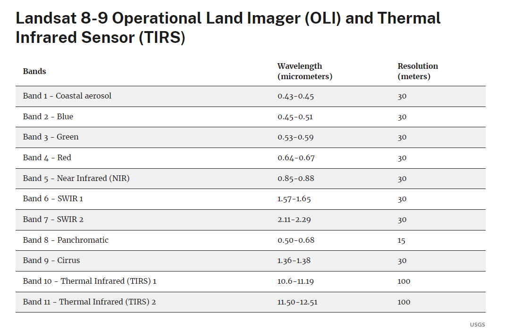

```{css, echo=FALSE}
# CSS for including pauses in printed PDF output (see bottom of lecture)
@media print {
  .has-continuation {
    display: block !important;
  }
}
.remark-code-line {
  font-size: 95%;
}
.small {
  font-size: 75%;
}
.scroll-output-full {
  height: 90%;
  overflow-y: scroll;
}
.scroll-output-75 {
  height: 75%;
  overflow-y: scroll;
}
```

```{r setup, include=FALSE}
options(htmltools.dir.version = FALSE)
library(knitr)
library(fontawesome)

# define colors
red_pink <- "#e64173"
turquoise <- "#20B2AA"
orange <- "#FFA500"
red <- "#fb6107"
blue <- "#3b3b9a"
green <- "#8bb174"
grey_light <- "grey70"
grey_mid <- "grey50"
grey_dark <- "grey20"
purple <- "#6A5ACD"
slate <- "#314f4f"

knitr::opts_chunk$set(
	fig.align = "center",
	cache = FALSE,
	dpi = 300,
  warning = F,
  message = F,
	fig.height = 5,
	out.width = "80%"
)
```

# Table of Contents: Today

**Part 3: Raster Data** 


1. [ Intro to Raster Data](#intro)

1. [Common Raster Data](#sources)

1. [Raster Operations](#ops)

1. [Combining Rasters and Vectors](#combine)


---
# Prologue


To start, load in some packages:

```{r preamble}
if (!require("pacman")) install.packages("pacman")
pacman::p_load(prism, sf, terra, tidyterra, 
               tictoc, tidyverse, tmap, units)
```

---
# Preamble

Let's also define a custom ggplot map theme
```{r mappreamble}
# add ggplot map theme
maptheme <- theme(
  panel.background = element_rect(fill = NA),
  # panel.border = element_rect(fill = NA, color = "grey75"),
  axis.text.x=element_blank(), #remove x axis labels
  axis.ticks.x=element_blank(), #remove x axis ticks
  axis.text.y=element_blank(),  #remove y axis labels
  axis.ticks.y=element_blank(),  #remove y axis ticks
  panel.grid.major = element_blank(),
  panel.grid.minor = element_blank(),
  legend.key = element_blank())
  
```


---
class: inverse, middle
name: intro

# Intro to Raster Data


---
# Raster Data: Regular Grids

.hi-medgrn[Rasters] are a way to represent .hi-medgrn[spatially continuous data] in a regular, .hi-medgrn[gridded format]

.center[]

.footer[<font size = "1"> Image source: [Wikimedia](https://tinyurl.com/5h9trtfj) </font>]


---
# Raster Data: Regular Grids
Every raster is a .hi-medgrn[matrix of cells (pixels)] organized into a .hi-medgrn[grid]

--

.pull-left[
* Covered area is divided into equal-area cells
* Grid size varies from raster to raster
* Each cell contains a .hi-dkgrn[value]
]
.pull-right[
.center[]
.small[[Image Source: ESRI](https://www.earthdata.nasa.gov/learn/backgrounders/nighttime-lights)]
]


---
# Raster Data: Regular Grids
Every raster is a .hi-medgrn[matrix of cells (pixels)] organized into a .hi-medgrn[grid]


.pull-left[
Rasters can represent
* .hi-purple[Categorical data:] land use, soil type
* .hi-green[Continuous phenomena:] temperature, elevation, spectral data from satellite images
* .hi-red[Pictures:] scanned maps, drawings, photographs
]
.pull-right[
.center[]
.small[[Image Source: ESRI](https://www.earthdata.nasa.gov/learn/backgrounders/nighttime-lights)]
]


---
# Single vs. Multi-Band

Raster data can come in .hi-pink[single] and .hi-blue[multi] band formats

--
.pull-left[
* .hi-pink[Single-Band:] one band (layer) with a set of values 
  * 1 value per grid cell
  * Ex: elevation, daily max temperature, land use
  ]
.pull-right[
.center[]
]

---
# Single vs. Multi-Band

Raster data can come in .hi-pink[single] and .hi-blue[multi] band formats

.pull-left[
* .hi-blue[Multi-band] multiple bands/layers per file
  * 1 value per grid cell .hi-slate[per layer]
  * Ex: MODIS satellite imagery - R, G, B, aerosol optical depth, reflectance, vegetation index, etc.
]
.pull-right[
.center[]
.small[Image Source: USGS]
]
    
---
class: inverse, middle
name: sources

# Common Raster Data

---
# Common Raster Data

Raster data come in many different flavors

A few commonly used in Env, Ag, and Dev economics are

1. PRISM Gridded Climate Data

1. Nighttime Lights (NOAA, NASA, DoD)

1. National Land Cover Database (NLCD)

1. Cropland Data Layer (USDA)

1. Landsat (USGS, NASA)

---
# PRISM

[PRISM Climate Group](https://prism.oregonstate.edu/) produces several different climate products, including the .hi-medgrn[AN81d daily spatial climate dataset]

.pull-right[]
.pull-left.font90[
* 4km by 4km (or 800m by 800m) grid cells for CONUS, daily since Jan 1, 1981
* Precip, max/min/mean temp, mean dew point temp, min/max vapor pressure deficit
* Takes into account elevation, coastal effects, inversions, terrain barriers
* Standard product is available for free (800m grid available [for a fee](https://prism.oregonstate.edu/orders))
* Easily accessed directly in R with the `PRISM` package
]
---
# Nighttime Lights

Currently produced under a NASA/NOAA partnership, began with Dept of Defense
  
  .center[]


.footer[<font size = "1"> Image source: [NASA](https://www.earthdata.nasa.gov/learn/backgrounders/nighttime-lights) </font>]


---
# Nighttime Lights

[Light Every Night - World Bank Nighttime Light Data](https://blogs.worldbank.org/opendata/light-every-night-new-nighttime-light-data-set-and-tools-development) contains a complete archive of all daily nighttime imagery from the last 30 years.

* Analysis-ready, compiled from .hi-medgrn[two satellite imaging sources]
  1. Defense Meteorological Satellite Program Operational Linescan System (DMSP - OLS) , 1993- 2017
  1. Visible Infrared Imaging Radiometer Suite (VIIRS)
* [Open Nighttime Lights](https://worldbank.github.io/OpenNightLights/welcome.html) has tutorials for accessing/performing operations and analysis with Night Lights data

---
# Nighttime Lights

[Light Every Night - World Bank Nighttime Light Data](https://blogs.worldbank.org/opendata/light-every-night-new-nighttime-light-data-set-and-tools-development) contains a complete archive of all daily nighttime imagery from the last 30 years.

Other versions of the products exist
  * DMSP or VIIRS Directly from the source 
    * Cloud-free composites from [CO School of Mine's Earth Observation Group](https://eogdata.mines.edu/products/vnl/)
  * [Harmonized version 1992-2018](https://figshare.com/articles/dataset/Harmonization_of_DMSP_and_VIIRS_nighttime_light_data_from_1992-2018_at_the_global_scale/9828827/2) from [Li et al.](https://www.nature.com/articles/s41597-020-0510-y#code-availability)
  
   
---
# National Land Cover Database (NLCD)
[National Land Cover Database (NLCD)](https://www.usgs.gov/centers/eros/science/national-land-cover-database#overview) characterizes land cover and land cover change over time

.pull-left[
* Land cover: water, ice, developed open/low/medium/high intensity, barren, forest, shrubland, herbaceous, planted/cultivated, wetlands
* Impervious surface descriptor categorizes roads, core urban areas, energy production sites
]
.pull-right[
.center[]
]


---
# NASS Cropland Data Layer (CDL)
USDA's National Agricultural Statistics Service (NASS) produces the [Cropland Data Layer (CDL)](https://croplandcros.scinet.usda.gov/) to .hi-medgrn[classify crop types]

.center[]


---
# NASS Cropland Data Layer (CDL)

USDA's National Agricultural Statistics Service (NASS) produces the [Cropland Data Layer (CDL)](https://croplandcros.scinet.usda.gov/) to .hi-medgrn[classify crop types]
* Works relatively well in areas with .hi-blue[few distinct crops] (i.e. corn and soy land)
* Less effective in areas with .hi-red[lots of specialty crops] (i.e California, part of Michigan)
  * Hard to tell the difference between Red Russian kale and kohlrabi from a satellite
* Used as inputs to products like the [Corn and Soy Data Layer (CSDL)](https://github.com/LobellLab/csdl) that fill in areas/periods missing from CDL [(Wang et al.)](https://www.nature.com/articles/s41597-020-00646-4#Sec20)


---
# Landsat

.hi-purple[Landsat] is the longest-running earth imaging project from NASA and USGS

.pull-left[
* High-resolution, satellite images across many bands
.font80[* Landsat 1-3 (1978-1983): Green, Red, Near Infrared (NIR), 60m resolution
* Landsat 4-5 (1982 - 2013): add Blue, Shortwave IR, thermal, 30m res.
* Landsat 6: didn't make it to orbit (RIP)
* Landsat 7 (1999 - 2022): add Panchromatic, 15m res.
* Landsat 8-9 (2013 - ): add ultrablue, cirrus, more thermal
]
]
.pull-right[

]


---
# Other Raster Data Sources

Many other raster data products exist, including

* Digital Elevation Models (DEM) like the [National Elevation Dataset (NED)](https://apps.nationalmap.gov/datasets/)
* [MODIS/Terra Vegetation Indices](https://lpdaac.usgs.gov/products/mod13q1v061/)
* [National Agriculture Imagery Program](https://developers.google.com/earth-engine/datasets/catalog/USDA_NAIP_DOQQ)
* [Nighttime Boat Detection using VIIRS](https://eogdata.mines.edu/products/vbd/)

Many handy collections of raster and other GIS data

* [NASA EarthData Collection](https://www.earthdata.nasa.gov/)
* [USGS Collection](https://www.earthdata.nasa.gov/)
* [US Forest Service](https://data.fs.usda.gov/geodata/rastergateway/index.php)
* [Socioeconomic Data and Applications Center (SEDAC)](https://sedac.ciesin.columbia.edu/data/sets/browse?facets=data-type:raster&facets=theme:poverty)
* [Boston College List of Open Access GIS Data](https://libguides.bc.edu/gis/oadata)
* [Michigan GIS Open Data](https://gis-michigan.opendata.arcgis.com/)

---

class: inverse, middle
name: ops

# Raster Operations


---
# Raster Math (Map Algebra)

.hi-medgrn[Map algebra] uses math-like operations to perform operations .hi-medgrn[on rasters]

Largely fall into four camps:

--

1. .hi-blue[Local:] perform operations on a .hi-blue[cell-by-cell basis]

  * i.e. calculate difference between max and min daily temp for each cell

--

1. .hi-green[Global:] apply bulk change to .hi-green[all cells in a raster]

  * i.e. Rescale to percent, add/subtract a constant

---
# Raster Math (Map Algebra)

.hi-medgrn[Map algebra] uses math-like operations to perform operations .hi-medgrn[on rasters]

Largely fall into four camps:

1. .hi-purple[Focal:] create value using .hi-purple[neighboring cells' values]

  * i.e. average over current and contiguous cells

--

1. .hi-red[Zonal:] apply math function to group of cells in a.hi-red[specific zone]

  * i.e. total precipitation within a watershed

---
# Raster Math (Map Algebra)

.hi-medgrn[Map algebra] uses math-like operations to perform operations .hi-medgrn[on rasters]

<br>

Other common raster operations include
* Cropping to extents of other rasters or vectors
* Extracting values from grid cells for overlayed vectors

---
# Raster Packages in R

There are several packages we can and may want to use to manipulate rasters in R.

--

.hi-slate[1\. raster]

  * Most popular, longstanding way to handle raster data
  * Many other econ-oriented packages were written for it

--

.hi-slate[2\. terra]

  * Newer package to replace `raster`
  * Shares most function names with `raster`
  * Written in C++, so much faster than `raster`

---
# Raster Packages in R

There are several packages we can and may want to use to manipulate rasters in R.

.hi-slate[1\. stars]

  * Designed for handling spatiotemporal raster data
  * Directly compatible with .hi-slate[sf] (same developer)
  * Allows .hi-slate[dplyr] language (filter, mutate, etc.)
  
---
# raster and terra

.hi-slate[raster] is the  traditional way to read/load/interact with rasters

--

* Use `raster()` to read .hi-medgrn[single-band] rasters
  
  * Class `RasterLayer`

--

* Use `brick()` to read .hi-blue[multi-band] rasters
    
    * Class `RasterBrick`

--

.hi-slate[terra] has only one object class: `SpatRaster`
* no distinction between single and multi-layer rasters

---
# Working with Rasters

Let's get some practice working with rasters, using the PRISM data.

--

We can use the .hi-slate[prism] package to download the files we want. Let's start by downloading two files: max and min daily temp for April 4, 2023

```{r prism_dl, eval = FALSE}
# Set the download path to the PRISM data folder
options(prism.path = "data/PRISM/")

# Download the data
get_prism_dailys(type='tmax',minDate='2023-04-04',maxDate='2023-04-04',keepZip=F)
get_prism_dailys(type='tmin',minDate='2023-04-04',maxDate='2023-04-04',keepZip=F)

```

---
# Working with Rasters

Let's read in the single-band PRISM max daily temp data as a `SpatRaster` using .hi-slate[terra] methods

```{r, out.height = "40%"}
tmax <- rast("data/PRISM/PRISM_tmax_stable_4kmD2_20230404_bil/PRISM_tmax_stable_4kmD2_20230404_bil.bil")
```
---

# Working with Rasters
Get a summary of the structure and contents just by calling the object's name

.font80[
```{r}
tmax 
```
]

---

# Working with Rasters
Retrieve the CRS with `terra::crs()`
 * Necessary when we want to interact with vector objects!
```{r}
prism_crs <- terra::crs(tmax)
prism_crs
```

---

# Working with Rasters
And plot the raster with the `plot()` function

```{r}
plot(tmax)
```


---

# terra and ggplot2
To plot rasters in ggplot, use `geom_spatraster()` from the .hi-slate[tidyterra] package:
```{r, eval = FALSE, out.height = "70%"}
pacman::p_load(tidyterra)
ggplot() + geom_spatraster(data = tmax) +
  maptheme +
  scale_fill_whitebox_c(
    palette = "muted",
    labels = scales::label_number(suffix = " C")) +
  labs(fill = "Max Temperature")
```

---

# terra and ggplot2
To plot `SpatRasters` in ggplot, use `geom_spatraster()` from the .hi-slate[tidyterra] package:
```{r, echo = FALSE, out.height = "80%"}
pacman::p_load(tidyterra)
ggplot() + geom_spatraster(data = tmax) +
  maptheme +
  scale_fill_whitebox_c(
    palette = "muted",
    labels = scales::label_number(suffix = " C")) +
  labs(fill = "Max Temperature")
```

---

# Working with Rasters

We can easily create a .hi-medgrn[multi-layer] `SpatRaster` object from two single-layer objects using `c()`

Let's load in the same day's minimum temp and create a high/low temp multi-layer raster

.font90[
```{r rast_multi, out.height = "40%"}
tmin <- rast("data/PRISM/PRISM_tmin_stable_4kmD2_20230404_bil/PRISM_tmin_stable_4kmD2_20230404_bil.bil")

high_low <- c(tmin, tmax)
high_low
```
]

---
#Multi-layer SpatRasters

Access specific layers with indexing `[[]]`

```{r rast_muilti_layer, out.height = "40%"}
# retrieve the second layer only (tmax)
high_low[[2]]
```

---
#Multi-layer SpatRasters
And access values using the `values` function (or try to...)
```{r, out.height = "40%"}
temp_vals <- terra::values(high_low)
head(temp_vals)
```
Returns a matrix with
* One column per layer
* One row per cell

---
# terra and Memory

Since raster images can be quite large, .hi-slate[terra] didn't actually store cell values .hi-medgrn[in memory] when we loaded the two rasters (hence the `NaN`s).

--

Instead, we established a .hi-blue[connection] to the file, allowing us to retrieve the values .hi-blue[only when necessary].

---
# terra and Vectors

.hi-slate[terra] also has its own vector object class: `SpatVector`

--

We can easily go from an `sf` object to `SpatVector` using `vect()`:

```{r}
# get counties shapefile as an sf object
counties <- st_read("data/MichiganCounties/MichiganCounties.shp", quiet = T) 

# convert to SpatVector
counties_vect <- counties %>% 
  vect()

class(counties_vect)
```
---
# raster

```{r}
library(raster)
```

When we load in the .hi-slate[raster] package, it .hi-medgrn[masks] the `select` function

--

* Running `select()` now defaults to the version specific to raster data (the .hi-slate[raster] package version)

--

* To use the `dplyr` version, we now need to call it explicitly with `dplyr::select()`

--

Packages .hi-blue[warn you in the console] when masking occurs!

---
# Convert Raster to sf

Historically, going from raster to sf took a few steps.

--

1. Use .hi-slate[raster] package to convert raster to polygons (`SpatialPolygons`)

--

1. Use .hi-slate[sf] to convert sp object to sf

---
# Convert Raster to sf

Let's give it a try using PRISM data. 

```{r, error = TRUE}
# first convert to spatialPolygons
tmax_vec <- raster::rasterToPolygons(tmax)
```
--

Hmm, looks like `raster` functions don't play great with `SpatRaster` objects from .hi-slate[terra].


---
# Convert Raster to sf

We can use `as()` to easily go between `raster` and `terra` objects:

```{r}
tmax_rast <- as(tmax, "Raster")
```

--

Now retry the polygon conversion (note: this takes a *while* to run)

```{r, eval = T}
tmax_vec <- raster::rasterToPolygons(tmax_rast)
```


---
# Convert Raster to sf

Q: what did we get back?

```{r}
class(tmax_vec)
```

--

A: a `SpatialPolygonsDataFrame`, the *old* R format for vector. 

To get it into an sf object, we can use `st_as_sf()` (again, this can take a while)

```{r, eval = T}
tmax_vec_sf <- st_as_sf(tmax_vec)
```


---
# Convert Raster to sf

We now have an sf object, with 
* One row per polygon
* A single attribute column
* Geometry column for the original grid cell

```{r}
head(tmax_vec_sf)
```

---
# Convert Raster to sf

Plotting emphasizes that each polygon is the original grid cell:

```{r}
colnames(tmax_vec_sf)[1] <- "tmax"
ggplot() +
  geom_sf(aes(fill = tmax), data = tmax_vec_sf[2:19,])

ggsave("output/tmax_vec_sf.png")
```

---
# Convert Raster to sf

One nice thing about this process: the original CRS tags along the whole way through.

```{r}
prism_crs

st_crs(tmax_vec_sf)
```
---
# Convert sf to Raster

We can more easily go the other direction with `st_rasterize()` from the .hi-slate[stars] package to rasterize an sf object.

```{r}
county_rast <- dplyr::select(counties, SQMILES) %>%
  stars::st_rasterize()
```

---
# Convert sf to Raster

This process yields a `stars` object, which represents a dense spatiotemporal array

.font80[
```{r, out.width = "50%"}
class(county_rast)
plot(county_rast) 
```
]

---
class: inverse, middle
name: combine

# Combining Raster and Vector Data

---
# Combining Raster and Vector Data

Often we want to .hi-medgrn[combine] raster and vector data 
* Plot administrative boundaries over nightlights 
* Extract vegetation indices for farm fields

I often do this to add variables for use in econometric models

--

Let's work through an example workflow of both for .hi-medgrn[extracting PRISM data]

---
# CRS Agreement

As when working with multiple vector objects, we first need to make sure our raster and vector objects are on the .hi-medgrn[same CRS]

```{r comb_crs}
# read in the Wayne County census tracts
tracts <- st_read("data/wayne_acs", quiet = TRUE)

identical(st_crs(high_low), st_crs(tracts))

# not the same, so transform tracts to prism CRS
tracts <- st_transform(tracts, crs = st_crs(high_low))

identical(st_crs(high_low), st_crs(tracts))
```

---
# Plotting

Now that we have them on the same CRS, we can plot them together.

```{r, eval = F, out.height = "80%"}
ggplot() + geom_spatraster(data = tmax) +
  geom_sf(data = tracts) +
  maptheme +
  scale_fill_whitebox_c(
    palette = "muted",
    labels = scales::label_number(suffix = " C")) +
  labs(fill = "Max Temperature")
```

---
# Plotting

Now that we have them on the same CRS, we can plot them together.

```{r, echo = F, out.height = "80%"}
ggplot() + geom_spatraster(data = tmax) +
  geom_sf(data = tracts) +
  maptheme +
  scale_fill_whitebox_c(
    palette = "muted",
    labels = scales::label_number(suffix = " C")) +
  labs(fill = "Max Temperature")
```
---
# Adjust the Viewing Area

That *technically* worked, but it defaulted to the widest extent of the two objects.

--

If we want to focus in on a specific area (i.e. Wayne County), we can crop the raster using the  `crop()` function from `terra`.

--

First, let's figure out what the CRS units are for the census tracts:

```{r comb_crop, out.height = "70%"}
st_crs(tracts) # view units of current CRS (meters)
```

---

# Cropping

Now, crop to a 25mi buffer around Wayne county

  * Converting to the right units (meters)!


```{r, out.height = "70%"}
# crop to Wayne County with 25mi buffer:
tmax_crop <- terra::crop(tmax, st_buffer(tracts, dist = 40233.6))

crop_plot <- ggplot() + geom_spatraster(data = tmax_crop) + geom_sf(data = tracts, fill = NA) +
  maptheme + scale_fill_whitebox_c(palette = "muted",
    labels = scales::label_number(suffix = " C")) +
  labs(fill = "Max Temperature")
```


---

# Cropping

And plotting:


```{r, out.height = "70%"}
crop_plot <- ggplot() + geom_spatraster(data = tmax_crop) + geom_sf(data = tracts, fill = NA) +
  maptheme + scale_fill_whitebox_c(palette = "muted",
    labels = scales::label_number(suffix = " C")) +
  labs(fill = "Max Temperature")
```

---
# 1. Cropping

```{r comb_crop_plot, out.height = "75%"}
crop_plot
```


---
# Extracting from Raster

Next, we can extract max temp values for each of our polygons using
--

* `raster`

    * slowest
    
--

* `terra`

    * moderate speed
    
--

* `velox`
  * super fast (orders of magnitude faster)
  * trickier to download/setup

--

.footnote[Note that it's often best to extract from a .hi-medgrn[cropped raster] to reduce computational time if you have a big raster]

---
# Raster Extract

Extracting with `raster`:
```{r extract_rast, out.height = "70%"}
tic()
extr_raster <- raster::extract(tmax_crop, tracts, df = TRUE)
toc(quiet = FALSE)

```

---
# Extract Output
Inspecting the output:
```{r extract_rast_expl, out.height = "60%"}
head(extr_raster, 10)
```

---
# Extract Output

```{r}
dim(extr_raster)
```

Since we didn't specify a summary function, we got back a data frame with

--

* one row per intersecting grid cell

--

* `ID` column indicates the matching sf object's row
  * Third tract intersects three grid cells


---
# Extract Output
Specify a summary function with the `fun` argument to get .hi-medgrn[one row per polygon]
  * `df = TRUE` no longer used
```{r extract_rast_sum, out.height = "60%"}
extr_raster_mean <- raster::extract(tmax_crop, tracts, fun = mean)
head(extr_raster_mean)
```
---
# Terra Extract
Equivalently using terra's `extract`
```{r extract_terra, out.height = "70%"}
tic()
extr_terra <- terra::extract(tmax_crop, tracts, fun = mean)
toc(quiet = FALSE)
head(extr_terra)
```
---
# Velox Extract

The [`velox`](https://hunzikp.github.io/velox/index.html) package can perform extractions a .hi-medgrn[lot faster] than `raster`

--

  * 122.2x faster according to [their benchmarking](https://hunzikp.github.io/velox/benchmark.html) 
  * Fully interoperable with `sf` package
  * Can extract for polygons, lines, and points
  * Performs all raster operations in C++

<!-- -->

--
This speed comes at a .hi-blue[slight cost], though:
  * Not currently on CRAN, so must install from Github (along with dependencies)
  * Syntax doesn't match anything we've done so far
  * Doesn't play nicely with `terra` objects (SpatRaster, SpatVector, etc.)
  * Specific considerations for small polygons
      + By default returns NA if polygon doesn't intersect with at least one grid cell's centroid
      + Must use `small = TRUE` argument

---
# Velox Installation

Since .hi-slate[velox] isn't on CRAN, we'll install it straight from GitHub

```{r install_velox, error = TRUE}
if (!require("velox")){
  # install dependencies
remotes::install_github('cran/rgeos')
remotes::install_github('cran/rgdal')

#then install velox
remotes::install_github('hunzikp/velox')
}
```

---
# Velox Installation

Turns out that .hi-slate[rgdal], which has been archived on CRAN, can't install directly from GitHub either.

--

Let's do it manually then from the [archive](https://cran.r-project.org/src/contrib/Archive/rgdal/).

  * Note that you have to 
    1. Be on an older version of R (4.2.0 works)
    1. Have Rtools installed (Windows) for *the older version of R* (i.e. 42)
      * Switch from `Tools > Global Options > R Version > Change`

```{r}
# Download package tarball from CRAN archive
url <- "https://cran.r-project.org/src/contrib/Archive/rgdal/rgdal_1.6-7.tar.gz"

# Install package
install.packages(url, type="source", repos=NULL)
```

---
# Velox Installation

Oof, that took some work - but now we can install velox:

```{r}
if (!require("velox")){
  #install velox
  remotes::install_github('hunzikp/velox')
}
```

---
# Velox Syntax
`velox` uses its own `VeloxRaster` object, which you can create from one of our existing rasters using `velox()`:

```{r veloxraster, error = TRUE}
pacman::p_load(velox)
vx_tmax <- velox(tmax_crop)
```

--

Reminder: it doesn't like `terra` objects. We'll instead need a `Raster` object

  * RasterLayer, RasterStack, or RasterBrick (depending on the number of layers)


---
# Velox Syntax

We can use `as()` to easily go between `raster` and `terra` objects:

```{r}
tmax_crop_rast <- as(tmax_crop, "Raster")
```

--

Now that we have our Raster object, we can create the `VeloxRaster` object using `velox()`:

```{r}
vx_tmax <- velox(tmax_crop_rast)
class(vx_tmax)
```

.footnote[You can go back to Rasters with `stack <- vx$as.RasterStack()`]


---
# Velox Extract

Now we can extract with `VeloxRaster$extract(sf, fun, small, df)`

  * `sf` the sf object to extract for
  * `fun` the function to use
    * If omitted, returns the value for every matching grid cell
  * `small = TRUE`  to return values when polygons don't intersect grid cell centroids
  * `df = TRUE` to return a dataframe (otherwise returns a list)

```{r}
tic()
extr_velox <- vx_tmax$extract(tracts, fun = mean, small = TRUE, df = TRUE)
toc(quiet = FALSE)
```

.footnote[While it took more work to get .hi-slate[velox] working, clearly the fixed costs are worth it for large extraction tasks. An easier alternative: .hi-slate[exactextractr]]
---
# Challenge

Using the same datasets we've used in these (and previous) slides:

1. .hi-slate[Construct a time series of county-level total annual precipitation for Michigan Counties]

1. .hi-slate[How has the share of annual precipitation falling outside of the corn growing season changed over the last 20 years?]
  * Use monthly long-term precip data from [PRISM LT81m](https://prism.oregonstate.edu/documents/PRISM_datasets.pdf)
  
Write out a step-by-step plan, then implement it.

---
# Table of Contents: Today


1. [ Intro to Raster Data](#intro)

1. [Common Raster Data](#sources)

1. [Raster Operations](#ops)

1. [Combining Rasters and Vectors](#combine)


```{r gen_pdf, include = FALSE, cache = FALSE, eval = FALSE}
infile = list.files(pattern = 'Raster.html')
pagedown::chrome_print(input = infile, timeout = 400)
```
