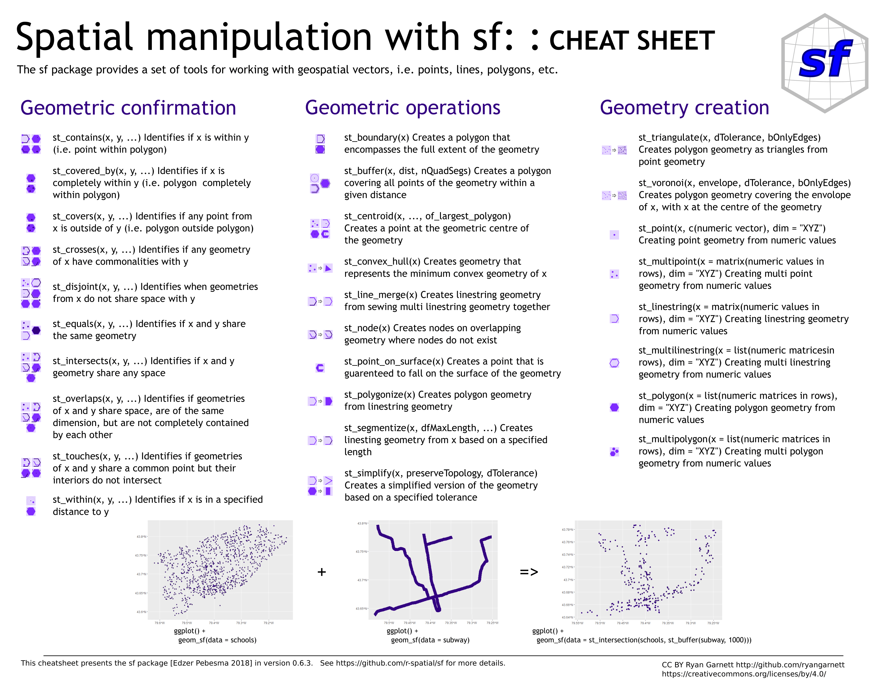

```{css, echo=FALSE}
# CSS for including pauses in printed PDF output (see bottom of lecture)
@media print {
  .has-continuation {
    display: block !important;
  }
}
.remark-code-line {
  font-size: 95%;
}
.small {
  font-size: 75%;
}
.scroll-output-full {
  height: 90%;
  overflow-y: scroll;
}
.scroll-output-75 {
  height: 75%;
  overflow-y: scroll;
}
```

```{r setup, include=FALSE}
options(htmltools.dir.version = FALSE)
library(knitr)
library(fontawesome)

# define colors
red_pink <- "#e64173"
turquoise <- "#20B2AA"
orange <- "#FFA500"
red <- "#fb6107"
blue <- "#3b3b9a"
green <- "#8bb174"
grey_light <- "grey70"
grey_mid <- "grey50"
grey_dark <- "grey20"
purple <- "#6A5ACD"
slate <- "#314f4f"

knitr::opts_chunk$set(
	fig.align = "center",
	cache = FALSE,
	dpi = 300,
  warning = F,
  message = F,
	fig.height = 5,
	out.width = "80%"
)
```

# Table of Contents: Today

**Part 2: Vector Data Manipulation**

1. [Spatial Queries: Measurement](#measure)

1. [Spatial Queries: Relationship](#relate)

1. [Geometric Operations](#geom)

1. [Spatial Joins](#join)

---

# Table of Contents: Next Time


**Part 3: Raster Data** 


1. Common Raster Data Sources

1. Raster Operations 

1. Combining Raster and Vector Data

---
# Prologue


To start, load in some packages/data from Part 1:

```{r preamble}
if (!require("pacman")) install.packages("pacman")
pacman::p_load(sf, tidyverse, tmap, units)

counties<- st_read("data/MichiganCounties/MichiganCounties.shp")
ingham <- filter(counties, NAME == "Ingham")
```
---
# Preamble

Let's also define a custom ggplot map theme
```{r mappreamble}
# add ggplot map theme
maptheme <- theme(
  panel.background = element_rect(fill = NA),
  # panel.border = element_rect(fill = NA, color = "grey75"),
  axis.text.x=element_blank(), #remove x axis labels
  axis.ticks.x=element_blank(), #remove x axis ticks
  axis.text.y=element_blank(),  #remove y axis labels
  axis.ticks.y=element_blank(),  #remove y axis ticks
  panel.grid.major = element_blank(),
  panel.grid.minor = element_blank(),
  legend.key = element_blank())
  
```

---
class: inverse, middle
name: measure

# Spatial Queries: Measurement


---

# Spatial Queries

.hi-blue[Spatial queries] ask questions of our data and return data metrics, subsets, or new data objects.  

The two basic types of spatial queries are

--

.hi-medgrn[1\. Spatial Measurement]
- Return .hi-medgrn[continuous, numerical] answers

--

  - .hi-slate[Area:] How many square meters is Lake Superior?

--

  - .hi-slate[Length:] What is the length of I-96 in Michigan?

--

  - .hi-slate[Distance:] How far is East Lansing from Traverse City?

---

# Spatial Queries


.hi-blue[Spatial queries] ask questions of our data and return data metrics, subsets, or new data objects.  

.hi-purple[2\. Spatial Relationships]
- Return .hi-purple[TRUE or FALSE] (binary predicates)

  - .hi-slate[Intersects, Overlaps, Touches, Disjoint, Crosses]
  - .hi-slate[Contains, Covered by, Covers, Within]
  - .hi-slate[Equal]
  
--

- Or the .hi-purple[set of matching features]

  - .hi-slate[Intersection]
  - .hi-slate[Difference]
  - .hi-slate[Union]
  - .hi-slate[Crop]

---

# Spatial Queries

Note: sf can do a [*lot*](https://osf.io/an6b5/download) of additional spatial manipulations




---
# Spatial Queries

Note: sf can do a [*lot*](https://osf.io/an6b5/download) of additional spatial manipulations


---
# Calculating Area

```{r area}
st_area(ingham)
```

Too big!

--

```{r area_scale}
st_area(ingham)/1000000
```

Wait, the units are wrong!

--

```{r area_units}
units::set_units(st_area(ingham), km^2)
```

[Resource: Measurement units in R](https://cran.r-project.org/web/packages/units/vignettes/measurement_units_in_R.html)
---
# Calculating Area

Next, let's add an `area` variable to our dataframe for each county:
```{r area_mutate}
counties2 <- mutate(counties,
                   area = units::set_units(st_area(counties), km^2))
mean(counties2$area)
```
--
```{r area_head}
head(counties2$area)
```
---
# Calculating Area: Impact of CRS

Recall that spatial measurements can .hi-mdgrn[differ greatly] depending on the .hi-medgrn[CRS/projection we use!]

```{r area_diff}
# Calculate area using data in WGS84 CRS (4326)
counties2$area_wgs84 <- st_transform(counties, 4326) %>% st_area() %>% set_units(km^2)
  
# Calculate area using data in Web Mercator CRS (3857)
counties2$area_web <- st_transform(counties, 3857) %>% st_area() %>% set_units(km^2)
  
# Calculate are using data in UTM Zone 16N, NAD83 (26916)
counties2$area_utm16 <- st_transform(counties, 26916) %>% st_area() %>% set_units(km^2)
  
# Take a look at the results
counties2 %>% select(starts_with("area")) %>% st_drop_geometry() %>% head()
```

---
# Calculating Area: Impact of CRS

.hi-slate[Your choice of CRS is absolutely critical to accurate calculations.]

* *.hi-blue[WGS84] is a geographic (unprojected) CRS in degrees... but `sf` calculates area using spherical geometry!

--

* .hi-medgrn[UTM16N] is optimized for most of MI. Calculations outside the zone will be increasingly distorted as we move farther away from the zone
* .hi-purple[Web Mercator] preserves shape and explicitly .hi-purple[distorts area, don't use it for area calculations!]


---
# Calculating Length
`st_length()` calculates .hi-medgrn[feature lengths] in a spatial dataframe.

Let's first load in some data on railroad locations in Michigan.

.font80[
```{r rail}
#https://gis-michigan.opendata.arcgis.com/datasets/Michigan::railroads-v17a/explore?location=42.470352%2C-84.644141%2C7.94
  ## load in the railroads data
rail <- st_read("data/Railroads/")
```
]
---
# Calculating Length

Let's first load in some data on railroad locations in Michigan.

.font80[
```{r}
st_crs(rail)
```
]

.hi-slate[Q: should we reproject the railroad data before continuing?]

---
# Calculating Length
`st_length()` calculates .hi-medgrn[feature lengths] in a spatial dataframe.

```{r length}

rail <- mutate(rail,
               len = st_length(rail)) 
head(rail$len)
```

Note the output units! (meter)

-- 

This mostly matches the (unitless) `LENGTH` variable that was already in the dataframe

---
# Calculating Length
Use `set_units()` from the .hi-slate[units] package to change to preferred units:

```{r}

rail <- mutate(rail,
               len_mi = units::set_units(st_length(rail), mi),
               len_km = units::set_units(st_length(rail), km)
               )

select(rail, starts_with("len")) %>% st_drop_geometry() %>% head()
```


---
#Calculating Distance

How far are the railroads from the centroid of MSU's campus? 

Let's create an sf object from point coordinates we [looked up on latlong.net](https://www.latlong.net/place/michigan-state-university-east-lansing-mi-usa-4710.html)

```{r}
msu <- data.frame(latitude = 42.701847,
                  longitude = -84.482170) %>% # build dataframe
  st_as_sf(coords = c("longitude", "latitude"), # specify variables with coordinates
           crs = 4326) # set WGS84 CRS

```
---
#Calculating Distance

Plotting on top of the Ingham County polygon:
```{r ingham_plot, out.width = "60%"}
ggplot() +
  geom_sf(data = filter(counties, NAME == "Ingham")) +
  geom_sf(data = msu) + 
  maptheme

```

---
#Calculating Distance

`st_distance(X, Y)` calculates .hi-blue[spherical distances] by default

```{r}
rail_msu_dist <- st_distance(rail, msu)
```

---
#Calculating Distance

What does `st_distance()` return?

```{r}
class(rail_msu_dist)
dim(rail_msu_dist)
head(rail_msu_dist)
```


---
#Calculating Distance

By default, `st_distance()` returns a `unit` object with

--

* One row per feature in X (650 rail lines)

--

* One column per feature in Y (1 point for MSU)

---
#Calculating Distance
What about the distance to the .hi-medgrn[closest rail line] for our `counties` object?
```{r dist}
rail_cnty_dist <- st_distance(counties, rail) %>% # unit object, 1 row per county
  as.data.frame() %>% # convert to data frame
  rowwise() %>% # group by row 
  summarise(min = min(c_across(everything()))) # get row min across all columns

counties$rail_dist <- rail_cnty_dist$min # add as column to counties 
```

--

Which counties don't have a rail line in them?

```{r name_error, error = TRUE}
counties$NAME[which(counties$rail_dist > 0)]
```
That doesn't work since our variable has units!

---
#Calculating Distance

.hi-medgrn[Solution:] either need to compare to a units object or change the variable to numeric.

```{r name}
counties$NAME[which(counties$rail_dist > set_units(0, m))]
```

---
#Calculating Distance
```{r dist_plot, out.width = "70%"}
ggplot() +
  geom_sf(aes(fill = as.numeric(rail_dist)), data = counties) +
  geom_sf(data = rail, color = "forestgreen") + 
  maptheme
```


---
class: inverse, middle
name: relate

# Spatial Queries: Relationship

---
# Spatial Queries: Relationship

Often we want to understand how spatial objects relate to each other.

.hi-purple[Binary predicates] tell us whether a specified relationship holds between geometries, returning a matrix of .hi-purple[TRUE or FALSE]

--

Common binary predicates include
* `st_intersects()` (most general)
* `st_within()`
* `st_contains()` (inverse of `st_within()`)

--

We can also get more specific about the type of geometric confirmation
* `st_overlaps()`, `st_touches()`, `st_disjoint()`, `st_crosses()`
* `st_covered_by()`, `st_covers()`
* `st_equal()`

---
# Spatial Queries: Relationship

Let's load in data on [protected wellhead areas](https://gis-michigan.opendata.arcgis.com/datasets/egle::wellhead-protection-areas-whpa/explore?location=42.680891%2C-84.545043%2C10.84) in MI to investigate

```{r whpa, out.width = "60%"}
whpa <- st_read("data/Wellhead_Protection_Areas_(WHPA)") %>%
  # fix invalid polygons
  st_make_valid()

# Filter county shapefile to just Ingham
ingham <- filter(counties, NAME == "Ingham")
```
---
# Spatial Queries: Relationship

And plot Ingham county with the wellhead protection areas...

--

... but first verify that they're on the same CRS!


```{r }
# Verify that CRS is the same as the rail line
stopifnot(st_crs(ingham) == st_crs(whpa))

```

---
# Spatial Queries: Relationship

And *actually* plotting Ingham county with the wellhead protection areas


```{r whpa_plot, out.width = "70%"}
tm_shape(whpa) + tm_polygons() +
  tm_shape(ingham) + tm_polygons(col = "green", alpha = 0.5)
```

---
# Spatial Queries: Relationship
Some protected areas are completely .hi-blue[within] the county, some .hi-green[overlap], and some are completely .hi-purple[outside].

Our choice of geometric predicate will therefore influence *which* wellhead areas we select

--

Let's work through them and see how they differ.

---

# Relationship Predicates

`st_intersects()` is the .hi-medgrn[most general] of confirmation functions

--

  * returns `TRUE` if x and y geometry share .hi-medgrn[any space],  `FALSE` if .hi-medgrn[absolutely no shared space]

--

We could also be more specific with the form of space that's shared

--

* `st_crosses()` looks for .hi-purple[any commonalities] between x and y.

--

* `st_touches()` looks if x and y .hi-green[share a common point] but .hi-green[interiors don't intersect]

--

* `st_overlaps()` looks if x and y .hi-pink[share space], are .hi-pink[of the same dimension], but .hi-pink[aren't completely contained by one another]


---

# Relationship Predicates


We could also be more specific with the form of space that's shared

* `st_within()` looks if x is .hi-blue[completely within] y

--

* `st_is_within_distance()` looks if x is .hi-red[within a specified distance] of y

--

* `st_contains()` looks if x .hi-dkorange[completely contains] y.

--

* `st_covered_by()` looks if x is .hi-slate[completely covered by] y.

--

* `st_covers()` looks if x .hi-yellow[completely covers] y.

--

* `st_disjoint()` looks if x .hi-grey[doesn't share space] with y.

---

# Intersects

`st_intersects()` is the .hi-medgrn[most general] of confirmation functions
  * returns `TRUE` if x and y geometry share .hi-medgrn[any space], `FALSE` if .hi-medgrn[absolutely no shared space]

--

Let's use it to retrieve the counties adjacent to Ingham.

```{r intersects1}
ingh_int <- st_intersects(counties, ingham)
class(ingh_int)
```

---

# Intersects

`st_intersects()` is the .hi-medgrn[most general] of confirmation functions
  * returns `TRUE` if x and y geometry share .hi-medgrn[any space], `FALSE` if .hi-medgrn[absolutely no shared space]


By default, `st_intersects()` returns a .hi-medgrn["sparse geometric binary predicate"] (`sgbp`) list
  * 1 list element per geometry in x (wellheads)
  * Each =1 if fully within y (ingham county)
  * =0 if not fully within

---
# Sparse vs. Non-Sparse

Setting `sparse = FALSE` yields the .hi-blue[entire TRUE/FALSE matrix]
* 1 row per row of X
* 1 column per row of Y
* element `i,j` whether geometry row `i` of X intersects geometry row `j` of Y
```{r intersects4}
ingh_int_mat <- st_intersects(counties, ingham, sparse = FALSE)
class(ingh_int_mat)
head(ingh_int_mat)
```

---
# st_filter
We could use index positions and `which` to extract matching geometries from the spatial dataframe...

But `st_filter()` makes the process of retrieving the matches even easier

--

* returns a .hi-medgrn[spatial dataframe] with the geometries that return TRUE using the chosen predicate
* default predicate: `st_intersects()`
* change predicate with the `.predicate` optional argument

```{r intersects2}
ingh_int_sf <- st_filter(counties, ingham)
ingh_int_sf$NAME
```
---
# st_filter

```{r intersects_ggplot, out.width = "70%"}
ggplot() +
  geom_sf(data = ingh_int_sf) + 
  maptheme
```


---
# Intersect vs. Within
.hi-purple[Within] is a .hi-purple[stricter] operation than .hi-medgrn[intersection]

--

* `st_intersects()` returns both the "within" and "overlap" cases

--

* `st_within()` returns only the "completely within" cases

--

Let's find which protected areas lie .hi-purple[fully within] Ingham county:
```{r int_within}
# Verify that CRS is the same as the rail line
stopifnot(st_crs(ingham) == st_crs(whpa))

whpa_within <- st_filter(whpa, ingham, .predicate = st_within)
```

---
# Intersect vs. Within

Comparing .hi-purple[within] to .hi-medgrn[intersects] highlights the difference:

.font90[
```{r int_within_plot, out.width = "60%"}
whpa_int <- st_filter(whpa, ingham)
ggplot() +
  geom_sf(data = ingham, alpha = 0.5) +
  geom_sf(data = whpa_int, fill = "green") +
  geom_sf(data = whpa_within, fill = "white") + 
  maptheme
```
]
---

# Within vs. Contains

`st_contains()` is the .hi-turquoise[inverse] of `st_within()`

* `st_contains(x,y)` returns the .hi-turquoise[transpose] of `st_within(y,x)`

```{r contains}
whpa_contain <- st_contains(ingham, whpa, sparse = FALSE) # 1 x 2837
whpa_wthn <- st_within(whpa, ingham, sparse = FALSE) # 2837 x 1
identical(whpa_contain, t(whpa_wthn))
```


---

# Overlaps

`st_overlaps()` yields the protected areas .hi-pink[partially in] Ingham County


```{r overlaps, out.width = "65%"}

ggplot() +
  geom_sf(data = ingham, alpha = 0.5) +
  geom_sf(data = st_filter(whpa, ingham, .predicate = st_overlaps), fill = "green")  + 
  maptheme

```

---

# Covered by
`st_covered_by` yields the protected areas .hi-slate[completely covered by] Ingham County
* `st_covers` is the inverse

```{r covered_by, out.width = "63%"}

ggplot() +
  geom_sf(data = ingham, alpha = 0.5) +
  geom_sf(data = st_filter(whpa, ingham, .predicate = st_covered_by), fill = "purple")  + 
  maptheme

```


---

# Touches
`st_touches` yields the protected areas that .hi-green[only touch the boundary] of Ingham County
* Spoiler: there aren't any

.font80[
```{r touches, out.width = "63%"}
ggplot() +
  geom_sf(data = ingham, alpha = 0.5) +
  geom_sf(data = st_filter(whpa, ingham, .predicate = st_touches), fill = "red")  + 
  maptheme
```
]
---

# Disjoint
`st_disjoint` returns the elements of x that .hi-grey[don't share space] with y

```{r disjoint, out.width = "70%"}
ggplot() +
  geom_sf(data = ingham, alpha = 0.5) +
  geom_sf(data = st_filter(whpa, ingham, .predicate = st_disjoint), fill = "green")  + 
  maptheme

```


---
# Spatial Queries: Relationship

We can also **create new geometries** based on the relationship between two spatial objects

--

* `st_intersection()` creates geometry equal to the .hi-blue[shared portion] of x and y

--

* `st_union()` combines geometries of x and y into a .hi-green[single geometry]

--

* `st_difference()` creates geometry equal to the .hi-pink[parts of x] that .hi-pink[don't intersect] y

--

* `st_sym_difference()` creates geometry equal to the .hi-purple[parts of x and y] that .hi-purple[don't intersect]

--

* `st_crop()` creates geometry from portion of x that .hi-medgrn[intersects a specified rectangle]


---
# Intersection

`st_intersection()` trims the protected areas to .hi-blue[only the parts contained within] Ingham county

```{r intersection, out.width = "50%"}
ggplot() +
  geom_sf(data = st_filter(whpa, ingham, .predicate = st_overlaps), fill = "yellow", alpha =0.5) +
  geom_sf(data = ingham, alpha = 0.5) +
  geom_sf(data = st_intersection(whpa, ingham), fill = "blue")  + 
  maptheme

```
---
# Intersection

Note that `st_intersection()` returns attributes from .hi-blue[both intersecting features].
* Mindlessly, without checking whether they still makes sense for the .hi-blue[intersection] geometry.
* Now we have two different sets of area/length variables, plus acre/mile values for **all of Ingham County**
```{r intersection2, out.width = "50%"}
colnames(st_intersection(whpa, ingham))
```

**Be careful when interpreting attributes after geometry operations.**

---
# Union

`st_union()` combines .hi-green[each geometry] in x with .hi-green[each geometry of y]

--

* if a protected area falls fully within y, returns y's geometry
* if it falls partially outside, returns the conjoined geometry

.font80[
```{r union, out.width = "45%"}
# calculate union
whpa_union <- st_union(whpa_int, ingham)
# plotting the new, unioned geometry in the fourth row
ggplot() +
  geom_sf(data = whpa_union[4,], alpha = 0.5, fill = "forestgreen")  + maptheme
```
]

---
# Difference

`st_difference()` returns the .hi-pink[parts] of x (protected areas) .hi-pink[not in]  y (Ingham)

.font90[
```{r diff, out.width = "70%"}
ggplot() +
  geom_sf(data = st_difference(whpa_int, ingham), alpha = 0.5, fill = "orangered")  + 
  maptheme
```
]

---
# Symmetric Difference
`st_sym_difference()` returns a geometry for each row of x that also includes the .hi-purple[parts of y] (Ingham) that are .hi-purple[not in] x (note the little missing overlapping piece)

.font90[
```{r symdiff, out.width = "65%"}
ggplot() +
  geom_sf(data = st_sym_difference(whpa_int, ingham)[4,], alpha = 0.5, fill = "violet")  + 
  maptheme
```
]
---
# Crop
`st_crop()` trims x to a .hi-medgrn[specified rectangle]

--

* .hi-medgrn[Easiest solution:] use `st_bbox()` as the y object

--

* .hi-medgrn[Less easy:] use `ymin`, `ymax`, `xmin`, `xmax` arguments to make the box manually

```{r plotbox1, out.width = "70%", eval = FALSE}
st_crop(whpa_int, st_bbox(ingham))
```

---
# Crop

The cropping is a little hard to see with Ingham county's boundary

Let's convert the bounding box to an sf object so we can plot it instead.


```{r cropbox}
# Create a dataframe with the desired point locations
box <- data.frame(lon = c(st_bbox(ingham)["xmin"], st_bbox(ingham)["xmax"], 
                          st_bbox(ingham)["xmax"], st_bbox(ingham)["xmin"]
                          ,st_bbox(ingham)["xmin"] ), 
                  lat = c(st_bbox(ingham)["ymin"], st_bbox(ingham)["ymin"],
                          st_bbox(ingham)["ymax"],st_bbox(ingham)["ymax"], 
                          st_bbox(ingham)["ymin"])) %>%
  # convert to sf object
  st_as_sf(coords = c("lon", "lat"), crs = st_crs(ingham))%>% 
  # combine the geometry and cast into a single polygon
  summarise((geometry = st_combine(geometry))) %>% 
  st_cast("POLYGON")
```

---
# Crop
  
Plotting the .hi-medgrn[uncropped] protected areas and the bounding box:

.font90[
```{r plotbox, out.width = "70%"}
ggplot() +
  geom_sf(data = box, alpha = 0.5) +
  geom_sf(data = whpa_int, alpha = 0.5, fill = "deepskyblue3") + 
  maptheme
```

]
---
# Crop
  
Plotting the .hi-blue[cropped] protected areas and the bounding box:

.font90[
```{r plot_crop_box, out.width = "66%"}
ggplot() +
  geom_sf(data = box, alpha = 0.5) +
  geom_sf(data = st_crop(whpa_int, st_bbox(ingham)), alpha = 0.5, fill = "aquamarine3")  + 
  maptheme
```

]
---
# Table of Contents: 


1. [Spatial Queries: Measurement](#queries_m)

1. [Spatial Queries: Relationship](#queries_r)

1. [Geometric Operations](#geom)

1. [Spatial Joins](#join)


```{r gen_pdf, include = FALSE, cache = FALSE, eval = FALSE}
infile = list.files(pattern = 'Vector.html')
pagedown::chrome_print(input = infile, timeout = 400)
```
