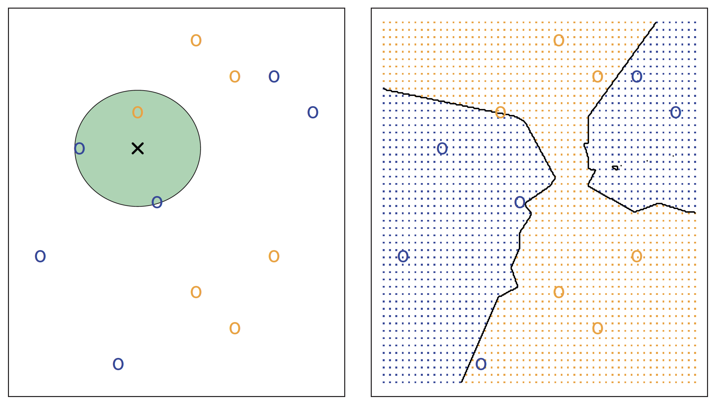
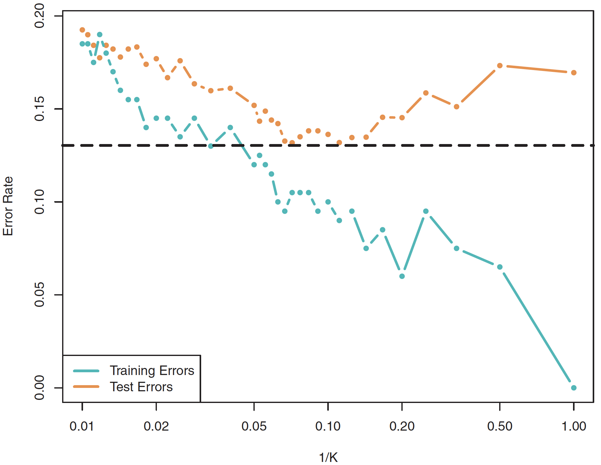

exclude: true

```{r, packages, include = F}
if (!require("pacman")) install.packages("pacman")
pacman::p_load(broom, data.table, DT, gridExtra, extrafont, FNN, glmnet, magrittr, tidyverse, viridis,
       tibble)

# Define colors
red_pink   = "#e64173"
turquoise  = "#20B2AA"
orange     = "#7BBD00"
red        = "#fb6107"
blue       = "#3b3b9a"
green      = "#8bb174"
grey_light = "grey70"
grey_mid   = "grey50"
grey_dark  = "grey20"
purple     = "#6A5ACD"
slate      = "#314f4f"
```
---

```{css, echo=FALSE}
# CSS for including pauses in printed PDF output (see bottom of lecture)
@media print {
  .has-continuation {
    display: block !important;
  }
}
.remark-code-line {
  font-size: 95%;
}
.small {
  font-size: 75%;
}
.scroll-output-full {
  height: 90%;
  overflow-y: scroll;
}
.scroll-output-75 {
  height: 75%;
  overflow-y: scroll;
}
```

```{r setup, include=FALSE}
options(htmltools.dir.version = FALSE)
library(knitr)
knitr::opts_chunk$set(
	fig.align = "center",
	cache = FALSE,
	dpi = 300,
  warning = F,
  message = F,
	fig.height = 5,
	out.width = "80%"
)
```
# Table of Contents

.pull-left[
**Part 1: Introduction to Machine Learning**

1. [Intro to Machine Learning](#about)

1. [Resampling](#resample)

**Part 2: Machine Learning Methods for Classification and Model Selection**

1. [Machine Learning for Classification](#classification)

1. [Model Selection and Regularization](#selection)
]
.pull-right[
**Part 3: Tree-Based Methods**

1. [Trees and Forests](#trees)

1. [Machine Learning for Causal Treatment Effect Estimation](#causal)

1. [Deep Learning (if time)](#deep)
]

---

# Prologue

Packages we'll use today:

```{r}
if (!require("DT")) remotes::install_github("rstudio/DT")

pacman::p_load(broom, data.table, DT, FNN, glmnet, ggrepel, ISLR, janitor,
               magrittr, tidyverse, viridis, tibble)
```


---
class: inverse, middle
name: classification
# Machine Learning for Classification

---
# Classification Problems

.hi-dkgrn[Classification Problems] are supervised learning methods for predicting .hi-medgrn[categorical labels].

--

.center[

]

```{r, pic chihuahua, echo = F, out.width = '68%', eval = F}
include_graphics("images/chihuahua-muffin.jpg")
```

---
# Classification Problems

.hi-dkgrn[Classification Problems] are supervised learning methods for predicting .hi-medgrn[categorical labels].

With categorical variables, MSE doesn't work—_e.g._,

--

.center[
$\color{#7BBD00}{\mathbf{y}} - \hat{\color{#7BBD00}{\mathbf{y}}} =$ .green[(Chihuahua)] - .green[(Blueberry muffin)] $=$ .hi-medgrn[not math]
]

--

Instead we will use the .hi-dkgrn[Training error rate:] the share of training predictions that we get wrong

$$
\begin{align}
  \dfrac{1}{n} \sum_{i=1}^{n} \mathbb{I}\!\left( \color{#7BBD00}{y}_i \neq \hat{\color{#7BBD00}{y}}_i \right)
\end{align}
$$

---

# Classification Example

Let's consider an example: the `Default` dataset from `ISLR`

```{r, datatable-default, echo = F, cache = T}
set.seed(1)
ISLR::Default %>% sample_n(100) %>% datatable(
  rownames = F,
  options = list(dom = 't')
) %>% formatRound(columns = 3:4, digits = c(2, 0))
```

---
# Classification Example

These data contain information on credit card default by  ten thousand customers.

--

Let's first add in a binary indicator of whether or not an individual defaulted:

```{r, clean-default-data, include = T}
# Clean data
default_df <- ISLR::Default %>% dplyr::mutate(i_default = 1 * (default == "Yes"))
```

---
# Classification Example

.hi-purple[The data:] The outcome, default, only takes two values (only `r default_df$i_default %>% mean() %>% scales::percent(accuracy = 0.1)` default).

```{r, boxplot-default-balance, echo = F, cache = T}
ggplot(data = default_df, aes(x = default, y = balance)) +
geom_boxplot(outlier.shape = NA, fill = "grey90") +
geom_jitter(width = 0.2, alpha = 0.1, color = purple) +
xlab("Default") +
scale_y_continuous("Balance", labels = scales::comma) +
theme_minimal(base_size = 20) +
coord_flip()
```

---
# Classification Example


.hi-purple[The data:] The outcome, default, only takes two values (only `r default_df$i_default %>% mean() %>% scales::percent(accuracy = 0.1)` default).

```{r, plot-default-points, echo = F, cache = T}
# Plot points
ggplot(data = default_df, aes(x = balance, y = i_default)) +
geom_point(alpha = 0.05, size = 3.5, color = purple) +
geom_line(stat = "smooth", color = NA, method = lm, size = 1.5) +
scale_y_continuous("Default") +
scale_x_continuous("Balance", labels = scales::comma) +
theme_minimal(base_size = 20)
```
---
# Classification Example

A .hi-pink[linear probability model] struggles with prediction in this one-predictor setting.

```{r, plot-default-lpm, echo = F, cache = T}
ggplot(data = default_df, aes(x = balance, y = i_default)) +
geom_point(alpha = 0.05, size = 3.5, color = purple) +
geom_line(stat = "smooth", color = red_pink, method = lm, size = 1.5) +
scale_y_continuous("Default") +
scale_x_continuous("Balance", labels = scales::comma) +
theme_minimal(base_size = 20)
```

---
# Classification Example

.hi-green[Logistic regression] .it[appears] to offer an improvement.

```{r, plot-default-logistic, echo = F, cache = T}
ggplot(data = default_df, aes(x = balance, y = i_default)) +
geom_point(alpha = 0.05, size = 3.5, color = purple) +
geom_line(stat = "smooth", color = red_pink, method = lm, size = 1.5, alpha = 0.2) +
geom_line(stat = "smooth", color = orange, method = "glm", method.args = list(family = "binomial"), size = 1.5) +
scale_y_continuous("Default") +
scale_x_continuous("Balance", labels = scales::comma) +
theme_minimal(base_size = 20)
```
---
# Logistic Regression

How does logistic regression do using *both* balance and income as predictors?

--

Estimating the logistic regression:

```{r}
est_logistic <- glm(
  i_default ~ balance + income,
  family = "binomial", 
  data = default_df
)

# Get predicted Y = 1 if predicted probability is >= 0.5
y_hat_logit <- as.numeric(predict(est_logistic, type = "response") >= 0.5)
```

---
# How Did We Do?

We guessed `r mean(y_hat_logit == default_df$i_default) %>% scales::percent(accuracy = 0.01)` of the observations correctly.

--

.qa[Q:] `r mean(y_hat_logit == default_df$i_default) %>% scales::percent(accuracy = 0.01)` is pretty good, right?

--

.qa[A:] It depends...
--
 Remember that `r mean(default_df$i_default) %>% scales::percent(accuracy = 0.01)` of the observations *actually* defaulted.
 
--

<br> So we would get `r (1 - mean(default_df$i_default)) %>% scales::percent(accuracy = 0.01)` right by guessing "No" for everyone..super[.pink[†]]

.footnote[
.pink[†] This idea is called the .it[null classifier].
]


--

```{r, calc-sensitivity, include = F}
tmp_df = tibble(
  y = default_df$i_default,
  y_hat = y_hat_logit,
  y_hat_base = 0
)
ex_sensitivity = tmp_df %>% filter(y == 1) %>% mutate(y == y_hat, .keep = "none") %>% unlist() %>% mean()
ex_sensitivity_base = tmp_df %>% filter(y == 1) %>% mutate(y == y_hat_base, .keep = "none") %>% unlist() %>% mean()
```

We .it[did] guess `r ex_sensitivity %>% scales::percent(accuracy = 0.01)` of the defaults, which is clearly better than 0%.

--

.qa[Q:] How would a machine learning approach perform?

--

.qa[A:] Let's see!

---
# Bayes Classifier

The .hi-pink[Bayes Classifier] as the classifier that assigns an observation to its most probable groups, given the values of its predictors, _i.e._,
.center[
Assign obs. $i$ to the class $j$ for which $\mathop{\text{Pr}}\left(\color{#FFA500}{\mathbf{y}} = j | \color{#6A5ACD}{\mathbf{X}} = \mathbf{x}_0\right)$ is the largest
]


--

The .b[Bayes classifier] minimizes the .hi-pink[test error rate].

  * The share of test predictions that we get wrong:
.center[
Average $\mathbb{I}\!\left( \color{#FFA500}{y}_0 \neq \hat{\color{#FFA500}{y}}_0 \right)$ in our .hi-pink[test data]
]

---
# Bayes Classifier

Thinking back to the chihuahua/blueberry muffin problem, if the calculated conditional probabilities for a given picture were

- Pr(.orange[y] = "chihuahua" | .purple[X] = "orange and purple") = 0.3

--

- Pr(.orange[y] = "blueberry muffin" | .purple[X] = "orange and purple") = 0.4

--

- Pr(.orange[y] = "squirrel" | .purple[X] = "orange and purple") = 0.2

--

- Pr(.orange[y] = "other" | .purple[X] = "orange and purple") = 0.1

--

Then the Bayes classifier says we should predict .hi-blue["blueberry muffin"].

---
# Bayes Classifier

More notes on the Bayes classifier:

--

1. In the .hi-blue[two-class case], we're basically looking for<br> $\text{Pr}(\color{#FFA500}{\mathbf{y}}=j~|~\color{#6A5ACD}{\mathbf{X}}=x_0)>0.5$ for one class.

--

1. The .hi-medgrn[Bayes decision boundary] is the point where the .hi-medgrn[probability is equal] between the most likely groups (_i.e._, exactly 50% for two groups).

--

1. The Bayes classifier produces the lowest possible .hi-pink[test error rate], which is called the .hi-pink[Bayes error rate].

--

1. .hi-dkgrn[Challenge:] the probabilities $\mathop{\text{Pr}}\left(\color{#FFA500}{\mathbf{y}}=j~|~\color{#6A5ACD}{\mathbf{X}}=x_o\right)$ that the Bayes classifier relies upon are .hi-dkgrn[unknown]. We have to .hi-dkgrn[estimate them].


---
# K-Nearest Neighbors

One non-parametric way to estimate these unknown conditional probabilities: .hi-purple[K-nearest neighbors (KNN)].

--

.hi-purple[K-nearest neighbors (KNN)] simply assigns a category based upon the nearest K neighbors votes (their values).

--

.note[More formally:] Using the K closest neighbors.super[.pink[†]] to test observation $\color{#6A5ACD}{\mathbf{x_0}}$, we calculate the share of the observations whose class equals $j$,
$$
\begin{align}
  \hat{\mathop{\text{Pr}}}\left(\mathbf{y} = j ~|~ \mathbf{X} = \color{#6A5ACD}{\mathbf{x_0}}\right) = \dfrac{1}{K} \sum_{i \in \mathcal{N}_0} \mathop{\mathbb{I}}\left( \color{#FFA500}{\mathbf{y}}_i = j \right)
\end{align}
$$
These shares are our estimates for the unknown conditional probabilities.

We then assign observation $\color{#6A5ACD}{\mathbf{x_0}}$ to the class with the highest probability.

.footnote[
.pink[†] In $\color{#6A5ACD}{\mathbf{X}}$ space.
]


---
# K-Nearest Neighbors

We can use the `knn.reg()` function from the .hi-slate[FNN] package to obtain these predicted classifications for our defaulters.

First, we'll randomly sample 50% of our data as a .hi-medgrn[training] sample.

```{r}
# add a row identifier into the default df
default_df <- mutate(default_df, id = row_number())

# randomly sample 50% of the data for training
train_df <- slice_sample(default_df, n = nrow(default_df)/2)
```

---
# K Nearest Neighbors

Running KNN for an initial choice of K = 5, using balance and income as predictors, with half of the data used for testing

```{r}
knn_5 <- knn.reg(
  train = select(train_df, balance, income) %>% as.matrix(),
  test = select(default_df, balance, income) %>% as.matrix(),
  #train = train_df$balance %>% as.matrix(),
  #test = test_df$balance %>% as.matrix(),
  y = train_df$i_default,
  k = 5
)
```

---
# K Nearest Neighbors

How many defaults did we correctly predict?

```{r}
default_df <- mutate(default_df,
                     phat_5 = knn_5$pred,
                     yhat = (phat_5 > 0.5) %>% as.numeric(),
                     correct = (i_default == yhat) %>% as.numeric(),
                     training = (row_number() %in% train_df$id) %>% as.numeric())
```

--

* Overall: `r mean(default_df$correct) %>% scales::percent(accuracy = 0.01)`


--

* Correct Default: `r mean(default_df$correct[default_df$default == "Yes"]) %>% scales::percent(accuracy = 0.01)`

--

* Correct Non-Default: `r mean(default_df$correct[default_df$default == "No"]) %>% scales::percent(accuracy = 0.01)`

--

All told, slightly *worse* than the logistic regression.


---
# Choice of K

The choice of K is very important—ranging from super flexible to inflexible.

--

  * When K is .hi-medgrn[low], the decision boundary becomes .hi-medgrn[overly flexible], finding patterns in the data that don't match truth

--

  * When K is .hi-blue[high], things become .hi-blue[too rigid] and the decision boundary approaches linearity
  

---
# Sensitivity to Choice of K
.font80[
```{r}
# function to estimate for a given k
est_bayes <- function(k_choice,df){
  knn <- knn.reg(
  train = select(train_df, balance, income) %>% as.matrix(),
  test = select(df, balance, income) %>% as.matrix(),
  #train = train_df$balance %>% as.matrix(),
  #test = test_df$balance %>% as.matrix(),
  y = train_df$i_default,
  k = k_choice
)
  df <- mutate(df, phat = knn$pred,
                     yhat = (phat > 0.5) %>% as.numeric(),
                     correct = (i_default == yhat) %>% as.numeric())
  
  # Error rate in training data
  error_train <- filter(df, training ==1, default == "Yes") %>% mutate(error = 1-correct, .keep = "none") %>% unlist() %>% mean()
  # Error rate in test data
  error_test <- filter(df, training ==0, default == "Yes") %>% mutate(error = 1-correct, .keep = "none") %>% unlist() %>% mean()

  return(data.frame(k = k_choice,
                    error_train = error_train,
                    error_test = error_test))
}
# running over k in 1:50
bayes_k_range <- map(1:50, est_bayes, df = default_df) %>% list_rbind()
```
]
---
# KNN Error Rates

Visualizing the error rates as a function of K: training

.font80[
```{r, echo = F, out.width = "90%"}
pivot_longer(bayes_k_range, cols = starts_with("error"), names_to = "error_type") %>%
  mutate(error_type = ifelse(error_type == "error_train", "Training Error", "Test Error")) %>%
  filter(error_type == "Training Error") %>%
ggplot() +
  geom_line(aes(x = k, y = value, linetype = "dashed")) + 
  geom_point(aes(x = k, y = value)) + 
  theme_minimal() +
  labs(linetype = NULL, x = "K", y = "Error Rate (%)")
```
]

---
# KNN Error Rates

Visualizing the error rates as a function of K: training + test

.font80[
```{r, echo = F, out.width = "90%"}
pivot_longer(bayes_k_range, cols = starts_with("error"), names_to = "error_type") %>%
  mutate(error_type = ifelse(error_type == "error_train", "Training Error", "Test Error")) %>%
ggplot() +
  geom_line(aes(x = k, y = value, linetype = error_type)) + 
  geom_point(aes(x = k, y = value)) + 
  theme_minimal() +
  labs(linetype = NULL, x = "K", y = "Error Rate (%)")
```
]

---
# Bayes Decision Boundary

Recall that the .hi-medgrn[Bayes decision boundary] is the point where the .hi-medgrn[probability is equal] between the most likely groups (_i.e._, exactly 50% for two groups)


--

Let's visualize it with a simpler example on a simulated dataset.


---
# Bayes Decision Boundary

First, generate a random dataset with a regular grid (useful for plotting later)

```{r, gen bayes data,  cache = T}
# Generate data
set.seed(1234)
n_b <- 70
bayes_gen <- tibble(
  x1 = runif(n_b, 10, 90),
  x2 = x1 + rnorm(n_b, sd = 30),
  y = (x1 - 0.9 * x2 + rnorm(10) > 0) %>% as.numeric()
)
bayes_truth <- expand.grid(x1 = 1:100, x2 = 1:100) %>% as_tibble()
```

---
# Bayes Decision Boundary

Running KNN for $k=5$ on "truth" and adding the predictions to the data:

```{r}
est_knn <- knn.reg(
  train = bayes_gen[,c("x1", "x2")],
  test = bayes_truth,
  y = bayes_gen$y,
  k = 5
)
bayes_truth$p <- est_knn$pred
bayes_truth$y <- as.numeric(est_knn$pred > 0.5)
```

---
# Bayes Decision Boundary

Sampling data points and estimating KNN for $k=5$ for two training data samples:
.font90[
```{r}
# Sample data points
bayes_sample <- sample_n(bayes_truth, size = 100) %>%
  mutate(y = rbernoulli(n = 100, p = p) * 1)
bayes_sample2 <- sample_n(bayes_truth, size = 100) %>%
  mutate(y = rbernoulli(n = 100, p = p) * 1)
# Train kNN
est_boundary <- knn.reg(
  train = bayes_sample[,c("x1", "x2")],
  test = bayes_truth[,c("x1", "x2")],
  y = bayes_sample$y,
  k = 5
)
est_boundary2 <- knn.reg(
  train = bayes_sample2[,c("x1", "x2")],
  test = bayes_truth[,c("x1", "x2")],
  y = bayes_sample2$y,
  k = 5
)
```
]
---
# Bayes Decision Boundary

Let's also estimate for $k=1$ and $k=60$ on the first sample:

```{r}
est_boundary_k1 <- knn.reg(
  train = bayes_sample[,c("x1", "x2")],
  test = bayes_truth[,c("x1", "x2")],
  y = bayes_sample$y,
  k = 1
)
est_boundary_k60 <- knn.reg(
  train = bayes_sample[,c("x1", "x2")],
  test = bayes_truth[,c("x1", "x2")],
  y = bayes_sample$y,
  k = 60
)
```

---
# Bayes Decision Boundary

Adding estimates to the full dataset:

```{r}
bayes_truth <- bayes_truth %>%
  mutate(
    y_hat = as.numeric(est_boundary$pred > 0.5),
    y_hat2 = as.numeric(est_boundary2$pred > 0.5),
    y_hat_k1 = as.numeric(est_boundary_k1$pred > 0.5),
    y_hat_k60 = as.numeric(est_boundary_k60$pred > 0.5)
  )
```


---
# Bayes Decision Boundary

The .hi-pink[Bayes decision boundary] between classes .orange[A] and .navy[B]
```{r, plot bayes boundary, echo = F, cache = T, dependson = "gen bayes data"}
ggplot(data = bayes_truth, aes(x1, x2, color = y)) +
  geom_point(shape = 20, size = 0.7) +
  geom_contour(
    aes(x = x1, y = x2, z = y),
    bins = 1, color = red_pink, size = 1.3
  ) +
  scale_color_viridis_c(option = "magma", begin = 0.1, end = 0.85) +
  theme_void() +
  theme(legend.position = "none")
```

---
# Bayes Decision Boundary

Now we sample...
```{r, plot bayes sample, echo = F, cache = T, dependson = "gen bayes data"}
ggplot(data = bayes_truth, aes(x1, x2, color = y)) +
  geom_point(shape = 20, size = 0.5) +
  geom_contour(
    aes(x = x1, y = x2, z = y),
    bins = 1, color = red_pink, size = 1.3
  ) +
  geom_point(
    data = bayes_sample,
    aes(x1, x2, color = y),
    size = 2
  ) +
  scale_color_viridis_c(option = "magma", begin = 0.1, end = 0.85) +
  theme_void() +
  theme(legend.position = "none")
```

---
# Bayes Decision Boundary

... and our first sample gives us an .hi-purple[estimated decision boundary].
```{r, echo = F, cache = T, dependson = "gen bayes data"}
ggplot(data = bayes_truth, aes(x1, x2, color = y)) +
  geom_point(shape = 20, size = 0.5) +
  geom_contour(
    aes(x = x1, y = x2, z = y),
    bins = 1, color = red_pink, size = 1.3
  ) +
  geom_point(
    data = bayes_sample,
    aes(x1, x2, color = y),
    size = 2
  ) +
  geom_contour(
    aes(x = x1, y = x2, z = y_hat),
    bins = 1, color = purple, size = 1.3
  ) +
  scale_color_viridis_c(option = "magma", begin = 0.1, end = 0.85) +
  theme_void() +
  theme(legend.position = "none")
```

---
# Bayes Decision Boundary

Resample...

```{r, plot bayes est boundary, echo = F, cache = T, dependson = "gen bayes data"}
ggplot(data = bayes_truth, aes(x1, x2, color = y)) +
  geom_point(shape = 20, size = 0.5) +
  geom_contour(
    aes(x = x1, y = x2, z = y),
    bins = 1, color = red_pink, size = 1.3
  ) +
  geom_point(
    data = bayes_sample2,
    aes(x1, x2, color = y),
    size = 2
  ) +
  geom_contour(
    aes(x = x1, y = x2, z = y_hat),
    bins = 1, color = purple, size = 1.3
  ) +
  scale_color_viridis_c(option = "magma", begin = 0.1, end = 0.85) +
  theme_void() +
  theme(legend.position = "none")
```


---
# Bayes Decision Boundary

And the second sample gives us another .hi-turquoise[estimated decision boundary].
```{r, plot bayes est boundary 2, echo = F, cache = T, dependson = "gen bayes data"}
ggplot(data = bayes_truth, aes(x1, x2, color = y)) +
geom_point(shape = 20, size = 0.5) +
geom_contour(
  aes(x = x1, y = x2, z = y),
  bins = 1, color = red_pink, size = 1.3
) +
geom_point(
  data = bayes_sample2,
  aes(x1, x2, color = y),
  size = 2
) +
geom_contour(
  aes(x = x1, y = x2, z = y_hat),
  bins = 1, color = purple, size = 1.3
) +
geom_contour(
  aes(x = x1, y = x2, z = y_hat2),
  bins = 1, color = turquoise , size = 1.3
) +
scale_color_viridis_c(option = "magma", begin = 0.1, end = 0.85) +
theme_void() +
theme(legend.position = "none")
```


---
name: knn-fig
layout: false
class: clear, middle

.b[KNN in action]
<br>.note[Left:] K=3 estimation for "x".       .note[Right:] KNN decision boundaries.
```{r, fig knn, echo = F}

```
.smaller.it[Source: ISL]

---
name: ex-knn
class: clear, middle

Decision boundaries: .hi-pink[Bayes], .hi-purple[K=1], and .hi-turquoise[K=60]
```{r, plot knn k, echo = F, cache = T, dependson = "gen bayes data"}
ggplot(data = bayes_truth, aes(x1, x2, color = y)) +
geom_point(shape = 20, size = 0.5) +
geom_contour(
  aes(x = x1, y = x2, z = y),
  bins = 1, color = red_pink, size = 1.3
) +
geom_point(
  data = bayes_sample,
  aes(x1, x2, color = y),
  size = 2
) +
geom_contour(
  aes(x = x1, y = x2, z = y_hat_k1),
  bins = 1, color = purple, size = 1.3
) +
geom_contour(
  aes(x = x1, y = x2, z = y_hat_k60),
  bins = 1, color = turquoise, size = 1.3
) +
scale_color_viridis_c(option = "magma", begin = 0.1, end = 0.85) +
theme_void() +
theme(legend.position = "none")
```


---
# Choice of K

The choice of K is very important—ranging from super flexible to inflexible.

  * When K is .hi-medgrn[low], the decision boundary becomes .hi-medgrn[overly flexible], finding patterns in the data that don't match truth

--

  * When K is .hi-blue[high], things become .hi-blue[too rigid] and the decision boundary approaches linearity
  
  
---
class: clear, middle
.medgrn[KNN error rates], as K increases
```{r, fig knn error, echo = F, out.width = '85%'}

```
.smaller.it[Source: ISL]


---
class: inverse, middle
name: selection

# Model Selection and Regularization


---
# Model Selection and Regularization

As economists, we often use .hi-medgrn[Economic Theory] to specify our econometric models.

$$f(L,K) = Y = A L^{\alpha}K^{\beta}$$

--

Which we can easily represent in R with the formula `y ~ log(L) + log(K)`


---
# Model Selection and Regularization

However, there are plenty of times where we aren't sure .hi-medgrn[which variables] to plausibly include as explanatory variables

$$
Weather_{it} = f(Temp,~ Precip, ~Wind, ~Pressure, ...)
$$

--

In cases like this, we can use machine learning to aid in .hi-blue[model selection].

---
# Model Selection and Regularization

Two main approaches:


.hi-medgrn[1\. Subset-selection methods] 
1. Algorithmically search for the .green["best" subset] of our $p$ predictors
1. Estimate the linear models via .green[least squares]

--

These methods assume we need to choose a model before we fit it...

--

.hi-blue[2\. Shrinkage methods]
- Fit a model that contains .pink[all] $\color{#e64173}{p}$ .pink[predictors]
- Simultaneously: .pink[shrink.super[.pink[†]] coefficients] toward zero

.footnote[
.pink[†] Synonyms for .it[shrink]: constrain or regularize
]

--

.note[Idea:] Penalize the model for coefficients as they move away from zero.

---
# Shrinkage Methods

Two most commonly used shrinkage methods are .hi-medgrn[Ridge Regression] and .hi-purple[LASSO]


---
# Shrinkage Methods

Two most commonly used shrinkage methods are .hi-medgrn[Ridge Regression] and .hi-purple[LASSO]

--

.hi-medgrn[Ridge Regression]
- Uses all variables
- Shrinks all coefficients towards zero

--

.hi-purple[LASSO]
- Shrinks some coefficients to exactly zero
- i.e. uses only a subset of variables


---
# Shrinkage Methods: Ridge Regression


.note[Recall] Least-squares regression gets $\hat{\beta}_j$'s by minimizing RSS, _i.e._,
$$
\begin{align}
  \min_{\hat{\beta}} \text{RSS} = \min_{\hat{\beta}} \sum_{i=1}^{n} e_i^2 = \min_{\hat{\beta}} \sum_{i=1}^{n} \bigg( \color{#FFA500}{y_i} - \color{#6A5ACD}{\underbrace{\left[ \hat{\beta}_0 + \hat{\beta}_1 x_{i,1} + \cdots + \hat{\beta}_p x_{i,p} \right]}_{=\hat{y}_i}} \bigg)^2
\end{align}
$$

--

.hi-medgrn[Ridge regression] makes a small change
- Adds  a hi-medgrn[shrinkage penalty] = the sum of squared coefficients $\left( \color{#e64173}{\lambda\sum_{j}\beta_j^2} \right)$
- Minimizes the (weighted) sum of .hi-medgrn[RSS and the shrinkage penalty]

--

$$
\begin{align}
  \min_{\hat{\beta}^R} \sum_{i=1}^{n} \bigg( \color{#FFA500}{y_i} - \color{#6A5ACD}{\hat{y}_i} \bigg)^2 + \color{#e64173}{\lambda \sum_{j=1}^{p} \beta_j^2}
\end{align}
$$


---
# Shrinkage Methods: Ridge Regression

$$
\begin{align}
  \min_{\hat{\beta}^R} \sum_{i=1}^{n} \bigg( \color{#FFA500}{y_i} - \color{#6A5ACD}{\hat{y}_i} \bigg)^2 + \color{#e64173}{\lambda \sum_{j=1}^{p} \beta_j^2}
\end{align}
$$


<br>

$\color{#e64173}{\lambda}\enspace (\geq0)$ is a .hi-medgrn[tuning parameter] for the harshness of the penalty.
<br>
$\color{#e64173}{\lambda} = 0$ implies .hi-medgrn[no penalty:] we are back to least squares.
<br>
Size of penalty changes with .hi-medgrn[units of] $\mathbf{x}_j$ $\Rightarrow$ standardize!

--
<br>
Each value of $\color{#e64173}{\lambda}$ produces a new set of coefficients.

--

Ridge's approach to the bias-variance tradeoff: .hi-dkgrn[Balance]
- Reducing .b[RSS], _i.e._, $\sum_i\left( \color{#FFA500}{y_i} - \color{#6A5ACD}{\hat{y}_i} \right)^2$
- Reducing .b[coefficients] .grey-light[(ignoring the intercept)]

$\color{#e64173}{\lambda}$ determines how much ridge "cares about" these two quantities.


---
# Shrinkage Methods: Lasso

.hi-purple[LASSO] simply replaces ridge's .hi-pink[squared] coefficients with .hi-green[absolute values].

$$
\begin{align}
\min_{\hat{\beta}^L} \sum_{i=1}^{n} \big( \color{#FFA500}{y_i} - \color{#6A5ACD}{\hat{y}_i} \big)^2 + \color{#7BBD00}{\lambda \sum_{j=1}^{p} \big|\beta_j\big|}
\end{align}
$$

Lasso's penalty does not increase with the size of $\beta_j$ (always pay $\color{#7BBD00}{\lambda}$  to increase $\big|\beta_j\big|$ by one unit)
<br>
The only way to avoid lasso's penalty is to .hi-purple[set coefficients to zero].


This feature has .hi-dkgrn[two benefits:]
1. Some coefficients will be .hi[set to zero]—we get .hi-purple["sparse" models].
1. Lasso can be used for subset/feature .hi-purple[selection].

---
# $\lambda$ and Penalization

Choosing a .hi-green[good] value for $\lambda$ is key for Ridge and LASSO.
- If $\lambda$ is too small, then our model is essentially back to OLS.
- If $\lambda$ is too large, then we shrink all of our coefficients too close to zero (or remove all our variables entirely).

--

.qa[Q:] So what do we do?
--
<br>
.qa[A:] Cross validate!

.hi-medgrn[(You saw that coming, right?)]

---
# Example

Let's get some practice with Lasso and Ridge using more credit card data:

```{r}
credit_df <- ISLR::Credit %>% clean_names()
```

.font80[
```{r echo = F}
credit_df %>% sample_n(100) %>% head()
```
]
---
# Example

First, we'll want to perform some cleaning, converting the categorical variables to dummies

```{r}
credit_std <- mutate(credit_df,
                     gender_female = (gender == "Female") %>% as.numeric(),
                     student_yes = (student == "Yes") %>% as.numeric(),
                     married_yes = (married == "Yes") %>% as.numeric(),
                     ethnicity_asian = (ethnicity == "Asian") %>% as.numeric(),
                     ethnicity_caucasian = (ethnicity == "Caucasian") %>% as.numeric()
) %>%
  select(-gender, -student, -married, -ethnicity)
```

---
# Example

For Ridge and Lasso, we will use `glmnet()` from the .hi-slate[glmnet] package.

--


The .hi-slate[key arguments] for `glmnet()` are

.col-left[
- `x` a [matrix] of predictors
- `y` outcome variable as a vector
- `standardize` (`T` or `F`)
- `alpha` elasticnet parameter
  - `alpha=0` gives ridge
  - `alpha=1` gives lasso
]

.col-right[
- `lambda` tuning parameter (sequence of numbers)
- `nlambda` alternatively, R picks a sequence of values for $\lambda$
]

---
# Example

We just need to define a .hi-medgrn[decreasing sequence] for $\lambda$, and then we're set.

```{r}
# Define our range of lambdas (glmnet wants decreasing range)
lambdas <- 10^seq(from = 5, to = -2, length = 100)
```

--

Estimating ridge regression:
```{r, ex-ridge-glmnet}
# Fit ridge regression
est_ridge = glmnet(
  x = credit_std %>% dplyr::select(-balance, -id) %>% as.matrix(),
  y = credit_std$balance,
  standardize = T,
  alpha = 0, # alpha = 0 for Ridge
  lambda = lambdas
)
```

---
# Ridge


The `glmnet` output (`est_ridge` here) contains estimated coefficients for $\lambda$. 

--

Use `coef(s = lambda)` to retrieve estimated coefficients for a .hi-medgrn[specific lambda]

For example, the smallest lambda (0.01)

```{r}
coef(est_ridge, s = 0.01) 
```


---
# Ridge
Looking at the largest lambda (1e+05) highlights how all the coefficients have been driven close to zero:

```{r}
coef(est_ridge, s = 1e+05) 
```

---
# Ridge

Retrieving all the Ridge regression coefficients for $\lambda$ between 0.01 and 100,000 and formatting long:

```{r}
# convert to data frame with variables on the columns
ridge_df <- est_ridge %>% coef() %>% t() %>% as.matrix() %>% as.data.frame()
# remove intercept and add in lambdas
ridge_df %<>% dplyr::select(-1) %>% mutate(lambda = est_ridge$lambda)
# Convert to long format
ridge_df %<>% pivot_longer(-lambda, names_to = "variable", values_to = "coefficient") %>%
  arrange(lambda, variable)
```

---
# Ridge

Plotting the coefficients for $\lambda$ between 0.01 and 100,000

```{r, echo = F}
ggplot(
  data = ridge_df,
  aes(x = lambda, y = coefficient, color = variable)
) +
geom_line() +
scale_x_continuous(
  expression(lambda),
  labels = c("0.1", "10", "1,000", "100,000"),
  breaks = c(0.1, 10, 1000, 100000),
  trans = "log10"
) +
scale_y_continuous("Ridge coefficient") +
scale_color_viridis_d("Predictor", option = "magma", end = 0.9) +
theme_minimal(base_size = 12, base_family = "Fira Sans Book") +
theme(legend.position = "bottom")
```


---
# Ridge and Lasso

`glmnet` also provides convenient cross-validation function: `cv.glmnet()`.

```{r, cv-ridge, cache = F}
# Cross validation
ridge_cv <- cv.glmnet(
  x = credit_std %>% dplyr::select(-balance, -id) %>% as.matrix(),
  y = credit_std$balance,
  alpha = 0,
  standardize = T,
  lambda = lambdas,
  # New: How we make decisions and number of folds
  type.measure = "mse", # loss function
  nfolds = 5 # number of folds to use (LOOCV if set at sample size)
)
```
---
# Ridge and Lasso

Which choice of lambda gives lowest cross-validated error?

```{r}
ridge_cv$lambda.min
```

---
# Ridge 

Visualizing Cross-validated RMSE and $\lambda$: Which $\color{#e64173}{\lambda}$ minimizes CV RMSE?

```{r, plot-cv-ridge, echo = F}
# Create data frame of our results
ridge_cv_df <- data.frame(
  lambda = ridge_cv$lambda,
  rmse = sqrt(ridge_cv$cvm)
)
# Plot
ggplot(
  data = ridge_cv_df,
  aes(x = lambda, y = rmse)
) +
geom_line() +
geom_point(
  data = ridge_cv_df %>% filter(rmse == min(rmse)),
  size = 3.5,
  color = red_pink
) +
scale_y_continuous("RMSE") +
scale_x_continuous(
  expression(lambda),
  trans = "log10",
  labels = c("0.1", "0.5857", "10", "1,000", "100,000"),
  breaks = c(0.1, ridge_cv$lambda.min, 10, 1000, 100000),
) +
theme_minimal(base_size = 20)
```

---
# Ridge 


Often, you will have a minimum more obviously far from the extremes.

--

For example, if we re-run our Ridge regression but omit the first three predictors (income, limit, and rating):


```{r, cv-ridge2, cache = F, include = F}
# Cross validation
ridge_cv2 <- cv.glmnet(
  x = credit_std %>% dplyr::select(-balance, -rating, -limit, -income) %>% as.matrix(),
  y = credit_std$balance,
  alpha = 0,
  standardize = T,
  lambda = lambdas,
  # New: How we make decisions and number of folds
  type.measure = "mse",
  nfolds = 5
)
```


```{r, plot-cv-ridge2, echo = F}
# Create data frame of our results
ridge_cv_df2 <- data.frame(
  lambda = ridge_cv2$lambda,
  rmse = sqrt(ridge_cv2$cvm)
)
# Plot
ggplot(
  data = ridge_cv_df2,
  aes(x = lambda, y = rmse)
) +
geom_line() +
geom_point(
  data = ridge_cv_df2 %>% filter(rmse == min(rmse)),
  size = 3.5,
  color = red_pink
) +
scale_y_continuous("RMSE") +
scale_x_continuous(
  expression(lambda),
  trans = "log10",
  labels = c("0.1", "10", "242.01", "1,000", "100,000"),
  breaks = c(0.1, 10, ridge_cv2$lambda.min, 1000, 100000),
) +
theme_minimal(base_size = 20)
```

---
# Lasso

How do our results differ if we perform Lasso?

```{r, cache = F}
est_lasso <- glmnet(
  x = credit_std %>% dplyr::select(-balance, -id) %>% as.matrix(),
  y = credit_std$balance,
  alpha = 1, # Lasso
  standardize = T,
  lambda = lambdas
)
```


---
# Lasso Coefficients for Range of $\lambda$
```{r, plot-lasso-glmnet, echo = F, out.width = "100%"}
lasso_df <- est_lasso %>% coef() %>% t() %>% as.matrix() %>% as.data.frame()
lasso_df %<>% dplyr::select(-1) %>% mutate(lambda = est_ridge$lambda)
# Convert to long format
lasso_df %<>% pivot_longer(-lambda, names_to = "variable", values_to = "coefficient") %>%
  arrange(lambda, variable)


ggplot(
  data = lasso_df,
  aes(x = lambda, y = coefficient, color = variable)
) +
geom_line() +
scale_x_continuous(
  expression(lambda),
  labels = c("0.1", "10", "1,000", "100,000"),
  breaks = c(0.1, 10, 1000, 100000),
  trans = "log10"
) +
scale_y_continuous("Lasso coefficient") +
scale_color_viridis_d("Predictor", option = "magma", end = 0.9) +
theme_minimal(base_size = 12) +
theme(legend.position = "bottom")
```

---
# Lasso

We can also cross validate $\lambda$ with `cv.glmnet()`:

```{r, cv-lasso, cache = F}
lasso_cv <- cv.glmnet(
  x = credit_std %>% dplyr::select(-balance, -id) %>% as.matrix(),
  y = credit_std$balance,
  alpha = 1, # Lasso
  standardize = F,
  lambda = lambdas,
  # New: How we make decisions and number of folds
  type.measure = "mse", # loss function
  nfolds = 5 # number of folds to use (LOOCV if set at sample size)
)
```

---
# Lasso
Cross-validated RMSE and $\lambda$: Which $\color{#8AA19E}{\lambda}$ minimizes CV RMSE?

```{r, plot-cv-lasso, echo = F}
# Create data frame of our results
lasso_cv_df <- data.frame(
  lambda = lasso_cv$lambda,
  rmse = sqrt(lasso_cv$cvm)
)
# Plot
ggplot(
  data = lasso_cv_df,
  aes(x = lambda, y = rmse)
) +
geom_line() +
geom_point(
  data = lasso_cv_df %>% filter(rmse == min(rmse)),
  size = 3.5,
  color = "#8AA19E"
) +
scale_y_continuous("RMSE") +
scale_x_continuous(
  expression(lambda),
  trans = "log10",
  labels = c("0.1", "10", "1,000", "100,000"),
  breaks = c(0.1, 10, 1000, 100000),
) +
theme_minimal(base_size = 20)
```


---
# Which to Use: Ridge or Lasso?

.pull-left.pink[
**Ridge regression**
<br>
<br>.b.orange[+] shrinks $\hat{\beta}_j$ .it[near] 0
<br>.b.orange[-] many small $\hat\beta_j$
<br>.b.orange[-] doesn't work for selection
<br>.b.orange[-] difficult to interpret output
<br>.b.orange[+] better when all $\beta_j\neq$ 0
<br><br> .it[Best:] $p$ is large & $\beta_j\approx\beta_k$
]

.pull-right.purple[
**Lasso**
<br>
<br>.b.orange[+] shrinks $\hat{\beta}_j$ to 0
<br>.b.orange[+] many $\hat\beta_j=$ 0
<br>.b.orange[+] great for selection
<br>.b.orange[+] sparse models easier to interpret
<br>.b.orange[-] implicitly assumes some $\beta=$ 0
<br><br> .it[Best:] $p$ is large & many $\beta_j\approx$ 0
]

--

.left-full[
> [N]either ridge... nor the lasso will universally dominate the other.

.ex[ISL, p. 224]
]

--

Alternative: .hi-red[elasticnet], which combines .pink[Ridge] and .purple[Lasso].

---

**Part 2: Machine Learning Methods for Classification and Model Selection**

1. [Machine Learning for Classification](#classification)

1. [Model Selection and Regularization](#selection)


```{r gen_pdf, include = FALSE, cache = FALSE, eval = FALSE}
infile = list.files(pattern = 'Sel.html')
pagedown::chrome_print(input = infile, timeout = 400)
```
