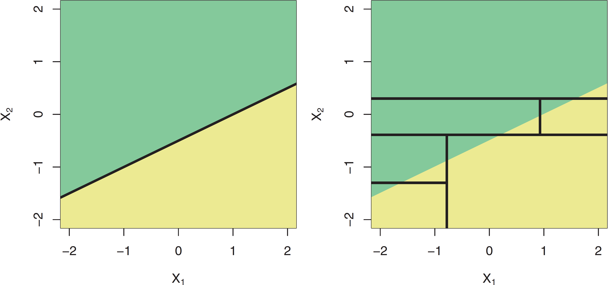

exclude: true

```{r, packages, include = F}
if (!require("pacman")) install.packages("pacman")
pacman::p_load(DiagrammeR, janitor, fixest, rsvg, DiagrammeRsvg, kableExtra,  huxtable, grf, magrittr, randomForest, 
               ranger, rpart.plot, rsample, scales, tidymodels, tidyverse, vip)


# Define colors
red_pink   = "#e64173"
turquoise  = "#20B2AA"
orange     = "#7BBD00"
red        = "#fb6107"
blue       = "#3b3b9a"
green      = "#8bb174"
grey_light = "grey70"
grey_mid   = "grey50"
grey_dark  = "grey20"
purple     = "#6A5ACD"
slate      = "#314f4f"
```
---

```{css, echo=FALSE}
# CSS for including pauses in printed PDF output (see bottom of lecture)
@media print {
  .has-continuation {
    display: block !important;
  }
}
.remark-code-line {
  font-size: 95%;
}
.small {
  font-size: 75%;
}
.scroll-output-full {
  height: 90%;
  overflow-y: scroll;
}
.scroll-output-75 {
  height: 75%;
  overflow-y: scroll;
}
```

```{r setup, include=FALSE}
options(htmltools.dir.version = FALSE)
library(knitr)
knitr::opts_chunk$set(
	fig.align = "center",
	cache = FALSE,
	dpi = 300,
  warning = F,
  message = F,
	fig.height = 5,
	out.width = "80%"
)
options(knitr.table.format = "html")
# A few extras
xaringanExtra::use_xaringan_extra(c("tile_view", "fit_screen"))
```
# Table of Contents


1. [Machine Learning for Causal Treatment Effect Estimation](#causal)
  * Causal Forest Example
  * Local Linear Forests


---
class: inverse, middle
name: causal

# Machine Learning for Causal Treatment Effect Estimation

---
# Machine Learning for Causal Treatment Effect Estimation

The goal of .hi-medgrn[Random Forests] is to estimate a .hi-medgrn[conditional mean],

$$\mu(x_0) = E[Y~|~X = x_0 ]$$
--

But what if instead we wanted to estimate... .hi-blue[any] conditional function $\theta(x_0)$?
  * Conditional linear regression coefficients
  * Conditional causal treatment effects
  * Conditional local average treatment effects using instruments
  * Quantiles of the conditional distribution of $Y~|~X = x_0$
  * Conditional class probabilities

--

Enter [Athey, Tibshirani, and Wager (2019)](https://doi.org/10.1214/18-AOS1709).

---
# Generalized Random Forests

.hi-medgrn[Generalized Random Forests] by [Athey, Tibshirani, and Wager (2019)](https://doi.org/10.1214/18-AOS1709) extends the ensemble methods of Random Forests to essentially any conditional function $\theta(x)$ that can be identified by local moment conditions.

--

They recast forests as an .hi-medgrn[adaptive locally weighted estimator]

--

1. Use the forest to calculate weighted set of neighbors for each observation (sound familiar?)

  * Employ problem-specific splitting rules to maximize the likelihood of capturing heterogeneity in $\theta(x)$
  
--

1. Use those neighbors to estimate $\theta(x)$ as the solution to a local moment equation


---
# GRF Setup


.hi-blue[More formally:]

Suppose you have an IID sample with $N$ observations.
  
--

You observe:

--

* $O_i$ an observable quantity that encodes information relevant to estimating $\theta(\cdot)$

--

  * For nonparametric regression, this is just our our outcome $O_i = \{Y_i\}$
--

  * For treatment effect estimation, $O_i = \{Y_i, W_i\}$
--

  * Generally can contain more info
  
--

* Auxiliary covariates $Xi$


---
# GRF

.hi-medgrn[Goal:] Estimate solutions to local estimating equations of the form


$$E[\psi_{\theta(x), ~\nu(x)}(O_i~|~X_i = x)] = 0$$
--

  * $\theta(x)$ the parameter we care about (i.e. conditional mean, treatment effect, regression slope)
  
--

  * $\nu(x)$ a (optional) nuisance parameter
  
<br>

If conditional mean without noise, then $\psi_{\mu(x)}(Y_i) = Y_i - \mu(x)$


---
# GRF Forest-Based Local Estimation

.hi-purple[One approach] to estimating functions like $\theta(x)$: 

  * Find $\hat{\theta}(x), \hat{\nu}(x)$ that solve

$$\sum\limits_{i=1}^n \alpha_i \psi_{\hat\theta(x), \hat\nu(x)} (O_i) = 0$$

--

  * $\alpha_i$: weights measuring relevance of the $i^{th}$ observation for fitting $\theta(\cdot)$ at $x$
    * Traditionally obtained using a kernel function (and sometimes a bandwidth)
    * Traditionally sensitive to curse of dimensionality

---
# GRF Forest-Based Local Estimation

.hi-medgrn[GRF Approach:] use forests to derive $\alpha_i$.

--

  1. Grow $b= 1,..., B$ trees
  
--

  1. Choose weights $\alpha_i(x)$ to capture how frequently the $i^{th}$ training example falls into the same leaf as $x$.
  
--

Weights within a given tree, $\alpha_{bi}(x)$, are calculated as 
  
$$\alpha_{bi}(x) = \frac{I[X_i \in L_b(x)]}{|L_b(x)|}$$
* $L_b(x)$ the set of observations falling within the same leaf as $x$

--

Overall weights for observation $i$ are then the average across all trees:

.font90[
$$\alpha_i(x) = \frac{1}{B} \sum_{b=1}^B \alpha_{bi}(x)$$
]

---
# GRF Weights

For example, we can reframe random forests and our estimate of the conditional mean function as 

$$\hat\mu(x) = \sum_{i=1}^n \frac{1}{B} \sum_{b=1}^B Y_i \frac{I[X_i \in L_b(x)]}{|L_b(x)|}$$

--

Or as the weighted sum of single tree predictions $\hat\mu_b(\cdot)$:

$$\hat\mu(x) = \frac{1}{B} \sum_{b=1}^B \hat\mu_b(x)$$


--

Or more simply, as 

$$\hat\mu(x) = \sum_{i=1}^n Y_i \alpha_i(x)$$

---
# GRF Weights Visually

Let's see how these weights are developed with a simple example: a forest with three trees and two covariates.

.pull-left[
  * $x$ the point of interest
  * lines our splits
  * darker dots the points within the same leaf
]
.center.pull-right[
.hi-green[Tree 1]

]

---
# GRF Weights Visually

Let's see how these weights are developed with a simple example: a forest with three trees and two covariates.


.pull-left[
  * $x$ the point of interest
  * lines our splits
  * darker dots the points within the same leaf
]
.center.pull-right[
.hi-purple[Tree 2]

]

---
# GRF Weights Visually

Let's see how these weights are developed with a simple example: a forest with three trees and two covariates.


.pull-left[
  * $x$ the point of interest
  * lines our splits
  * darker dots the points within the same leaf
]
.center.pull-right[
.hi-pink[Tree 3]

]

---
# GRF Weights Visually
Let's see how these weights are developed with a simple example: a forest with three trees and two covariates.

.pull-left[
Then we average across all the individual tree-based weights to obtain the overall $\alpha_i(x)$.
]
.center.pull-right[
.hi-purple[Forest Weights for] $x$

]


---
# Honesty 

One additional benefit of using GRF: growing .hi-medgrn[honest] forests

--

.hi-medgrn[Honesty] aims to reduce bias in tree predictions by using .hi-medgrn[distinct subsamples] for 1\. Building the tree, and 2\. Making predictions

--

.pull-left.center[
.hi-purple[Classic Random Forest]
* Draws a single subsample, use that subsample for both choosing a tree's splits and making predictions in that tree
]

--

.pull-right.center[
.hi-medgrn[Honest Forests]
* Draw a training sample
* Use part of that sample to choose the tree's splits
* Use the rest of the training sample to make predictions
* Prune away any remaining empty leaves 
]


---
# GRF Functions

Conveniently for us, the .hi-slate[grf] package contains tons of features and [extensive documentation](https://grf-labs.github.io/grf/index.html) to estimate a wide range of forests, including...

.hi-blue[Causal Treatment Effects]

| Approach | Forest Function |
| --------------------- |  --------------- |
| Causal Treatment Effects |  `causal_forest()` |
| Causal Treatment Effects with right-censored outcomes |`causal_survival_forest()` |
| Multi-arm/multi-outcome causal treatment effects | `multi_arm_causal_forest()` |

---
# GRF Functions

Conveniently for us, the .hi-slate[grf] package contains tons of features and [extensive documentation](https://grf-labs.github.io/grf/index.html) to estimate a wide range of forests, including...


.hi-medgrn[Moments of Conditional Distributions]

| Approach | Forest Function |
| --------------------- |  --------------- |
| Conditional Mean |  `regression_forest()`|
| Multi-outcome conditional means |  `multi_regression_forest()`|
| Right-censored Survival | `survival_forest()` |
| Conditional Quantiles |  `quantile_forest()` |
| Conditional Class Probabilities  | `probability_forest()`|

---
# GRF Functions

Conveniently for us, the .hi-slate[grf] package contains tons of features and [extensive documentation](https://grf-labs.github.io/grf/index.html) to estimate a wide range of forests, including...


.hi-purple[Regression Outcomes]

| Approach | Forest Function |
| --------------------- |  --------------- |
| Conditional Linear Model |  `lm_forest()`|
| Local Average Treatment Effects (IV) |  `instrumental_forest()`|


---
# Causal Forests

When $W_i \in \{0,1\}$ and .hi-medgrn[unconfoundedness holds], we can estimate heterogeneous causal treatment effects with .hi-blue[causal forests].


.hi-medgrn[1\. Build Phase:] greedily choose splits to maximize the .hi-green[squared difference in subgroup treatment effects]

$$n_Ln_R(\hat{\tau}_{L} - \hat{\tau})_R)^2$$
* $\hat\tau$'s chosen through a centered residual-on-residual regression (Robinson 1988)


---
# Causal Forests

.hi-purple[2\. Estimate] $\tau(x)$, where 

$$\tau(x) := lm~\left(Y_i - \hat{m}^{-1}(X_i) \sim W_i - \hat{e}^{-1}(X_i), \text{ weights} = \alpha_i(x)\right)$$
* $\left(Y_i - \hat{m}^{-1}(X_i), ~W_i - \hat{e}^{-1}(X_i)\right)$: orthogonalized outcome/treatment
  * Residual after "regressing out" the main effect of $X_i$ on $Y_i$ (W_i)
  * $\hat{m}^{-1}(X_i)$, $\hat{e}^{-1}(X_i)$ obtained from separate regression forests

  
  
---
# Causal Forests Example

Let's load in some data to see how we can run causal forests, using a sample from the .hi-medgrn[National Study of Learning Mindsets].

.center[

]

```{r}
 nslm <- read.csv("data/NSLM.csv") 
```


---
# Causal Forests Example

Taking a look at the data, we have the following variables:

.pull-left.font90[
* `schoolid` the ID of randomly selected US public high schools
* `Y`: continuous measure of achievement
* `Z`: treatment status 
* `S3`: students' self-reported expectations for future success
* `C1`: student race (categorical)
* `C2`: student gender (categorical)
* `C3`: first-generation status (categorical)
* `XC`: school urbanicity (categorical)
]
.pull-right.font90[
* `X1`: school-level mean of students' fixed mindsets
* `X2`: school achievement level (test scores + college prep)
* `X3`: school racial minority composition (% black, latino, native american)
* `X4`: school poverty (% in familes below FPL)
* `X5`: school size
]


---
# Causal Forests Example

We want to answer the following research questions:

--

1. Was a nudge-like mindset intervention designed to instill a "growth mindset" in students effective at improving achievement?

--

1. Do schools' prior achievement levels (`X2`) and pre-existing mindset norms (`X1`) effect the magnitude of this effect? 

--

Let's find out!


---
# Causal Forests Example

We *could* just run an (interacted) OLS regression...
.font90[
```{r}
pacman::p_load(fixest, grf, tidyverse)
reg1 <- feols(Y ~ Z + S3 + C1 + C2 + C3 + XC + X1 + X2 + X3 + X4 + X5, data  = nslm, vcov = "HC1")
reg2 <- feols(Y ~ Z + Z:X2 + Z:X1 + S3 + C1 + C2 + C3 + XC + X1 + X2 + X3 + X4 + X5, data  = nslm, vcov = "HC1")
etable(reg1, reg2, keep = c("Z", "X2", "X1"))
```
]
---
# Causal Forests Example

...which gives us an estimate of the mean treatment effect and mean mediating effect of `X1/X2`.

--

Instead, let's use `causal_forest()` to obtain heterogeneous treatment effects for each school.

Let's first build some data objects we'll use as arguments.

--

1\. Convert `C1` and `XC` to dummies:
  
  * `C1` has 15 levels, so rather than code each one by hand let's use `model.matrix`
    * Argument: formula

```{r}
# expand C1 categorical variable into dummies (with intercept)
C1_exp <- model.matrix(~ factor(nslm$C1) + 0)
```

---
# Causal Forests Example

Let's first build some data objects we'll use as arguments.

Repeat for `XC`:

```{r}
XC_exp <- model.matrix(~ factor(nslm$XC) + 0)
```


---
# Causal Forests Example

Next, build the predictor matrix

```{r}
# first select all covariates except for XC and C1
X <- select(nslm, -schoolid:-Y, -XC, - C1)

# Add in the dummies for XC and C1
Xmat <- cbind(X, C1_exp, XC_exp) 
```

--

And get the outcome and treatment vectors along with the school clusters:

```{r}
Y <- nslm$Y # our outcome
Z <- nslm$Z # our treatment indicator
schoolid <- nslm$schoolid
```

---
# Causal Forests Example

To perform the residual-on-residual regression step, our forest wants predictions for $\hat{Y}$ and $\hat{W}$. We can either

--

1. Omit them from the forest setup

  * The forest will estimate them for us in a separate regression forest

--

1. Run the initial regression forests manually and supply the predictions

--

Let's do the latter, but first an important consideration...

---
# Causal Forests Example

As with random forests, by default GRF methods assume .hi-medgrn[independent observations].

--

Here, we know that treatment assignment occurred at the .hi-blue[school level], so students' treatment is dependent on which school that they're at.

--

The good news is, we can account for this .hi-blue[clustering] within our forest to draw our random units at the school level.

* `clusters` the clustering variable (here our `schoolid` factor)
* `equalize.cluster.weights = TRUE` ensures we draw the same fraction frmo each cluster


---
# Causal Forests Example

Running the initial regression forests for our $\hat{Y}$ and $\hat{W}$ predictions:

```{r}
set.seed(1)
Y_forest <- regression_forest(X = Xmat, Y = Y, 
                              clusters = schoolid, #<<
                              equalize.cluster.weights = TRUE) #<<
Y_hat <- predict(Y_forest)$predictions

W_forest <- regression_forest(X = Xmat, Y = Z, clusters = schoolid, equalize.cluster.weights = TRUE)
W_hat <- predict(W_forest)$predictions
```


---
# Causal Forests Example

Setting up the causal forest:


.less-left.font90[
<br>
- `X`: the covariate matrix

]

.more-right[
```{r, eval = F}
# Define the random forest
cf <- causal_forest(X = Xmat, #<<
                    Y = Y, 
                    Y.hat = Y_hat,
                    W = Z, 
                    W.hat = W_hat,
                    clusters = schoolid,
                    equalize.cluster.weights = TRUE,
                    num.trees = 200,
                    honesty = TRUE,
                    honesty.fraction = 0.5, 
                    tune.parameters = "all"
                    )
```
]


---
# Causal Forests Example

Setting up the causal forest:


.less-left.font90[
<br>
- `X`: the covariate matrix
- `Y`: the outcome vector (our measure of student achievement)
- `W`: the treatment vector
]

.more-right[
```{r, eval = F}
# Define the random forest
cf <- causal_forest(X = Xmat, 
                    Y = Y, #<<
                    W = Z, #<<
                    Y.hat = Y_hat,
                    W.hat = W_hat,
                    clusters = schoolid,
                    equalize.cluster.weights = TRUE,
                    num.trees = 2000,
                    honesty = TRUE,
                    honesty.fraction = 0.5, 
                    tune.parameters = "all"
                    )
```
]


---
# Causal Forests Example

Setting up the causal forest:


.less-left.font90[
<br>
- `X`: the covariate matrix
- `Y`: the outcome vector (our measure of student achievement)
- `W`: the treatment vector
- `Y.hat`: our prediction of Y as a function of X
- `W.hat`: our prediction of W as a function of X
]

.more-right[
```{r, eval = F}
# Define the random forest
cf <- causal_forest(X = Xmat, 
                    Y = Y, 
                    W = Z, 
                    Y.hat = Y_hat, #<<
                    W.hat = W_hat, #<<
                    clusters = schoolid,
                    equalize.cluster.weights = TRUE,
                    num.trees = 200,
                    honesty = TRUE,
                    honesty.fraction = 0.5, 
                    tune.parameters = "all"
                    )
```
]


---
# Causal Forests Example

Setting up the causal forest:


.less-left.font90[
<br>
- `clusters`: the cluster identifier vector
- `equalize.cluster.weights`: whether to draw equal sample sizes from each cluster
]

.more-right[
```{r, eval = F}
# Define the random forest
cf <- causal_forest(X = Xmat, 
                    Y = Y, 
                    W = Z, 
                    Y.hat = Y_hat,
                    W.hat = W_hat,
                    clusters = schoolid, #<<
                    equalize.cluster.weights = TRUE, #<<
                    num.trees = 200,
                    honesty = TRUE,
                    honesty.fraction = 0.5, 
                    tune.parameters = "all"
                    )
```
]

---
# Causal Forests Example

Setting up the causal forest:


.less-left.font90[
<br>
- `clusters`: the cluster identifier vector
- `equalize.cluster.weights`: whether to draw equal sample sizes from each cluster
- `num.trees`: size of forest to grow (default is 2000)
]

.more-right[
```{r, eval = F}
# Define the random forest
cf <- causal_forest(X = Xmat, 
                    Y = Y, 
                    W = Z, 
                    Y.hat = Y_hat,
                    W.hat = W_hat,
                    clusters = schoolid, 
                    equalize.cluster.weights = TRUE, 
                    num.trees = 200, #<<
                    honesty = TRUE,
                    honesty.fraction = 0.5, 
                    tune.parameters = "all"
                    )
```
]


---
# Causal Forests Example

Setting up the causal forest:


.less-left.font90[
<br>
- `honesty`: whether or not to grow honestly (default to TRUE)
- `honesty.fraction`: the subsample portion used for growing trees (defaults to 50%)
]

.more-right[
```{r, eval = F}
# Define the random forest
cf <- causal_forest(X = Xmat, 
                    Y = Y, 
                    W = Z, 
                    Y.hat = Y_hat,
                    W.hat = W_hat,
                    clusters = schoolid, 
                    equalize.cluster.weights = TRUE, 
                    num.trees = 200, 
                    honesty = TRUE, #<<
                    honesty.fraction = 0.5,  #<<
                    tune.parameters = "all"
                    )
```
]

---
# Causal Forests Example

Setting up the causal forest:


.less-left.font90[
<br>
- `tune.parameters`: which/whether to tune parameters
  - `none, all, sample.fraction, mtry, min.node.size, honesty.fraction, honesty.prune.leaves, alpha, imbalance.penalty`
]

.more-right[
```{r, eval = T}
# Define the random forest
cf <- causal_forest(X = Xmat, 
                    Y = Y, 
                    W = Z, 
                    Y.hat = Y_hat,
                    W.hat = W_hat,
                    clusters = schoolid, 
                    equalize.cluster.weights = TRUE, 
                    num.trees = 200, 
                    honesty = TRUE, 
                    honesty.fraction = 0.5,  
                    tune.parameters = "all" #<<
                    )
```
]


---
# Variable Importance

Looking at .hi-purple[variable importance] with `variable_importance(forest)`:
  * Scaled count of how frequently variables were chosen to split on (i.e. that they maximized treatment effect heterogeneity)

.font90[
```{r, echo = F}
varimp_df <- data.frame(covar = colnames(Xmat),
                        imp = variable_importance(cf)
                       ) %>%
  arrange(desc(imp))

head(varimp_df)
```
]
---
# Split Frequencies

Alternatively, we can obtain the raw split frequencies with... `split_frequencies(forest, max.depth)`

```{r}
# getting split frequencies 4 branches deep
splitfreq <- split_frequencies(cf, max.depth = 4)
colnames(splitfreq) <- colnames(Xmat)
rownames(splitfreq) <- paste("Depth", 1:4)
splitfreq[,1:8]
```

---
# Variable Selection

Our variable importance and split frequencies reveals useful information about the covariates: some .hi-medgrn[really don't matter]

--

Since we're only considering a random subset of covariates at each potential split, by including covariates without explanatory power for treatment effect heterogeneity, we're likely .hi-purple[adding noise] and .hi-purple[diluting] the performance of our forest.

--

.hi-pink[Solution:] re-run the tree, keeping only the .hi-pink[most important variables]
  * Athey and Wager (2019): keep only variables greater than mean importance
  
  
---
# Variable Selection


Selecting the "important" covariates:

```{r}
varimp <- variable_importance(cf)
X_sel <- Xmat[,which(varimp> mean(varimp))]
colnames(X_sel)
```


---
# Causal Forests Example


And rerunning the forest with just these variables:

```{r}
cf_sel <- causal_forest(X = X_sel, 
                    Y = Y, 
                    W = Z, 
                    num.trees = 2000,
                    honesty = TRUE,
                    honesty.fraction = 0.5,
                    tune.parameters = "all" 
                    )
```


---
# Causal Forests Treatment Effects

Use the `average_treatment_effect()` function to get one of several .hi-purple[average treatment effects]:

--

* `target.sample = "all"`: The ATE 

  * $E[Y(1)-Y(0)]$

--

* `target.sample = "treated"`: The ATT 

  * $E[Y(1)-Y(0)~|~W_i = 1]$

---
# Causal Forests Treatment Effects

Use the `average_treatment_effect()` function to get one of several .hi-purple[average treatment effects]:


* `target.sample = "control"`: The average treatment effect on the control 

  * $E[Y(1)-Y(0)~|~W_i = 0]$


--

* `target.sample = "overlap"`: The overlap-weighted average treatment effect on the control
  * $E[e(X)(1-e(X))(Y(1)-Y(0))]/E[e(X)(1-e(X))]$
  * Where $e(X) = P[W_i =1 ~|~X_i = x]$

---
# Causal Forests Treatment Effects

Use the `average_treatment_effect()` function to get one of several .hi-purple[average treatment effects]:

```{r}
ate <- average_treatment_effect(cf_sel, target.sample = "all")
ate
```


---
# Causal Forests Treatment Effects

Retrieving the out-of-bag predictions for $\tau(X)$ with `predict()`:

```{r}
tauhat_oob <- predict(cf_sel, estimate.variance = TRUE)
head(tauhat_oob)
```

---
# Causal Forest Error

In addition to our predicted treatment effects and variance estimate, we get .hi-dkgrn[two types of error]:

--

.pull-left[
.center.hi-purple[Debiased Error]
* Estimate of the .hi-purple["R-loss" Criterion]
  * i.e. the .hi-purple[predictive fit] of our forest
]

--

.pull-right[
.center.hi-medgrn[Excess Error]
* Error resulting from .hi-medgrn[random nature of forests]
  * i.e. how .hi-medgrn[unstable] our estimates would be if we re-grew forests with the same data/setup
  * We want this to be very small relative to estimate's variance
]

---
# Treatment Effects

Plotting the distribution of individual treatment effects (and relative to the OLS mean estimate:)
.font80[
```{r, out.width = "60%"}
ggplot() +
  geom_histogram(aes(tauhat_oob$predictions), fill = "forestgreen", alpha = 0.6) +
  geom_vline(aes(xintercept = reg1$coefficients["Z"]), linetype = "dashed") +
  theme_minimal()
```
]
---
# ATE Subset Comparison

We can also use `subset` to see differences in top/bottom treatment effects 
```{r}
# Getting boolean vectors of top/bottom quartile treatment effects
high_effect <- tauhat_oob$predictions > quantile(tauhat_oob$predictions, 0.75)
low_effect <- tauhat_oob$predictions < quantile(tauhat_oob$predictions, 0.25)
```
---
# ATE Subset Comparison

We can also use `subset` to see differences in top/bottom treatment effects 

.pull-left[
```{r}
# getting ATE for each group
ate_high = average_treatment_effect(cf, subset = high_effect)
ate_high
```
]

--

.pull-right[
```{r}
# getting ATE for each group
ate_low = average_treatment_effect(cf, subset = low_effect)
ate_low
```
]

--

```{r, echo = F}
paste("95% CI for difference in ATE:",
      round(ate_high[1] - ate_low[1], 3), "+/-",
      round(qnorm(0.975) * sqrt(ate_high[2]^2 + ate_low[2]^2), 3))
```
---
# Causal Forests Example

Re-estimating the forest .hi-purple[without clusters] shows the importance of accounting for the cluster assignment:
```{r}

cf_noclust <- causal_forest(X = X_sel, 
                    Y = Y, 
                    Y.hat = predict(Y_forest)$predictions, 
                    W = Z, 
                    W.hat = predict(W_forest)$predictions, 
                    num.trees = 2000,
                    honesty = TRUE,
                    honesty.fraction = 0.5,
                    tune.parameters = "all"
                    )
```

---
# Test Calibration

Looking at the .hi-medgrn[Test Calibration] results for each forest shows the importance of clustering.

--

`test_calibration()` Regresses the forest error for prediction of Y on .hi-blue[two terms:]

--

1. `Mean Prediction`: indication of how well the forest captures the mean ATE
  * Coefficient indistinguishable from 1 $\rightarrow$ accurate mean prediction
--

1. `Differential Prediction:` how well the forest captures heterogeneity in the ATE
  * Coefficient distinguishable from 0 $\rightarrow$ confirms existence of heterogeneous treatment effects
  * Coefficient indistinguishable from 1 $\rightarrow$ accurately capture heterogeneity


---
# Test Calibration

First for the clustered forest:

```{r}
test_calibration(cf_sel)
```

---
# Test Calibration

Looking at the .hi-medgrn[Test Calibration] results for each forest shows the importance of clustering.

Next for the unclustered forest:

```{r}
test_calibration(cf_noclust)
```


---
# Treatment Effect Heterogeneity

It looks like there's a clear effect of the intervention nudge on achievement, but what about the mediating effects of `X1` and `X2`?

--

First, let's look at the variation in treatment effects by the values of `X1`:

```{r, echo = F, out.width = "70%"}
tauhat_x1 <- data.frame(tau_hat = predict(cf_sel)$predictions,
                        X1 = factor(round(Xmat$X1)))
ggplot(tauhat_x1) +
  geom_boxplot(aes(x =X1, y = tau_hat)) +
  theme_minimal()
```


---
# Treatment Effect Heterogeneity

Repeating for pre-existing achievement levels (`X2`):

```{r, echo = F, out.width = "72%"}
tauhat_x2 <- data.frame(tau_hat = predict(cf_sel)$predictions,
                        X2 = factor(round(Xmat$X2)))
ggplot(tauhat_x2) +
  geom_boxplot(aes(x =X2, y = tau_hat)) +
  theme_minimal()
```
.font90[
It appears that the nudge had the least impact in schools with the highest pre-existing achievement level (`X2`) 
]
---
# Covariate Correlation

One potential limitation: there are a lot of factors at the school-level associated with pre-existing achievement levels.

.font90[
```{r}
x2_reg <- feols(X2 ~ X1 + X3 + X4 + X5 + C2 + C3  | XC + C1, data = nslm)
etable(x2_reg)
```
]
---
# Simulations

.hi-medgrn[Potential solution:] use a new "simulated" covariate matrix to predict treatment effects if schools had different achievement levels, holding other characteristics fixed.

--

Let's write a function that will let us obtain treatment effect predictions if we swap the value of `X2` with a particular value in all rows:

.font70[
```{r, eval = F}
sim_x2 <- function(val){
  # replace all X2 values in the Xmat with the specified value
  X_sim <- mutate(X_sel, X2 = val)
 
  # predict using the trained forest with the new data
  res <- data.frame(preds = predict(cf_sel, newdata = X_sim)$predictions) %>%
    mutate(X2_val = val)
  return(res)
}
```
]
---
# Simulations

Next, build a vector of X2 values to predict for:

```{r, eval = F}
# get range of X2 to predict over
min_x2 <- min(Xmat$X2)%>% round(2)
max_x2 <- max(Xmat$X2) %>% round(2)
x2_seq <- seq(min_x2, max_x2, length.out = 20)
```

--

And running:

```{r, eval = F}
# Vectorizing and saving out
tic()
sim_x2_df <- map_dfr(x2_seq, sim_x2)
toc()
saveRDS(sim_x2_df, "F:/OneDrive - Michigan State University/Teaching/MSU 2023-2024/AFRE 891 SS24/Lecture-Slides/11-ML/output/x2_sim_df.rds")
```

---
# Simulations

Plotting the results suggests that other factors changing play important roles in the treatment effect too (changing `X2` in isolation not sufficient)

```{r sim-plot, echo = F, out.width = "80%"}
# Reading in the finished file, getting objects out
sim_x2_df <- readRDS("output/x2_sim_df.rds")

min_x2 <- min(Xmat$X2)%>% round(2)
max_x2 <- max(Xmat$X2) %>% round(2)
x2_seq <- seq(min_x2, max_x2, length.out = 20)

# Plotting
ggplot(data = sim_x2_df, aes(x = factor(X2_val), y =preds)) +
  geom_boxplot() +
  theme_minimal() +
  scale_x_discrete(breaks = seq(min_x2, max_x2, length.out = 20)[seq(1,20,2)],
                   labels = seq(min_x2, max_x2, length.out = 20)[seq(1,20,2)] %>% round(1)) +
  geom_hline(aes(yintercept = mean(tauhat_oob$predictions)), linetype = "dashed") +
  labs(x = "X2",
       y = expression(hat(tau)))

```
---
# Linear Boundaries


What if I want to use these methods to estimate heterogeneous treatment effects but I'm concerned about replicating .hi-medgrn[linear boundaries]?

.center[

]

--

.hi-medgrn[A: local linear forests]

---
# Local Linear Forests

[Developed in Friedberg et al. (2021)](https://www.tandfonline.com/doi/full/10.1080/10618600.2020.1831930), local linear forests combine the local smoothness benefits of local linear regression with the high-dimensional flexibility of random forests.

--

.pull-left[
.center.hi-purple[Random Forests]
* Highly data-adaptive
* Struggle to capture smoothness in conditional mean function
]

--

.pull-right[
.center.hi-medgrn[Local Linear Regression]
* Great at capturing locally smooth signals
* Quickly deteriorates due to curse of dimensionality
  * Relies on Euclidean distance, which loses locality even in 4-5 dimensions
]


---
# Local Linear Forests


Local linear forests function as a Two-stage adaptive kernel method:

--

1. Grow a random forest with splits chosen to minimize the sum of squared errors between the resulting two branches 
  
  * Uses a standard splitting procedure but splitting on the .hi-medgrn[residuals from a ridge regression] 
  
  * Partitions the covariate space based on local effects, captures existing linear signals
  
--

1. Use the forest to obtain weights $\alpha_i(x_0)$

--

1. Rather than use the weights to fit the local average at $x_0$ as in random forests, Use the $\alpha_i(x_0)$ weights to fit a .hi-medgrn[local linear regression] 
  * Includes a ridge penalty for regularization


---
# Local Linear Forests

.hi-medgrn[More formally:]

Consider two parameters:

--

1. $\mu(x_0)$: the local average at $x_0$

--

1. $\theta(x_0)$: the slope of the local line
  * Correction for local trend in $X_i - x$
  
--

.hi-blue[Goal:] solve for estimates $\hat\mu(x_0)$, $\hat\theta(x_0)$ that minimize

$$\sum_{i=1}^n \underbrace{\alpha_i(x_0)}_{\text{Weights}}(Y_i-\mu(x_0) - \underbrace{(X_i - x_0)\theta(x_0)}_{\text{Local Trend Correction}})^2 + \underbrace{\lambda||\theta(x_0)||_2^2}_{Ridge Penalty}$$
---
# Local Linear Forests

Local linear forests also extend to causal forests:

--

1\. Use local linear forests to obtain the estimates for  $\left(\hat{m}^{-1}(X_i), ~ \hat{e}^{-1}(X_i))\right)$
  
  * i.e. the leave-one-out initial predictions for $Y$ and $W$ obtained from auxiliary forests

---
# Local Linear Forests

Local linear forests also extend to causal forests:

2\. Estimate conditional average treatment effect $\hat\tau$ as the arg min of

$$\begin{split}\sum_{i=1}^n \alpha_i(x_0)\left(Y_i-\hat{m}^{-1}(x_i) - a - (X_i - x_0)\theta_a \\ - (\tau + \theta_t(X_i - x_0))(W_i - \hat{e}^{-1}(X_i))\right)^2 \\ + \lambda_\tau||\theta_\tau||_2^2 + \lambda_a||\theta_a||_2^2\end{split}$$
* $a$ intercept (0 if $\left(\hat{m}^{-1}(X_i), ~ \hat{e}^{-1}(X_i))\right)$ estimates are accurate)
* $\lambda_\tau$ and $\lambda_a$: ridge penalties for local trends in treatment and outcome
  * As these get large, we recover a standard causal forest
  
---
# Local Linear Forests

To estimate a local linear causal forest:

--

1\. Use `ll_regression_forest()` instead of `regression_forest()` to obtain the initial estimates of $\left(\hat{m}_{ll}^{-1}(X_i), ~ \hat{e}_{ll}^{-1}(X_i))\right)$ 

```{r ll-pre}
# Got LL forest predictions of Y
Y_ll_forest <- ll_regression_forest(X = Xmat, Y = Y, 
                              clusters = schoolid,
                              equalize.cluster.weights = TRUE,
                              # make forest splits on ridge residuals
                              enable.ll.split = TRUE)  #<<
Y_ll_hat <- predict(Y_ll_forest, 
                    # standardize ridge penalty by covariance 
                    ll.weight.penalty = T)$predictions #<<
# Repeat for W
W_ll_forest <- ll_regression_forest(X = Xmat, Y = Z, clusters = schoolid, equalize.cluster.weights = TRUE, enable.ll.split = TRUE) 
W_ll_hat <- predict(W_ll_forest, ll.weight.penalty = T)$predictions 
```

---
# Local Linear Forests

To estimate a local linear causal forest:


2\. Run Causal forest using the local linear forest estimates from 1\.

```{r ll-caus}
cf_sel_ll <- causal_forest(
  # unchanged parameters:
  X = X_sel, Y = Y, W = Z, clusters = schoolid, equalize.cluster.weights = TRUE, num.trees = 2000, honesty = TRUE, honesty.fraction = 0.5,  tune.parameters = "all",
  # changed inputs:
                    Y.hat = Y_ll_hat, #<<
                    W.hat = W_ll_hat, #<<
                    )
```

---
# Local Linear Forests

To estimate a local linear causal forest:

3\. Use local linear arguments of `predict()` when generating predictions for $\tau$

```{r ll-predictions}
tauhat_ll_oob <- predict(cf_sel_ll, 
                         linear.correction.variables = 1:ncol(X_sel), #<<
                         ll.weight.penalty = TRUE #<<
                         ) 
```

---
# Local Linear Forests

Comparing overall fit (Root MSE) between the two:

```{r mse}
rmse_cf <- sqrt(sum((cf_sel$Y.orig - cf_sel$Y.hat)^2)/length(cf_sel$Y.orig))
rmse_ll <- sqrt(sum((cf_sel_ll$Y.orig - cf_sel_ll$Y.hat)^2)/length(cf_sel_ll$Y.orig))
data.frame(Forest = c("Causal Forest", "Local Linear Causal Forest"),
           RMSE = c(rmse_cf, rmse_ll) %>% round(4))
```

---
# Local Linear Forests

Comparing test calibration results:

```{r comp-cal1}
test_calibration(cf_sel)
```
---
# Local Linear Forests

Comparing test calibration results:

```{r comp-cal2}
test_calibration(cf_sel_ll)
```

---
# Local Linear Forests

And comparing predictions from the two approaches:

```{r pred-comp, echo = F}
# Build prediction dataframe
pred_comp <- data.frame(pred_cf = tauhat_oob$predictions,
                        pred_ll = tauhat_ll_oob$predictions)

# build color palette
col1 <- broman::brocolors("crayons")[c("Pine Green")]
col3 <- broman::brocolors("crayons")[c("Vivid Violet")]

# Plotting
ggplot(pred_comp) +
  geom_histogram(aes(x=pred_cf, fill = "Causal Forest"), binwidth = 0.01, color = col1, alpha = 0.5) +
  geom_histogram(aes(x=pred_ll, fill = "LL Causal Forest"), binwidth = 0.01, color = col3, alpha = 0.5) +
  geom_vline(xintercept = 0, alpha= 0.5) +
  theme_minimal() +
  labs(x = expression(hat(tau)),
        y = "Count",
        title = "Prediction Comparison: Causal vs. LL Causal Forest")+
  scale_fill_manual(name = "Treatment Effect Estimates",
                    values = c("Causal Forest" = "#158078" , "LL Causal Forest" = "#8f509d" ) )

```
---

# Table of Contents


1. [Machine Learning for Causal Treatment Effect Estimation](#causal)
  * Causal Forest Example
  * Local Linear Forests

```{r gen_pdf, include = FALSE, cache = FALSE, eval = FALSE}
infile = list.files(pattern = 'GRF.html')
pagedown::chrome_print(input = infile, timeout = 400)
```

