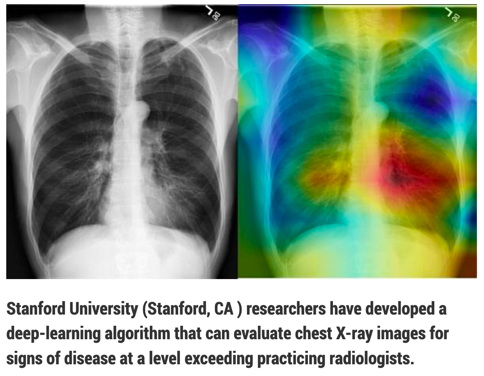
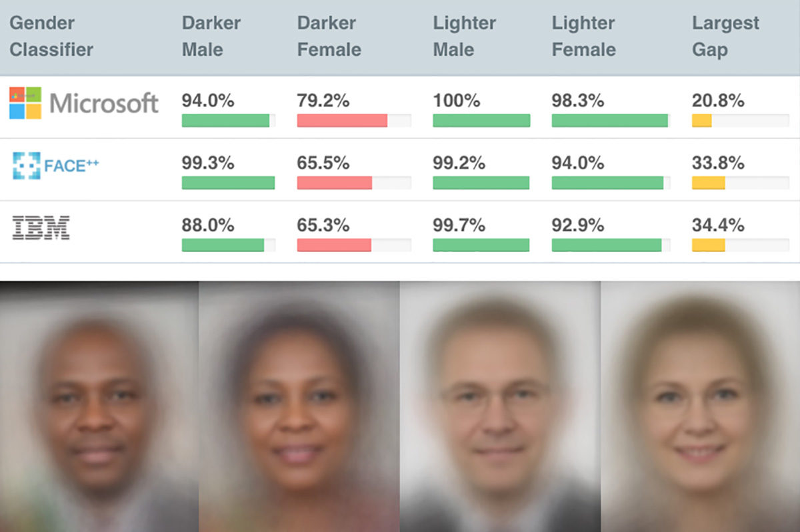

exclude: true

```{r, packages, include = F}
if (!require("pacman")) install.packages("pacman")
pacman::p_load(broom, data.table, gridExtra, extrafont, furrr, future, parallel, tidyverse, viridis,
       tibble)

# Define colors
red_pink   = "#e64173"
turquoise  = "#20B2AA"
orange     = "#7BBD00"
red        = "#fb6107"
blue       = "#3b3b9a"
green      = "#8bb174"
grey_light = "grey70"
grey_mid   = "grey50"
grey_dark  = "grey20"
purple     = "#6A5ACD"
slate      = "#314f4f"
```
---

```{css, echo=FALSE}
# CSS for including pauses in printed PDF output (see bottom of lecture)
@media print {
  .has-continuation {
    display: block !important;
  }
}
.remark-code-line {
  font-size: 95%;
}
.small {
  font-size: 75%;
}
.scroll-output-full {
  height: 90%;
  overflow-y: scroll;
}
.scroll-output-75 {
  height: 75%;
  overflow-y: scroll;
}
```

```{r setup, include=FALSE}
options(htmltools.dir.version = FALSE)
library(knitr)
knitr::opts_chunk$set(
	fig.align = "center",
	cache = FALSE,
	dpi = 300,
  warning = F,
  message = F,
	fig.height = 5,
	out.width = "80%"
)
```
# Table of Contents

**Part 1: Introduction to Machine Learning**

1. [Intro to Machine Learning](#about)

1. [Resampling](#resample)

**Part 2: Machine Learning Methods**

1. [Machine Learning for Classification](#classification)

1. [Model Selection and Regularization](#selection)

1. [Trees and Forests](#trees)

1. [Machine Learning for Causal Treatment Effect Estimation](#causal)

1. [Deep Learning (if time)](#deep)

---
class: inverse, middle
name: about

# Intro to Machine Learning

---

# Prologue

Packages we'll use today:

```{r}
#if (!require("DT")) remotes::install_github("rstudio/DT")

pacman::p_load(broom, data.table, furrr, future, ISLR, parallel, tidyverse, viridis,
       tibble)
```


---

#	What is Machine Learning?

.hi-medgrn[Machine Learning]  uses algorithms that .hi-medgrn[learn] based on the data they're given

--

So far in your econometric training you've focused largely on well-behaved estimators with desirable properties and causal identification

--

We've expanded this some in our class, but machine learning can help us tackle an additional set of new tasks


---
name: more-goals
# Applications of Machine Learning

There are many  reasons to step outside the world of linear regression...

--

.hi-medgrn[Multi-class] classification problems
- Rather than {0,1}, we need to classify $y_i$ into 1 of K classes
- _E.g._ ER patients: {heart attack, drug overdose, stroke, nothing}

--

.hi-blue[Text analysis] and .hi-blue[image recognition]
- Comb though sentences (pixels) to glean insights from relationships
- _E.g._ detect sentiments in tweets or roof-top solar and crop type in satellite imagery

---
name: more-goals
# Applications of Machine Learning

There are many  reasons to step outside the world of linear regression...

.hi-purple[Unsupervised learning]
- You don't know groupings, but you think there are relevant groups
- _E.g._ classify spatial data into groups

--


.hi-green[Treatment Effect Heterogeneity]
- You want to go beyond an average causal effect
- _E.g._ estimate conditional average treatment effects, perform simulations


---

layout: true
class: clear, middle

---
name: example-articles
```{r, xray image, echo = F, out.width = '90%'}

```

---
```{r, cars image, echo = F, out.width = '90%'}
knitr::include_graphics("images/ml-cars.png")
```

---
```{r, oil image, echo = F, out.width = '90%'}
knitr::include_graphics("images/ml-oil.png")
```

---
```{r, methane image, echo = F, out.width = '90%'}

```

---
```{r, ny image, echo = F, out.width = '90%'}
knitr::include_graphics("images/ml-writing.png")
```

---
```{r, gender-race image, echo = F, out.width = '90%'}

```

---

And of course...

[**OpenAI**](https://openai.com/) and [**ChatGPT**](https://openai.com/blog/chatgpt/)

---
layout: false
# Takeaways?

Any main takeaways/thoughts from these examples?

--

- Interactions and .hi-medgrn[nonlinearities] likely matter
- Features/variables can be important
  - We might not even know *which* are the features that matter
- Flexibility is huge, but we still want to avoid .hi-medgrn[overfitting]

---
name: sources
layout: false

# Sources

Sources (articles) of images

- [Deep learning and radiology](https://www.smart2zero.com/news/algorithm-beats-radiologists-diagnosing-x-rays)
- [Parking lot detection](https://www.smart2zero.com/news/algorithm-beats-radiologists-diagnosing-x-rays)
- [.it[New Yorker] writing](https://www.newyorker.com/magazine/2019/10/14/can-a-machine-learn-to-write-for-the-new-yorker)
- [Oil surplus](https://www.wired.com/2015/03/orbital-insight/)
- [Methane leaks](https://www.esa.int/Applications/Observing_the_Earth/Copernicus/Sentinel-5P/Monitoring_methane_emissions_from_gas_pipelines)
- [Gender Shades](http://gendershades.org/overview.html)
---
# Types of ML Algorithms

 We tend to break machine learning into two(ish) classes:

1. .hi-medgrn[Supervised learning] builds ("learns") a statistical model for predicting an .hi-green[output] $\left( \color{#7BBD00}{\mathbf{y}} \right)$ given a set of .hi-purple[inputs] $\left( \color{#6A5ACD}{\mathbf{x}_{1},\, \ldots,\, \mathbf{x}_{p}} \right)$

--

 _i.e._, we want to build a model/function $\color{#20B2AA}{f}$
$$\color{#7BBD00}{\mathbf{y}} = \color{#20B2AA}{f}\!\left( \color{#6A5ACD}{\mathbf{x}_{1},\, \ldots,\, \mathbf{x}_{p}} \right)$$
that accurately describes $\color{#7BBD00}{\mathbf{y}}$ given some values of $\color{#6A5ACD}{\mathbf{x}_{1},\, \ldots,\, x_{p}}$.

--

2. .hi-purple[Unsupervised learning] learns relationships and structure using only .hi-purple[inputs] $\left( \color{#6A5ACD}{x_{1},\, \ldots,\, x_{p}} \right)$ without any *supervising* output —letting the data "speak for itself."

--

.hi-red[Semi-supervised learning] falls somewhere between these supervised and unsupervised learning—generally applied to supervised tasks when labeled .hi-green[outputs] are incomplete.

---
# Output

We tend to further break .hi-medgrn[supervised learning] into two groups, based upon the .hi-green[output] (the type of outcome we want to predict):

--

1. .hi-blue[Classification tasks] for which the values of $\color{#7BBD00}{\mathbf{y}}$ are .hi-blue[discrete categories]
<br>*E.g.*, race, sex, loan default, hazard, disease, flight status

--

2. .hi-dkgrn[Regression tasks] in which $\color{#7BBD00}{\mathbf{y}}$ takes on .hi-dkgrn[continuous, numeric values].
<br>*E.g.*, price, arrival time, number of emails, temperature

.note[1] The use of .it[regression] differs from our use of .it[linear regression].

--

.note[2] Don't get tricked: Not all numbers represent continuous, numerical values—_e.g._, zip codes, industry codes, social security numbers.super[.green[†]].

.footnote[
.green[†] .[Q:] Where would you put responses to 5-item Likert scales?
]


---
# Why *Learning*?

**Q:** What puts the "learning" in statistical/machine learning?

--

**A:** Most learning models/algorithms will .hi-medgrn[tune model parameters] based upon the observed dataset—learning from the data.

---
# Primer on Machine Learning

This lecture we're going to do an overview of how to use machine learning for several types of tasks:

--

* .hi-medgrn[Model Selection and Regularization:] how do we choose what to throw on the RHS of a regression when economic theory doesn't tell us what the right controls or interactions are?

--

* .hi-blue[Classification:] Are there distinct groups within our highly multi-dimensional data?

--

* .hi-green[Regression Trees and Forests:] Are there differences in conditional means (treatment effects) across the covariate space? What variable are most important for informing these differences?

--

* .hi-purple[Deep Learning:] Can we predict attributes of a document or class of images?

--
  
.footnote[But first...]
  
  
---
class: inverse, middle
name: terminology

# Terminology

---
# Terminology

I'm following the notation of .hi-medgrn[[ISL (great, free textbook)](https://hastie.su.domains/ISLR2/ISLRv2_corrected_June_2023.pdf)]


---
# Data

$\color{#e64173}{n}$ gives the .pink[number of observations]

--

$\color{#6A5ACD}{p}$ represents the .purple[number of variables] available for predictions

--

$\mathbf{X}$ is our $\color{#e64173}{n}\times\color{#6A5ACD}{p}$ matrix of predictors
- Also known as .hi-medgrn[features], inputs, independent/explanatory variables, ...
- $x_{\color{#e64173}{i},\color{#6A5ACD}{j}}$ is observation $\color{#e64173}{i}$ (in $\color{#e64173}{1,\ldots,n}$) on variable $\color{#6A5ACD}{j}$ (for $\color{#6A5ACD}{j}$ in $\color{#6A5ACD}{1,...,p}$)


$$
\begin{align}
  \mathbf{X} =
  \begin{bmatrix}
    x_{1,1} & x_{1,2} & \cdots & x_{1,\color{#6A5ACD}{p}} \\
    x_{2,1} & x_{2,2} & \cdots & x_{2,\color{#6A5ACD}{p}} \\
    \vdots  & \vdots  & \ddots & \vdots \\
    x_{\color{#e64173}{n},1} & x_{\color{#e64173}{n},2} & \cdots & x_{\color{#e64173}{n},\color{#6A5ACD}{p}}
  \end{bmatrix}
\end{align}
$$

---
# Dimensions of $\mathbf{X}$

.col-left[
.hi-pink[Observation] $\color{#e64173}{i}$ is a $\color{#6A5ACD}{p}$-length vector
$$
\begin{align}
  x_{\color{#e64173}{i}} =
  \begin{bmatrix}
    x_{\color{#e64173}{i},\color{#6A5ACD}{1}} \\
    x_{\color{#e64173}{i},\color{#6A5ACD}{2}} \\
    \vdots  \\
    x_{\color{#e64173}{i},\color{#6A5ACD}{p}}
  \end{bmatrix}
\end{align}
$$
]

--

.col-right[
.hi-purple[Variable] $\color{#6A5ACD}{j}$ is an $\color{#e64173}{n}$-length vector
$$
\begin{align}
  \mathbf{x}_{\color{#6A5ACD}{j}} =
  \begin{bmatrix}
    x_{\color{#e64173}{1},\color{#6A5ACD}{j}} \\
    x_{\color{#e64173}{2},\color{#6A5ACD}{j}} \\
    \vdots  \\
    x_{\color{#e64173}{n},\color{#6A5ACD}{j}}
  \end{bmatrix}
\end{align}
$$
]

---
# Dimensions of $\mathbf{X}$

.hi-pink[Observation] $\color{#e64173}{i}$ is a $\color{#6A5ACD}{p}$-length vector

.hi-purple[Variable] $\color{#6A5ACD}{j}$ is an $\color{#e64173}{n}$-length vector

<br>

Applied to .mono[R]:
- `dim(x_df)` = $\color{#e64173}{n}$ $\color{#6A5ACD}{p}$
- `nrow(x_df)` $= \color{#e64173}{n}$; `ncol(x_df)` $= \color{#6A5ACD}{p}$
- `x_df[1,]` $\left( \color{#e64173}{i = 1} \right)$; `x_df[,1]` $\left( \color{#6A5ACD}{j = 1} \right)$

---
# Outcomes

In supervised settings, we will denote our .hi-green[outcome variable] as $\color{#7BBD00}{\mathbf{y}}$.

  * .hi-slate[Synonyms:] output, outcome, dependent/response variable, ...

--

The .green[outcome] for our .pink[i.super[th]] observation is $\color{#7BBD00}{y}_{\color{#e64173}{i}}$. Together the $\color{#e64173}{n}$ observations form

$$
\begin{align}
  \color{#7BBD00}{\mathbf{y}} =
  \begin{bmatrix}
    y_{\color{#e64173}{1}} \\
    y_{\color{#e64173}{2}} \\
    \vdots  \\
    y_{\color{#e64173}{n}}
  \end{bmatrix}
\end{align}
$$

--

and our full dataset is composed of $\bigg\{ \left( x_{\color{#e64173}{1}},\color{#7BBD00}{y}_{\color{#e64173}{1}} \right),\, \left( x_{\color{#e64173}{2}},\color{#7BBD00}{y}_{\color{#e64173}{2}} \right),\, \ldots,\, \left( x_{\color{#e64173}{n}},\color{#7BBD00}{y}_{\color{#e64173}{n}} \right) \bigg\}$


---
# MSE

.hi-medgrn[Mean squared error (MSE)] is the most common.super[.pink[†]] way to .hi-medgrn[measure model performance] in a regression setting.

.footnote[
.pink[†] *Most common* does not mean best—it just means lots of people use it.
]

$$\text{MSE} = \dfrac{1}{n} \sum_{i=1}^n \left[ \color{#7BBD00}{y}_i - \hat{\color{#20B2AA}{f}}(\color{#6A5ACD}{x}_i) \right]^2$$

Where $\color{#7BBD00}{y}_i - \hat{\color{#20B2AA}{f}}(\color{#6A5ACD}{x}_i) = \color{#7BBD00}{y}_i - \hat{\color{#7BBD00}{y}}_i$ is our prediction error.

--

Two notes about MSE

1. MSE will be (relatively) .hi-medgrn[very small] when prediction error is .hi-medgrn[nearly zero].
1. MSE .hi-medgrn[penalizes big errors] more than little errors (the squared part).


---
# MSE

.hi-medgrn[Mean squared error (MSE)] is the most common.super[.pink[†]] way to .hi-medgrn[measure model performance] in a regression setting.

.footnote[
.pink[†] *Most common* does not mean best—it just means lots of people use it.
]

$$\text{MSE} = \dfrac{1}{n} \sum_{i=1}^n \left[ \color{#7BBD00}{y}_i - \hat{\color{#20B2AA}{f}}(\color{#6A5ACD}{x}_i) \right]^2$$

One potential alternative: .hi-pink[mean absolute error (MAE)]
$$\text{MAE} = \dfrac{1}{n} \sum_{i=1}^n \left| \color{#7BBD00}{y}_i - \hat{\color{#20B2AA}{f}}(\color{#6A5ACD}{x}_i) \right|$$

---
# Training or Testing?

Low MSE (accurate performance) on the data that trained the model isn't actually impressive—maybe the model is just .hi-blue[overfitting] our data..super[.pink[†]]

.footnote[
.pink[†] Recall R-squared weakly increasing in .purple[p].
]

.hi-medgrn[What we want:] How well does the model perform .hi-medgrn[on data it has never seen]?

--

This introduces an important distinction:

1. .hi-dkgrn[Training data]: The observations $(\color{#7BBD00}{y}_i,\color{#e64173}{x}_i)$ used to .hi-medgrn[train] our model $\hat{\color{#20B2AA}{f}}$.
1. .hi-dkgrn[Testing data]: The observations $(\color{#7BBD00}{y}_0,\color{#e64173}{x}_0)$ that our model has yet to see—and which we can use to .hi-medgrn[evaluate the performance] of $\hat{\color{#20B2AA}{f}}$.

--

.hi-dkgrn[Real goal:] Low .hi-medgrn[test-sample MSE] (not the training MSE from before).


---
class: inverse, middle
name: resample

# Resampling

---
# Resampling


Before we dive into our machine learning algorithms, we should take a moment to discuss .hi-dkgrn[resampling].

--

Resampling methods help us understand uncertainty in statistical modeling
  * .hi-medgrn[Linear Regression:] How precise are your $\hat\beta_1$? 
  * .hi-medgrn[K-Means Clustering:] What choice of $K$ minimizes out-of-sample error?

  
---
# The Process Behind Resampling


Resampling methods largely follow the below steps:
  1. Split data into .hi-medgrn[training] and .hi-purple[test] data
  1. .hi-dkgrn[Repeatedly draw samples] from the .hi-dkgrn[training data]
  1. .hi-dkgrn[Fit your model](s) on each random sample
  1. .hi-dkgrn[Compare] model performance (or estimates) .hi-dkgrn[across samples]
  1. Infer the .hi-dkgrn[variability/uncertainty in your model] from (3)
  
--

.note[Warning 1:] resampling methods can be computationally intensive

.note[Warning 2:] certain methods only work in certain settings

---
# Resampling Methods

We're going to focus on two common .hi-dkgrn[resampling methods:]

--

1. .hi-blue[Cross validation] used to .hi-medgrn[estimate test error], evaluating performance or selecting a model's flexibility

--

1. .hi-red[Bootstrap] used to .hi-medgrn[assess accuracy]—parameter estimates or methods

---
# Cross-Validation and Hold-out Methods

.hi-dkgrn[Hold-out methods] like .hi-blue[Cross-validation] use the training data itself to estimate test performance

--

* .hi-dkgrn[Holds out] a mini "test" sample of the training data that we use to estimate the test error.

--

Two approaches we'll see:
  * .hi-purple[Leave-one-out cross-validation (LOOCV):] leave out one observation, train the model, estimate error, repeat over all observations
  * .hi-pink[k-fold cross-validation:] split data into k groups (folds), leave out one fold and train the model, estimate error, repeat over all folds

---
# Leave-one-out Cross Validation
.hi-purple[Leave-one-out cross-validation (LOOCV)] maximizes the available training data while still maintaining separation between training and validation subsets

--
Benefits:

1. .hi-medgrn[Reduces bias] relative to validation set methods by using n-1 (almost all) observations for training.
  * .hi-medgrn[Validation set:] reserve a subset (30%) 
2. .hi-medgrn[Resolves variance]: it makes all possible comparisons<br>(no dependence upon which validation-test split you make).

---
# Leave-one-out Cross Validation

Steps:
  1. .hi-dkgrn[Leave out] one observation $i$
  1. .hi-dkgrn[Train] the model on the $n-1$ observations
  1. .hi-dkgrn[Calculate] MSE.sub[i]
  1. .hi-dkgrn[Take Mean]

$$
\begin{align}
  \text{CV}_{(n)} = \dfrac{1}{n} \sum_{i=1}^{n} \text{MSE}_i
\end{align}
$$


---
exclude: true
```{r, sim-validation, include = F, cache = T}
# Generate population and sample
N = 1e5
set.seed(12345)
pop_dt = data.table(
  x1 = runif(N, min = -1, max = 1),
  x2 = runif(N, min = -1, max = 1),
  x3 = runif(N, min = -1, max = 1),
  er = rnorm(N, sd = 3)
)
pop_dt <- mutate(pop_dt, 
  y = 3 + 5 * x1 - 4 * x2 + 3 * x1 * x2 * x3 + x3 - 2 * x3^2 + 0.1 * x3^3 + er
)
# Grab our sample
sample_dt = pop_dt[1:1e3,]
# For 10 seeds, grab validation set and estimate flexibility
vset_dt = mclapply(
  X = 1:10,
  mc.cores = 1, # can change to more if 
  FUN = function(i) {
    # Set seed
    set.seed(i)
    # Grab validation set
    v_i = sample.int(1e3, size = 500, replace = F)
    vset_i = sample_dt[v_i,]
    tset_i = sample_dt[setdiff(1:1e3, v_i),]
    # Train models for y~x3 and grab their validation MSEs
    mse_i = lapply(
      X = 1:10,
      FUN = function(p) {
        # Train the model
        model_ip = lm(y ~ poly(x3, p, raw = T), data = tset_i)
        # Predict
        mean((vset_i$y - predict(model_ip, newdata = vset_i, se.fit = F))^2)
      }
    ) %>% unlist()
    # Create dataset
    data.table(iter = i, degree = 1:10, mse = mse_i)
  }
) %>% rbindlist()
# Repeat using full training model to train and full population to test
mse_true = lapply(
  X = 1:10,
  FUN = function(p) {
    # Train the model
    model_p = lm(y ~ poly(x3, p, raw = T), data = sample_dt)
    # Predict
    mean((pop_dt[-(1:1e3),]$y - predict(model_p, newdata = pop_dt[-(1:1e3),], se.fit = F))^2)
  }
) %>% unlist()
true_dt = data.table(degree = 1:10, mse = mse_true, iter = 1)
```

---
exclude: true

```{r, mse-loocv, include = F, cache = T, dependson = "sim-validation"}
# Calculate LOOCV MSE for each p
mse_loocv = lapply(
  X = 1:10,
  FUN = function(p) {
    # Train the model
    model_p = lm(y ~ poly(x3, p, raw = T), data = sample_dt)
    # Leverage
    h_p = hatvalues(model_p)
    # y and predictions
    y_p = sample_dt$y
    y_hat_p = model_p$fitted.values
    # MSE
    data.table(
      degree = p,
      mse = 1 / nrow(sample_dt) * sum(((y_p - y_hat_p) / (1 - h_p))^2),
      iter = 1
    )
  }
) %>% rbindlist()
```

---
exclude: true

```{r, data-loocv, include = F, cache = T}
# Generate data
X = 40
Y = 12
loocv_df = expand_grid(
  x = 1:X,
  y = -(1:Y)
) %>% mutate(
  i = 1:(X * Y),
  grp_1 = if_else(i == 1, "Validate", "Train"),
  grp_2 = if_else(i == 2, "Validate", "Train"),
  grp_3 = if_else(i == 3, "Validate", "Train"),
  grp_4 = if_else(i == 4, "Validate", "Train"),
  grp_5 = if_else(i == 5, "Validate", "Train"),
  grp_n = if_else(i == X*Y, "Validate", "Train")
)
```

---
# Leave-one-out Cross Validation

```{r, plot-loocv-1, echo = F, fig.height = 3, dependson = "data-loocv", cache = T}
ggplot(data = loocv_df, aes(x, y, fill = grp_1, color = grp_1)) +
geom_point(shape = 21, size = 4.5, stroke = 0.5) +
scale_fill_manual("", values = c("white", slate)) +
scale_color_manual("", values = c(purple, slate)) +
theme_void() +
theme(legend.position = "none")
```

.slate[Observation 1's turn for validation produces MSE.sub[1]].

---
# Leave-one-out Cross Validation

```{r, plot-loocv-2, echo = F, fig.height = 3, dependson = "data-loocv", cache = T}
ggplot(data = loocv_df, aes(x, y, fill = grp_2, color = grp_2)) +
geom_point(shape = 21, size = 4.5, stroke = 0.5) +
scale_fill_manual("", values = c("white", slate)) +
scale_color_manual("", values = c(purple, slate)) +
theme_void() +
theme(legend.position = "none")
```

.slate[Observation 2's turn for validation produces MSE.sub[2]].

---
# Leave-one-out Cross Validation

```{r, plot-loocv-3, echo = F, fig.height = 3, dependson = "data-loocv", cache = T}
ggplot(data = loocv_df, aes(x, y, fill = grp_3, color = grp_3)) +
geom_point(shape = 21, size = 4.5, stroke = 0.5) +
scale_fill_manual("", values = c("white", slate)) +
scale_color_manual("", values = c(purple, slate)) +
theme_void() +
theme(legend.position = "none")
```

.slate[Observation 3's turn for validation produces MSE.sub[3]].

---
# Leave-one-out Cross Validation

```{r, plot-loocv-4, echo = F, fig.height = 3, dependson = "data-loocv", cache = T}
ggplot(data = loocv_df, aes(x, y, fill = grp_4, color = grp_4)) +
geom_point(shape = 21, size = 4.5, stroke = 0.5) +
scale_fill_manual("", values = c("white", slate)) +
scale_color_manual("", values = c(purple, slate)) +
theme_void() +
theme(legend.position = "none")
```

.slate[Observation 4's turn for validation produces MSE.sub[4]].

---
# Leave-one-out Cross Validation

```{r, plot-loocv-5, echo = F, fig.height = 3, dependson = "data-loocv", cache = T}
ggplot(data = loocv_df, aes(x, y, fill = grp_5, color = grp_5)) +
geom_point(shape = 21, size = 4.5, stroke = 0.5) +
scale_fill_manual("", values = c("white", slate)) +
scale_color_manual("", values = c(purple, slate)) +
theme_void() +
theme(legend.position = "none")
```

.slate[Observation 5's turn for validation produces MSE.sub[5]].

---
# Leave-one-out Cross Validation

```{r, plot-loocv-n, echo = F, fig.height = 3, dependson = "data-loocv"}
# The final observation
ggplot(data = loocv_df, aes(x, y, fill = grp_n, color = grp_n)) +
geom_point(shape = 21, size = 4.5, stroke = 0.5) +
scale_fill_manual("", values = c("white", slate)) +
scale_color_manual("", values = c(purple, slate)) +
theme_void() +
theme(legend.position = "none")
```

.slate[Observation n's turn for validation produces MSE.sub[n]].

---
# k-fold Cross Validation

.hi-pink[k-fold cross-validation (LOOCV)] is less computationally demanding and has (generally) greater accuracy

  * Somewhat .hi-pink[higher bias:] $n-1$ vs. $(k-1)/k$
  * .hi-pink[Lower variance:] high degree of correlation in LOOCV MSE
  
--

.hi-pink[Steps:]

  1. .hi-dkgrn[Divide] the training data into $k$ equally sized groups (folds).
  1. .hi-dkgrn[Train] the model on the other $k-1$ folds
  1. .hi-dkgrn[Repeat] for all folds
  1. .hi-dkgrn[Average] the folds' MSEs to estimate test MSE


---
exclude: true

```{r, data-cv, include = F, cache = T}
# Generate data
X = 40
Y = 12
set.seed(12345)
cv_df = expand_grid(
  x = 1:X,
  y = 1:Y
) %>% mutate(
  id = 1:(X*Y),
  grp = sample(X * Y) %% 5 + 1
)
# Find groups
a = seq(1, X*Y, by = X*Y/5)
b = c(a[-1] - 1, X*Y)
```

---
layout: true
# k-fold Cross Validation

With $k$-fold cross validation, we estimate test MSE as
$$
\begin{align}
  \text{CV}_{(k)} = \dfrac{1}{k} \sum_{i=1}^{k} \text{MSE}_{i}
\end{align}
$$

---
# k-fold Cross Validation
```{r, plot-cvk-0a, echo = F, fig.height = 3, dependson = "data-cv"}
ggplot(data = cv_df, aes(x, y, color = grp)) +
geom_point(size = 4.5) +
scale_color_viridis_c(option = "magma", end = 0.925) +
theme_void() +
theme(legend.position = "none")
```

Our $k=$ 5 folds.

---
# k-fold Cross Validation
```{r, plot-cvk-0b, echo = F, fig.height = 3, dependson = "data-cv"}
ggplot(data = cv_df, aes(x, y, color = grp == 1, fill = grp == 1)) +
geom_point(shape = 21, size = 4.5, stroke = 0.5) +
scale_fill_manual("", values = c("white", slate)) +
scale_color_manual("", values = c(purple, slate)) +
theme_void() +
theme(legend.position = "none")
```

Each fold takes a turn at .hi-slate[validation]. The other $k-1$ folds .hi-purple[train].

---
# k-fold Cross Validation
```{r, plot-cvk-1, echo = F, fig.height = 3, dependson = "data-cv"}
ggplot(
  data = cv_df,
  aes(x, y, color = between(id, a[1], b[1]), fill = between(id, a[1], b[1]))
) +
geom_point(shape = 21, size = 4.5, stroke = 0.5) +
scale_fill_manual("", values = c("white", slate)) +
scale_color_manual("", values = c(purple, slate)) +
theme_void() +
theme(legend.position = "none")
```

For $k=5$, fold number $1$ as the .hi-slate[validation set] produces MSE.sub[k=1].

---
# k-fold Cross Validation
```{r, plot-cvk-2, echo = F, fig.height = 3, dependson = "data-cv"}
ggplot(
  data = cv_df,
  aes(x, y, color = between(id, a[2], b[2]), fill = between(id, a[2], b[2]))
) +
geom_point(shape = 21, size = 4.5, stroke = 0.5) +
scale_fill_manual("", values = c("white", slate)) +
scale_color_manual("", values = c(purple, slate)) +
theme_void() +
theme(legend.position = "none")
```

For $k=5$, fold number $2$ as the .hi-slate[validation set] produces MSE.sub[k=2].

---
# k-fold Cross Validation
```{r, plot-cvk-3, echo = F, fig.height = 3, dependson = "data-cv"}
ggplot(
  data = cv_df,
  aes(x, y, color = between(id, a[3], b[3]), fill = between(id, a[3], b[3]))
) +
geom_point(shape = 21, size = 4.5, stroke = 0.5) +
scale_fill_manual("", values = c("white", slate)) +
scale_color_manual("", values = c(purple, slate)) +
theme_void() +
theme(legend.position = "none")
```

For $k=5$, fold number $3$ as the .hi-slate[validation set] produces MSE.sub[k=3].

---
# k-fold Cross Validation
```{r, plot-cvk-4, echo = F, fig.height = 3, dependson = "data-cv"}
ggplot(
  data = cv_df,
  aes(x, y, color = between(id, a[4], b[4]), fill = between(id, a[4], b[4]))
) +
geom_point(shape = 21, size = 4.5, stroke = 0.5) +
scale_fill_manual("", values = c("white", slate)) +
scale_color_manual("", values = c(purple, slate)) +
theme_void() +
theme(legend.position = "none")
```

For $k=5$, fold number $4$ as the .hi-slate[validation set] produces MSE.sub[k=4].

---
# k-fold Cross Validation
```{r, plot-cvk-5, echo = F, fig.height = 3, dependson = "data-cv"}
ggplot(
  data = cv_df,
  aes(x, y, color = between(id, a[5], b[5]), fill = between(id, a[5], b[5]))
) +
geom_point(shape = 21, size = 4.5, stroke = 0.5) +
scale_fill_manual("", values = c("white", slate)) +
scale_color_manual("", values = c(purple, slate)) +
theme_void() +
theme(legend.position = "none")
```

For $k=5$, fold number $5$ as the .hi-slate[validation set] produces MSE.sub[k=5].


---
exclude: true

```{r, sim-cvk, include = F, cache = T, dependson = "sim-validation"}
# 5-fold cross validation, 20 times
cv_sim = mclapply(X = 1:20, mc.cores = 1, FUN = function(s) {
  set.seed(s)
  # Assign folds for CV
  sample_cv = copy(sample_dt) %T>% setDT()
  sample_cv[, fold := sample(1:.N) %% 5 + 1]
  # Iterate over polynomial degrees
  mse_s = lapply(X = 1:10, function(p) {
    # Iterate over folds
    lapply(X = 1:5, FUN = function(k) {
      # Train the model
      model_spk = lm(y ~ poly(x3, p, raw = T), data = sample_cv[fold != k])
      # Predict
      mean(
        (sample_cv[fold == k,y] - predict(
          model_spk,
          newdata = sample_cv[fold == k],
          se.fit = F
        )
      )^2)
    }) %>% unlist() %>% mean()
  }) %>% unlist()
  data.table(degree = 1:10, mse = mse_s, iter = s)
}) %>% rbindlist()
```

---
name: ex-cv-sim
layout: false
class: clear, middle

.b[Test MSE] .it[vs.] estimates: .orange[LOOCV], .pink[5-fold CV] (20x), and .purple[validation set] (10x)
```{r, plot-cv-mse, echo = F, dependson = c("sim-validation", "mse-loocv", "sim-cvk"), cache = T}
ggplot(data = vset_dt, aes(x = degree, y = mse, group = iter)) +
geom_line(alpha = 0.5, color = purple) +
geom_point(alpha = 0.5, color = purple, shape = 1) +
geom_line(data = true_dt, aes(x = degree, y = mse), color = "black", size = 1) +
geom_point(data = true_dt, aes(x = degree, y = mse), color = "black", size = 3) +
geom_line(data = cv_sim, aes(x = degree, y = mse, group = iter), color = red_pink, size = 1) +
geom_point(data = cv_sim, aes(x = degree, y = mse, group = iter), color = red_pink, size = 3) +
geom_line(data = mse_loocv, aes(x = degree, y = mse), color = orange, size = 1) +
geom_point(data = mse_loocv, aes(x = degree, y = mse), color = orange, size = 3) +
scale_x_continuous("Polynomial degree of x", breaks = seq(2, 10, 2)) +
ylab("MSE") +
theme_minimal(base_size = 18, base_family = "Fira Sans Book") +
scale_color_viridis_c(option = "magma", begin = 0.3, end = 0.9) +
theme(legend.position = "none")
```

---
layout: false
class: clear, middle

.note[Note:] Each of these methods extends to .hi-dkgrn[classification settings], _e.g._, LOOCV
$$
\begin{align}
   \text{CV}_{(n)} = \dfrac{1}{n} \sum_{i=1}^{n} \mathop{\mathbb{I}}\left( \color{#7BBD00}{y_i} \neq \color{#7BBD00}{\hat{y}_i} \right)
\end{align}
$$

---
name: holdout-caveats
layout: false
# Caveat

So far, we've treated each observation as separate/independent from each other observation.

The methods that we've defined assume this .b.slate[independence].

--

Make sure that you think about

- the .b.slate[structure] of your data
- the .b.slate[goal] of the prediction exercise

.note[E.g.,]

1. Are you trying to predict the behavior of .b.purple[existing] or .b.pink[new] customers?
2. Are you trying to predict .b.purple[historical] or .b.pink[future] recessions?
---
class: inverse, middle
name: boot-intro

# The Bootstrap

---
# The Bootstrap


The .hi-red[Bootstrap] is a resampling method often used to quantify the .hi-red[uncertainty (variability) underlying an estimator] or learning method.

--

.hi-dkgrn[Hold-out methods]
- Randomly divide the sample into training and validation subsets
- Train and validate ("test") model on .hi-dkgrn[each subset/division]

--

.hi-red[Bootstrapping]
- Randomly samples .hi-red[with replacement] from the original sample
- Estimates model on each of the .it[bootstrap samples]

---
# Why Bootstrap?


As we've seen, estimating an estimator's standard error involves assumptions and theory.

--

Sometimes this is straightforward to derive (e.g. OLS)

--

However, there are times this derivation is difficult or even impossible, *e.g.*,
$$
\begin{align}
  \mathop{\text{Var}}\left(\dfrac{\hat{\beta}_1}{1-\hat{\beta}_2}\right)
\end{align}
$$

The bootstrap can help in these situations.

Rather than .hi-purple[deriving an estimator's variance], we use bootstrapped samples to .hi-red[build a distribution] and then learn about the estimator's variance.


---
layout: false
class: clear, middle
## Intuition
.note[Idea:] Bootstrapping builds a distribution for the estimate using the variability embedded in the training sample.

---
exclude: true

```{r, ex-boot-0, echo = F}
# Generate the dataset
set.seed(123)
n = 9
z = tibble(x = 1:n, y = 1 + x + rnorm(n, sd = 5))
b = lm(y ~ x, data = z)$coefficient[2]
boot_colors <- magma(n, begin = 0.1, end = 0.93)
s = 1:n
base_df <- expand.grid(x = 1:sqrt(n), y = 1:sqrt(n)) %>% as_tibble()
# Bootstrap 1
s1 <- sample(1:n, n, replace = T)
z1 <- z[s1,]
b1 <- lm(y ~ x, data = z1)$coefficient[2]
# Bootstrap 2
s2 <- sample(1:n, n, replace = T)
z2 <- z[s2,]
b2 <- lm(y ~ x, data = z2)$coefficient[2]
# Bootstrap 3
s3 <- sample(1:n, n, replace = T)
z3 <- z[s3,]
b3 <- lm(y ~ x, data = z3)$coefficient[2]
# Bootstrap 4
s4 <- sample(1:n, n, replace = T)
z4 <- z[s4,]
b4 <- lm(y ~ x, data = z4)$coefficient[2]
```


---
name: boot-graph
# Graphically

.thin-left[
$$Z$$
```{r, g1-boot0, echo = F, out.width = "100%"}
# Graph individuals
ggplot(
  data = base_df %>% mutate(fill = 1:n, lab = s),
  aes(x, y, fill = as.factor(fill))
) +
geom_tile(color = "white", size = 1.5) +
geom_text(aes(label = lab), color = "white", size = 20) +
coord_equal() +
scale_fill_manual(values = boot_colors[s]) +
scale_color_manual(values = boot_colors[s]) +
theme_void() +
theme(legend.position = "none")
```

$$\hat\beta = `r b %>% round(3)`$$

```{r, g2-boot0, echo = F, out.width = '100%'}
# Graph individuals
ggplot(
  data = z %>% mutate(s = 1:n),
  aes(x, y, color = as.factor(s))
) +
geom_smooth(method = lm, se = F, color = "grey85", size = 5) +
geom_point(size = 20, alpha = 0.5) +
coord_equal() +
xlim(-0.5,n+0.5) +
scale_color_manual(values = boot_colors[s]) +
theme_void() +
theme(legend.position = "none")
```
]

--

.thin-left[
$$Z^{\star 1}$$
```{r, g1-boot1, echo = F, out.width = "100%"}
# Graph individuals
ggplot(
  data = base_df %>% mutate(fill = 1:n, lab = s1),
  aes(x, y, fill = as.factor(fill))
) +
geom_tile(color = "white", size = 1.5) +
geom_text(aes(label = lab), color = "white", size = 20) +
coord_equal() +
scale_fill_manual(values = boot_colors[s1]) +
scale_color_manual(values = boot_colors[s1]) +
theme_void() +
theme(legend.position = "none")
```

$$\hat\beta = `r b1 %>% round(3)`$$

```{r, g2-boot1, echo = F, out.width = '100%'}
# Graph individuals
ggplot(
  data = z1 %>% mutate(s = 1:n),
  aes(x, y, color = as.factor(s))
) +
geom_smooth(method = lm, se = F, color = "grey85", size = 5) +
geom_point(size = 20, alpha = 0.5) +
coord_equal() +
xlim(-0.5,n+0.5) +
scale_color_manual(values = boot_colors[s1]) +
theme_void() +
theme(legend.position = "none")
```
]

--

.thin-left[
$$Z^{\star 2}$$
```{r, g1-boot2, echo = F, out.width = "100%"}
# Graph individuals
ggplot(
  data = base_df %>% mutate(fill = 1:n, lab = s2),
  aes(x, y, fill = as.factor(fill))
) +
geom_tile(color = "white", size = 1.5) +
geom_text(aes(label = lab), color = "white", size = 20) +
coord_equal() +
scale_fill_manual(values = boot_colors[s2]) +
scale_color_manual(values = boot_colors[s2]) +
theme_void() +
theme(legend.position = "none")
```

$$\hat\beta = `r b2 %>% round(3)`$$

```{r, g2-boot2, echo = F, out.width = '100%'}
# Graph individuals
ggplot(
  data = z2 %>% mutate(s = 1:n),
  aes(x, y, color = as.factor(s))
) +
geom_smooth(method = lm, se = F, color = "grey85", size = 5) +
geom_point(size = 20, alpha = 0.5) +
coord_equal() +
xlim(-0.5,n+0.5) +
scale_color_manual(values = boot_colors[s2]) +
theme_void() +
theme(legend.position = "none")
```
]

--

.left5[
<br><br><br>⋯
]

.thin-left[
$$Z^{\star B}$$
```{r, g1-boot3, echo = F, out.width = "100%"}
# Graph individuals
ggplot(
  data = base_df %>% mutate(fill = 1:n, lab = s3),
  aes(x, y, fill = as.factor(fill))
) +
geom_tile(color = "white", size = 1.5) +
geom_text(aes(label = lab), color = "white", size = 20) +
coord_equal() +
scale_fill_manual(values = boot_colors[s3]) +
scale_color_manual(values = boot_colors[s3]) +
theme_void() +
theme(legend.position = "none")
```

$$\hat\beta = `r b3 %>% round(3)`$$

```{r, g2-boot3, echo = F, out.width = '100%'}
# Graph individuals
ggplot(
  data = z3 %>% mutate(s = 1:n),
  aes(x, y, color = as.factor(s))
) +
geom_smooth(method = lm, se = F, color = "grey85", size = 5) +
geom_point(size = 20, alpha = 0.5) +
coord_equal() +
xlim(-0.5,n+0.5) +
scale_color_manual(values = boot_colors[s3]) +
theme_void() +
theme(legend.position = "none")
```
]

---
# The Bootstrap

First, let's write a function to obtain one bootstrap estimate:

```{r}
 # Write a bootstrap function
boot_est <- function(n) {
    # Estimates via bootstrap
    est <- lm(y ~ x, data = z[sample(1:n, n, replace = T), ])
    # Return a tibble
    data.frame(int = est$coefficients[1], coef = est$coefficients[2])
}

# Calculate a "safe" number of cores (allow for background processes)
n_cores = future::availableCores() - 2
```


---
# The Bootstrap

Running this bootstrap 10,000 times in parallel
.font90[
```{r, boot-full, cache = T, eval = T}
# Set the "plan"
plan(strategy = "multisession", # run in parallel in separate background R sessions
     workers = n_cores) # use the desired number of cores

# Set a seed
set.seed(123)
# Run the simulation 1e4 times
boot_df <- future_map_dfr(
  rep(n, 1e4),   # Repeat sample size 100 for 1e4 times
  boot_est, # our single bootstrap estimate function
  .options = furrr_options(seed = T)  # Let furrr know we want to set a seed
)
plan("sequential")
```
]


---
name: boot-ex
layout: false
class: clear, middle

```{r, boot-full-graph, echo = F, dev = 'png', dpi = 250, cache = T}
ggplot(
  data = z,
  aes(x, y, fill = as.factor(1:n))
) +
geom_abline(
  data = boot_df,
  aes(intercept = int, slope = coef),
  color = "grey50",
  alpha = 0.01
) +
geom_abline(
  intercept = lm(y ~ x, z)$coefficient[1],
  slope = lm(y ~ x, z)$coefficient[2],
  color = "black",
  size = 1.25
) +
geom_point(
  size = 10,
  stroke = 0.75,
  color = "white",
  shape = 21
) +
# coord_equal() +
# xlim(-0.5,n+0.5) +
scale_fill_manual(values = boot_colors[s]) +
theme_void() +
theme(legend.position = "none")
```

---
layout: true
# The Bootstrap

---
## Comparison: Standard-error estimates

The .attn[bootstrapped standard error] of $\hat\alpha$ is the standard deviation of the $\hat\alpha^{\star b}$

$$
\begin{align}
  \mathop{\text{SE}_{B}}\left( \hat\alpha \right) = \sqrt{\dfrac{1}{B} \sum_{b=1}^{B} \left( \hat\alpha^{\star b} - \dfrac{1}{B} \sum_{\ell=1}^{B} \hat\alpha^{\star \ell} \right)^2}
\end{align}
$$

.pink[This 10,000-sample bootstrap estimates] $\color{#e64173}{\mathop{\text{S.E.}}\left( \hat\beta_1 \right)\approx}$ .pink[`r sd(boot_df$coef) %>% round(3)`.]

--

.purple[If we go the old-fashioned OLS route, we estimate `r tidy(lm(y~x,z))[2,3] %>% as.numeric() %>% round(3)`.]


---
layout: false
class: clear, middle

```{r, boot-dist-graph, out.height = "150%", echo = F}
ggplot(data = boot_df, aes(x = coef)) +
  geom_density(fill = red_pink, color = NA, alpha = 0.9) +
  geom_hline(yintercept = 0) +
  geom_vline(xintercept = b, color = orange, size = 1.3) +
  ylab("Density") +
  xlab(expression(Bootstrap~estimate~of~beta[1])) +
  theme_minimal(base_size = 18, base_family = "Fira Sans Book")
```
---
# Table of Contents

1. [Intro to Machine Learning](#about)

1. [Resampling](#resample)


```{r gen_pdf, include = FALSE, cache = FALSE, eval = FALSE}
infile = list.files(pattern = 'Intro.html')
pagedown::chrome_print(input = infile, timeout = 400)
```
