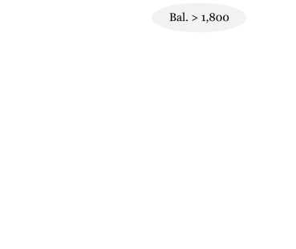
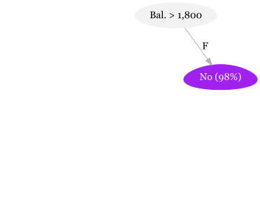
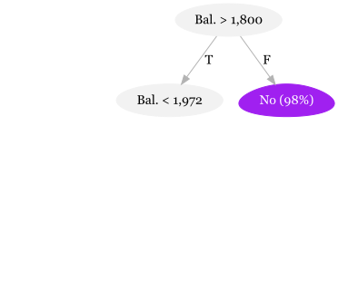
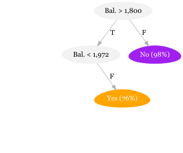
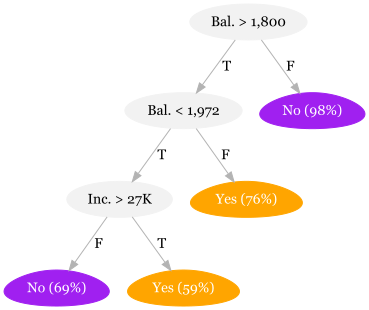
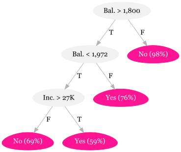
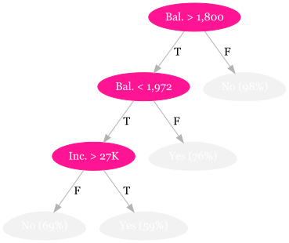
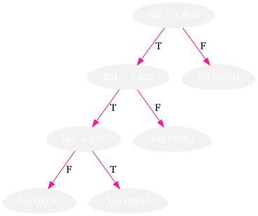

exclude: true

```{r, packages, include = F}
if (!require("pacman")) install.packages("pacman")
pacman::p_load(DiagrammeR, janitor, rsvg, DiagrammeRsvg, kableExtra,  huxtable, grf, magrittr, randomForest, 
               ranger, rpart.plot, rsample, scales, tidymodels, tidyverse, vip)


# Define colors
red_pink   = "#e64173"
turquoise  = "#20B2AA"
orange     = "#7BBD00"
red        = "#fb6107"
blue       = "#3b3b9a"
green      = "#8bb174"
grey_light = "grey70"
grey_mid   = "grey50"
grey_dark  = "grey20"
purple     = "#6A5ACD"
slate      = "#314f4f"
```
---

```{css, echo=FALSE}
# CSS for including pauses in printed PDF output (see bottom of lecture)
@media print {
  .has-continuation {
    display: block !important;
  }
}
.remark-code-line {
  font-size: 95%;
}
.small {
  font-size: 75%;
}
.scroll-output-full {
  height: 90%;
  overflow-y: scroll;
}
.scroll-output-75 {
  height: 75%;
  overflow-y: scroll;
}
```

```{r setup, include=FALSE}
options(htmltools.dir.version = FALSE)
library(knitr)
knitr::opts_chunk$set(
	fig.align = "center",
	cache = FALSE,
	dpi = 300,
  warning = F,
  message = F,
	fig.height = 5,
	out.width = "80%"
)
options(knitr.table.format = "html")
# A few extras
xaringanExtra::use_xaringan_extra(c("tile_view", "fit_screen"))
```
# Table of Contents


**Part 3: Tree-Based Methods**

1. [Decision Trees](#trees)

1. [Random Forests](#forests)


**Part 4: Generalized Random Forests**

1. [Machine Learning for Causal Treatment Effect Estimation](#causal)

1. [Deep Learning (if time - not a tree method)](#deep)


---

# Prologue

Packages we'll use today:

```{r}
pacman::p_load(grf, janitor, magrittr, parsnip, ranger, rpart, rpart.plot, rsample, scales, tidymodels, tidyverse, vip)
```

As well, let's use two datasets:

  * The ISL default data again
  * Heart disease data 
```{r}
default_df <- ISLR::Default

heart_df <- read_csv("data/Heart.csv") %>%
  dplyr::select(-1) %>%
  rename(HeartDisease = AHD) %>%
  clean_names()
```

---

# Prologue

Throughout our econometric training, we've become experts in predicting an outcome by writing down a model with a .hi-blue[specific functional form] for the relationship between $\color{#7BBD00}{\mathbf{y}}$ and  $\color{#6A5ACD}{\mathbf{X}}$. 

--

.hi-medgrn[Decision Trees] (or classification and regression trees, CART) are a supervised learning method that offers an alternative, .hi-medgrn[data-driven] way of generating predictions by partitioning the covariate space into groups and using the grouping to generate predictions.

--

After working through decision trees, we'll shift our focus to .hi-green[forest methods] that combine many, many trees to overcome drawbacks of individual trees and yield predictions of alternate objects - including heterogeneous treatment effects.

---
class: inverse, middle
name: trees

# 🌲 Decision Trees 🌲


---

#	Decision Trees: Punchline

.hi-medgrn[Goal]
- Split the .it[predictor space] (our $\color{#6A5ACD}{\mathbf{X}}$) into regions (partitions)
- Predict the most-common value within a region

--

.hi-medgrn[Attributes of Decision Trees]
1. Work for .hi-purple[both classification and regression]

--
1. Are inherently .hi-green[nonlinear]

--
1. Are relatively .hi-pink[simple] and  .hi-pink[interpretable]

--
1. Often .hi-blue[underperform] relative to competing methods

--
1. easily extend to .hi-red[very competitive ensemble methods] (forests with *many* trees).super[🌲]

.footnote[
🌲 Though the ensembles will be much less interpretable.
]


---

#	Growing Decision Trees


.hi-blue[1\. Divide the predictor space] into $J$ regions (using predictors $\mathbf{x}_1,\ldots,\mathbf{x}_p$)

--
  
  * .hi-pink[Regression Trees:] Choose the regions to .hi-green[minimize RSS] across all $J$ regions 
  
$$
\begin{align}
  \sum_{j=1}^{J} \left( y_i - \hat{y}_{R_j} \right)^2
\end{align}
$$

---

#	Growing Decision Trees: Steps


.hi-blue[1\. Divide the predictor space] into $J$ regions (using predictors $\mathbf{x}_1,\ldots,\mathbf{x}_p$)

  * .hi-pink[Classification Trees:] Choose the regions to .hi-green[minimize Gini index] or .hi-green[Entropy] 

--

.pull-left[
$$
\begin{align}
   G = \sum_{k=1}^{K} \hat{p}_{mk} \left( 1 - \hat{p}_{mk} \right)
\end{align}
$$
] 

--

.pull-right[
$$
\begin{align}
  Entropy = - \sum_{k=1}^{K} \hat{p}_{mk} \log \left( \hat{p}_{mk} \right)
\end{align}
$$
]

<br>

* Keep splitting until a specified threshold is reached (e.g. at most 5 observations per region)


---
# Classification Tree 


.hi-medgrn[Q:] Why are we using the Gini index or entropy (*vs.* error rate)?

--

.hi-medgrn[A:] The error rate isn't sufficiently sensitive to grow good trees.
<br> The Gini index and entropy tell us about the .hi-blue[composition] of the leaf.

--

 Consider two different leaves in a three-level classification.

--

.pull-left[
.center.hi-slate[Leaf 1]
- .b[A:] 51, .b[B:] 49, .b[C:] 00
- .hi-orange[Error rate:] 49%
- .hi-purple[Gini index:] 0.4998
- .hi-pink[Entropy:] 0.6929
]

--

.pull-right[
.center.hi-slate[Leaf 2]
- .b[A:] 51, .b[B:] 25, .b[C:] 24
- .hi-orange[Error rate:] 49%
- .hi-purple[Gini index:] 0.6198
- .hi-pink[Entropy:] 1.0325
]

.clear-up[
The .hi-purple[Gini index] and .hi-pink[entropy] tell us about the distribution.
]


---

#	Growing Decision Trees: Steps


.hi-blue[2\. Make predictions] using the regions' mean outcome.

<br>
<br>

For region $R_j$ predict $\hat{y}_{R_j}$ where
$$
\begin{align}
  \hat{y}_{R_j} = \frac{1}{n_j} \sum_{i\in R_j} y
\end{align}
$$


---
#	Growing Decision Trees

Let's visualize this by growing a classification tree for predicting credit card defaults based on income and card balances.

---
#	Growing Decision Trees

Consider our two-dimensional covariate space:


```{r, partition-base, include = F, cache = F}
gg_base <- ggplot(
  data = default_df,
  aes(x = balance, y = income, color = default, alpha = default)
) +
geom_hline(yintercept = 0) +
geom_vline(xintercept = 0) +
geom_point(size = 2) +
scale_y_continuous("Income", labels = scales::label_currency()) +
scale_x_continuous("Balance", labels = scales::label_currency()) +
scale_color_manual("Defaulted:", values = c("#6A5ACD","#FFA500"), labels = c("No", "Yes")) +
scale_alpha_manual("Defaulted:", values = c(0.1, 0.8), labels = c("No", "Yes")) +
theme_minimal(base_size = 16) +
theme(legend.position = "none")
```

```{r, plot-raw, echo = F, out.width = "88%"}
gg_base
```

---
#	Growing Decision Trees

The .hi-pink[first partition] splits balance at $1,800.

```{r, plot-split1, echo = F, cache = F, dependson = c(-2), out.width = "88%"}
# Add the first split (to existing figure)
gg_base +
annotate(
  "segment",
  x = 1800, xend = 1800, y = -Inf, yend = Inf,
  color = red_pink, size = 1.2
)
```


---
#	Growing Decision Trees


The .hi-pink[second partition] splits balance at $1,972, (.it[conditional on bal. > $1,800]).

```{r, plot-split2, echo = F, cache = F, dependson = c(-3), out.width = "88%"}
gg_base +
annotate(
  "segment",
  x = 1800, xend = 1800, y = -Inf, yend = Inf,
  linetype = "longdash"
) +
annotate(
  "segment",
  x = 1972, xend = 1972, y = -Inf, yend = Inf,
  color = red_pink, size = 1.2
)
```
---
#	Growing Decision Trees


The .hi-pink[third partition] splits income at $27K .b[for] bal. between $1,800 and $1,972.

```{r, plot-split3, echo = F, cache = F, dependson = c(-4), out.width = "88%"}
gg_base +
annotate(
  "segment",
  x = 1800, xend = 1800, y = -Inf, yend = Inf,
  linetype = "longdash"
) +
annotate(
  "segment",
  x = 1972, xend = 1972, y = -Inf, yend = Inf,
  linetype = "longdash"
) +
annotate(
  "segment",
  x = 1800, xend = 1972, y = 27e3, yend = 27e3,
  color = red_pink, size = 1.2
)
```

---
#	Growing Decision Trees


These three partitions give us four .hi-pink[regions]...

```{r, plot-split3b, echo = F, cache = F, dependson = c(-5), out.width = "88%"}
gg_base +
annotate(
  "segment",
  x = 1800, xend = 1800, y = -Inf, yend = Inf,
  linetype = "longdash"
) +
annotate(
  "segment",
  x = 1972, xend = 1972, y = -Inf, yend = Inf,
  linetype = "longdash"
) +
annotate(
  "segment",
  x = 1800, xend = 1972, y = 27e3, yend = 27e3,
  linetype = "longdash"
) +
annotate("text",
  x = 900, y = 37500, label = expression(R[1]),
  size = 8, family = "Fira Sans Book"
) +
annotate("text",
  x = 1886, y = 5.1e4, label = expression(R[2]),
  size = 8, family = "Fira Sans Book"
) +
annotate("text",
  x = 1886, y = 1e4, label = expression(R[3]),
  size = 8, family = "Fira Sans Book"
) +
annotate("text",
  x = 2336, y = 37500, label = expression(R[4]),
  size = 8, family = "Fira Sans Book"
)
```

---
#	Growing Decision Trees

.hi-pink[Predictions] cover each region (e.g. using the region's .hi-pink[most common class]).

```{r, plot-split3c, echo = F, cache = F, dependson = c(-6), out.width = "88%"}
gg_base +
annotate(
  "rect",
  xmin = 0, xmax = 1800, ymin = 0, ymax = Inf,
  fill = purple, alpha = 0.3
) +
annotate(
  "segment",
  x = 1800, xend = 1800, y = -Inf, yend = Inf,
  linetype = "longdash"
) +
annotate(
  "segment",
  x = 1972, xend = 1972, y = -Inf, yend = Inf,
  linetype = "longdash"
) +
annotate(
  "segment",
  x = 1800, xend = 1972, y = 27e3, yend = 27e3,
  linetype = "longdash"
)
```

---
#	Growing Decision Trees

.hi-pink[Predictions] cover each region (e.g. using the region's .hi-pink[most common class]).

```{r, plot-split3d, echo = F, cache = F, dependson = c(-7), out.width = "88%"}
gg_base +
annotate(
  "rect",
  xmin = 0, xmax = 1800, ymin = 0, ymax = Inf,
  fill = purple, alpha = 0.3
) +
annotate(
  "rect",
  xmin = 1800, xmax = 1972, ymin = 27e3, ymax = Inf,
  fill = "#FFA500", alpha = 0.3
) +
annotate(
  "segment",
  x = 1800, xend = 1800, y = -Inf, yend = Inf,
  linetype = "longdash"
) +
annotate(
  "segment",
  x = 1972, xend = 1972, y = -Inf, yend = Inf,
  linetype = "longdash"
) +
annotate(
  "segment",
  x = 1800, xend = 1972, y = 27e3, yend = 27e3,
  linetype = "longdash"
)
```

---
#	Growing Decision Trees

.hi-pink[Predictions] cover each region (e.g. using the region's .hi-pink[most common class]).

```{r, plot-split3e, echo = F, cache = F, dependson = c(-8), out.width = "88%"}
gg_base +
annotate(
  "rect",
  xmin = 0, xmax = 1800, ymin = 0, ymax = Inf,
  fill = purple, alpha = 0.3
) +
annotate(
  "rect",
  xmin = 1800, xmax = 1972, ymin = 27e3, ymax = Inf,
  fill = "#FFA500", alpha = 0.3
) +
annotate(
  "rect",
  xmin = 1800, xmax = 1972, ymin = 0, ymax = 27e3,
  fill = purple, alpha = 0.3
) +
annotate(
  "segment",
  x = 1800, xend = 1800, y = -Inf, yend = Inf,
  linetype = "longdash"
) +
annotate(
  "segment",
  x = 1972, xend = 1972, y = -Inf, yend = Inf,
  linetype = "longdash"
) +
annotate(
  "segment",
  x = 1800, xend = 1972, y = 27e3, yend = 27e3,
  linetype = "longdash"
)
```

---
#	Growing Decision Trees

.hi-pink[Predictions] cover each region (e.g. using the region's .hi-pink[most common class]).

```{r, plot-split3f, echo = F, cache = F, dependson = c(-9), out.width = "88%"}
gg_base +
annotate(
  "rect",
  xmin = 0, xmax = 1800, ymin = 0, ymax = Inf,
  fill = purple, alpha = 0.3
) +
annotate(
  "rect",
  xmin = 1800, xmax = 1972, ymin = 27e3, ymax = Inf,
  fill = "#FFA500", alpha = 0.3
) +
annotate(
  "rect",
  xmin = 1800, xmax = 1972, ymin = 0, ymax = 27e3,
  fill = purple, alpha = 0.3
) +
annotate(
  "rect",
  xmin = 1972, xmax = Inf, ymin = 0, ymax = Inf,
  fill = "#FFA500", alpha = 0.3
) +
annotate(
  "segment",
  x = 1800, xend = 1800, y = -Inf, yend = Inf,
  linetype = "longdash"
) +
annotate(
  "segment",
  x = 1972, xend = 1972, y = -Inf, yend = Inf,
  linetype = "longdash"
) +
annotate(
  "segment",
  x = 1800, xend = 1972, y = 27e3, yend = 27e3,
  linetype = "longdash"
)
```

---
# Visualizing the Decision Tree

.hi-medgrn[Q:] Why do we call it a tree?

--

.hi-medgrn[A:] Because we can easily represent this partitioning process in the form of a .hi-pink[decision tree!]

---
# Visualizing the Decision Tree

Our first split occurs at a Balance of $1800:

.clear-space[
```{r, eval = F, include = F}
DiagrammeR::grViz("
digraph {

graph [layout = dot, overlap = false, fontsize = 14]

node [shape = oval, color = Gray95, style = filled]
s1 [label = 'Bal. > 1,800']

node [shape = oval, color = white, style = filled, fontcolor = White]
s2 [label = 'Bal. < 1,972']
s3 [label = 'Inc. > 27K']

node [shape = egg,  color = white, style = filled, fontcolor = White]
l1 [label = 'No (98%)']

node [shape = egg,  color = white, style = filled, fontcolor = White]
l2 [label = 'Yes (76%)']
l3 [label = 'Yes (59%)']
l4 [label = 'No (69%)']

edge [color = Grey70,color = white,  fontcolor = white]
s1 -> l1 [label = 'F']
s1 -> s2 [label = 'T']
s2 -> s3 [label = 'T']
s2 -> l2 [label = 'F']
s3 -> l3 [label = 'T']
s3 -> l4 [label = 'F']
}
") %>%
    export_svg %>% charToRaw %>% rsvg_svg("images/tree1.svg")
```
]

.center[

]

---
# Visualizing the Decision Tree

If Balance > 1800 Is False, we get our first region:

.clear-space[
```{r, eval = F, include = F}
DiagrammeR::grViz("
digraph {

graph [layout = dot, overlap = false, fontsize = 14]

node [shape = oval, color = Gray95, style = filled]
s1 [label = 'Bal. > 1,800']

node [shape = oval, color = white, style = filled, fontcolor = White]
s2 [label = 'Bal. < 1,972']
s3 [label = 'Inc. > 27K']


node [shape = egg,  color = Purple, style = filled, fontcolor = White]
l1 [label = 'No (98%)']

node [shape = egg,  color = white, style = filled, fontcolor = White]
l2 [label = 'Yes (76%)']
l3 [label = 'Yes (59%)']
l4 [label = 'No (69%)']

edge [color = Grey70]
s1 -> l1 [label = 'F']

edge [color = white,  fontcolor = white]
s1 -> s2 [label = 'T']
s2 -> s3 [label = 'T']
s2 -> l2 [label = 'F']
s3 -> l3 [label = 'T']
s3 -> l4 [label = 'F']
}
")  %>%
    export_svg %>% charToRaw %>% rsvg_svg("images/tree2.svg")
```
]

.center[

]

---
# Visualizing the Decision Tree

If Balance < 1800 Is True, we next split on Balance < 1,972

.clear-space[
```{r, eval = F, include = F}
DiagrammeR::grViz("
digraph {

graph [layout = dot, overlap = false, fontsize = 14]

node [shape = oval, color = Gray95, style = filled]
s1 [label = 'Bal. > 1,800']
s2 [label = 'Bal. < 1,972']

node [shape = oval, color = white, style = filled, fontcolor = White]
s3 [label = 'Inc. > 27K']


node [shape = egg,  color = Purple, style = filled, fontcolor = White]
l1 [label = 'No (98%)']

node [shape = egg,  color = white, style = filled, fontcolor = White]
l2 [label = 'Yes (76%)']
l3 [label = 'Yes (59%)']
l4 [label = 'No (69%)']

edge [color = Grey70]
s1 -> l1 [label = 'F']
s1 -> s2 [label = 'T']

edge [color = white,  fontcolor = white]
s2 -> s3 [label = 'T']
s2 -> l2 [label = 'F']
s3 -> l3 [label = 'T']
s3 -> l4 [label = 'F']
}
") %>%
    export_svg %>% charToRaw %>% rsvg_svg("images/tree3.svg")
```
]

.center[

]

---
# Visualizing the Decision Tree

If False, we get our second terminal node (76% default)

.clear-space[
```{r, eval = F, include = F}
DiagrammeR::grViz("
digraph {

graph [layout = dot, overlap = false, fontsize = 14]

node [shape = oval, color = Gray95, style = filled]
s1 [label = 'Bal. > 1,800']
s2 [label = 'Bal. < 1,972']

node [shape = oval, color = white, style = filled, fontcolor = White]
s3 [label = 'Inc. > 27K']


node [shape = egg,  color = Purple, style = filled, fontcolor = White]
l1 [label = 'No (98%)']

node [shape = egg,  color = Orange, style = filled, fontcolor = White]
l2 [label = 'Yes (76%)']

node [shape = egg,  color = white, style = filled, fontcolor = White]
l4 [label = 'No (69%)']

node [shape = egg,  color = white, style = filled, fontcolor = White]
l3 [label = 'Yes (59%)']

edge [color = Grey70]
s1 -> l1 [label = 'F']
s1 -> s2 [label = 'T']
s2 -> l2 [label = 'F']

edge [color = white,  fontcolor = white]
s2 -> s3 [label = 'T']
s3 -> l3 [label = 'T']
s3 -> l4 [label = 'F']
}
") %>%
    export_svg %>% charToRaw %>% rsvg_svg("images/tree4.svg")
```
]

.center[

]

---
# Visualizing the Decision Tree

If True, we get our final split at Income > 27,000

.clear-space[
```{r,  eval = F, include = F}
DiagrammeR::grViz("
digraph {

graph [layout = dot, overlap = false, fontsize = 14]

node [shape = oval, color = Gray95, style = filled]
s1 [label = 'Bal. > 1,800']
s2 [label = 'Bal. < 1,972']
s3 [label = 'Inc. > 27K']


node [shape = egg,  color = Purple, style = filled, fontcolor = White]
l1 [label = 'No (98%)']
l4 [label = 'No (69%)']

node [shape = egg,  color = Orange, style = filled, fontcolor = White]
l2 [label = 'Yes (76%)']
l3 [label = 'Yes (59%)']

edge [color = Grey70]
s1 -> l1 [label = 'F']
s1 -> s2 [label = 'T']
s2 -> l2 [label = 'F']
s2 -> s3 [label = 'T']
s3 -> l3 [label = 'T']
s3 -> l4 [label = 'F']
}
") %>%
    export_svg %>% charToRaw %>% rsvg_svg("images/tree5.svg")
```
]

.center[

]

---
# Decision Tree Anatomy

The .hi-pink[regions] correspond to the tree's .hi-pink[terminal nodes] (or .hi-pink[leaves])


.clear-space[
```{r,  eval = F, include = F}
DiagrammeR::grViz("
digraph {

graph [layout = dot, overlap = false, fontsize = 14]

node [shape = oval, color = Gray95, style = filled]
s1 [label = 'Bal. > 1,800']
s2 [label = 'Bal. < 1,972']
s3 [label = 'Inc. > 27K']


node [shape = egg,  color = DeepPink, style = filled, fontcolor = White]
l1 [label = 'No (98%)']
l4 [label = 'No (69%)']
l2 [label = 'Yes (76%)']
l3 [label = 'Yes (59%)']

edge [color = Grey70]
s1 -> l1 [label = 'F']
s1 -> s2 [label = 'T']
s2 -> l2 [label = 'F']
s2 -> s3 [label = 'T']
s3 -> l3 [label = 'T']
s3 -> l4 [label = 'F']
}
") %>%
    export_svg %>% charToRaw %>% rsvg_svg("images/tree6.svg")
```
]

.center[

]

---
# Decision Tree Anatomy

The graph's .hi-pink[separating lines] correspond to the tree's .hi-pink[internal nodes]


.clear-space[
```{r,  eval = F, include = F}
DiagrammeR::grViz("
digraph {

graph [layout = dot, overlap = false, fontsize = 14]

node [shape = oval, color = DeepPink, fontcolor = White, style = filled]
s1 [label = 'Bal. > 1,800']
s2 [label = 'Bal. < 1,972']
s3 [label = 'Inc. > 27K']


node [shape = egg,  color = Gray95, style = filled, fontcolor = White]
l1 [label = 'No (98%)']
l4 [label = 'No (69%)']
l2 [label = 'Yes (76%)']
l3 [label = 'Yes (59%)']

edge [color = Grey70]
s1 -> l1 [label = 'F']
s1 -> s2 [label = 'T']
s2 -> l2 [label = 'F']
s2 -> s3 [label = 'T']
s3 -> l3 [label = 'T']
s3 -> l4 [label = 'F']
}
") %>%
    export_svg %>% charToRaw %>% rsvg_svg("images/tree7.svg")
```
]

.center[

]

---
# Decision Tree Anatomy

The segments connecting the nodes are the tree's .hi-pink[branches]


.clear-space[
```{r,  eval = F, include = F}
DiagrammeR::grViz("
digraph {

graph [layout = dot, overlap = false, fontsize = 14]

node [shape = oval, color = Gray95, fontcolor = White, style = filled]
s1 [label = 'Bal. > 1,800']
s2 [label = 'Bal. < 1,972']
s3 [label = 'Inc. > 27K']


node [shape = egg,  color = Gray95, style = filled, fontcolor = White]
l1 [label = 'No (98%)']
l4 [label = 'No (69%)']
l2 [label = 'Yes (76%)']
l3 [label = 'Yes (59%)']

edge [color = DeepPink]
s1 -> l1 [label = 'F']
s1 -> s2 [label = 'T']
s2 -> l2 [label = 'F']
s2 -> s3 [label = 'T']
s3 -> l3 [label = 'T']
s3 -> l4 [label = 'F']
}
") %>%
    export_svg %>% charToRaw %>% rsvg_svg("images/tree8.svg")
```
]

.center[

]


---
# Growing The Tree

.hi-medgrn[Problem:] Examining every possible partition (every .pink[cutoff] $\color{#e64173}{s}$ of every .purple[predictor] $\color{#6A5ACD}{\mathbf{x}_j}$) is .hi-medgrn[computationally infeasible.]

--

.hi-blue[Solution:] a top-down, *greedy* algorithm named .hi-blue[recursive binary splitting]

--

* .hi-blue[Recursive:] starts with the "best" split, then find the next "best" split, etc.

--

* .hi-blue[Binary:] each split creates only two branches: "yes" and "no"

--

* .hi-blue[Greedy:] each step makes the "best" split without consideration for the overall process


---
# Splitting Example

 Consider the dataset

```{r, data-ex-split, echo = F}
ex_df <- data.frame(
  "i" = 1:3,
  "pred" = c(0, 0, 0),
  "y" = c(0, 8, 6),
  "x1" = c(1, 3, 5),
  "x2" = c(4, 2, 6)
)
ex_df %>%
  hux() %>%
  set_align(1:4, 1:5, "center") %>%
  set_bold(1, 1:5, T) %>%
  set_bold(2:4, 1:5, F) %>%
  set_bottom_border(1, c(1,3:5), 1) %>%
  set_text_color(1:4, 2, "grey98") %>% 
  set_width(0.5)
```

--

With just three observations, each variable only has two actual splits..super[🌲]

.footnote[
🌲 You can think about cutoffs as the ways we divide observations into two groups.
]

---
# Splitting Example


One possible split: x.sub[1] at 2, which yields .purple[(.b[1]) x.sub[1] < 2] .it[vs.] .pink[(.b[2]) x.sub[1] ≥ 2]

```{r, ex-split1, echo = F}
split1 <- ex_df %>%
  mutate("pred" = c(0, 7, 7)) %>%
  hux() %>%
  set_align(1:4, 1:5, "center") %>%
  set_bold(1, 1:5, T) %>%
  set_bottom_border(1, 1:5, 1) %>%
  set_text_color(2, 1:4, purple) %>%
  set_text_color(3:4, 1:4, red_pink)
split1 %>%
  set_text_color(1:4, 2, "grey98") %>%
  set_bottom_border(1, 2, 0) %>% 
  set_bold(2:4, 1:5, F) %>% 
  set_width(0.5)
```

---
# Splitting Example


One possible split: x.sub[1] at 2, which yields .purple[(.b[1]) x.sub[1] < 2] .it[vs.] .pink[(.b[2]) x.sub[1] ≥ 2]

```{r, ex-split1b, echo = F}
split1 <- ex_df %>% mutate("pred" = c(0, 7, 7)) %>%
  hux() %>%
  set_align(1:4, 1:5, "center") %>%
  set_bold(1, 1:5, T) %>%
  set_bottom_border(1, 1:5, 1) %>%
  set_text_color(2, 1:4, purple) %>%
  set_text_color(3:4, 1:4, red_pink) %>%
  set_bold(1:4, 2, T)
split1 %>% set_width(0.5)
```

This split yields an RSS of .purple[0.super[2]] + .pink[1.super[2]] + .pink[(-1).super[2]] = 2.

--

.note[Note.sub[1]] Splitting x.sub[1] at 2 yields the same results as 1.5, 2.5—anything in (1, 3).

---
# Splitting Example


An alternative split: x.sub[1] at 4, which yields .purple[(.b[1]) x.sub[1] < 4] .it[vs.] .pink[(.b[2]) x.sub[1] ≥ 4]

```{r, ex-split2, echo = F}
ex_df %>% mutate("pred" = c(4, 4, 6)) %>%
  hux() %>%
  set_align(1:4, 1:5, "center") %>%
  set_bold(1, 1:5, T) %>%
  set_bottom_border(1, 1:5, 1) %>%
  set_text_color(2:3, 1:4, purple) %>%
  set_text_color(4, 1:4, red_pink) %>%
  set_bold(1:4, 2, T) %>% 
  set_width(0.5)
```

This split yields an RSS of .purple[(-4).super[2]] + .purple[4.super[2]] + .pink[0.super[2]] = 32.

--

.it[Previous:] Splitting x.sub[1] at 4 yielded RSS = 2. .it.grey-light[(Much better)]

---
# Splitting Example


Another split: x.sub[2] at 3, which yields .purple[(.b[1]) x.sub[1] < 3] .it[vs.] .pink[(.b[2]) x.sub[1] ≥ 3]

```{r, ex-split3, echo = F}
ex_df %>% mutate("pred" = c(3, 8, 3)) %>%
  hux() %>%
  set_align(1:4, 1:5, "center") %>%
  set_bold(1, 1:5, T) %>%
  set_bottom_border(1, 1:5, 1) %>%
  set_text_color(c(2,4), c(1:3,5), red_pink) %>%
  set_text_color(3, c(1:3,5), purple) %>%
  set_bold(1:4, 2, T) %>% 
  set_width(0.5)
```

This split yields an RSS of .pink[(-3).super[2]] + .purple[0.super[2]] + .pink[3.super[2]] = 18.

---
# Splitting Example


Final split: x.sub[2] at 5, which yields .purple[(.b[1]) x.sub[1] < 5] .it[vs.] .pink[(.b[2]) x.sub[1] ≥ 5]

```{r, ex-split4, echo = F}
ex_df %>% mutate("pred" = c(4, 4, 6)) %>%
  hux() %>%
  set_align(1:4, 1:5, "center") %>%
  set_bold(1, 1:5, T) %>%
  set_bottom_border(1, 1:5, 1) %>%
  set_text_color(2:3, c(1:3,5), purple) %>%
  set_text_color(4, c(1:3,5), red_pink) %>%
  set_bold(1:4, 2, T) %>% 
  set_width(0.5)
```

This split yields an RSS of .pink[(-4).super[2]] + .pink[4.super[2]] + .purple[0.super[2]] = 32.

---
# Splitting Example

Across our four possible splits (two variables each with two splits)
- x.sub[1] with a cutoff of 2: .b[RSS] = 2
- x.sub[1] with a cutoff of 4: .b[RSS] = 32
- x.sub[2] with a cutoff of 3: .b[RSS] = 18
- x.sub[2] with a cutoff of 5: .b[RSS] = 32

our split of x.sub[1] at 2 generates the lowest RSS.

---
# Splitting 


.note[Note:] Categorical predictors work in exactly the same way.
<br>We want to try .b[all possible combinations] of the categories.

--

.ex[Ex:] For a four-level categorical predictor (levels: A, B, C, D)

.pull-left[
- Split 1: .pink[A|B|C] .it[vs.] .purple[D]
- Split 2: .pink[A|B|D] .it[vs.] .purple[C]
- Split 3: .pink[A|C|D] .it[vs.] .purple[B]
- Split 4: .pink[B|C|D] .it[vs.] .purple[A]
]
.pull-right[
- Split 5: .pink[A|B] .it[vs.] .purple[C|D]
- Split 6: .pink[A|C] .it[vs.] .purple[B|D]
- Split 7: .pink[A|D] .it[vs.] .purple[B|C]
]

.clear-up[
we would need to try 7 possible splits.
]

---
# Splitting


Once we make our a split, we then continue splitting,
<br>.b[conditional] on the regions from our previous splits.

So if our first split creates R.sub[1] and R.sub[2], then our next split
<br>searches the predictor space only in R.sub[1] or R.sub[2]..super[🌲]

.footnote[
🌲 We are no longer searching the full space—it is conditional on the previous splits.
]

--

The tree continue to .b[grow until] it hits some specified threshold,
<br>_e.g._, at most 5 observations in each leaf.

---
# Too many Splits?

One can have .hi-blue[too many splits.]

.hi-medgrn[Q:] Why?

--

.hi-medgrn[A:] "More splits" means

--

1. more flexibility (think about the bias-variance tradeoff/overfitting)

--

1. less interpretability (one of the selling points for trees)

--

.hi-medgrn[Q:] So what can we do?

--

.hi-medgrn[A:] Prune your trees!

---
# Pruning

.hi-medgrn[The idea:] Some regions may increase .hi[variance] more than they reduce .hi[bias].

* By removing these regions, we gain in test MSE.

.hi-medgrn[Candidates for trimming:] Regions that do not .b[reduce RSS] very much.

--

.hi-medgrn[Updated strategy:] Grow big trees $T_0$ and then trim $T_0$ to an optimal .attn[subtree].


--

.hi-medgrn[Updated problem:] Considering all possible subtrees can get expensive.

---
# Pruning

.hi-medgrn[Updated solution:] add a penalty for complexity with .hi-medgrn[cost-complexity pruning]
  * Pay a penalty to become more complex with a greater number of regions $|T|$

--

For regression trees.super[1]:

$$
\begin{align}
  \sum_{m=1}^{|T|} \sum_{i:x\in R_m} \left( y_i - \hat{y}_{R_m} \right)^2 + \alpha |T|
\end{align}
$$

For any value of $\alpha (\ge 0)$, we get a subtree $T\subset T_0$.

--

We choose $\alpha$ via cross validation.

.footnote[
1 For classification trees we instead penalize the error rate
]

---
# Decision Trees in R


To train decision trees in R, we'll  use .hi-slate[tidymodels] (and several others) for modeling and machine learning using .hi-slate[tidyverse] principles.super[2]

.footnote[2\. [tidymodels](https://www.tidymodels.org/) allow you to do a *ton* of stuff that we're just scratching the surface of.]

--

Let's first set the seed and define our cross-validation with `vfold_cv` from .hi-slate[rsample]
  * `v` the number of folds (here we'll use 5)
  
```{r, cache = F}
# Define our CV split
set.seed(12345)
default_cv <- default_df %>% vfold_cv(v = 5)
```

---
# Decision Trees in R

Next, let's use the `decision_tree()` function from .hi-slate[parsnip] to set up the parameters of the tree:

- `mode`: `"regression"` or `"classification"`
- `cost_complexity`: the cost (penalty) paid for complexity
- `tree_depth`: *max.* tree depth (max. number of splits in a "branch")
- `min_n`: *min.* # of observations for a node to split
- Use the .hi-slate[rpart] "engine" to grow the tree

```{r}
# Define the decision tree
default_tree <- decision_tree(
  mode = "classification", #
  cost_complexity = tune(),
  tree_depth = tune(),
  min_n = 10 # Arbitrarily choosing '10' 
) %>% set_engine("rpart")
```

---
# Decision Trees in R

Next, use `recipe()` to build a recipe describing the formula/data

```{r}
# Define recipe
default_recipe <- recipe(default ~ ., data = default_df)
```
--

And define the workflow, first adding the model then the recipe

```{r}
# Define the workflow
default_flow <- workflow() %>%
  add_model(default_tree) %>% add_recipe(default_recipe)
```
---
# Decision Trees in R

Lastly, execute the workflow through cross-validation!
```{r, train-decision-tree, cache = F}
# Tune!
default_cv_fit <- default_flow %>% tune_grid(
  default_cv,
  grid = expand_grid(
    cost_complexity = seq(0, 0.15, by = 0.01),
    tree_depth = c(1, 2, 5, 10),
  ),
  metrics = metric_set(accuracy)
)
```
---
# Decision Trees in R

Plotting 
```{r, eval = F}
ggplot(
  data = default_cv_fit %>% collect_metrics() %>% filter(.metric == "accuracy"),
  aes(
    x = cost_complexity,
    y = mean,
    color = tree_depth %>% factor(levels = c(1,2,5,10), ordered = T),
    shape = tree_depth %>% factor(levels = c(1,2,5,10), ordered = T)
  )
) +
geom_line(linewidth = 0.4) +
geom_point(size = 3, alpha = 0.8) +
scale_y_continuous("Accuracy") +
scale_x_continuous("Cost complexity") +
scale_color_viridis_d("Tree depth") +
scale_shape_manual("Tree depth", values = c(1, 18, 15, 20)) +
theme_minimal(base_size = 16) +
theme(legend.position = "bottom")
```
---
# Decision Trees in R

```{r, echo = F, out.width = "120%"}
ggplot(
  data = default_cv_fit %>% collect_metrics() %>% filter(.metric == "accuracy"),
  aes(
    x = cost_complexity,
    y = mean,
    color = tree_depth %>% factor(levels = c(1,2,5,10), ordered = T),
    shape = tree_depth %>% factor(levels = c(1,2,5,10), ordered = T)
  )
) +
geom_line(linewidth = 0.4) +
geom_point(size = 3, alpha = 0.8) +
scale_y_continuous("Accuracy") +
scale_x_continuous("Cost complexity") +
scale_color_viridis_d("Tree depth") +
scale_shape_manual("Tree depth", values = c(1, 18, 15, 20)) +
theme_minimal(base_size = 16) +
theme(legend.position = "bottom")
```

---
# Decision Trees in R

.hi-slate[To plot the CV-chosen tree...]

1\. .hi-pink[Fit] the chosen/best model with  `finalize_workflow()` and `select_best()`

```{r, plot-tree-1}
best_flow <- 
  default_flow %>% 
  finalize_workflow(select_best(default_cv_fit, metric = "accuracy")) %>%
  fit(data = default_df)
```

--


2\. .hi-purple[Extract] the fitted model with `extract_fit_parsnip()`

```{r, plot-tree-2}
best_tree <- best_flow %>% extract_fit_parsnip()
```

---
# Decision Trees in R


3\. .hi-red[Plot] the tree with `rpart.plot()` from .hi-slate[rpart.plot].

```{r, plot-tree-3, eval = F, out.width = "65%"}
best_tree$fit %>% rpart.plot()
```


```{r, plot-rpart-cv, echo = F}
rpart.plot(
  best_tree$fit,
  extra = 104, # displays probability per class and % of obs
  box.palette = "Oranges",
  branch.lty = 3, # branch line type
  nn = TRUE, # display node numbers
  cex = 1.2 # font size
)
```

---
# Decision Trees in R

The previous tree has cost complexity of 0.03 (and a max. depth of 5).

We can compare this "best" tree to a less pruned/penalized tree

- `cost_complexity = 0.005`
- `tree_depth = 5`

---
# Decision Trees in R

```{r, plot-tree_complex, echo = F, out.width = "120%"}
tree_complex <- decision_tree(
  mode = "classification",
  cost_complexity = 0.005,
  tree_depth = 5,
  min_n = 10
) %>% set_engine(
  "rpart"
) %>% fit(default ~ ., data = default_df)
rpart.plot(
  tree_complex$fit,
  extra = 104,
  box.palette = "Oranges",
  branch.lty = 3,
  nn = TRUE,
  cex = 1
)
```

---
# Decision Trees vs. Linear Models

<br><br>

.center[
.hi-medgrn[Q] How do trees compare to linear models?]

--

.center[
.hi-medgrn[A] It depends how linear the true boundary is.
]

---
# Linear Boundary

.pull-left.center[.hi-medgrn[Linear models] recreate the line]

.pull-right.center[.hi-blue[trees] struggle at replicating linearity]
```{r, fig-compare-linear, echo = F}
knitr::include_graphics("images/compare-linear.png")
```

.ex.small[Source: ISL, p. 315]

---
# Nonlinear Bounday


.pull-left.center[.hi-medgrn[Linear models] struggle with nonlinear boundaries]

.pull-right.center[.hi-blue[trees] easily replicate these relationships]

```{r, fig-compare-nonlinear, echo = F}
knitr::include_graphics("images/compare-nonlinear.png")
```

.ex.small[Source: ISL, p. 315]

---
# Strengths and weaknesses

As with any method, decision trees have .hi-medgrn[tradeoffs].

--

.pull-left.purple.font90[
.hi-purple.center[Strengths]
<br>.b[+] Easily explained/interpretted
<br>.b[+] Include several graphical options
<br>.b[+] Mirror human decision making?
<br>.b[+] Handle num. or cat. on LHS/RHS
]

--

.pull-right.pink.font90[
.hi-pink.center[Weaknesses]
<br>.b[-] Outperformed by other methods
<br>.b[-] Struggle with linearity
<br>.b[-] Can be very "non-robust" - small data changes can cause huge changes in our tree
]


--

.note[Next:] Create ensembles of trees.super[🌲] to strengthen these weaknesses..super[🌴] with...

.footnote[
🌲 Forests! 🌴 Which will also weaken some of the strengths.
]

---
class: inverse, middle
name: forests

# 🌲🌴🌳🌲🌴🌳🌲🌴🌳🌲🌴🌳🌲🌴🌳🌴🌳🌲🌴🌳🌲🌴🌳🌲🌴🌳🌲🌴🌳🌴🌳🌲🌴🌳🌲🌴🌳🌲🌴🌳🌲🌴🌳🌴🌳🌲🌴🌳🌲🌴🌳🌲🌴🌳🌲🌴🌳🌲🌴🌳 Random Forests 🌲🌴🌳🌲🌴🌳🌲🌴🌳🌲🌴🌳🌲🌴🌳🌴🌳🌲🌴🌳🌲🌴🌳🌲🌴🌳🌲🌴🌳🌴🌳🌲🌴🌳🌲🌴🌳🌲🌴🌳🌲🌴🌳🌴🌳🌲🌴🌳🌲🌴🌳🌲🌴🌳🌲🌴🌳🌲🌴🌳

---
# Random Forests

.hi-medgrn[The gist:] combine many individual trees into a single .hi-medgrn[forest] via .hi-pink[bootstrap aggregation (bagging)]

--

.hi-pink[Bagging:]

1. Create $B$ bootstrapped samples

--

1. Train an estimator (tree) $\color{#6A5ACD}{\mathop{\hat{f^b}}(x)}$ on each of the $B$ samples

--

1. Aggregate across your $B$ bootstrapped models:
$$
\begin{align}
  \color{#e64173}{\mathop{\hat{f}_{\text{bag}}}(x)} = \dfrac{1}{B}\sum_{b=1}^{B}\color{#6A5ACD}{\mathop{\hat{f^b}}(x)}
\end{align}
$$

This aggregated model $\color{#e64173}{\mathop{\hat{f}_{\text{bag}}}(x)}$ is your final model.

---
# Bagging

When we apply bagging to decision trees,

- We typically .hi-pink[grow the trees deep and do not prune]

- For .hi-purple[regression], we .hi-purple[average] across the $B$ trees' regions

- For .hi-purple[classification], we have more options—but often take .hi-purple[plurality]

--

.hi-pink[Individual] (unpruned) trees will be very .hi-pink[flexible] and .hi-pink[noisy],
<br>but their .hi-purple[aggregate] will be quite .hi-purple[stable].

---
# Out-of-Bag Error


Bagging also offers a convenient method for evaluating performance.

--

For any bootstrapped sample, we omit ∼n/3 observations.

.hi-pink[Out-of-bag (OOB) error estimation] estimates the test error rate using observations .hi-medgrn[randomly omitted] from each bootstrapped sample.

--

For each observation $i$:

1. Find all samples $S_i$ in which $i$ was omitted from training.

1. Aggregate the $|S_i|$ predictions $\color{#6A5ACD}{\mathop{\hat{f^b}}(x_i)}$, _e.g._, using their mean or mode

1. Calculate the error, _e.g._, $y_i - \mathop{\hat{f}_{i,\text{OOB},i}}(x_i)$

---
# Out-of-Bag Error


When $B$ is big enough, the OOB error rate will be very close to LOOCV.

--

.hi-medgrn[Q:] Why use OOB error rate?

--

.hi-medgrn[A:] When $B$ and $n$ are large, cross validation—with any number of folds—can become pretty computationally intensive.

---
# Random Forests

.hi-medgrn[Random forests] overcome a major shortcoming of bagging: .hi-pink[very correlated trees]

  * Since trees consider all predictors at every split of every tree, the trees will often be highly related.

--

.hi-medgrn[Solution:] decorrelate the trees!

  * Only consider a .hi-pink[random subset] of $\color{#e64173}{m\enspace (\approx\sqrt{p})}$ .pink[predictors] when making each split (for each tree)

--
  
  * This nudges trees away from always using the same variables, increasing variation across trees, and potentially reducing the variance of our estimates

--
  
  * If our predictors are very correlated, we may want to shrink $m$
  

---
# Random Forests


Random forests thus introduce .hi-slate[two dimensions of random variation]

--

1. The .hi-medgrn[bootstrapped sample]

--

2. The $m$ .hi-blue[randomly selected predictors] (for the split)


Everything else about random forests works just as it did with decision trees.

---
# Random Forests in R 

Let's see how to train a random forest using .hi-slate[tidymodels].

--

Let's try and predict heart disease occurrence as a function of

.pull-left.font80[
* `age` Patient age
* `sex` Gender (`sex=1` for male)
* `chest_pain` Type of chest pain 
* `rest_bp` Resting blood pressure
* `chol` Serum cholesterol level
* `fbs` Fasting blood sugar above 120mg/dl
* `restecg` Resting ECG results
  * 0 normal, 1 have ST-T wave abnormality, 2 probable/definite left ventricular hypertrophy
* `max_hr` Max heart rate
]
.pull-right.font80[
* `ex_ang` Exercised induced angina (pain from reduced blood flow)
  * 1 yes
* `oldpeak` ST depression induced by exercise relative to rest (observed in ECG)
* `slope` Slope of the peak exercise ST segment (observed in ECG)
  * 0 upsloping, 1 flat, 2 downsloping
* `ca` Number of major vessels colored by fluoroscopy (`ca`)
* `thal` Thalium stress test result
  * 0 normal, 1 fixed defect, 2 reversible defect, 3 not described
]

---
# Random Forests in R 

Let's first define our recipe and do some preprocessing.
  * .hi-medgrn[Recipe:] predict heart disease (Yes/No) as a function of everything else
  * .hi-medgrn[Cleaning:]  imput missing values (median for numeric, mode for categorical)
  
```{r}
# Impute missing values
heart_recipe <- recipe(heart_disease ~ ., data = heart_df) %>% 
  step_impute_median(all_predictors() & all_numeric()) %>% 
  step_impute_mode(all_predictors() & all_nominal())
```

--

Now we can use `prep()` and `juice()` to replace our data frame with the cleaned version:

```{r}
heart_df_clean <- heart_recipe %>% prep() %>% juice()
```

---
# Random Forests in R

You have several [options](http://topepo.github.io/caret/train-models-by-tag.html#Random_Forest) for training random forests with `tidymodels`..super[🎄]

  * _E.g._ `ranger`, `randomForest`, `spark`.

`rand_forest()` accesses each of these packages via their .it[engines].

.footnote[
🎄 And even more if you look outside of `tidymodels`.
]

--

- The default engine is `"ranger"` ([`ranger`](https://cran.r-project.org/web/packages/ranger/index.html) package).

--

- The argument `mtry` gives $m$, the # of predictors at each split.

--

You've already seen the other hyperparameters for `ranger`:

- `trees` the number of trees in your (random) forest
- `min_n` min. # of observations

---
# Random Forests in R

Training a random forest in R using .hi-slate[tidymodels] and .hi-slate[ranger]:


.pull-right[
```{r, ex-tidy-ranger, cache = F}
# Define the random forest
heart_rf <- rand_forest(
  mode = "classification",
  mtry = 3,
  trees = 100,
  min_n = 2
) %>% set_engine(
  engine = "ranger",
  splitrule = "gini", 
  importance = "impurity"
)
```
]


---
# Random Forests in R

Training a random forest in R using .hi-slate[tidymodels] and .hi-slate[ranger]:


.pull-left.font90[
<br>
- Goal: Classification
]

.pull-right[
```{r, eval = F}
# Define the random forest
heart_rf <- rand_forest(
  mode = "classification", #<<
  mtry = 3,
  trees = 100,
  min_n = 2
) %>% set_engine(
  engine = "ranger",
  splitrule = "gini", 
  importance = "impurity"
)
```
]

---
# Random Forests in R

Training a random forest in R using .hi-slate[tidymodels] and .hi-slate[ranger]:


.pull-left.font90[
<br>
- Goal: Classification
- Try 3 variables per split
]

.pull-right[
```{r, eval = F}
# Define the random forest
heart_rf <- rand_forest(
  mode = "classification", 
  mtry = 3, #<<
  trees = 100,
  min_n = 2
) %>% set_engine(
  engine = "ranger",
  splitrule = "gini", 
  importance = "impurity"
)
```
]

---
# Random Forests in R

Training a random forest in R using .hi-slate[tidymodels] and .hi-slate[ranger]:


.pull-left.font90[
<br>
- Goal: Classification
- Try 3 variables per split
- 100 trees in the forest
]

.pull-right[
```{r, eval = F}
# Define the random forest
heart_rf <- rand_forest(
  mode = "classification", 
  mtry = 3,
  trees = 100, #<<
  min_n = 2
) %>% set_engine(
  engine = "ranger",
  splitrule = "gini", 
  importance = "impurity"
)
```
]

---
# Random Forests in R

Training a random forest in R using .hi-slate[tidymodels] and .hi-slate[ranger]:


.pull-left.font90[
<br>
- Goal: Classification
- Try 3 variables per split
- 100 trees in the forest
- At least 2 obs. to split
]

.pull-right[
```{r, eval = F}
# Define the random forest
heart_rf <- rand_forest(
  mode = "classification", 
  mtry = 3,
  trees = 100,
  min_n = 2 #<<
) %>% set_engine(
  engine = "ranger",
  splitrule = "gini", 
  importance = "impurity"
)
```
]

---
# Random Forests in R

Training a random forest in R using .hi-slate[tidymodels] and .hi-slate[ranger]:


.pull-left.font90[
<br>
- Goal: Classification
- Try 3 variables per split
- 100 trees in the forest
- At least 2 obs. to split
- Choose the `ranger` engine
]

.pull-right[
```{r, eval = F}
# Define the random forest
heart_rf <- rand_forest(
  mode = "classification", 
  mtry = 3,
  trees = 100,
  min_n = 2
) %>% set_engine(
  engine = "ranger", #<<
  splitrule = "gini",
  importance = "impurity"

)
```
]

---
# Random Forests in R

Training a random forest in R using .hi-slate[tidymodels] and .hi-slate[ranger]:


.pull-left.font90[
<br>
- Goal: Classification
- Try 3 variables per split
- 100 trees in the forest
- At least 2 obs. to split
- Choose the `ranger` engine
- Set a [splitting rule](https://dials.tidymodels.org/reference/ranger_parameters.html)
]

.pull-right[
```{r, eval = F}
# Define the random forest
heart_rf <- rand_forest(
  mode = "classification", 
  mtry = 3,
  trees = 100,
  min_n = 2
) %>% set_engine(
  engine = "ranger",
  splitrule = "gini", #<<
  importance = "impurity"
)
```
]

---
# Random Forests in R

Training a random forest in R using .hi-slate[tidymodels] and .hi-slate[ranger]:


.pull-left.font90[
<br>
- Goal: Classification
- Try 3 variables per split
- 100 trees in the forest
- At least 2 obs. to split
- Choose the `ranger` engine
- Set a [splitting rule](https://dials.tidymodels.org/reference/ranger_parameters.html)
- Set the method for calculating variable importance
]
.pull-right[
```{r, eval = F}
# Define the random forest
heart_rf <- rand_forest(
  mode = "classification", 
  mtry = 3,
  trees = 100,
  min_n = 2
) %>% set_engine(
  engine = "ranger",
  splitrule = "gini", 
  importance = "impurity" #<<
)
```
]

---
# Random Forests in R

We can then build our workflow and fit the random forest:

```{r, ex-tidy-ranger-fit, include = F, cache = F, dependson = -1}
# Define workflow
heart_rf_wf <- workflow() %>% 
  add_model(heart_rf) %>% 
  add_recipe(heart_recipe)
# Fit
heart_rf_fit <- heart_rf_wf %>% fit(heart_df) 

heart_rf_fit
```

---
# Interpreting Random Forests

While ensemble methods like random forests tend to .hi[improve predictive performance], they also tend to .hi[reduce interpretability].


--

We can illustrate .hi-blue[variables' importance] by considering their splits' reductions in the model's .hi-blue[performance metric] (RSS, Gini, entropy, _etc._)..super[🌳]

.footnote[
🌳 This idea isn't exclusive to forests; it also works for a single tree.
]

--

.note[Note] By default, many variable importance functions will scale importance.

---
# Variable Importance

Plotting the most important variables using `vip()` from .hi-slate[vip]:
```{r, out.width = "60%"}
# extract the fitted forest
extr <- heart_rf_fit %>% 
  extract_fit_parsnip() 

# plot variable importance
extr %>% vip::vip()
```

---
# Variable Importance

Or extracting manually:
.font90[
```{r}
var_imp <- data.frame(variable = names(extr$fit$variable.importance),
                      importance = extr$fit$variable.importance %>% as.numeric() # as.numeric removes row names
                      ) %>% arrange(desc(importance))
var_imp
```
]

---
# Variable Importance

Standardizing to 0-100 scale:

```{r}
var_imp <- var_imp %>%
  # standardize importance
  mutate(imp_std = importance - min(importance),
         imp_std = 100 * imp_std/ max(imp_std))
```

---
# Variable Importance

Plotting standardized importance:


```{r, plot-var-importance, echo = F}
# Plot importance
ggplot(data = var_imp,
  aes(x = reorder(variable, -imp_std), y = imp_std)
) +
geom_col(fill = red_pink) +
geom_hline(yintercept = 0) +
xlab("Variable") +
ylab("Importance (scaled [0,100])") +
theme_minimal(base_size = 16) +
theme(legend.position = "none") +
coord_flip()
```

---
# Random Forest Error

Out-of-bag error is hidden pretty deep in the fitted model:

```{r}
rf_error <- heart_rf_fit$fit$fit$fit$prediction.error
```

Which means we predicted `r (1-rf_error) %>% round(2)*100`% of heart disease cases correctly with our forest!

---
# Random Forest Predictions

Extracting the predictions confirms another .hi-medgrn[interpretability challenge] of random forests/ensemble methods: 
<br>

since we .hi-medgrn[average over all tree predictions], our predicted classifications represent the .hi-medgrn[share of trees that assign the observation to class] $s$..super[3]

.footnote[3\. The result of this averaging is more interpretable for regression forests]


---
# Random Forest Predictions

Extracting the predictions and viewing them:
.font90[
```{r}
rf_fit <- heart_rf_fit %>% extract_fit_parsnip()
rf_pred <- rf_fit$fit$predictions %>% as.data.frame()
head(rf_pred)
```
]

---
# Random Forest Predictions

Like with the predicted probabilities with the Bayes classifier, we can assign each observation to the .hi-medgrn[most frequently predicted class]:

```{r}
rf_pred <- rf_pred %>% mutate(heart_disease_hat = case_when(
  Yes > No ~ "Yes", # assign yes if more trees assign the obs to Yes
  TRUE ~ "No" # otherwise assign to No
))
```

--

Adding the predictions into the cleaned data frame:


```{r}
heart_df_clean <- mutate(heart_df_clean,
                         heart_disease_hat = rf_pred$heart_disease_hat,
                         correct = ifelse(
                           heart_disease == heart_disease_hat, 1, 0)) 
```

---
# Random Forest Predictions

Seeing how we did at predicting each class:

.font90[
```{r}
group_by(heart_df_clean, heart_disease) %>%
  summarise(Correct = mean(correct) %>% round(4),
            Count = n())
```
So we did relatively better at predicting the more frequent "No Heart Disease" cases..super[4.]
]

.footnote[4\. Note that the unconditional average would get us a different value than the model's error rate. That's because the error rate is calculated at the individual tree level while the above error is a summary/average across all the trees' predictions]

---
# Random Forest Cross-Validation

Just like with our single tree, we can .hi-pink[tune] our random forest parameters via .hi-pink[cross-validation].

--

.hi-medgrn[1\.] Partition the data into training/test samples

```{r}
set.seed(12345)
split <- initial_split(data = heart_df_clean, prop = 0.5) # split 50/50

train_set <- training(split)
test_set <- testing(split)
```

---
# Random Forest Cross-Validation

.hi-medgrn[2\.] Setup the cross-validation with `vfold_cv()`

```{r}
# 3-fold cross-validation
heart_cv <- vfold_cv(train_set, v = 3)
```

---
# Random Forest Cross-Validation

.hi-medgrn[3\.] Set up the random forest for cross-validating parameters


```{r}
# Define the random forest
heart_rf_cv <- rand_forest(
  mode = "classification", 
  mtry = tune(), #<<
  trees = 100,
  min_n = tune() #<<
) %>% set_engine(
  engine = "ranger",
  splitrule = "gini", 
  importance = "impurity" 
)
```


---
# Random Forest Cross-Validation

.hi-medgrn[4\.] Build a grid of possible hyperparameter values


```{r}
# Define the grid of parameter values
rf_grid <- expand_grid(
  mtry = 1:13,
  min_n = 1:15
)
```

---
# Random Forest Cross-Validation

.hi-medgrn[5\.] Set the workflow

```{r}
rf_cv_wf <- workflow() %>%
  add_model(heart_rf_cv) %>% # new CV random forest setup
  add_recipe(heart_recipe) # same recipe as before
```

---
# Random Forest Cross-Validation

.hi-medgrn[6\.] Tune!

```{r}
rf_tune <- rf_cv_wf %>%
  tune_grid(
    resamples = heart_cv, # the CV setup
    grid = rf_grid # the grid of hyperparameter values to try
  ) 
```
---
# Random Forest Cross-Validation

Showing the 5 best-performing models:

```{r}
show_best(x = rf_tune, metric = "accuracy", n = 5) %>%
   select(mtry:min_n, mean, std_err)
```
---
# Random Forests

Random Forests offer a lot of improvement over single decision trees from a performance standpoint.

--

However, they can often be harder to interpret.

--

Perhaps more limiting to the types of questions we economists are interested in: it's not always a .hi-blue[conditional mean] that we're interested in.

--

What if we want to harness the benefits of .hi-medgrn[forest-based ensemble methods] for identifying .hi-pink[any conditional object of interest?]

--

Next time...

---

# Table of Contents


**Part 3: Tree-Based Methods**

1. [Decision Trees](#trees)

1. [Random Forests](#forests)


```{r gen_pdf, include = FALSE, cache = FALSE, eval = FALSE}
infile = list.files(pattern = 'Trees.html')
pagedown::chrome_print(input = infile, timeout = 600)
```

